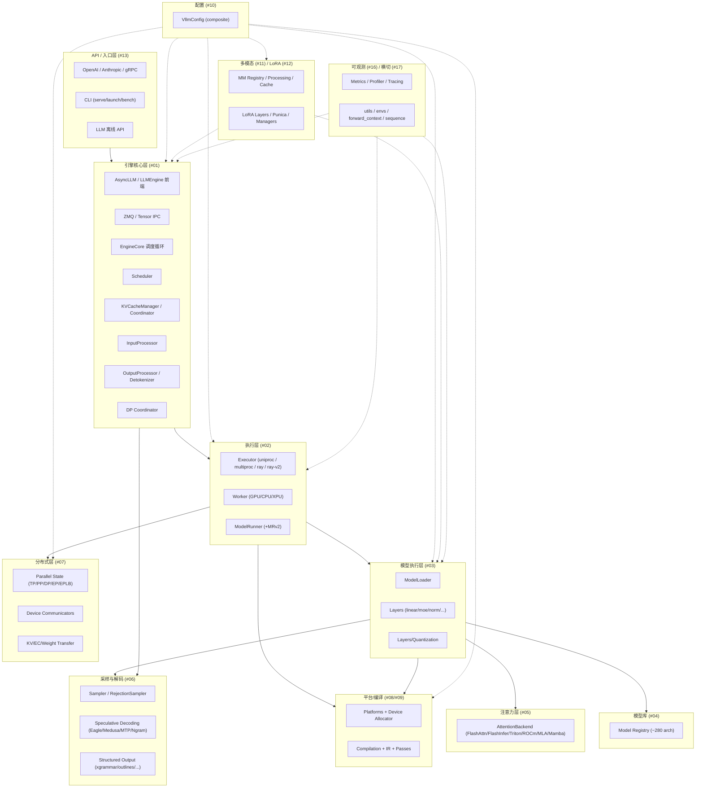
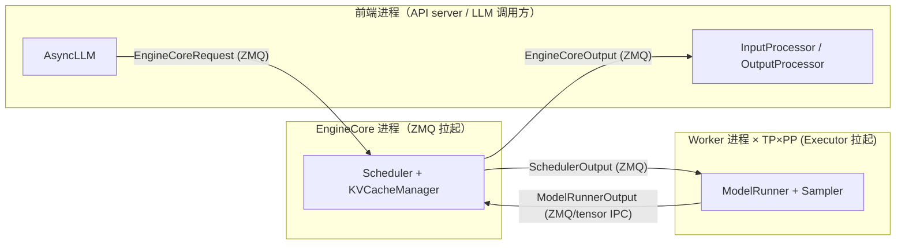

# vLLM 整体架构总览

[← 全局资产首页](README.md) > [全局资产](README.md)

本文给出 vLLM 现行（v1 引擎为主）的分层架构与子系统关系图。源码根目录：`/home/lychee/mycode/vllm`。

## 1. 顶层目录结构

```
vllm/
├── vllm/                       # Python 主包（本文档研究对象）
│   ├── v1/                     # v1 引擎（现行主线，所有调度/worker/attention/sampling/spec_decode 等均在此）
│   ├── engine/                 # v0 引擎兼容层（仅 arg_utils.py / protocol.py 真实存在，其余为 shim）
│   ├── compilation/ + ir/      # torch.compile 集成 + vLLM IR
│   ├── distributed/            # TP/PP/DP/EP/EPLB + 设备通信 + KV/EC/权重迁移
│   ├── platforms/              # 硬件平台抽象（CUDA/ROCm/TPU/XPU/CPU/Zen）
│   ├── device_allocator/       # 内存分配器（cumem / xpumem + sleep 模式后端）
│   ├── config/                 # VllmConfig 复合配置体系
│   ├── model_executor/         # 模型加载器 + 层库 + 量化 + 内核
│   ├── models/                 # 顶层厂商分流模型实现（DeepSeek V4 等）
│   ├── attention/ (legacy)     # 仅 v0 残留；v1 注意力在 vllm/v1/attention/
│   ├── multimodal/             # 多模态输入处理
│   ├── lora/                   # LoRA 层/内核/Punica/管理器
│   ├── entrypoints/            # OpenAI/Anthropic/CLI/LLM/启动器
│   ├── tokenizers/             # 分词器
│   ├── transformers_utils/     # HF 配置/processor/权重粘合
│   ├── tool_parsers/, reasoning/, renderers/   # 工具调用/推理/渲染
│   ├── profiler/, tracing/, logging_utils/    # 可观测性
│   ├── utils/, plugins/, parser/, usage/      # 横切工具
│   ├── inputs/, outputs.py, sequence.py, sampling_params.py, pooling_params.py, logits_process.py, logprobs.py, scalar_type.py, forward_context.py, envs.py, exceptions.py, tasks.py, connections.py  # 核心数据/参数
│   ├── kernels/, vllm_flash_attn/             # 热点算子（含 Triton/CUDA）
│   └── third_party/, triton_utils/, cute_utils/, assets/, benchmarks/, scripts.py, collect_env.py, version.py
├── csrc/                       # C/C++/CUDA 源（自定义算子、flash-attn、cumem、moe 等）
├── rust/                       # Rust 组件（前端/工具）
├── tests/, benchmarks/, tools/, docker/, cmake/, build_rust.sh, setup.py, CMakeLists.txt, pyproject.toml
└── docs/, examples/, .buildkite/, .github/, requirements/
```

## 2. 分层架构图



## 3. 子系统关系要点

- **入口层 #13** 把请求转化为 `EngineCoreRequest`（msgspec 结构，见 [`01-engine-core/data-model.md`](../01-engine-core/data-model.md)），交给引擎核心。
- **引擎核心 #01** 是 v1 的派发中心：前端 `AsyncLLM` 与 `EngineCore` 在独立进程通过 ZMQ 通信，`EngineCore` 每个引擎步调度一次（`Scheduler`），产出 `SchedulerOutput` 交给执行层。
- **执行层 #02** 由 `Executor` 选择 uniproc / multiproc / ray 后端拉起 `Worker`；`Worker` 内的 `ModelRunner` 负责一步前向（含 cudagraph 捕获/重放）。
- **模型执行层 #03** 通过 `ModelLoader` 装配来自 [`04-model-zoo`](../04-model-zoo/README.md) 的模型类，模型类由 `Layers` 拼装，部分算子走 [`05-attention`](../05-attention/README.md) 与量化层。
- **采样与解码 #06** 接在模型 logits 之后；投机解码与结构化输出（grammar）均通过 `Scheduler` 注入前置约束、由 `Worker` 内 `Sampler`/`RejectionSampler` 落地。
- **分布式层 #07** 在 `Worker` 内提供 TP/PP/DP/EP 通信；KV/EC/权重迁移用于跨引擎的解耦/扩缩容。
- **平台 #08 / 编译 #09** 是横切基础设施：`Platform` 决定硬件可用特性、`compilation/` 接管 `torch.compile` + cudagraph + Inductor pass，全流程都消费它。
- **配置 #10** 是所有子系统的统一参数面，`VllmConfig` 持有 `ModelConfig`/`CacheConfig`/`ParallelConfig`/`SchedulerConfig`/`LoadConfig`/`CompilationConfig`/`KVTransferConfig` 等十余个子配置。
- **多模态 #11 / LoRA #12** 通过注册表挂到 `ModelConfig` 与 `ModelRunner` 上，分别在 InputProcessor 与 Worker 侧生效。
- **可观测 #16 / 横切 #17** 被几乎所有子系统引用，提供日志、metrics、forward context、环境变量、序列数据结构等通用工具。

## 4. 关键进程拓扑



> 数据物理分隔说明：EngineCore 与 Worker 通常是独立进程；DP 场景下还有 [`DPCoordinator`](../01-engine-core/dp-coordinator.md) 协调多个 EngineCore。

[← 返回全局资产首页](README.md)
