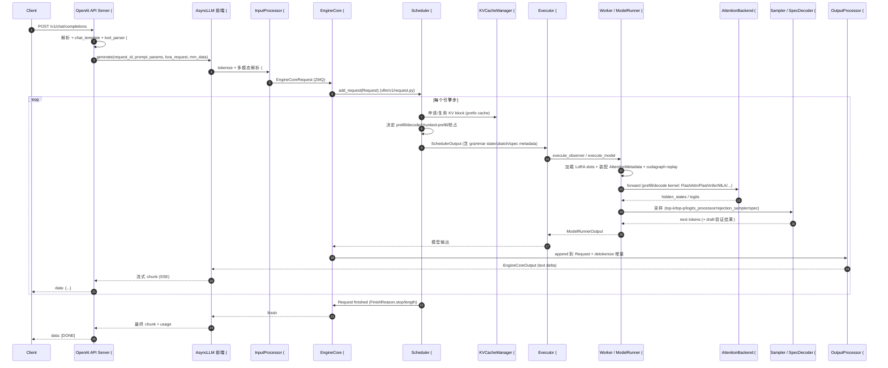

# 一个推理请求的完整生命周期

[← 全局资产首页](README.md) > [全局资产](README.md)

本文跟踪一个 OpenAI Chat 请求从 HTTP 进入到流式 token 返回的全过程，标注所涉及的子系统与源码锚点。

## 总览时序

## 关键步骤详解

### 1. HTTP 接收
- 路由：`vllm/entrypoints/openai/chat_completion/api_router.py` 注册 `/v1/chat/completions`。
- 处理类：`OpenAIServingChat`（`vllm/entrypoints/openai/chat_completion/serving.py`），详见 [`13-entrypoints/openai/`](../13-entrypoints/openai/README.md)。
- 多模态数据由 API 解析后随请求下行，真正处理在 [`11-multimodal/`](../11-multimodal/README.md)。

### 2. 转化为 EngineCoreRequest
- `OpenAIServingChat` 调用 `AsyncLLM.generate()`（`vllm/v1/engine/async_llm.py`）。
- `InputProcessor`（`vllm/v1/engine/input_processor.py`）做：
  - tokenizer 编码（[`14-tokenizers-transformers/`](../14-tokenizers-transformers/README.md)）；
  - 多模态预算计算 + 占位符替换；
  - LoRA / 推理（reasoning）/ 渲染（renderers）参数附加；
  - 序列化为 `EngineCoreRequest`（msgspec），通过 ZMQ 发往 EngineCore 进程。
- 数据形状见 [`01-engine-core/data-model.md`](../01-engine-core/data-model.md)。

### 3. EngineCore 调度
- `EngineCore`（`vllm/v1/engine/core.py`）通过 ZMQ 收到请求 → `Scheduler.add_request()`（`vllm/v1/core/sched/scheduler.py`）。
- 调度策略、chunked prefill、抢占详见 [`01-engine-core/scheduler/`](../01-engine-core/scheduler/README.md)。
- KV 块分配/复用见 [`01-engine-core/kv-cache-management/`](../01-engine-core/kv-cache-management/README.md)。Prefix cache 命中可避免重复 prefill。
- 若开启结构化输出，`StructuredOutputManager`（`vllm/v1/structured_output/`）会把 grammar 状态嵌入 `SchedulerOutput`，见 [`06-sampling-decoding/structured-output/`](../06-sampling-decoding/structured-output/README.md)。

### 4. 执行一步前向
- `Executor`（`vllm/v1/executor/`，见 [`02-execution/executor/`](../02-execution/executor/README.md)）把 `SchedulerOutput` 分发到 `Worker`。
- `Worker`（`vllm/v1/worker/gpu_worker.py`）调用 `GPUModelRunner.execute_model()`：
  - 装配 `InputBatch`、block_table、`AttentionMetadata`；
  - 根据是否 LoRA 请求加载适配器（[`12-lora/`](../12-lora/README.md)）；
  - 触发 cudagraph 重放或 eager（[`09-compilation-ir/`](../09-compilation-ir/README.md)）；
  - 调用模型的 `forward`，注意力层走 [`05-attention/`](../05-attention/README.md) 选定的 backend；
  - MoE 走 fused_moe（[`03-model-execution/layers/`](../03-model-execution/layers/README.md)）+ 可选 EP all-to-all（[`07-distributed/`](../07-distributed/README.md)）。
- 详见 [`02-execution/worker/`](../02-execution/worker/README.md)。

### 5. 采样与投机解码
- logits 走 `logits_processor` 后由 `Sampler`（`vllm/v1/sample/sampler.py`）采样，见 [`06-sampling-decoding/sampler.md`](../06-sampling-decoding/sampler.md)。
- 若启用投机解码（[`06-sampling-decoding/speculative-decoding/`](../06-sampling-decoding/speculative-decoding/README.md)）：
  - `Proposer`（如 `Eagle`/`Ngram`）先吐若干 draft token；
  - 目标模型一次性 forward；
  - `RejectionSampler` 验证并产出接受 token 序列。
- 若开启结构化输出，采样前会按 grammar mask logits / 调整 token。
- thinking budget（`vllm/v1/sample/thinking_budget_state.py`）在 reasoning 模型中控制思考段输出长度。

### 6. 输出回流
- `Worker` 把 `ModelRunnerOutput` 通过 ZMQ / tensor IPC 返回 `EngineCore`。
- `OutputProcessor`（`vllm/v1/engine/output_processor.py`）：
  - 累加 token 到 `Request`；
  - `Detokenizer`（`vllm/v1/engine/detokenizer.py`）做增量反分词（处理 BPE 边界、特殊 token）；
  - 生成 `EngineCoreOutput`（含 text delta、logprobs、tool_calls 等）。
- `AsyncLLM` 通过 async queue / SSE 推给 API server，最终回到客户端。

### 7. 终止
- `FinishReason` 为 `stop` / `length` / `abort` 时，`Scheduler` 释放 KV block（可被 prefix cache 复用），`EngineCore` 上报终态，`OutputProcessor` 取消订阅。

## 跨子系统数据结构（贯穿全程）

| 结构 | 定义位置 | 用途 |
|---|---|---|
| `Request` | `vllm/v1/request.py` | 引擎内部的请求运行时状态 |
| `EngineCoreRequest` | `vllm/v1/engine/__init__.py` | 前端 → EngineCore 的 msgspec 传输结构 |
| `SchedulerOutput` | `vllm/v1/core/sched/output.py` | EngineCore → Executor 的步调度结果 |
| `ModelRunnerOutput` | `vllm/v1/outputs.py` | Worker → EngineCore 的步输出结果 |
| `EngineCoreOutput` | `vllm/v1/engine/__init__.py` | EngineCore → 前端的输出结构 |
| `RequestOutput` | `vllm/outputs.py` | 前端对外暴露给 LLM 类的输出 |

[← 返回全局资产首页](README.md)
