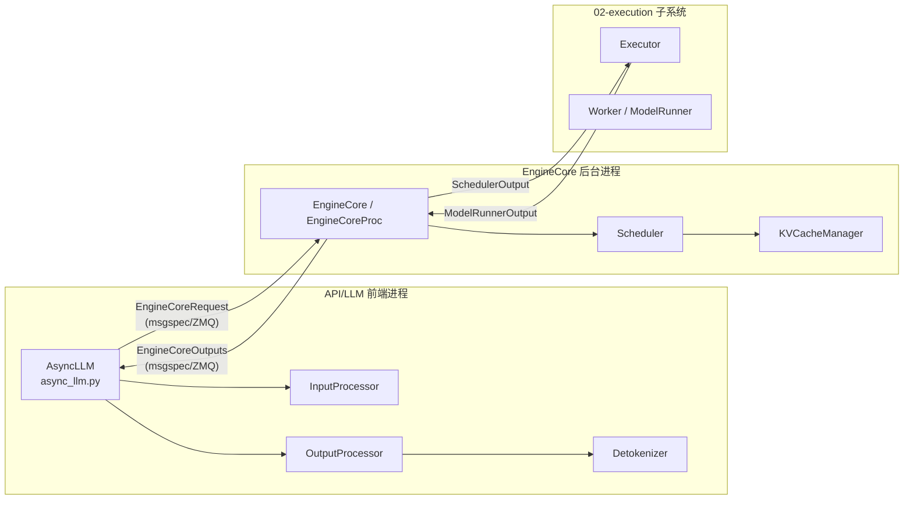

# 01 · 引擎核心

[← Wiki 首页](../README.md)

本子系统是 vLLM v1 的"中枢神经"，承担从 API 前端到 GPU 执行之间的全部决策逻辑：输入处理、调度、KV 缓存管理、增量反分词与输出装配。它与 [`02-execution/`](../02-execution/README.md) 的 Executor/Worker 通过 `SchedulerOutput`、`ModelRunnerOutput` 两类数据结构衔接，自身不直接接触 GPU 张量（多模态特征张量除外）。

## 子系统边界与对外接口

- **上行（前端 → 核）**：`EngineCoreRequest`、`EngineCoreRequestType`（ADD/ABORT/UTILITY/START_DP_WAVE 等）。
- **下行（核 → 前端）**：`EngineCoreOutputs`（含 `EngineCoreOutput` 列表、`SchedulerStats`、`wave_complete`/`start_wave`、`UtilityOutput`）。
- **核心 → 执行层**：`SchedulerOutput`（每步的调度决策）；**执行层 → 核心**：`ModelRunnerOutput`（采样 token、logprobs、pooling 输出、KV connector 输出）。
- **对外控制面**：`AsyncLLM` 实现 `EngineClient` 协议，暴露 `generate/encode/add_request/abort/pause_generation/resume_generation/sleep/wake_up/scale_elastic_ep` 等异步接口供 API server 调用。

## 设计要点速览

- **双进程拓扑**：`AsyncLLM`（前端）与 `EngineCoreProc`（核心）默认跨进程运行，靠 ZMQ + msgspec 解耦；同步 `LLMEngine` 走 `InprocClient`/`EngineCore` 同进程路径。
- **三段流水线**：`InputProcessor`（tokenize + 多模态/LoRA 装配） → `EngineCore` busy loop（`schedule` → `execute_model` → `update_from_output`） → `OutputProcessor` + `Detokenizer`（增量还原文本与 RequestOutput）。
- **统一调度模型**：调度器无显式 prefill/decode phase，仅维护每个 request 的 `num_computed_tokens` 与 `num_tokens_with_spec`，chunked prefill、prefix caching、speculative decoding 都是对"新 token 数"的不同切分。
- **多类型 KV cache**：通过 `KVCacheSpec` 子类（FullAttention/MLA/SlidingWindow/Mamba/...）+ 注册表 + 多个 `SingleTypeKVCacheManager`，由 `HybridKVCacheCoordinator` 统一协调混合块池。

## 子目录导航表

### 顶层模块页

| 文档 | 简介 | 主要源码 |
|---|---|---|
| [async-llm-frontend.md](async-llm-frontend.md) | `AsyncLLM` 前端：实现 `EngineClient` 协议，串联输入/输出处理器与后台 output_handler | `vllm/v1/engine/async_llm.py` |
| [engine-core-process.md](engine-core-process.md) | EngineCore 进程 + ZMQ IPC：busy loop、握手、shutdown、DP/Elastic EP 变体 | `vllm/v1/engine/core.py`、`core_client.py` |
| [input-processor.md](input-processor.md) | 入参校验、tokenize、多模态 placeholder 装配、LoRA/cache_salt、request_id 随机化 | `vllm/v1/engine/input_processor.py` |
| [output-processor.md](output-processor.md) | 增量输出装配：detokenize、logprobs、parallel sampling 聚合、streaming 输入续写 | `vllm/v1/engine/output_processor.py` |
| [detokenizer.md](detokenizer.md) | `FastIncrementalDetokenizer`/`SlowIncrementalDetokenizer`：基于 `DecodeStream` 的逐 token 反分词 + stop 字符串检测 | `vllm/v1/engine/detokenizer.py` |
| [dp-coordinator.md](dp-coordinator.md) | DP>1 时独立 `DPCoordinatorProc`：收集 stats、wave 协调、广播 START_DP_WAVE | `vllm/v1/engine/coordinator.py` |
| [data-model.md](data-model.md) | msgspec 消息结构（`EngineCoreRequest/Output/Outputs`）、`Request`/`RequestStatus`、`ModelRunnerOutput` | `vllm/v1/engine/__init__.py`、`v1/request.py`、`v1/outputs.py` |

### scheduler/ 子目录

| 文档 | 简介 | 主要源码 |
|---|---|---|
| [scheduler/README.md](scheduler/README.md) | 调度子模块总览 | `vllm/v1/core/sched/*` |
| [scheduler/scheduler.md](scheduler/scheduler.md) | `Scheduler.schedule()` / `update_from_output()` 主循环、抢占与 stop 判定 | `vllm/v1/core/sched/scheduler.py` |
| [scheduler/queues.md](scheduler/queues.md) | `RequestQueue`/`FCFSRequestQueue`/`PriorityRequestQueue`、`skipped_waiting`、`PauseState` | `request_queue.py`、`interface.py` |
| [scheduler/chunked-prefill.md](scheduler/chunked-prefill.md) | `max_num_scheduled_tokens` 预算切分、`long_prefill_token_threshold`、Mamba block-aligned split | `scheduler.py` |
| [scheduler/preemption.md](scheduler/preemption.md) | 资源不足时的抢占与重排、`_preempt_request`、deferred free | `scheduler.py` |
| [scheduler/parallel-sampling.md](scheduler/parallel-sampling.md) | `n>1` 并行采样：`ParentRequest` fan-out 与子请求聚合 | `vllm/v1/engine/parallel_sampling.py` |

### kv-cache-management/ 子目录

| 文档 | 简介 | 主要源码 |
|---|---|---|
| [kv-cache-management/README.md](kv-cache-management/README.md) | KV 缓存子模块总览 | `vllm/v1/core/*`、`v1/kv_cache_interface.py` |
| [kv-cache-management/kv-cache-manager.md](kv-cache-management/kv-cache-manager.md) | `KVCacheManager`：`get_computed_blocks`/`allocate_slots`/`free` 对调度器暴露的统一门面 | `vllm/v1/core/kv_cache_manager.py` |
| [kv-cache-management/coordinator.md](kv-cache-management/coordinator.md) | `HybridKVCacheCoordinator`/`UnitaryKVCacheCoordinator`：混合块池、find_longest_cache_hit 不动点算法 | `vllm/v1/core/kv_cache_coordinator.py` |
| [kv-cache-management/block-pool.md](kv-cache-management/block-pool.md) | `BlockPool`：物理块分配/释放、LRU 驱逐、prefix cache 哈希表、KV 事件发布 | `vllm/v1/core/block_pool.py` |
| [kv-cache-management/spec.md](kv-cache-management/spec.md) | `KVCacheSpec` 体系 + `KVCacheSpecRegistry`：多类型 spec 注册与合并 | `vllm/v1/kv_cache_interface.py`、`kv_cache_spec_registry.py` |
| [kv-cache-management/encoder-cache.md](kv-cache-management/encoder-cache.md) | `EncoderCacheManager`/`EncoderDecoderCacheManager`：多模态编码器输出的 LRU 缓存与驱逐 | `vllm/v1/core/encoder_cache_manager.py` |
| [kv-cache-management/metrics.md](kv-cache-management/metrics.md) | `KVCacheMetricsCollector`：块生命周期采样、驱逐事件 | `vllm/v1/core/kv_cache_metrics.py` |

## 阅读建议

1. 第一次进入本子系统：先读 [data-model.md](data-model.md) 与 [async-llm-frontend.md](async-llm-frontend.md)，理解进程间数据流。
2. 关注性能/调度：直接进入 [scheduler/scheduler.md](scheduler/scheduler.md) 与 [scheduler/chunked-prefill.md](scheduler/chunked-prefill.md)。
3. 关注 KV 缓存/前缀缓存：从 [kv-cache-management/README.md](kv-cache-management/README.md) 入手，再到 [coordinator.md](kv-cache-management/coordinator.md) 与 [block-pool.md](kv-cache-management/block-pool.md)。
4. 数据并行相关：[dp-coordinator.md](dp-coordinator.md) + [engine-core-process.md](engine-core-process.md) 的 `DPEngineCoreProc` 小节。

[← 返回 Wiki 首页](../README.md)
