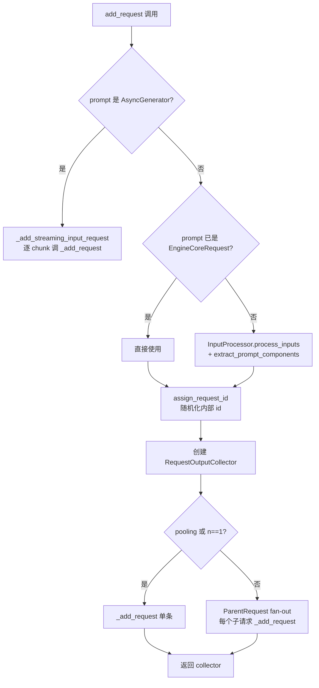
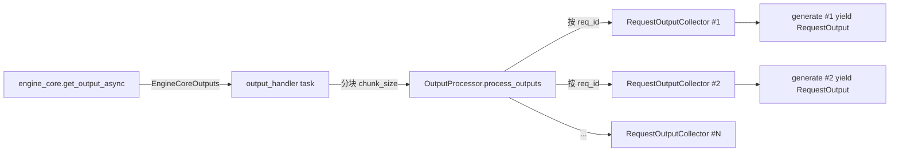

# AsyncLLM 前端

[← Wiki 首页](../README.md) > [引擎核心](../README.md) > AsyncLLM 前端

源码：`vllm/v1/engine/async_llm.py`（约 1108 行）。`AsyncLLM` 是 v1 引擎面向 API server / `LLM` 同步入口的统一前端，实现 `vllm/engine/protocol.py` 的 `EngineClient` 协议，自身不接触 GPU 推理逻辑。

## 是什么

`AsyncLLM` 是一个运行在前端进程中的 async wrapper，把"用户输入 → 后台 EngineCore → 用户可见输出"三段流水线编排起来。它持有四个核心组件：

- `InputProcessor`（`async_llm.py:135`）：把 `PromptType`/`EngineInput`/`EngineCoreRequest` 转成最终 `EngineCoreRequest`。
- `OutputProcessor`（`async_llm.py:138`）：把 `EngineCoreOutputs` 反向装配成 `RequestOutput`/`PoolingRequestOutput`。
- `EngineCoreClient`（`async_llm.py:146`，由 `EngineCoreClient.make_async_mp_client` 工厂创建）：负责跨进程 ZMQ 通信，DP>1 时返回 `DPLBAsyncMPClient`/`DPAsyncMPClient`。
- 后台 `output_handler` asyncio Task（`async_llm.py:637`）：单生产者-多消费者地拉取 EngineCore 输出并分发到各请求的 `RequestOutputCollector`。

构造入口：
- `AsyncLLM.from_vllm_config(...)`（`async_llm.py:202`）：服务端最常用入口。
- `AsyncLLM.from_engine_args(...)`（`async_llm.py:232`）：从 `AsyncEngineArgs` 构造。
- 直接 `__init__`：传入 `vllm_config` + `executor_class`。

主要公共方法（实现 `EngineClient`）：
- `add_request()` / `generate()` / `encode()`：发起请求；`generate` 是 `add_request` + 异步消费 collector 的语法糖。
- `abort(request_id, internal=False)`：撤销请求，同时清理 OutputProcessor 与 EngineCore。
- `pause_generation(mode=, clear_cache=)` / `resume_generation()` / `is_paused()`：模型权重热更新场景的暂停-恢复。
- `sleep(level, mode)` / `wake_up(tags)` / `is_sleeping()`：分级显存卸载（与 [`15-kv-cache-offload`](../15-kv-cache-offload/README.md) 配合）。
- `scale_elastic_ep(new_data_parallel_size, drain_timeout)`：Elastic EP 在线扩缩容。
- `add_lora/remove_lora/list_loras/pin_lora`、`collective_rpc`、`save_sharded_state`、`start_profile/stop_profile`、`reset_mm_cache/reset_prefix_cache/reset_encoder_cache`：控制面 RPC。
- `check_health()`：基于 `engine_core.resources.engine_dead` 与 `output_handler` 状态判定。
- `notify_kv_transfer_request_rejected()`：P-D 场景下当 KV transfer 在 D 节点被拒时，预提交一条 `abort_immediately=True` 的占位请求以触发 connector 清理钩子。

## 为什么

- **解耦前后端**：API server 在事件循环中跑，EngineCore 在独立进程/actor 里 busy loop。`AsyncLLM` 作为薄编排层，让 API server 不必关心 IPC 细节，只面对 `EngineClient` 协议。
- **多请求并发**：每个 `generate()` 都是一个独立的 async generator，通过 per-request `RequestOutputCollector` 与全局 `output_handler` 解耦；后者批量拉取 `EngineCoreOutputs` 后按 `req_id` 路由到对应 collector，前端协程从 collector 队列消费。这样 EngineCore 的一次步进可同时推进成百上千个 generate 协程。
- **优雅降级与取消**：`generate()` 的 `try/except` 显式区分 `CancelledError`（客户端断连 → abort）、`EngineDeadError`（后端死亡 → 不 abort）、`InputStreamError`（用户输入流异常 → 直接抛原因）、`ValueError`（请求校验失败）、其它异常（包装为 `EngineGenerateError`）。`finally` 里 `q.close()` 取消 streaming input 子任务。
- **延迟启动 output_handler**：`_run_output_handler` 在 `__init__` 与首次 `add_request` 都会被尝试调用（`async_llm.py:171`/`373`），但幂等；这样 `__init__` 可在事件循环启动前调用（OpenAI server 启动失败友好处理）。
- **scale-out 多前端**：`client_count`/`client_index` 字段允许同一 EngineCore 被多 API server 共享；`EngineCoreOutput.client_index` 路由输出回到正确的 server。
- **不阻塞事件循环**：`output_handler` 用 `VLLM_V1_OUTPUT_PROC_CHUNK_SIZE`（默认值见 `envs`）切分大批输出，每块之间 `await asyncio.sleep(0)` 让出事件循环。

## 怎么做

### add_request 主流程

`AsyncLLM.add_request`（`async_llm.py:280`）关键步骤：



`_add_request`（`async_llm.py:400`）做两件事：
1. `output_processor.add_request(request, prompt, parent_req, index, queue)`：在前端建立 `RequestState`（含 detokenizer、logprobs processor）。
2. `await self.engine_core.add_request_async(request)`：把 `EngineCoreRequest` 经 ZMQ 发到 EngineCore。

### output_handler 后台任务



- `output_handler` 内部循环：`await engine_core.get_output_async()` → 按 `chunk_size` 切片 → `output_processor.process_outputs(slice, timestamp, iteration_stats)` → 处理 `reqs_to_abort`（stop string 触发）→ `update_scheduler_stats` → logger_manager 记录。
- `process_outputs` 返回的 `request_outputs` 在 AsyncLLM 场景永远为空（outputs 已被 push 到各 collector），断言 `assert not processed_outputs.request_outputs` 用作不变量保护（`async_llm.py:679`）。
- 失败时 `output_processor.propagate_error(e)` 把异常塞进所有 collector，使所有挂起的 `generate()` 抛错。

### generate() 消费侧

```python
# 简化自 async_llm.py:524
q = await self.add_request(...)
while not finished:
    out = q.get_nowait() or await q.get()  # 先非阻塞出队，避免任务切换
    finished = out.finished
    if out is not STREAM_FINISHED:
        yield out
```

`RequestOutputCollector.get_nowait()` 优先消费已就绪输出，只有空时才 `await`，在批量短请求场景显著降低调度抖动。

### streaming-input 请求

`_add_streaming_input_request`（`async_llm.py:417`）支持异步生成器作为 prompt：
- 先用 `TokensPrompt(prompt_token_ids=[0])` 构造一个 `final_req` 作为"输入流结束"信号。
- `handle_inputs()` 内部 task 遍历 `input_stream`，每个 chunk 经 `InputProcessor.process_inputs(resumable=True)` 后调 `_add_request` 提交"可续写子请求"。
- 流结束或取消时提交 `final_req`；OutputProcessor 据此把会话状态收尾。
- 限制：不支持 pooling、`n>1`、`FINAL_ONLY` 输出模式或带 stop 字符串（`_validate_streaming_input_sampling_params`）。

### pause / sleep / scale_elastic_ep

- `pause_generation(mode, clear_cache=True)`（`async_llm.py:750`）：先 `renderer.clear_mm_cache_async()`（若 clear_cache），再 `engine_core.pause_scheduler_async(mode, clear_cache)`；末尾固定 `asyncio.sleep(0.02)` 让最后一批输出先回到调用方（仅为体感顺序，非正确性要求）。
- `sleep(level, mode)`：level≥1 时清 mm cache，然后委托 executor 做显存卸载；`level 0` 仅暂停调度。
- `scale_elastic_ep`：可选 `wait_for_requests_to_drain`，重建 `StatLoggerManager`（Prometheus 指标重置，受 Ray 限制 `TODO(rob)`），调 `engine_core.scale_elastic_ep(new_dp_size)`，更新 `parallel_config.data_parallel_size`。

### 资源与生命周期

- `__del__` 调 `shutdown()`，`shutdown(timeout)` 顺序：`shutdown_prometheus()` → `renderer.shutdown()` → `engine_core.shutdown(timeout)` → `cancel_task_threadsafe(output_handler)`。
- `is_running` = `output_handler` 未结束；`errored` = `engine_core.resources.engine_dead or not is_running`；`check_health` 抛 `EngineDeadError()`。

## 与其它模块/系统配合

- **[EngineCoreClient / core_client.py](./engine-core-process.md)**：`AsyncLLM` 只持有 `EngineCoreClient` 抽象；具体是 `AsyncMPClient`/`DPAsyncMPClient`/`DPLBAsyncMPClient` 取决于 DP 配置。
- **[InputProcessor](./input-processor.md)**：`AsyncLLM` 把所有原始 prompt 委托给它；`extract_prompt_components` 从 `EngineInput` 抽取 `prompt_text` 供 OutputProcessor 使用。
- **[OutputProcessor](./output-processor.md)** / **[Detokenizer](./detokenizer.md)**：`AsyncLLM` 不直接 detokenize，只负责把 OutputProcessor 产出的 `RequestOutput` 经 collector 转交 generate 协程。
- **[Parallel sampling](./scheduler/parallel-sampling.md)**：`add_request` 在 `n>1` 时 fan-out 子请求，所有子请求共享同一个 `RequestOutputCollector`；`ParentRequest.get_outputs` 决定是否对外发出。
- **[StatLoggerManager](../16-observability/README.md)**：`output_handler` 每步调 `logger_manager.record(engine_idx, scheduler_stats, iteration_stats, mm_cache_stats)`。
- **[Renderer / 多模态](../14-tokenizers-transformers/README.md)**：`AsyncLLM.renderer` 提供 tokenizer 与 `clear_mm_cache_async`；`reset_mm_cache` 同时清前端 renderer 缓存与 EngineCore 端 receiver 缓存。
- **[API server](../13-entrypoints/README.md)**：OpenAI/Anthropic/gRPC 入口均直接调 `AsyncLLM.generate/encode/add_request/abort`。
- **[`vllm.engine.protocol.EngineClient`](../17-utils-cross-cutting/README.md)**：`AsyncLLM` 是该协议的旗舰实现，v0 `AsyncLLMEngine` 已退化为 shim。

## 历史版本演进

- **v0.5 及之前**：v0 `AsyncLLMEngine` 同进程，`async_generate` 直接驱动 `LLMEngine.step`，无独立 output_handler。
- **v0.7（v1 落地）**：`AsyncLLM` 取代 `AsyncLLMEngine`，引入 `EngineCoreClient` + 后台 `output_handler` task；`add_request` 拆出"构造请求 + 提交"两段。
- **v0.8（v1 默认）**：`AsyncLLM.from_vllm_config` 成为 serve 入口；`client_count`/`client_index` 支持 scale-out；`VLLM_V1_OUTPUT_PROC_CHUNK_SIZE` 引入避免大 batch 阻塞事件循环。
- **v0.9**：streaming-input (`_add_streaming_input_request`) 引入，支持 RAG/agent 流式 prompt；`notify_kv_transfer_request_rejected` 加入 P-D 路径。
- **v0.10**：`reasoning_ended`/`reasoning_parser_kwargs` 参数透传到 `EngineCoreRequest`，支持 thinking budget；`pause_generation` 新增 `mode` 参数（abort/wait/keep）取代旧 `wait_for_inflight_requests`。
- **v0.11 / v0.12 / main**：`scale_elastic_ep` 在线扩缩容成形；`wait_for_requests_to_drain`、`dp_engines_running()` 配合 Ray DP backend；weight transfer API（`init_weight_transfer_engine/start_weight_update/update_weights/finish_weight_update`）为 RL 训练加入。具体版本归属（待核实）。

[← 返回引擎核心首页](../README.md)

## 参见

- [engine-core-process.md](./engine-core-process.md) — `EngineCoreClient` 的多进程实现与 ZMQ 拓扑。
- [input-processor.md](./input-processor.md) — `EngineCoreRequest` 的构造细节。
- [output-processor.md](./output-processor.md) — `RequestOutputCollector` 与请求级状态。
- [detokenizer.md](./detokenizer.md) — 增量反分词，OutputProcessor 调用。
- [dp-coordinator.md](./dp-coordinator.md) — DP>1 时的协调进程。
- [scheduler/parallel-sampling.md](./scheduler/parallel-sampling.md) — `n>1` fan-out 逻辑。
