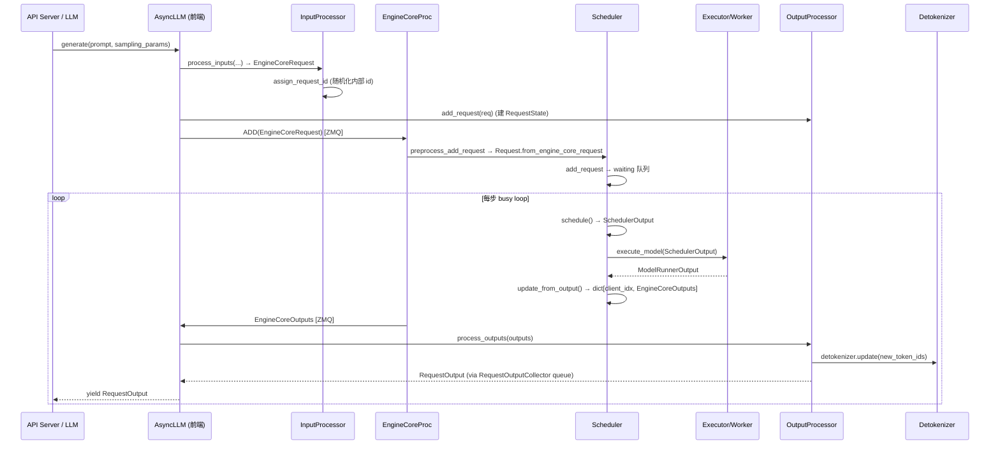

# 数据模型（msgspec 消息 + Request/Output）

[← Wiki 首页](../README.md) > [引擎核心](../README.md) > 数据模型

本页汇总引擎核心子系统跨进程/跨模块传递的核心数据结构，三者共同构成 v1 引擎的"消息协议"：

- `vllm/v1/engine/__init__.py`：跨进程 ZMQ 消息（基于 `msgspec.Struct`）。
- `vllm/v1/request.py`：EngineCore 进程内的请求状态机 `Request`。
- `vllm/v1/outputs.py`：执行层回送到调度器的 `ModelRunnerOutput` 及相关张量容器。

## 是什么

### 跨进程消息（msgspec）

`vllm/v1/engine/__init__.py` 定义了一组紧凑、零拷贝友好的 msgspec 结构，用于 AsyncLLM ↔ EngineCore 之间通过 ZMQ 交换数据：

| 结构 | 方向 | 角色 |
|---|---|---|
| `EngineCoreRequest` | 前 → 核 | 单条推理请求；含 `prompt_token_ids`/`prompt_embeds`、`mm_features`、`sampling_params`/`pooling_params`、`lora_request`、`cache_salt`、`client_index`、`current_wave`、`priority`、`resumable`、`abort_immediately`、`reasoning_ended` 等。属性 `params` 返回当前生效的 params |
| `EngineCoreRequestType` | 前 → 核 | 1 字节枚举：`ADD=\x00`、`ABORT=\x01`、`START_DP_WAVE=\x02`、`UTILITY=\x03`、`EXECUTOR_FAILED=\x04`（核内哨兵）、`WAKEUP=\x05`（shutdown 唤醒哨兵） |
| `EngineCoreOutput` | 核 → 前 | 单请求输出：`new_token_ids`、`finish_reason`、`stop_reason`、`new_logprobs`、`new_prompt_logprobs_tensors`、`pooling_output`、`events`、`kv_transfer_params`、`prefill_stats`、`routed_experts`、`num_nans_in_logits` |
| `EngineCoreOutputs` | 核 → 前 | 一步批输出：`engine_index`、`outputs: list[EngineCoreOutput]`、`scheduler_stats`、`timestamp`、`utility_output`、`finished_requests`、`wave_complete`/`start_wave`（DP） |
| `UtilityOutput` / `UtilityResult` | 双向 | 工具方法 RPC 回执；`call_id` 关联前端 `Future` |
| `EngineCoreEvent` / `EngineCoreEventType` | 核 → 前 | 请求级时序事件（QUEUED/SCHEDULED/PREEMPTED），用于 tracing 指标（TTFT/排队/抢占） |
| `EngineCoreReadyResponse` | 核 → 前 | 启动握手回执：`max_model_len`（可能被 auto-fit 缩小）、`num_gpu_blocks`、`block_size`、`kv_cache_size_tokens`、`kv_cache_max_concurrency`、`dp_stats_address` 等 |
| `ReconfigureDistributedRequest` | 前 → 核 | Elastic EP 重配置：新 DP size/rank、master ip/port、coord_store_port |
| `FinishReason` | — | `IntEnum`：STOP=0 / LENGTH=1 / ABORT=2 / ERROR=3 / REPETITION=4；用 `__str__` 映射到外部字符串 |
| `PauseMode` | — | `Literal["abort","wait","keep"]`，`pause_generation` 行为模式 |

`EngineCoreRequest`/`EngineCoreOutput` 都启用 `array_like=True`、`omit_defaults=True`、`gc=False`，以降低高频 IPC 的序列化与 GC 开销。`EngineCoreRequest` 关键字段语义：

- `prompt_token_ids` / `prompt_embeds` / `prompt_is_token_ids`：支持纯 token、纯 embeds、以及"chat completion 混合 prompt_embeds 内容块"三种模式；后者用 `prompt_is_token_ids` 逐位置掩码。
- `client_index`：scale-out 前端时确保输出回到发起请求的那个 API server。
- `current_wave`：DP 场景下请求所属"波次"，用于避免 race condition（见 [dp-coordinator.md](./dp-coordinator.md)）。
- `external_req_id`：用户原始 request_id；`InputProcessor.assign_request_id` 会把用户 id 复制到 `external_req_id` 并在 `request_id` 上追加 8 位随机字符以保证内部唯一性。
- `resumable`：标记可流式续写的 streaming-input 请求。
- `abort_immediately`：KV transfer 在 D 节点被拒时，前端预先构造一条带此标志的请求，使调度器入队后立刻 abort，从而触发 connector 的 `request_finished` 钩子释放 P 端 prefill block。

### 进程内请求：`Request`

`vllm/v1/request.py:59` 的 `Request` 是 EngineCore 内部维护的请求状态机，由 `Request.from_engine_core_request()` 在核心进程反序列化得到。核心字段/方法：

- **token 视图**：`prompt_token_ids`、`_output_token_ids`、`_all_token_ids`（前缀+输出），通过 `ConstantList` 暴露只读视图 `output_token_ids` / `all_token_ids`，禁止直接 append；`append_output_token_ids()` 同步更新三者并触发 `update_block_hashes()`。
- **进度记账**：`num_computed_tokens`（已计算到 KV 的 token 数）、`num_tokens`（=全序列长度）、`num_tokens_with_spec`（含 spec/lookahead token）、`spec_token_ids`、`num_output_placeholders`/`async_tokens_to_discard`（异步调度专用）。
- **状态机**：`RequestStatus`（`IntEnum`）：`WAITING` → `WAITING_FOR_STRUCTURED_OUTPUT_GRAMMAR` / `WAITING_FOR_REMOTE_KVS` / `WAITING_FOR_STREAMING_REQ` → `RUNNING` → `PREEMPTED` → 一众 `FINISHED_*`；`is_finished()` 判定 `status > PREEMPTED`。`_FINISHED_REASON_MAP` 把完成态映射到 `FinishReason`。
- **缓存辅助**：`block_hashes` + `_block_hasher`（避免引用环导致 GC 延迟），`cache_salt`、`skip_reading_prefix_cache`（pooling/prompt_logprobs 场景需要绕过前缀缓存读取）。
- **多模态**：`mm_features: list[MultiModalFeatureSpec]`，`get_num_encoder_embeds(input_id)` 返回某项的编码器输出 token 数。
- **优先级与排序**：`__lt__` 按 `(priority, arrival_time, request_id, id())` 比较，供 `PriorityRequestQueue` 堆排使用。
- **统计与事件**：`events: list[EngineCoreEvent]`、`prefill_stats`（仅在首次 prefill 填充）、`num_preemptions`、`num_nans_in_logits`。
- **streaming-input**：`streaming_queue: deque[StreamingUpdate | None]`，`None` 表示输入流终止；`StreamingUpdate.from_request()` 抽取续写所需的最小字段集。
- **PP/async 调度**：`next_decode_eligible_step`（V2+PP+async 的 `pp_size` 节拍）、`last_sched_seq`（deferred free 的围栏序号）。

### 执行层输出：`ModelRunnerOutput` 与张量容器

`vllm/v1/outputs.py:234` 的 `ModelRunnerOutput` 是 Worker/ModelRunner 在一步前向结束后回送给 EngineCore 的结构：

- `req_ids: list[str]` 与 `req_id_to_index`：本步调度到的请求及其行号。
- `sampled_token_ids: list[list[int]]`：每请求本步生成 token（不同请求可不同长度，受 speculative/jump decoding 影响）。
- `logprobs: LogprobsLists | None`、`prompt_logprobs_dict: dict[str, LogprobsTensors | None]`：NumPy / torch 双形态；`LogprobsTensors.tolists()`、`to_cpu_nonblocking()` 支持跨进程迁移。
- `pooler_output: list[torch.Tensor | None]`：pooling 模型输出。
- `kv_connector_output: KVConnectorOutput`：KV connector 完成情况（`finished_sending`/`finished_recving`、`invalid_block_ids`、`expected_finished_count`）。
- `ec_connector_output: ECConnectorOutput`：EC（encoder cache）connector。
- `routed_experts: RoutedExpertsLists | None`：MoE 路由专家 ID + slot 映射，按步级累计后写回调度器槽缓冲。
- `cudagraph_stats`、`num_nans_in_logits`、`EMPTY_MODEL_RUNNER_OUTPUT`（共享空实例）。
- `AsyncModelRunnerOutput(ABC)`：异步调度 wrapper，`get_output()` 是一次性阻塞调用，等待 D2H 拷贝完成。
- `DraftTokenIds`：spec decode 的 draft token 回传容器。
- `make_empty_encoder_model_runner_output()`：为 encoder-only 模型构造占位输出。

## 为什么

- **跨进程低开销**：v1 把 EngineCore 隔离到独立进程（甚至 Ray actor），需把 Python 对象以最小开销穿越 ZMQ。msgspec 的 `Struct` + `array_like=True` + `gc=False` 显著低于 pickle，且支持 torch.Tensor 的带外传输（`MsgpackEncoder` + `TensorIpcSender`）。
- **状态与消息解耦**：`EngineCoreRequest` 是"不可变快照"，`Request` 是"可变状态机"。前者负责传输，后者承载调度演化（`num_computed_tokens`、`spec_token_ids`、抢占计数等），避免在 IPC 中传输大量可变状态。
- **统一 finish 语义**：`FinishReason` 用 IntEnum 而非字符串，压缩传输体积；`__str__` 又能映射回 OpenAI 兼容字符串（`stop`/`length`/`abort`/`error`/`repetition`）。
- **调度-执行无缝对齐**：`SchedulerOutput.num_scheduled_tokens` 的 key 集合严格等于 `ModelRunnerOutput.req_id_to_index` 的 key 集合，使 `update_from_output` 的 per-request 循环不会越界。
- **多模态/混合输入扩展**：`prompt_embeds` + `prompt_is_token_ids` 让 chat completion 能在同一序列内交错 token id 与预计算 embedding（如 RAG 应用预先 pooling 的文档向量），无需新建消息类型。

## 怎么做

### 一次请求的数据流转

### msgspec 字段流转要点

1. **请求侧**：`AsyncLLM.add_request` 先调 `InputProcessor.process_inputs` 得到 `EngineCoreRequest`，再 `assign_request_id` 写入 `external_req_id` 并随机化 `request_id`；`n>1` 时由 `ParentRequest.get_child_info(idx)` 为每个子请求生成 `{idx}_{request_id}` 形式的新 id 与克隆后的 `SamplingParams`。
2. **响应侧**：`EngineCoreOutputs` 在 `EngineCoreProc.process_output_sockets` 线程里经 `MsgpackEncoder` 编码，前端 `AsyncMPClient` 解码后按 `client_index` 路由到对应 API server 的 `outputs_queue`；`OutputProcessor` 按 `req_id` 反查 `RequestState` 做 detokenize 与 stop 判定。
3. **DP wave**：`wave_complete`/`start_wave` 字段仅在 DP>1 且非 external LB 时有意义，`DPCoordinatorProc` 据此推进全局 wave 计数并向所有前端广播。

### request_id 不可变约束

- 内部 `request_id`（带 8 位随机后缀）一旦设置即作为 scheduler/worker 缓存的键。
- `external_req_id` 仅在 `EngineCoreOutput`/`RequestOutput` 对外回送时使用，保证客户端看到的是它原始提交的 id。
- `OutputProcessor.abort_requests` 同时支持按 internal id 与 external id 撤销，后者会展开为所有关联 internal id。

## 与其它模块/系统配合

- **[InputProcessor](./input-processor.md)**：唯一构造 `EngineCoreRequest` 的入口；`assign_request_id` 是请求 id 随机化的唯一执行点（受 `VLLM_DISABLE_REQUEST_ID_RANDOMIZATION` 影响，未来将移除）。
- **[AsyncLLM](./async-llm-frontend.md)** / **[EngineCore](./engine-core-process.md)**：两端的 `MsgpackEncoder`/`MsgpackDecoder` 必须与 msgspec 结构字段严格一致；新增字段需考虑老前端的 `omit_defaults` 兼容性。
- **[Scheduler](./scheduler/scheduler.md)**：消费 `Request` 状态机，回送 `EngineCoreOutput`；`SchedulerOutput` 与 `ModelRunnerOutput` 是"成对"的，缺一不可（PP/async 调度下可能跨步对齐）。
- **[OutputProcessor](./output-processor.md)** / **[Detokenizer](./detokenizer.md)**：消费 `EngineCoreOutput`；`new_token_ids` 的长度必须与 `SchedulerOutput.num_scheduled_tokens[req_id]` 对齐（spec decode 场景下含已拒绝 token）。
- **[Parallel sampling](./scheduler/parallel-sampling.md)**：`ParentRequest` 维护 `child_requests: set[str]`，最终聚合输出的 `external_req_id` 取自 parent。
- **[KV connector / P-D](../15-kv-cache-offload/README.md)**：`kv_transfer_params` 通过 `EngineCoreOutput` 回传到前端，再由前端决定是否触发 `notify_kv_transfer_request_rejected`。
- **[02-execution](../02-execution/README.md)**：Executor 收到 `SchedulerOutput` 后构造 `ModelRunnerOutput`；`MV1`/`MV2` 路径在 `req_id_to_index` 上保持一致。

## 历史版本演进

- **v0.5 及之前**：v0 用 `LLMEngine`/`AsyncLLMEngine` 同进程模型，无 `EngineCoreRequest`，靠 `SequenceGroup` 等重型对象传递，IPC 性能受限。
- **v0.6**：开始 v1 预研，引入 msgspec 试验性结构，但仍在单进程内。
- **v0.7（v1 落地）**：`vllm/v1/engine/__init__.py` 正式定义 `EngineCoreRequest`/`EngineCoreOutput`/`EngineCoreRequestType`；`Request` 与 v0 `SequenceGroup` 完全解耦；双进程 + ZMQ 拓扑成型。
- **v0.8（v1 默认）**：`FinishReason` 改为 `IntEnum`（原为字符串），降低序列化体积；`EngineCoreReadyResponse` 加入 `kv_cache_size_tokens` / `kv_cache_max_concurrency` 以支持 auto-fit 后向前端回传真实容量。v0 `LLMEngine` 退化为 shim。
- **v0.9**：`prompt_embeds` / `prompt_is_token_ids` 引入，支持 chat completion 混合嵌入；`abort_immediately` 加入以支持 P-D 拒绝路径；`routed_experts` 字段加入支持 MoE 路由回传。
- **v0.10**：`reasoning_ended` / `reasoning_parser_kwargs` 加入 thinking budget；`EEPNotificationType`、`ReconfigureDistributedRequest` 完善 Elastic EP scale up/down。
- **v0.11 / v0.12 / main**：`ECConnectorOutput`、`expected_finished_count`（Nixl 握手）、`num_nans_in_logits`、`abort_immediately` 持续精细化；MRv2 引入 `AsyncModelRunnerOutput` 抽象。具体版本归属（待核实）。

[← 返回引擎核心首页](../README.md)

## 参见

- [async-llm-frontend.md](./async-llm-frontend.md) — 这些消息如何在前端被构造与消费。
- [engine-core-process.md](./engine-core-process.md) — ZMQ 编解码与握手细节。
- [output-processor.md](./output-processor.md) — `EngineCoreOutput` → `RequestOutput` 的装配。
- [scheduler/queues.md](./scheduler/queues.md) — `RequestStatus` 的状态流转。
