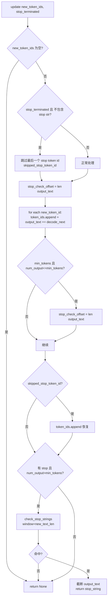

# Detokenizer（FastIncrementalDetokenizer）

[← Wiki 首页](../README.md) > [引擎核心](../README.md) > Detokenizer

源码：`vllm/v1/engine/detokenizer.py`（约 344 行）。本模块负责把 EngineCore 回送的增量 `new_token_ids` 逐 token 还原为文本，并检测 stop 字符串，是 OutputProcessor 的核心依赖。

## 是什么

类层次：
- `IncrementalDetokenizer`（`detokenizer.py:30`）：基类，提供空实现（tokenizer 为 None 时跳过反分词）。`from_new_request`（`detokenizer.py:48`）是工厂方法，按 tokenizer 类型分发：
  - `tokenizer is None` → `IncrementalDetokenizer`（no-op）
  - `USE_FAST_DETONIZER and PreTrainedTokenizerFast` → `FastIncrementalDetokenizer`
  - 否则 → `SlowIncrementalDetokenizer`
- `BaseIncrementalDetokenizer`（`detokenizer.py:68`，ABC）：实现 `update(new_token_ids, stop_terminated)` 主流程——逐 token `decode_next` + stop 字符串匹配 + min_tokens 检查；`get_next_output_text(finished, delta)` 处理 stop_buffer_length 与 delta 偏移。
- `FastIncrementalDetokenizer`（`detokenizer.py:167`）：基于 `tokenizers.decoders.DecodeStream`（≥0.22.0），用 prompt token ids 做 native prefill 启动 stream，`decode_next` 调 `stream.step(tokenizer, token_id)`。
- `SlowIncrementalDetokenizer`（`detokenizer.py:250`）：回退到 Python `detokenize_incrementally`（`vllm/tokenizers/detokenizer_utils.py`），手动维护 `prefix_offset`/`read_offset`/`tokens` 缓冲。
- `check_stop_strings`（`detokenizer.py:309`）：纯函数，按 `new_char_count` 窗口搜索 stop 字符串，返回 `(stop_string, truncate_offset)`，`-1` 表示无需截断。

模块级常量：
- `USE_FAST_DETONIZER = tokenizers.__version__ >= 0.22.0`（`detokenizer.py:24`）。
- `INVALID_PREFIX_ERR_MSG = "Invalid prefix encountered"`：来自 HF tokenizers Rust 端的错误串，用于在 `_protected_step` 中识别并重置 stream。

## 为什么

- **增量而非全量**：每步只新增 1~K 个 token，全量 `tokenizer.decode(all_token_ids)` 会随输出长度呈 O(N²)。增量维护"上一次已解码偏移"，仅处理新 token，O(N) 总成本。
- **stop 字符串跨越边界**：stop 串可能横跨多个 token（如 `"<|endoftext|>"` 拆成 3 个 token），必须维护缓冲文本并在每次 update 后做窗口搜索；`stop_buffer_length = max(len(s))-1` 决定未完成时保留多少字符不发出。
- **首 token 一致性**：HF BPE 等分词器倾向把"词首下划线"编进首 token，纯增量从空开始会丢失这个语义。Fast 路径用 `DecodeStream(ids=prompt_token_ids)` 做 native prefill，把 prompt tokens 灌入 stream 让起步状态正确。
- **`min_tokens` 与 stop 互斥**：在 `update` 中，若 `num_output_tokens <= min_tokens` 则把 `stop_check_offset` 持续前推，保证 stop 检测不会在未达 min_tokens 时触发（PR #22014）。
- **`include_stop_str_in_output`**：若 False，stop token 自身不参与 detokenize（避免它污染文本），但 token id 仍记录在 `token_ids`；若 True 则正常解码。
- **fast vs slow 兜底**：少数模型仍用_slow_ tokenizer（Llama、命令行小模型），fastokens shim 等场景也可能替换 `DecodeStream`；模块用 `getattr` 在模块层查找 `tokenizers.decoders.DecodeStream` 以尊重外部 patch。
- **错误恢复**：`_protected_step`（`detokenizer.py:223`）捕获 `OverflowError/TypeError` 与 `INVALID_PREFIX_ERR_MSG`，后者重置 stream 后重试单 token；这是 tokenizer 偶发的 non-monotonic UTF-8 边界 bug（issue #17448）。
- **性能**：Fast 路径走 Rust，无 GIL；Slow 路径只在没 fast tokenizer 时启用。

## 怎么做

### update 主流程



### Fast decode_next

```python
def decode_next(self, next_token_id):
    token = self._protected_step(next_token_id)  # stream.step(tokenizer, id)
    if not self.spaces_between_special_tokens:
        # added_token_ids dict 决定 special token 之间是否插空格
        special_token = self.added_token_ids.get(next_token_id)
        is_special = special_token is not None
        if is_special and self.last_special:
            token = special_token  # 直接用原始串，不前缀空格
        self.last_special = is_special
    return token or ""
```

`_protected_step` 错误恢复：
1. `OverflowError/TypeError` → 记 exception，返回 None（issue #21951）。
2. 抛 `INVALID_PREFIX_ERR_MSG` 异常 → 重建 `DecodeStream(skip_special_tokens=...)`（不带 prefill ids，因为前缀已损坏）并重试当前 token；记 warning。

### Slow decode_next

调 `detokenize_incrementally(tokenizer, all_input_ids, prev_tokens, prefix_offset, read_offset, ...)`，返回 `(new_tokens, decoded_text, prefix_offset, read_offset)`，本类负责维护 `tokens` 列表（不断 append）与 offsets。`output_token_ids` 属性跳过 prompt 部分（`token_ids[prompt_len:]`）。

### get_next_output_text

```python
buffer_length = 0 if finished else self.stop_buffer_length
if not delta:
    return self.output_text[:len-buffer_length] 或全量
# delta 模式：返回自上次 _last_output_text_offset 以来的增量
length = len(self.output_text) - buffer_length
delta_text = self.output_text[self._last_output_text_offset:length]
self._last_output_text_offset = length
return delta_text
```

### check_stop_strings

```python
for stop_str in stop:
    stop_index = output_text.find(stop_str, 1 - new_char_count - len(stop_str))
    if stop_index == -1: continue
    if include_in_output:
        stop_index += len(stop_str)
        if stop_index >= len(output_text): return stop_str, -1  # 无需截断
    return stop_str, stop_index
return None
```

注意 `1 - new_char_count - len(stop_str)` 是负数下标偏移，确保搜索窗口覆盖"上次尾部 + 新增字符"以捕获跨边界命中。

## 与其它模块/系统配合

- **[OutputProcessor](./output-processor.md)**：`RequestState.detokenizer` 由 OutputProcessor 持有；`process_outputs` 调 `detokenizer.update(new_token_ids, finish_reason==STOP)`，若返回 stop_string 则改写 finish_reason 并把 req_id 加入 `reqs_to_abort`。`make_request_output` 调 `get_next_output_text(finished, delta)` 取文本，`output_token_ids` 取 token 列表。
- **[InputProcessor](./input-processor.md)**：`from_new_request` 用 `request.prompt_token_ids` 启动 stream，所以 prompt 必须已 tokenize。
- **[SamplingParams](../10-config/README.md)**：`stop`、`min_tokens`、`include_stop_str_in_output`、`skip_special_tokens`、`spaces_between_special_tokens`、`detokenize`（False 时 tokenizer 强制 None，跳过 DETOK）。
- **[tokenizers 库](../14-tokenizers-transformers/README.md)**：Fast 路径直接用 `tokenizers.decoders.DecodeStream`；`fastokens` shim 可在模块加载时 patch 它。
- **[tracing / metrics](../16-observability/README.md)**：`first_token_ts`、`last_token_ts` 由 OutputProcessor 基于 detokenizer 输出时间戳写入 RequestStateStats。
- **[stream_interval](./output-processor.md)**：`stream_interval > 1` 时，OutputProcessor 用 `detokenizer.num_output_tokens()` 与 `sent_tokens_offset` 决定是否触发输出帧。

## 历史版本演进

- **v0.5/v0.6（v0）**：v0 用 `TextStreamDecoder` 同步全量解码；stop 字符串检测在 `AsyncLLMEngine` 内联，性能差。
- **v0.7（v1 落地）**：`IncrementalDetokenizer`/`BaseIncrementalDetokenizer`/`SlowIncrementalDetokenizer` 引入增量；`check_stop_strings` 抽成纯函数；`stop_buffer_length` 处理跨 token stop。
- **v0.8（v1 默认）**：`FastIncrementalDetokenizer` 引入（依赖 tokenizers≥0.22）；`DecodeStream(ids=...)` native prefill 修复首 token 一致性；`spaces_between_special_tokens` 通过 `added_token_ids` 缓存实现。
- **v0.9**：`_protected_step` 引入 `INVALID_PREFIX_ERR_MSG` 恢复（issue #17448）；`OverflowError/TypeError` 兜底（issue #21951）；`min_tokens` 与 stop 的互斥语义修正（PR #22014）。
- **v0.10 / main**：保持稳定；模块层 `getattr(tokenizers.decoders, "DecodeStream")` 查找以尊重 fastokens 等运行时 patch。具体版本归属（待核实）。

[← 返回引擎核心首页](../README.md)

## 参见

- [output-processor.md](./output-processor.md) — 唯一调用方与 stop 字符串异步 abort 回流。
- [input-processor.md](./input-processor.md) — 提供 prompt tokens 以启动 DecodeStream prefill。
- [data-model.md](./data-model.md) — `EngineCoreOutput.new_token_ids` 与 detokenizer 状态对齐。
