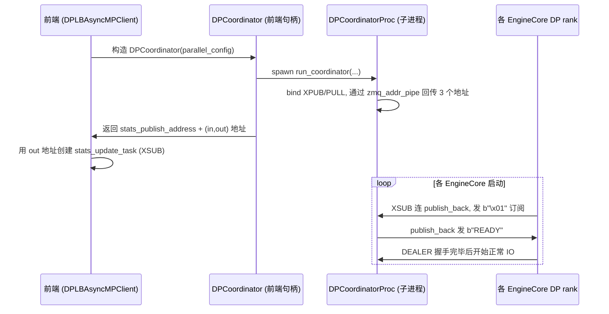

# DP Coordinator（数据并行协调）

[← Wiki 首页](../README.md) > [引擎核心](../README.md) > DP Coordinator

源码：`vllm/v1/engine/coordinator.py`（约 459 行）。当 `data_parallel_size > 1` 且非完全外部 LB 时，v1 启动一个独立的 `DPCoordinator` 进程作为多个 DP rank EngineCore 与一个或多个前端之间的"中介"。

## 是什么

两个类：
- `DPCoordinator`（`coordinator.py:23`）：前端侧句柄。负责 spawn `DPCoordinatorProc` 子进程，等待其上报 ZMQ 地址（`_wait_for_zmq_addrs`，超时 120s），暴露 `stats_publish_address`（前端订阅）与 `(coord_in_address, coord_out_address)`（EngineCore 连接）。`weakref.finalize` 注册 shutdown。
- `DPCoordinatorProc`（`coordinator.py:145`）：实际运行在子进程的协调逻辑，`set_process_title("DPCoordinator")`，使用 `zmq.Context()`。

`DPCoordinatorProc.process_input_socket`（`coordinator.py:188`）打开三个 socket：
- `publish_front`（XPUB bind）：前端订阅，广播 `(engine_req_counts_list, current_wave, engines_running)`。
- `output_back`（PULL bind）：EngineCore 发 stats 与 wave 通知。
- `publish_back`（XPUB bind）：EngineCore 订阅，广播 `START_DP_WAVE` 与 `READY`。

内部状态：
- `engines: list[EngineState]`：每个 DP rank 的 `[waiting, running]` 计数。
- `current_wave` / `engines_running`：全局 wave 与运行态。
- `stats_update_interval_ms`（默认 100）：有变化时最快 100ms 推一次 stats；无变化时每 5s 推一次。
- `last_step_counts` / `last_stats_step` / `last_stats_wave`：处理跨步 stats 乱序与批量缓存。

辅助类：
- `EngineState`（`coordinator.py:140`）：仅 `request_counts = [0, 0]`。
- `_send_start_wave(socket, wave, exclude_engine_index)`：广播 `START_DP_WAVE` 消息，含发起 wave 的引擎 index（已收过该 wave 请求，无需再通知）。

## 为什么

- **多前端共享 DP 池**：scale-out 部署时多个 API server 共享一组 DP EngineCore。如果每个前端各自维护 wave 状态会不一致；需要一个独立仲裁者。`DPCoordinator` 把 wave/stats 集中管理，前端只 sub 不写。
- **wave 协调避免空转**：DP>1（尤其 MoE）下，所有 rank 必须同步"跑/停"，否则空的 rank 会因 all-reduce 卡死。wave 是"从 running 到 paused 的次数"计数，由 rank 0 在 all-reduce 确认全员空闲时上报 `wave_complete`，coordinator 推进 `current_wave += 1` 并广播给前端。
- **首请求唤醒**：engines 处于 paused 时，前端发新请求会同时通过 `first_req_send_socket` 通知 coordinator；coordinator 立刻广播 `START_DP_WAVE` 唤醒其它 rank（除了已收到请求的 exclude_engine_index），避免dag starvation。
- **stale wave 竞态**：engine 可能在 paused 期间收到属于旧 wave 的请求（前端 race），此时上报 `start_wave`，coordinator 据此推进并通知其它 engine；若 wave < current_wave 则把 exclude 置 None 让所有 engine 都被唤醒。
- **DP LB stats 聚合**：内部 LB 模式下，coordinator 收集所有 rank 的 `(waiting, running)` 计数，按 100ms 节拍（或 5s 兜底）广播给前端；前端 `DPLBAsyncMPClient` 据此做 `waiting*4 + running` 最小评分选 target rank。
- **External LB 模式跳过 stats**：`data_parallel_external_lb=True` 时由外部 LB 器负责路由，coordinator 不发 stats，只广播 wave/running 变化，降低开销。
- **Elastic EP 扩缩通知**：`SCALE_ELASTIC_EP` 消息从 rank 0 前端发到 coordinator，coordinator 调整 `engines` 列表长度并广播出新 engine count。

## 怎么做

### 启动时序



### 主循环事件分派

```mermaid
flowchart TB
    P[zmq.Poller<br/>publish_front/publish_back/output_back] -->|timeout=wait_for| T{有事件?}
    T -- 无 --> PU[用 last_step_counts 或当前 counts 广播<br/>publish_front.send(counts, wave, running)]
    T -- 有 --> E{来自哪个 socket?}
    E -- publish_back --> PB{订阅消息?}
    PB -- 是 --> PQ[continue]
    PB -- 否 --> ERR[error]
    E -- publish_front --> PF{SCALE_ELASTIC_EP?}
    PF -- 是 --> SC[调整 engines 列表长度]
    PF -- 否 --> W[wave 协调:<br/>解码 (engine_to_exclude, wave)<br/>若 wave<current_wave exclude=None<br/>engines_running=True<br/>_send_start_wave]
    E -- output_back --> OB[解码 EngineCoreOutputs]
    OB --> S1{scheduler_stats?}
    S1 -- 是 --> SU[更新 engines[idx].request_counts<br/>按 (wave, step) 顺序校验]
    S1 -- 否 --> S2
    OB --> S2{wave_complete?}
    S2 -- 是 --> WC[current_wave = wave+1<br/>engines_running=False<br/>wave_state_changed=True]
    OB --> S3{start_wave?}
    S3 -- 是 且 推进 --> SW[current_wave=wave<br/>engines_running=True<br/>_send_start_wave(exclude=eng_index)]
    W --> CST{wave_state_changed?}
    WC --> CST
    SW --> CST
    CST -- 是 --> PUB[publish_front.send(None, wave, running)]
```

关键不变量：
- `output_back` 收到的 `EngineCoreOutputs` 在 wave 通知路径上 `assert not outputs.outputs and utility_output is None`——只承载控制信息。
- `stats_changed` 标志：stats 变化时把 100ms 节拍内最后一步的 counts 缓存到 `last_step_counts`，超时后批量广播，避免每步都发。
- 乱序检查：`(stats_wave, stats_step)` 必须严格大于上次，否则 warning。

### wave 协调三场景

| 场景 | 触发 | coordinator 行为 |
|---|---|---|
| 全员空闲 | rank 0 发 `wave_complete=k` | `current_wave=k+1`，`engines_running=False`，广播 `(None, k+1, False)` |
| 前端发首请求 | 前端 XPUB 消息 `(exclude_idx, wave)` | 若 `engines_running=False` 且 `wave<current_wave` 把 exclude 置 None；`engines_running=True`；`_send_start_wave(current_wave, exclude)` |
| engine 收到 stale wave 请求 | engine 发 `start_wave=k` | 若 `k>current_wave` 或 `(k==current_wave and not running)`：推进 wave，`engines_running=True`，`_send_start_wave(k, exclude=eng_idx)` |

### Elastic EP scale 通知

`SCALE_ELASTIC_EP` 消息由 rank 0 前端的 `DPLBAsyncMPClient._scale_up_elastic_ep`/`_scale_down_elastic_ep` 末尾通过 `first_req_send_socket` → coordinator `publish_front` 进入：
```python
if new_engine_count > current_count:
    for _ in range(new_engine_count - current_count):
        self.engines.append(EngineState())
    # 注意：新 engine 的 current_wave=0，若现有 engine 刚结束 wave
    # 而 engines_running 还未更新，可能让发往新 engine 的请求无法唤醒旧 engine
else:
    self.engines = self.engines[:new_engine_count]
```
coordinator 随后等待新 engine 的 XSUB 订阅消息（`b"\x01"`），回复 `READY` 让其加入。

## 与其它模块/系统配合

- **[EngineCore](./engine-core-process.md)**：`DPEngineCoreProc` 在 MoE 场景与 coordinator 配合，rank 0 通过 `wave_complete` 上报、所有 rank XSUB 订阅 `START_DP_WAVE`。`publish_dp_lb_stats` 仅在内部/混合 LB 模式为 True。
- **[core_client.py](./engine-core-process.md)**：`DPLBAsyncMPClient._ensure_stats_update_task` XSUB 连 `stats_publish_address`，消费 `(counts, wave, running)` 更新 `lb_engines`/`current_wave`；`first_req_send_socket`（PAIR）触发首请求通知。
- **[AsyncLLM](./async-llm-frontend.md)**：`AsyncLLM.wait_for_requests_to_drain` 调 `engine_core.dp_engines_running()`，后者读 `AsyncMPClient.engines_running`，由 stats task 更新。
- **[data-model.md](./data-model.md)**：`EngineCoreOutputs.wave_complete`/`start_wave`/`scheduler_stats` 是 coordinator 的输入；`EngineCoreRequestType.START_DP_WAVE=\x02` 是其输出。
- **[Distributed](../07-distributed/README.md)**：`ParallelConfig.stateless_init_dp_group` 用于 EngineCore 端建立 DP 进程组；coordinator 本身只用 ZMQ，不参与 torch distributed。
- **[Elastic EP](../07-distributed/README.md)**：`DPCoordinator.scale` 消息配合 `ReconfigureDistributedRequest` 协议完成 rank 增减。

## 历史版本演进

- **v0.7（v1 落地）**：`DPCoordinator`/`DPCoordinatorProc` 与 v1 DP 一起引入；最初仅支持 frontend-colocated 单前端场景。
- **v0.7.x**：引入外部 LB / 混合 LB 模式，`local_only` / `local_only_eng` 区分 inproc vs tcp socket；`enable_wave_coordination` 开关允许厂商禁用 wave 协调走纯外部仲裁。
- **v0.8（v1 默认）**：多前端 scale-out 成形；`stats_update_interval_ms=100`/5s 兜底；`SCALE_ELASTIC_EP` 消息加入。
- **v0.9**：Elastic EP scale up/down 全流程贯通：新 engine 订阅→READY→reconfigure→NEW_CORE_ENGINES_WEIGHTS_INIT_READY→RECONFIGURE_FINISHED；coordinator 处理新 engine `current_wave=0` 与现有 wave 不一致的边界。
- **v0.10 / v0.11 / main**：`enable_elastic_ep` 让 `local_only_eng=False` 强制走 tcp；NUMA/Ray 后端兼容性持续打磨；wave 协调稳定性修复（stale wave、两阶段暂停）。具体版本归属（待核实）。

[← 返回引擎核心首页](../README.md)

## 参见

- [engine-core-process.md](./engine-core-process.md) — `DPEngineCoreProc` 的 wave 协议对端 + Elastic EP 状态机。
- [async-llm-frontend.md](./async-llm-frontend.md) — `scale_elastic_ep` / `wait_for_requests_to_drain` 调用。
- [data-model.md](./data-model.md) — `EngineCoreOutputs.wave_complete`/`start_wave` 字段。
