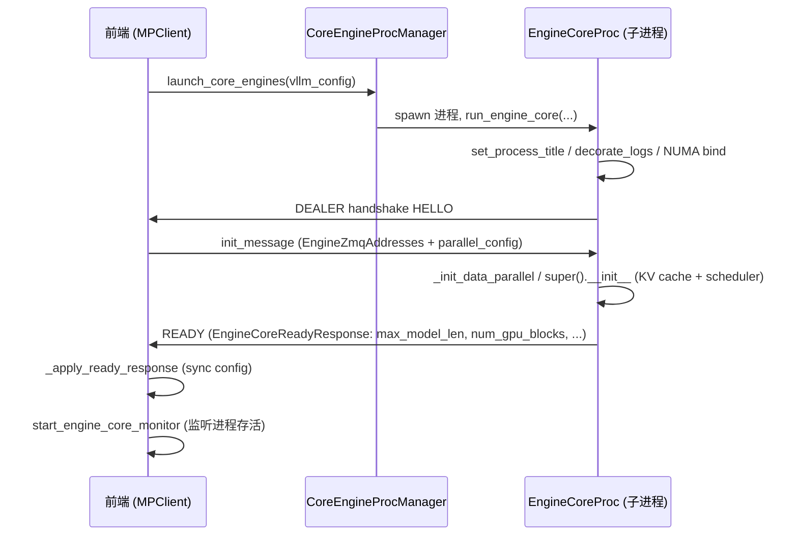
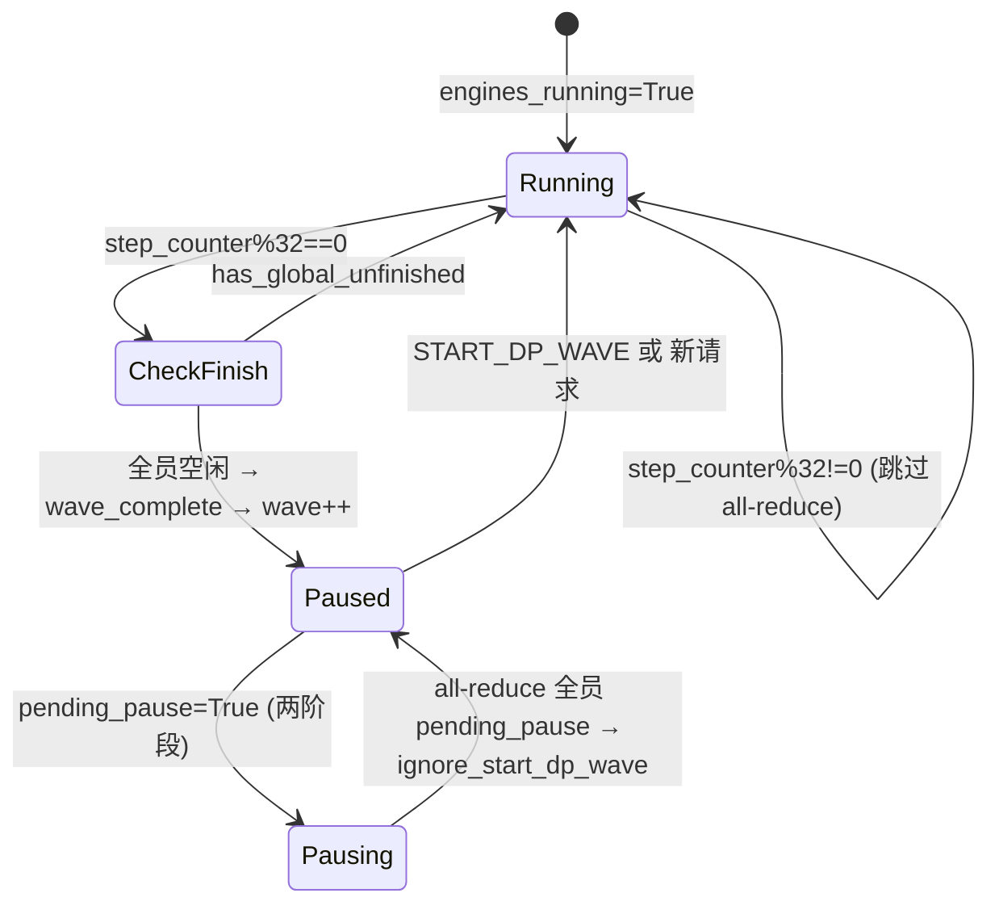

# EngineCore 进程 + ZMQ IPC

[← Wiki 首页](../README.md) > [引擎核心](../README.md) > EngineCore 进程

源码：
- `vllm/v1/engine/core.py`（约 2303 行）：`EngineCore`（内层逻辑）+ `EngineCoreProc`（ZMQ 包装）+ `DPEngineCoreProc`（MoE DP）+ Ray actor 变体。
- `vllm/v1/engine/core_client.py`（约 1764 行）：`EngineCoreClient` 抽象 + `InprocClient`/`SyncMPClient`/`AsyncMPClient`/`DPAsyncMPClient`/`DPLBAsyncMPClient`。

## 是什么

### `EngineCore`（`core.py:96`）

EngineCore 的"内层循环"，不涉及 IO，纯逻辑：
- 持有 `model_executor`（`Executor` 实例）、`scheduler`（`SchedulerInterface`）、`structured_output_manager`、`mm_receiver_cache`、可选 `kv_connector` / `ec_connector`。
- `__init__` 完成：插件加载 → `model_executor` 构造 → `_initialize_kv_caches()`（profile + 构建 `KVCacheConfig` + auto-fit `max_model_len`）→ `Scheduler` 实例化 → 收集 worker 端 KV connector 握手 metadata → `freeze_gc_heap()`（把启动期对象标记为静态，缩短后续 GC 暂停）。
- 核心方法：
  - `step()`（`core.py:479`）：`scheduler.schedule()` → `model_executor.execute_model(non_block=True)` → `get_grammar_bitmask` → `future.result()` → `_process_aborts_queue()` → `scheduler.update_from_output()`。返回 `(dict[int, EngineCoreOutputs], model_executed)`。
  - `step_with_batch_queue()`（`core.py:519`）：pipeline parallel 下用 `batch_queue: deque` 异步重叠多个 step，消除 bubble；支持 deferred structured-output sampling。
  - `add_request` / `abort_requests` / `preprocess_add_request`（mm_receiver_cache 取特征 + `Request.from_engine_core_request` + 语法初始化）。
  - `pause_scheduler` / `resume_scheduler` / `is_scheduler_paused` / `sleep` / `wake_up` / `is_sleeping`：控制面。
  - `reset_prefix_cache` / `reset_mm_cache` / `reset_encoder_cache` / `_reset_caches`：缓存清理。
  - `collective_rpc` / `profile` / `add_lora` 等：透传到 `model_executor`。

### `EngineCoreProc`（`core.py:896`）

继承 `EngineCore`，在子进程里包一层 ZMQ IO 与 busy loop：
- 构造时 `_perform_handshakes` 与前端交换 `EngineZmqAddresses`（inputs/outputs/coordinator_input/coordinator_output/frontend_stats_publish_address），`HELLO → init → READY`。
- 启动两个 daemon 线程：`process_input_sockets`（DEALER/XSUB 收请求，解码后塞 `input_queue`）与 `process_output_sockets`（PUSH 发送 `output_queue` 内容；支持 buffer 复用与 zero-copy `MessageTracker`）。
- `run_busy_loop()`（`core.py:1259`）：循环 `_handle_shutdown() → _process_input_queue() → _process_engine_step()`；`_process_input_queue` 在无工作时阻塞于 `input_queue.get(block=process_input_queue_block)`。
- `_handle_client_request`（`core.py:1372`）：按 `EngineCoreRequestType` 分派 ADD/ABORT/UTILITY/WAKEUP/EXECUTOR_FAILED；UTILITY 用 `_invoke_utility_method` 异步执行（Future 完成后再 enqueue）。
- shutdown 三态机 `EngineShutdownState`（`core.py:890`）：RUNNING → REQUESTED → SHUTTING_DOWN；`_handle_shutdown` 根据 `shutdown_timeout` 选 `abort`（立即撤销所有请求）或 `drain`（等待排空）；拒绝新请求并回 abort 输出。
- `_send_engine_dead()`：异常退出时把 `ENGINE_CORE_DEAD` 哨兵塞 `output_queue` 并 join output 线程，确保前端必收到死亡通知。

### `DPEngineCoreProc`（`core.py:1745`）

仅用于 **MoE 模型 + DP>1**（非 MoE 的 DP rank 互相独立，退化为多个 `EngineCoreProc`）。关键扩展：
- `_init_data_parallel`：用 `ParallelConfig.stateless_init_dp_group` 建立无状态 DP 进程组与 store。
- `run_busy_loop`：每步后做 `_has_global_unfinished_reqs`（每 32 步一次 all-reduce 同步），所有 rank 都空闲时由 rank 0（或无 coordinator 时每个 rank）发 `wave_complete=current_wave` 给前端/coordinator；wave 计数 +1，step_counter 清零。
- `_maybe_publish_request_counts`：内部 LB 模式把 `(waiting, running, step_counter, current_wave)` 推给 coordinator。
- `_should_throttle_prefills`：按 `prefill_schedule_interval` 节拍限制非对齐步的新 prefill，保持 DP rank 间 prefill 对齐。
- 两阶段暂停协议 `_pause_complete`：设 `pending_pause=True` 并 kick-start engines_running，等 all-reduce 全员同意后置 `ignore_start_dp_wave`，防 stale START_DP_WAVE 唤醒。
- `reinitialize_distributed` / `_eep_send_engine_core_notification` / `eep_handle_engine_core_notification` / `_eep_scale_up_before_kv_init`：Elastic EP 在线扩缩容状态机入口，委托给 `ElasticEPScalingState`。

### Ray actor 变体

`EngineCoreActorMixin`（`core.py:2120`）+ `DPMoEEngineCoreActor`/`EngineCoreActor`：Ray 后端下 EngineCore 作为 actor 运行，跳过 ZMQ 握手（地址在 actor 创建前已知），由 `run()` 直接进入 `run_busy_loop()`。`_set_visible_devices` 处理 Ray 下 `CUDA_VISIBLE_DEVICES` 的 stickiness 问题。

### `EngineCoreClient` 体系（`core_client.py`）

| 客户端 | 用途 | 关键点 |
|---|---|---|
| `InprocClient`（`core_client.py:276`） | v0-style `LLMEngine` 同进程 | 直接 `engine_core.step_fn()`；不支持 `wait` pause 模式 |
| `SyncMPClient`（`core_client.py:779`） | `LLM` 同步多进程 | 后台 `process_outputs_socket` 线程把 ZMQ 输出塞 `queue.Queue`；`call_utility` 用 `Future.result()` 同步等回执 |
| `AsyncMPClient`（`core_client.py:950`） | `AsyncLLM` 默认 | asyncio Queue + `process_outputs_socket` 协程；`EEPNotificationType` 走专用回调 |
| `DPAsyncMPClient`（`core_client.py:1200`） | DP>1 外部 LB | 每客户端对应一个 DP rank；`first_req_send_socket` 通知 coordinator 启动新 wave |
| `DPLBAsyncMPClient`（`core_client.py:1380`） | DP>1 内部 LB | `get_core_engine_for_request` 按 `waiting*4 + running` 评分选最闲 rank；`reqs_in_flight` 路由 abort |

`MPClient` 基类负责：ZMQ context 创建、`BackgroundResources` finalizer（防止循环引用导致 GC 不释放）、`launch_core_engines` 启动 `CoreEngineProcManager`/`CoreEngineActorManager`、等待各 engine 的 `READY` 消息（`EngineCoreReadyResponse`，`_apply_ready_response` 同步 `max_model_len`/`num_gpu_blocks`/`block_size`/`kv_cache_size_tokens` 回前端 config）、`start_engine_core_monitor` 监控进程存活。

## 为什么

- **进程隔离**：把调度+执行放到独立进程，使其 GIL 与 API server 解绑；API server 高并发 async IO 不被 Python 调度循环阻塞。同时单进程意外崩溃不会直接拖垮 server（`ENGINE_CORE_DEAD` 哨兵 + `validate_alive` + monitor 线程）。
- **IO 与计算重叠**：`process_input_sockets` / `process_output_sockets` 独立线程在 ZMQ 上编解码（ZMQ 释放 GIL），busy loop 只操作 Python 队列；多模态张量走 `TensorIpcSender`/`TensorIpcReceiver` 的 torch shm 带外通道，避免 msgspec 序列化大张量。
- **统一的 utility RPC**：所有非 ADD/ABORT 控制面（profile/lora/sleep/reset/collective_rpc/pause/resume/reinitialize_distributed/eep_handle_engine_core_notification ...）都通过 `UTILITY` 消息 + `call_id` Future 实现，前后端协议简洁。
- **shutdown 可配置**：`shutdown_timeout=0` 立即 abort 所有在飞请求；>0 则 drain。`_reject_add_in_shutdown` / `_reject_utility_in_shutdown` 保证关闭期间不接收新工作，但前端能拿到明确的 abort 输出而非崩溃。
- **DP 协调去中心化**：非 MoE DP rank 完全独立（节省 all-reduce）；MoE 因 expert all-to-all 必须同步，故 `DPEngineCoreProc` 引入 wave + 节拍 prefill throttle + 两阶段暂停。`DPCoordinator` 作为可选中介（见 [dp-coordinator.md](./dp-coordinator.md)）。
- **Elastic EP 在线扩缩容**：通过 `ReconfigureDistributedRequest` + `EEPNotificationType` 四阶段握手（NEW_CORE_ENGINES_INIT_READY → NEW_CORE_ENGINES_WEIGHTS_INIT_READY → RECONFIGURE_FINISHED → SHUTDOWN_COMPLETE）在不停止服务的前提下增减 DP rank。
- **GC 优化**：`freeze_gc_heap()` 把启动期对象（权重、KV 缓存）标为静态，减少 full GC 暂停；`enable_envs_cache()` 在 EngineCore 启动完成后冻结环境变量读取，避免热路径重复解析。

## 怎么做

### 启动握手时序



### busy loop 数据流

```mermaid
flowchart TB
    subgraph IOThreads["IO 线程"]
        IS[process_input_sockets<br/>DEALER+XSUB poller] -->|EngineCoreRequestType+data| IQ[input_queue]
        OQ[output_queue] -->|client_index, EngineCoreOutputs| OS[process_output_sockets<br/>PUSH encode]
    end
    subgraph BusyLoop["run_busy_loop (主线程)"]
        BL[_handle_shutdown] --> PIQ[_process_input_queue]
        PIQ -->|有工作| PES[_process_engine_step]
        PES -->|step_fn| ST[Scheduler.schedule]
        ST -->|SchedulerOutput| EXC[model_executor.execute_model]
        EXC -->|ModelRunnerOutput| UF[Scheduler.update_from_output]
        UF -->|dict[client_idx, EngineCoreOutputs]| OQ
    end
    IS --> IQ
    IQ --> PIQ
```

### _process_input_queue 阻塞语义

- `process_input_queue_block`（默认 True）：无工作时 `input_queue.get(block=True)` 阻塞，让出 GIL；shutdown 请求通过 `WAKEUP` 哨兵唤醒。
- Elastic EP scale up/down 期间临时设为 False（`core.py:2047`），使 busy loop 快速轮询 `eep_scaling_state.progress()`。

### UTILITY 调用链

```python
AsyncLLM.pause_scheduler_async(mode)
  → AsyncMPClient.call_utility_async("pause_scheduler", mode)
  → _send_input(UTILITY, (client_idx, call_id, method, args))
  → EngineCoreProc._handle_client_request UTILITY 分支
  → _invoke_utility_method(name, lambda: getattr(self, method)(*args), output, enqueue_output)
    # 若返回 Future，add_done_callback 延迟 enqueue（pause_scheduler 等就是 this 路径）
  → output_queue.put_nowait((client_idx, EngineCoreOutputs(utility_output=out)))
  → 前端 _process_utility_output(future.set_result / set_exception)
```

### DP wave 与暂停



### ZMQ 拓扑选址

- 单机 DP=1：`ipc://` 域 socket（`get_engine_zmq_addresses`）。
- 多机或 headless engine：`tcp://` 占位端口，绑定后通过 `zmq.LAST_ENDPOINT` 回传真实端口。
- Input socket 用 `ROUTER`（前端）↔ `DEALER`（engine）；Output 用 `PULL`（前端）↔ `PUSH`（engine）；Coordinator 用 `XPUB`/`XSUB`。
- Elastic EP 启用 `router_handover=True`，允许新 rank 复用被移除 rank 的连接（同 identity）。

## 与其它模块/系统配合

- **[AsyncLLM](./async-llm-frontend.md)**：`AsyncMPClient` 是 AsyncLLM 唯一 IPC 通道；`process_engine_outputs` 回调（DP LB）更新 `reqs_in_flight`。
- **[Scheduler](./scheduler/scheduler.md)**：`EngineCore` 持有 `SchedulerInterface`，`step_fn` 把 schedule + execute_model + update_from_output 串起来；`async_scheduling` 时由 `AsyncScheduler` 替换。
- **[02-execution](../02-execution/README.md)**：`model_executor.execute_model(SchedulerOutput, non_block=True)` 返回 `Future[ModelRunnerOutput]`；executor 内部把 SchedulerOutput 转成 worker 侧输入并广播。
- **[KV connector](../15-kv-cache-offload/README.md)**：scheduler.connector 在 `EngineCore.__init__` 时收集 worker 握手 metadata；`get_kv_connector_handshake_metadata` 跨 PP/TP rank 合并。
- **[structured output](../06-sampling-decoding/README.md)**：`StructuredOutputManager.grammar_init(req)` 在 `preprocess_add_request` 中执行（仅 input 处理线程），`get_grammar_bitmask` 在 step 中调用。
- **[Tensor IPC](./data-model.md)**：`TensorIpcSender`/`TensorIpcReceiver` 通过 `multiprocessing.Queue` 传递 torch shm handle，配合 `MsgpackEncoder(oob_tensor_consumer=...)` 实现多模态大张量零拷贝。
- **[Planner / Compilation](../09-compilation-ir/README.md)**：`vllm_config.compilation_config.compilation_time` 在 `_initialize_kv_caches` 完成后日志汇报。
- **[ Platforms](../08-platforms/README.md)**：`current_platform.register_custom_kv_cache_specs` 通过 `register_all_kvcache_specs` 触发，使厂商自定义 spec 进入注册表。

## 历史版本演进

- **v0.6（v1 预研）**：试验性单进程 v1，无独立 EngineCoreProc。
- **v0.7（v1 落地）**：`EngineCore` + `EngineCoreProc` + `core_client.py` 三件套成型；ZMQ + msgspec IPC；`InprocClient`/`SyncMPClient`/`AsyncMPClient` 三种客户端分离。`HANDSHAKE_TIMEOUT_MINS=5`。
- **v0.7.x**：`DPEngineCoreProc` 引入 MoE DP（all-reduce 同步、wave 概念）；`DPCoordinator`（coordinator.py）分离。
- **v0.8（v1 默认）**：`EngineCoreReadyResponse` 字段扩充（`kv_cache_size_tokens`、`kv_cache_max_concurrency`）；`shutdown_timeout` 三态机；`freeze_gc_heap` / `enable_envs_cache` 引入降低 GC 与 envs 解析开销。`BatchQueue`（pipeline parallel）加入 `step_with_batch_queue`。
- **v0.9**：Elastic EP scale up/down 框架（`EEPNotificationType`、`ReconfigureDistributedRequest`、`ElasticEPScalingState`）；`CoreEngineActorManager` 支持 Ray actor；`router_handover` 支持同 identity 重连；`abort_immediately` 加入 P-D 拒绝清理路径。
- **v0.10**：`prefill_schedule_interval` DP prefill 节拍对齐；`reasoning`/thinking budget 接入 `preprocess_add_request`。
- **v0.11 / v0.12 / main**：`ECConnectorOutput`、`expected_finished_count`（Nixl 握手）；`enable_return_routed_experts` MoE 路由回写；MRv2 切换中 `AsyncScheduler` 主线化；`tensor_ipc` torch_shm 路径稳定。具体版本归属（待核实）。

[← 返回引擎核心首页](../README.md)

## 参见

- [async-llm-frontend.md](./async-llm-frontend.md) — 前端如何使用 `EngineCoreClient`。
- [dp-coordinator.md](./dp-coordinator.md) — DP>1 时的协调进程与 wave 协议。
- [data-model.md](./data-model.md) — 跨进程消息结构与 `EngineCoreReadyResponse`。
- [scheduler/scheduler.md](./scheduler/scheduler.md) — `step_fn` 内部调度细节。
- [kv-cache-management/spec.md](./kv-cache-management/spec.md) — `_initialize_kv_caches` 中 spec 注册与 group 划分。
