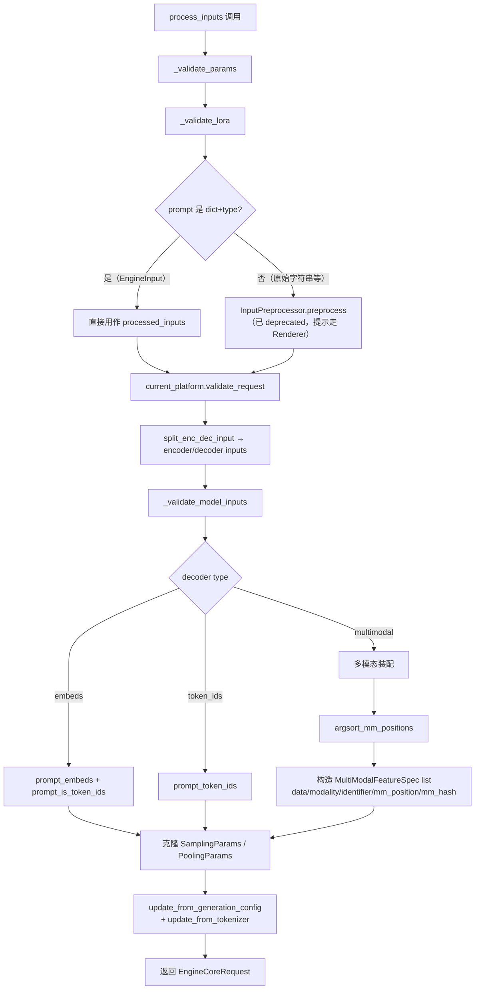

# InputProcessor（输入处理）

[← Wiki 首页](../README.md) > [引擎核心](../README.md) > InputProcessor

源码：`vllm/v1/engine/input_processor.py`（约 494 行）。`InputProcessor` 是 AsyncLLM 前端侧的"请求预处理器"，负责把 API server 传来的任意形态 prompt 转成 EngineCore 能直接调度的 `EngineCoreRequest`。

## 是什么

`InputProcessor`（`input_processor.py:36`）在 `AsyncLLM.__init__` 中创建（`async_llm.py:135`），持有：
- `vllm_config` 全套子配置（`model_config`/`cache_config`/`lora_config`/`scheduler_config`/`speculative_config`/`structured_outputs_config`/`observability_config`/`use_v2_model_runner`）。
- `renderer`（`BaseRenderer`，由 `renderer_from_config` 创建）：提供 tokenizer、chat 模板、mm_processor_cache、`get_eos_token_id()`。
- `input_preprocessor`（`InputPreprocessor`，来自 `vllm.inputs.preprocess`）：用于把"原始字符串/dict prompt"老式入口转换为 `EngineInput`。
- `mm_registry` + `MultiModalBudget`：在支持多模态时计算 `mm_encoder_cache_size`、`skip_prompt_length_check`。

核心方法：
- `process_inputs(...)`（`input_processor.py:242`）：主入口，参数与 `EngineClient.add_request` 对齐。
- `assign_request_id(request)`（`input_processor.py:222`，static）：把 `request_id` 复制到 `external_req_id`，并在 `request_id` 追加 8 位随机字符；受 `VLLM_DISABLE_REQUEST_ID_RANDOMIZATION` 影响（该 env 即将移除）。
- `_validate_params` / `_validate_lora` / `_validate_model_inputs` / `_validate_prompt_len`：参数与输入合法性。
- `_get_mm_identifier`：当 `enable_tower_connector_lora=True` 时把 mm_hash 拼上 `lora_name:` 前缀，避免不同 LoRA 的多模态 embedding 错误共享缓存。
- `inject_into_mm_cache`：当 mm_kwargs 已被前端 HF processor 处理过（如外部 SHM 传输）时直接写入 processor cache，保持命中率统计准确。

## 为什么

- **解耦 API 与 EngineCore**：API server 进入的 prompt 形态多样（字符串、TokensPrompt、chat messages、EmbedsPrompt、多模态 dict、`EngineCoreRequest`），EngineCore 不应感知这些差异。`InputProcessor` 是唯一的归一化点，输出标准 `EngineCoreRequest`。
- **校验前置**：把所有"早期失败"（vocab 越界、prompt 超长、LoRA 未启用、task 不支持、thinking_token_budget 与 reasoning_config 不匹配）提前到前端，避免 EngineCore 被无效请求打扰；发送到 EngineCore 的请求假定通过校验。
- **多模态 placeholder 装配**：多模态模型的 HF processor 会输出 `mm_placeholders`/`mm_hashes`/`mm_kwargs` 三个并列 dict；`process_inputs` 用 `argsort_mm_positions` 按序列位置排序并 flatten 成 `list[MultiModalFeatureSpec]`，与 prompt token 序列对齐，便于调度器按 `mm_position.offset` 切片调度编码器。
- **request_id 唯一化**：用户提交的 request_id 可能重复（尤其是 client 自定义 id），而 scheduler 的 `requests: dict[str, Request]`、worker 的 `req_id_to_index` 都要求全局唯一。`assign_request_id` 在前端一次性处理，对外仍用 `external_req_id`。
- **DP rank 路由校验**：`data_parallel_rank` 范围检查放在前端（`num_ranks = dp_local_size if local_engines_only else dp_size`），早失败。
- **generation config / tokenizer 同步**：`SamplingParams.update_from_generation_config(...)` 把模型自带的 generation_config（如默认 EOS、temperature）合并进请求；`update_from_tokenizer` 注入 tokenizer 相关字段（stop token ids 等）。

## 怎么做

### process_inputs 主流程



关键细节：
- `max_tokens` 默认填充：`SamplingParams.max_tokens is None` 时设为 `max_model_len - seq_len`（`input_processor.py:317`）。
- `_validate_prompt_len`：对 decoder 检查 `prompt_len <= max_model_len`；当 `prompt_len == max_model_len` 且 runner_type=generate 时直接报错（至少需要 1 个输出 token）。`skip_prompt_length_check` 用于某些多模态处理器内部已切片的场景。
- `_validate_model_input` 检查 `max_input_id > max(tokenizer.max_token_id, model_vocab_size - 1)` 报"out of vocabulary"；注释说明 Qwen3 等 LM 词表与 tokenizer 不对齐的特殊性。
- `cache_salt` 来自 `decoder_inputs.get("cache_salt")`，作为前缀缓存哈希的额外盐（同 prompt 不同 salt 不命中）。
- `resumable` 字段流入 `EngineCoreRequest.resumable`，是 streaming-input 的开关。

### assign_request_id

```python
request.external_req_id = request.request_id
if envs.VLLM_DISABLE_REQUEST_ID_RANDOMIZATION:
    # 警告：未来移除；可能造成重复 id 导致正确性问题
    pass
else:
    request.request_id = f"{request.external_req_id}-{random_uuid():.8}"
```

调用点：`AsyncLLM.add_request` 中 `_add_request` 之前（`async_llm.py:368`），streaming-input 路径在 `input_processor.py:453`。

### streaming-input 的复用

`_add_streaming_input_request`（`async_llm.py:417`）里每个 input chunk 都会再调 `process_inputs(..., resumable=True)`，使用相同的 `internal_req_id`。EngineCore `Scheduler.add_request` 检测到重复 id 且 `resumable=True` 时，把请求作为续写注入既有会话（`Request.streaming_queue`）。

### 多模态 placeholder 排序

`argsort_mm_positions` 返回 `[(modality, idx), ...]` 按 `mm_position.offset` 升序。然后构造：
```python
MultiModalFeatureSpec(
    data=decoder_mm_inputs[modality][idx],
    modality=modality,
    identifier=self._get_mm_identifier(base_mm_hash, lora_request),
    mm_position=decoder_mm_positions[modality][idx],
    mm_hash=base_mm_hash,
)
```
`identifier` 字段是 [EncoderCacheManager](./kv-cache-management/encoder-cache.md) 的 key；`enable_tower_connector_lora` 时带 LoRA 前缀避免跨 LoRA 共享。

## 与其它模块/系统配合

- **[AsyncLLM](./async-llm-frontend.md)**：`AsyncLLM.add_request` / `_add_streaming_input_request` 是唯一调用方；`extract_prompt_components` 从 `EngineInput` 抽 `prompt_text` 给 OutputProcessor。
- **[Renderer / 分词与转换器](../14-tokenizers-transformers/README.md)**：`Renderer.render_cmpl/render_chat` 是生成 `EngineInput` 的推荐入口（直接传字符串/原始 dict 已 deprecated，v0.18 移除）。
- **[data-model.md](./data-model.md)**：`EngineCoreRequest` 的最终形态由此决定。
- **[EngineCore](./engine-core-process.md)**：`EngineCore.preprocess_add_request` 用 `mm_receiver_cache.get_and_update_features` 把前端传入的 `mm_features` 替换成接收端实际特征（跨进程 SHM），再 `Request.from_engine_core_request`。
- **[Scheduler](./scheduler/scheduler.md)**：消费 `Request.mm_features` 和 `Request.structured_output_request`（来自 `StructuredOutputRequest.from_sampling_params`）。
- **[多模态子系统](../11-multimodal/README.md)**：`MultiModalBudget` 提供 `encoder_cache_size`/`encoder_compute_budget`，决定调度器 `_try_schedule_encoder_inputs` 的预算上限。
- **[Platforms](../08-platforms/README.md)**：`current_platform.validate_request(processed_inputs, params)` 允许厂商做平台特定校验（如禁用某些 dtype）。
- **[structured output](../06-sampling-decoding/README.md)**：`StructuredOutputRequest.from_sampling_params` 在 `Request.__init__` 中触发；`reasoning_ended`/`reasoning_parser_kwargs` 透传给 grammar 以支持 thinking budget。

## 历史版本演进

- **v0.5/v0.6（v0 风格）**：`LLMEngine` 内联 tokenization，无独立 `InputProcessor`；多模态装配散落在 `InputPreprocessor`。
- **v0.7（v1 落地）**：`InputProcessor` 抽出，专责 `EngineCoreRequest` 构造；`assign_request_id` 引入随机后缀；多模态 `MultiModalFeatureSpec` 统一格式。
- **v0.8（v1 默认）**：`_validate_params` 分离 `SamplingParams.verify` 与 `PoolingParams.verify`；`update_from_generation_config`/`update_from_tokenizer` 接入。`skip_prompt_length_check` 用于部分多模态处理器。
- **v0.9**：`prompt_embeds` + `prompt_is_token_ids` 引入，支持混合 embeds/token 输入；`inject_into_mm_cache` 支持前端预处理的 mm_kwargs 直接写入 processor cache；streaming-input (`resumable=True`) 路径成形。
- **v0.10**：`thinking_token_budget` 校验接入；显式禁止在 V2 model runner 下使用（`use_v2_model_runner` 检查）。`reasoning_ended`/`reasoning_parser_kwargs` 透传。
- **v0.11 / main**：`enable_tower_connector_lora` 让 mm_hash 带 LoRA 前缀；`cache_salt` 字段正式化；`tokenization_kwargs` 弃用提示（v0.18 移除）。具体版本归属（待核实）。

[← 返回引擎核心首页](../README.md)

## 参见

- [async-llm-frontend.md](./async-llm-frontend.md) — 唯一调用方。
- [data-model.md](./data-model.md) — `EngineCoreRequest` 字段语义。
- [output-processor.md](./output-processor.md) — 接收端的请求状态重建。
- [kv-cache-management/encoder-cache.md](./kv-cache-management/encoder-cache.md) — 多模态编码器缓存与 `identifier`。
