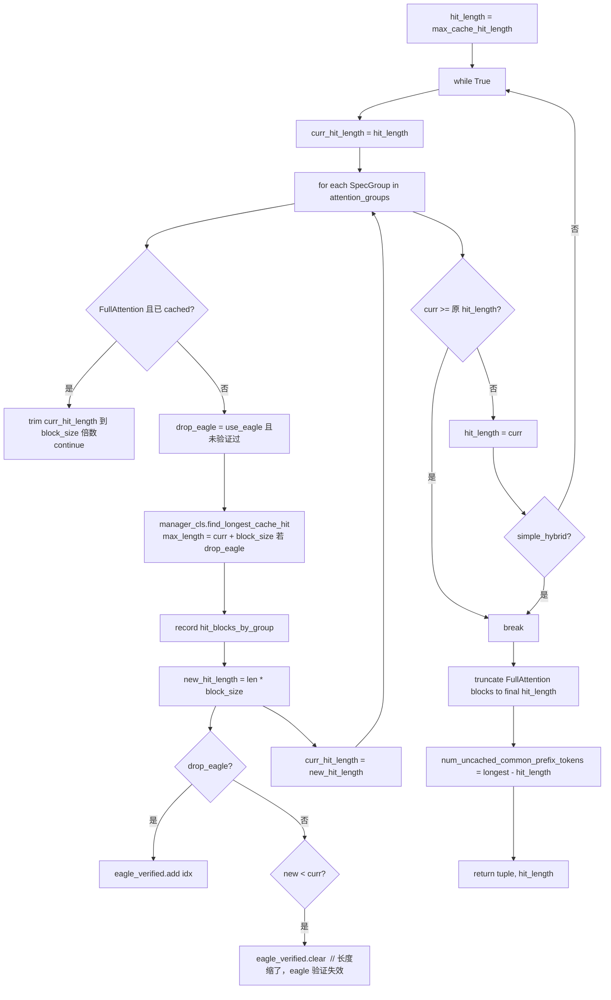

# KVCacheCoordinator（混合协调）

[← Wiki 首页](../../README.md) > [引擎核心](../README.md) > [KV 缓存管理](README.md) > KVCacheCoordinator

源码：`vllm/v1/core/kv_cache_coordinator.py`（约 834 行）。`KVCacheCoordinator` 抽象基类及其三个子类是 v1 混合 KV cache 的协调中枢，负责多 group 块的统一分配/释放/命中查找。

## 是什么

### 类层次

```
KVCacheCoordinator (ABC)
├── KVCacheCoordinatorNoPrefixCache   # caching=False 或 0 group
├── UnitaryKVCacheCoordinator         # caching=True 且仅 1 group
└── HybridKVCacheCoordinator          # caching=True 且 ≥2 group
```

`get_kv_cache_coordinator(...)` 工厂（`kv_cache_coordinator.py:782`）按 `enable_caching` 与 group 数选择子类。

### `KVCacheCoordinator` 基类（`kv_cache_coordinator.py:61`）

构造建立：
- `kv_cache_config`、`max_model_len`、`scheduler_block_size`（= 各 group `block_size` 的 LCM，必须整除 `hash_block_size` 的倍数约束的反向——`scheduler_block_size % hash_block_size == 0`）。
- `block_pool: BlockPool`：所有 group 共享。
- `eagle_group_ids: set[int]`：`is_eagle_group=True` 的 group id（无显式标记时 fallback 到全部 group）。
- `single_type_managers: tuple[SingleTypeKVCacheManager, ...]`：通过 `get_manager_for_kv_cache_spec` 工厂为每个 group 创建对应 manager 子类（FullAttentionManager / SlidingWindowManager / MambaManager / ...）。
- `retention_interval`：`VLLM_PREFIX_CACHE_RETENTION_INTERVAL`，0=仅保留最新 replay 边界，None=密集缓存，正数=按间隔稀疏化 SWA/Mamba checkpoint；通过 `_validate_prefix_cache_retention_interval` 校验。

核心方法（多 group 聚合）：
- `get_num_blocks_to_allocate(...)`：聚合各 manager 的需求；`CrossAttentionManager` 走专路径（按 encoder_tokens 静态分配）。
- `allocate_new_computed_blocks(...)`：two-phase 装配命中块（先 local 后 external，避免自驱逐）。
- `allocate_new_blocks(...)`：每组 manager 独立分配。
- `cache_blocks(request, num_computed_tokens)`：透传给各 manager，附 `retention_interval`。
- `free` / `pop_blocks_for_free` / `get_num_common_prefix_blocks` / `remove_skipped_blocks` / `get_blocks` / `new_step_starts`：批量调用各 manager。
- 抽象 `find_longest_cache_hit(block_hashes, max_cache_hit_length) -> (tuple[list[KVCacheBlock], ...], int)`。

### `UnitaryKVCacheCoordinator`（`kv_cache_coordinator.py:427`）

单 group 简化路径：
- `block_size` 按 `dcp_world_size`/`pcp_world_size` 放大（DCP/PCP 下每 rank 只存 `max_model_len/dcp/pcp` token）。
- `find_longest_cache_hit`：直接委托给 `single_type_managers[0].find_longest_cache_hit(...)`，返回 `(hit_blocks, len(hit_blocks[0]) * block_size)`。
- `use_eagle` 直接置 `0 in eagle_group_ids`。

### `HybridKVCacheCoordinator`（`kv_cache_coordinator.py:514`）

多 group 路径，混合 attention 的关键：
- `verify_and_split_kv_cache_groups()`：把 group 按 spec 类型分桶成 `attention_groups: list[SpecGroup]`（NamedTuple: `spec, group_ids, manager_cls, use_eagle`），同 spec 的 group 合并以便批量命中查找；按 FullAttention 优先排序（其 downward-closed 性质提供更紧的上界）。
- `cache_blocks` override：按 `scheduler_block_size` 对齐缓存；EAGLE group 多缓存一个 lookahead block（`aligned + block_size`）。
- `find_longest_cache_hit`：不动点迭代算法。
- `find_longest_cache_hit_per_group`：每组独立命中（Mamba hybrid 用，连接器需要 FA 命中数 vs Mamba 命中数区分）。
- `num_uncached_common_prefix_tokens`：上次 hit 算法的副产品，供 scheduler Marconi APC 使用。

### `SpecGroup`（`kv_cache_coordinator.py:499`）

NamedTuple：`(spec: KVCacheSpec, group_ids: list[int], manager_cls: type[SingleTypeKVCacheManager], use_eagle: bool)`。同 spec 的 group 共享命中查找（一次扫描服务多 group）。

## 为什么

- **物理池共享**：所有 group 用同一 `BlockPool`，避免按 group 切分池造成的内部碎片；ref_cnt 与哈希表全局维护。
- **粒度对齐**：`scheduler_block_size` 是 LCM，保证调度器一次给每 group 整数倍 block；`hash_block_size` 更细（通常等于最小 group block_size），让 hybrid 模型也能在 sub-scheduler-block 粒度命中。
- **NoPrefixCache 路径**：caching 关闭时跳过全部哈希表逻辑（`find_longest_cache_hit` 直接返回空），节省开销；支持 0 group（encoder-only 模型）。
- **Unitary 快路径**：单 group 模型（占大多数）不需要不动点迭代，直接 manager.find_longest_cache_hit。
- **Hybrid 不动点**：不同 attention 类型的"可命中前缀长度"互相制约（SWA 不能命中已超出窗口的 block）。算法从 `max_cache_hit_length` 出发，每轮用各 manager 的 `find_longest_cache_hit` 收缩候选长度，直到不再缩小。简单 hybrid（1 FullAttn + 1 其它）只需一轮。
- **EAGLE 最后一 block drop**：EAGLE/MTP draft attention 在 prefix cache 命中时要"多匹配一个 block 再 pop 掉"，因为 draft 模型用倒数第二 block 预测最后 block；`drop_eagle_block` 标志在不动点迭代中按候选长度只验证一次（issue #32802）。
- **retention_interval**：长序列 SWA/Mamba 不必密集缓存每个 block 的状态；按给定间隔保留 checkpoint，其余命中点删除以省内存。仅 SWA/Mamba 生效，FullAttention/ChunkedLocal 强制密集。
- **DCP/PCP block_size 放大**：context parallel 下每 rank 只持有 `max_model_len/dcp/pcp` token；把 `block_size` 等比放大让单 block 仍覆盖"全局 block"语义。
- **two-phase 外部分配**：见 [kv-cache-manager.md](./kv-cache-manager.md)。`allocate_new_computed_blocks` 先 `add_local_computed_blocks`（所有 group 触摸命中块、增 ref_cnt），再 `allocate_external_computed_blocks`（为 connector 命中 token 分配新块），避免早 group 的 `get_new_blocks` 驱逐晚 group 未触摸的命中块（issue #33775）。

## 怎么做

### `find_longest_cache_hit` 不动点算法（`kv_cache_coordinator.py:630`）



关键不变量：
- `eagle_verified` 每个 eagle group 在同一候选长度下只 drop 一次；若某 group 缩了长度，所有 eagle 验证失效需重做。
- FullAttention 的 downward-closed 性质：一次匹配后只需 trim，不需重扫。
- `is_simple_hybrid = 2 group 且首 group 是 FullAttention`：一轮即可。
- `num_uncached_common_prefix_tokens = longest_hit_length - final_hit_length`：表示有 group 缓存了更长的前缀但当前请求无法命中（被其它 group 限制），是"跨请求公共未缓存前缀"的提示，供 Marconi APC 决定是否优先缓存该段。

### `find_longest_cache_hit_per_group`（`kv_cache_coordinator.py:742`）

每组独立查找（无不动点约束），返回 `(blocks_per_group, hit_lengths_per_group)`。scheduler 在 hybrid Mamba 模型 + KV connector 场景下用它：connector 需要知道 FA 命中数（决定传输数量）vs Mamba 命中数（Mamba 状态总是最后 block 必传）。

### `cache_blocks`（Hybrid override，`kv_cache_coordinator.py:602`）

```python
aligned = num_computed_tokens // scheduler_block_size * scheduler_block_size
for manager in self.single_type_managers:
    num_tokens_to_cache = aligned
    if manager.use_eagle and aligned > 0:
        num_tokens_to_cache = min(num_computed_tokens, aligned + manager.block_size)
    manager.cache_blocks(request, num_tokens_to_cache, retention_interval=...)
```

EAGLE group 多缓存一个 lookahead block（在 aligned 边界外），让下一次 draft 预测可用。

### retention_interval 语义

| 值 | 含义 |
|---|---|
| `None`（默认） | 密集缓存，每个 full block 都进哈希表 |
| `0` | 仅保留最新 replay 边界 |
| 正整数 N（必须为 `scheduler_block_size` 倍数） | 每 N token 留一个 checkpoint，SWA/Mamba 跳过中间 block；FullAttention/ChunkedLocal 忽略此参数 |

`_validate_prefix_cache_retention_interval` 校验：模型无 SWA/Mamba group 时设置 retention 会报错（无意义）；非 `scheduler_block_size` 倍数报错（错位会落到非命中边界）。

### `get_num_blocks_to_allocate`（基类，`kv_cache_coordinator.py:130`）

聚合各 manager 的需求：
```python
for i, manager in enumerate(self.single_type_managers):
    if isinstance(manager, CrossAttentionManager):
        # 按 num_encoder_tokens 静态分配（与请求 token 无关）
        num_blocks_to_allocate += manager.get_num_blocks_to_allocate(
            request_id, num_encoder_tokens, [], 0, num_encoder_tokens, ...
        )
    else:
        num_blocks_to_allocate += manager.get_num_blocks_to_allocate(
            request_id, num_tokens, new_computed_blocks[i], total_computed_tokens, ...
        )
```
`apply_admission_cap=True` 时 SWA/ChunkedLocal manager 用 `_max_admission_blocks_per_request` 限流，匹配 startup pool sizer。

## 与其它模块/系统配合

- **[KVCacheManager](./kv-cache-manager.md)**：唯一构造 coordinator 的入口（`get_kv_cache_coordinator`）；`allocate_slots` 的实际执行者。
- **[block-pool.md](./block-pool.md)**：`block_pool` 由 coordinator 创建并共享给所有 single-type manager。
- **[SingleTypeKVCacheManager](./spec.md)**：每个 `SpecGroup` 对应一个 manager 子类；`find_longest_cache_hit` 是 classmethod，由 coordinator 用 `manager_cls` 调用。
- **[Scheduler](../scheduler/scheduler.md)**：`num_uncached_common_prefix_tokens` 喂 Marconi APC；`find_longest_cache_hit_per_group` 用于 hybrid Mamba + KV connector。
- **[Mamba / SSM](../../05-attention/README.md)**：`mamba_cache_mode='all'/'align'/'none'` 影响 `MambaManager` 与 `_mamba_block_aligned_split`。
- **[DCP/PCP](../../07-distributed/README.md)**：context parallel 下 `block_size` 放大，`UnitaryKVCacheCoordinator` 直接处理；Hybrid 暂不支持 DCP/PCP（断言 `dcp_world_size == 1`）。
- **[KV connector](../../15-kv-cache-offload/README.md)**：`allocate_external_computed_blocks` 让 connector 命中的 token 在本地分配块；`find_longest_cache_hit_per_group` 让 connector 知道 FA vs Mamba 命中差异。

## 历史版本演进

- **v0.7（v1 落地）**：`KVCacheCoordinator` 抽象 + `UnitaryKVCacheCoordinator`；仅支持 FullAttention。
- **v0.7.x**：SlidingWindow/Mamba 接入；`NoPrefixCache` 路径分离；`SingleTypeKVCacheManager` 工厂。
- **v0.8（v1 默认）**：`HybridKVCacheCoordinator` 上线，`attention_groups` 分桶与不动点算法；简单 hybrid 一轮优化。
- **v0.9**：EAGLE 最后一 block drop（issue #32802）；two-phase 外部块分配（issue #33775）；`find_longest_cache_hit_per_group` 用于 hybrid Mamba connector。
- **v0.10**：`retention_interval` 加入（`VLLM_PREFIX_CACHE_RETENTION_INTERVAL`）；`num_uncached_common_prefix_tokens` Marconi APC；ChunkedLocalAttentionSpec 接入。
- **v0.11 / v0.12 / main**：DCP/PCP block_size 放大；MLA/SlidingWindowMLA spec；厂商自定义 spec 注册路径稳定。具体版本归属（待核实）。

[← 返回引擎核心首页](../README.md)

## 参见

- [kv-cache-manager.md](./kv-cache-manager.md) — coordinator 的门面与调用方。
- [block-pool.md](./block-pool.md) — 共享的物理块池。
- [spec.md](./spec.md) — `SingleTypeKVCacheManager` 子类与 spec 注册。
- [../scheduler/chunked-prefill.md](../scheduler/chunked-prefill.md) — Marconi APC 的消费方。
