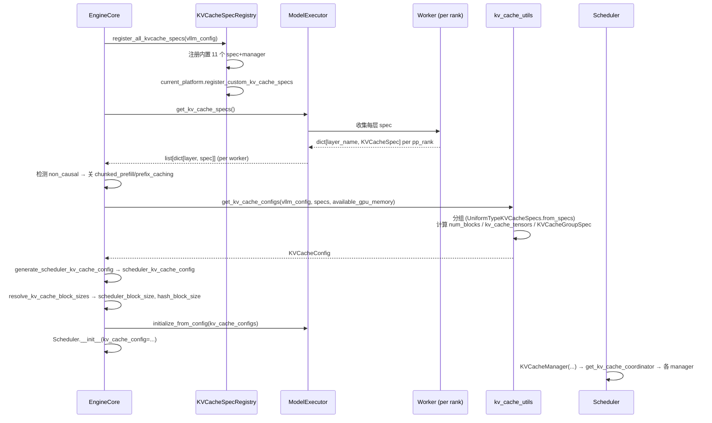

# KVCacheSpec 与注册表

[← Wiki 首页](../../README.md) > [引擎核心](../README.md) > [KV 缓存管理](README.md) > KVCacheSpec

源码：
- `vllm/v1/kv_cache_interface.py`（约 944 行）：所有 `KVCacheSpec` 子类、`KVCacheConfig`、quant mode 工具。
- `vllm/v1/kv_cache_spec_registry.py`（约 209 行）：`KVCacheSpecRegistry` 与 `@register_kv_cache_spec` 装饰器。
- `vllm/v1/core/single_type_kv_cache_manager.py` 中 `register_all_kvcache_specs` 完成内置 spec 注册。

## 是什么

### `KVCacheSpec` 体系（`kv_cache_interface.py`）

`KVCacheSpec`（`kv_cache_interface.py:99`，`@dataclass(frozen=True)`）是描述"单层 KV cache 格式"的不可变结构，基类提供 `block_size`、`page_size_bytes`（抽象）、`storage_block_size`、`max_memory_usage_bytes(vllm_config)`、`copy_with_new_block_size`、`merge(specs)`（类方法）、`is_uniform_with_collection`。

子类层级：

```
KVCacheSpec
├── AttentionSpec (+ num_kv_heads/head_size/dtype/kv_quant_mode/page_size_padded/indexes_kv_by_block_stride)
│   ├── FullAttentionSpec (+ head_size_v/sliding_window/attention_chunk_size/non_causal)
│   │   ├── TQFullAttentionSpec (+ tq_slot_size)
│   │   ├── MLAAttentionSpec (+ cache_dtype_str/alignment/compress_ratio/model_version)
│   │   │   └── HiddenStateCacheSpec
│   │   ├── RSWASpec (+ rswa_window)
│   │   ├── SinkFullAttentionSpec (+ sink_len)
│   ├── SlidingWindowSpec (+ sliding_window/head_size_v)
│   │   └── SlidingWindowMLASpec (+ cache_dtype_str/alignment/compress_ratio/model_version)
│   ├── ChunkedLocalAttentionSpec (+ attention_chunk_size)  # max_admission_blocks_per_request
│   ├── EncoderOnlyAttentionSpec  # max_memory_usage_bytes = 0
│   └── CrossAttentionSpec  # 按 max_encoder_len 计算容量
├── MambaSpec (+ shapes/dtypes/mamba_type/mamba_cache_mode/num_speculative_blocks)
└── UniformTypeKVCacheSpecs  # 多层同类型 spec 的合并视图
```

每个 spec 计算 `page_size_bytes`（含 quant padding）、`max_memory_usage_bytes`（用于启动期 pool sizing）以及 `max_admission_blocks_per_request`（仅 SWA/ChunkedLocal，回收型 spec 的准入上界）。`merge` 类方法把同组多层 spec 合并为一个代表 spec（用于 `KVCacheGroupSpec`），不同子类有不同合并约束（如 FullAttention 检查所有 sliding_window 一致）。

### `KVQuantMode`（`kv_cache_interface.py:33`）

`IntEnum`：`NONE`、`FP8_PER_TENSOR`、`INT8_PER_TOKEN_HEAD`、`FP8_PER_TOKEN_HEAD`、`INT4_PER_TOKEN_HEAD`、`NVFP4`。`get_kv_quant_mode(kv_cache_dtype)` 把字符串映射；`is_per_token_head`/`is_nvfp4` 属性供 attention 后端 dispatch。

### `KVCacheSpecKind`（`kv_cache_interface.py:86`）

字符串枚举：`FULL_ATTENTION`/`MLA_ATTENTION`/`SLIDING_WINDOW`/`SLIDING_WINDOW_MLA`/`MAMBA`/`CHUNKED_LOCAL_ATTENTION`/`SINK_FULL_ATTENTION`/`ENCODER_ONLY_ATTENTION`/`CROSS_ATTENTION`/`UNKNOWN`。`get_kv_cache_spec_kind(spec)` 按 isinstance 顺序判定（子类优先于父类）；用于 KV 事件注解与 `EngineCoreReadyResponse`/`get_kv_cache_group_metadata`。

### `KVCacheConfig`（`kv_cache_interface.py:919`）

```python
@dataclass
class KVCacheConfig:
    num_blocks: int
    kv_cache_tensors: list[KVCacheTensor]  # 张量初始化布局
    kv_cache_groups: list[KVCacheGroupSpec]
    # properties: has_mamba_layers / needs_kv_cache_zeroing
```

`KVCacheGroupSpec`：`layer_names + kv_cache_spec + is_eagle_group`。`KVCacheTensor` 描述某层在连续分配中的字节偏移与 stride（packed layout）。

### `KVCacheSpecRegistry`（`kv_cache_spec_registry.py:39`）

全局注册表 `_REGISTRY_KVCACHESPEC_LIST: dict[type[KVCacheSpec], KVCacheSpecMetadata]`。`KVCacheSpecMetadata` 含 `(kvcache_spec_cls, manager_class, uniform_type_base_spec)`。

类方法：
- `register(kvcache_spec_cls, manager_class, uniform_type_base_spec=None)`：登记；同 spec 重复登记需完全一致。
- `get_manager_class(kvcache_spec) -> type[SingleTypeKVCacheManager] | None`：沿 MRO 找首个注册的基类对应的 manager。
- `get_uniform_type_base_spec(kvcache_spec) -> type[KVCacheSpec] | None`：分组兼容性检查的"基准 spec"。
- `check_kv_cache_spec_registry(kv_cache_spec)`：运行期校验所有层都已注册。
- `_ensure_registered(vllm_config=None)`：懒加载 `register_all_kvcache_specs`。

`@register_kv_cache_spec(manager_class=..., uniform_type_base_spec=...)` 装饰器供厂商自定义 spec：

```python
@register_kv_cache_spec(
    manager_class=FullAttentionManager,
    uniform_type_base_spec=FullAttentionSpec
)
@dataclass(frozen=True, kw_only=True)
class CustomFullAttentionSpec(FullAttentionSpec):
    pass
```

### `register_all_kvcache_specs`（`single_type_kv_cache_manager.py:1499`）

内置 spec 全部注册到 `KVCacheSpecRegistry`：

| spec | manager | uniform_type_base_spec |
|---|---|---|
| `FullAttentionSpec` | `FullAttentionManager` | `FullAttentionSpec` |
| `SlidingWindowSpec` | `SlidingWindowManager` | `SlidingWindowSpec` |
| `SlidingWindowMLASpec` | `SlidingWindowManager` | `SlidingWindowMLASpec` |
| `MambaSpec` | `MambaManager` | `MambaSpec` |
| `ChunkedLocalAttentionSpec` | `ChunkedLocalAttentionManager` | `ChunkedLocalAttentionSpec` |
| `CrossAttentionSpec` | `CrossAttentionManager` | `CrossAttentionSpec` |
| `TQFullAttentionSpec` | `FullAttentionManager` | `FullAttentionSpec` |
| `MLAAttentionSpec` | `FullAttentionManager` | `FullAttentionSpec` |
| `RSWASpec` | `RSWAManager` | `FullAttentionSpec` |
| `HiddenStateCacheSpec` | `FullAttentionManager` | `FullAttentionSpec`（占位） |
| `SinkFullAttentionSpec` | `SinkFullAttentionManager` | `FullAttentionSpec` |

末尾调 `current_platform.register_custom_kv_cache_specs(vllm_config)` 让厂商扩展。

### `SingleTypeKVCacheManager` 子类（`single_type_kv_cache_manager.py`）

| 类 | 行号 | 对应 spec |
|---|---|---|
| `FullAttentionManager` | 564 | `FullAttentionSpec`/`MLAAttentionSpec`/`TQFullAttentionSpec`/`HiddenStateCacheSpec` |
| `RSWAManager(FullAttentionManager)` | 625 | `RSWASpec` |
| `SlidingWindowManager` | 669 | `SlidingWindowSpec`/`SlidingWindowMLASpec` |
| `ChunkedLocalAttentionManager` | 876 | `ChunkedLocalAttentionSpec` |
| `MambaManager` | 1026 | `MambaSpec` |
| `CrossAttentionManager` | 1368 | `CrossAttentionSpec` |
| `SinkFullAttentionManager(FullAttentionManager)` | 1431 | `SinkFullAttentionSpec` |

每个 manager 为其 group 维护 `req_to_blocks: dict[str, list[KVCacheBlock]]`、`num_cached_block: dict[str, int]`、`new_block_ids: list[int]`、`_null_block`、`use_eagle`/`_max_admission_blocks_per_request`。`find_longest_cache_hit` 是 classmethod，由 coordinator 用 `manager_cls` 直接调用。

## 为什么

- **多类型原生支持**：v1 不再"用 FullAttention 模拟 SWA"——每个 attention 类型有自己的 spec 与 manager，物理块布局、命中查找、回收逻辑都按类型实现。
- **不可变 + frozen**：`@dataclass(frozen=True)` 让 spec 可哈希、可作为 dict key（部分场景）；同时强制"一旦创建不可改"，避免运行期意外修改。
- **合并 (merge)**：模型每层都有 spec，但同组多层共享 block table；`merge` 把同组多层 spec 合并为代表 spec（如多 FullAttention layer 检查 sliding_window 一致后取其一），形成 `KVCacheGroupSpec`。
- **UniformTypeKVCacheSpecs**：某些场景（DeepseekV4）同类型多层有不同 page_size_bytes 但共享 block table；`UniformTypeKVCacheSpecs` 是多 spec 的合并视图，`page_size_bytes = sum(spec.page_size_bytes)`。
- **注册表去耦**：spec 定义在 `kv_cache_interface.py`，manager 实现在 `single_type_kv_cache_manager.py`，注册把它们连起来；厂商可在不修改核心代码前提下注册自定义 spec/manager。`uniform_type_base_spec` 决定哪些 spec 视为"同组"——如 `MLAAttentionSpec` 的 base 是 `FullAttentionSpec`，所以 MLA 与 FullAttention 同组。
- **MRO 查找**：`get_manager_class` 沿 `__mro__` 找首个注册基类，让 `MLAAttentionSpec` 自动匹配到 `FullAttentionManager`（因为其 base `FullAttentionSpec` 注册时绑定 FullAttentionManager）。
- **admission cap 单一真相源**：`SlidingWindowSpec.max_admission_blocks_per_request` 既用于 startup pool sizing（`max_memory_usage_bytes`），又用于 runtime admission（`get_num_blocks_to_allocate(apply_admission_cap=True)`），保证两者一致避免 mid-prefill OOM。
- **non_causal 标志**：Prefix LM 等非因果 attention 层在 spec 标记 `non_causal=True`，让 EngineCore 在收集 spec 时据此关闭 chunked prefill 与 prefix caching（这两者假设 causal）。

## 怎么做

### spec 生成时序（EngineCore 启动）



### 分组逻辑（`UniformTypeKVCacheSpecs.is_uniform_type`）

```python
@classmethod
def is_uniform_type(cls, kv_cache_specs: dict[str, KVCacheSpec]) -> bool:
    block_sizes = set(spec.block_size for spec in kv_cache_specs.values())
    if len(block_sizes) > 1:
        return False
    first_spec = next(iter(kv_cache_specs.values()))
    return first_spec.is_uniform_with_collection(kv_cache_specs)
```

`is_uniform_with_collection` 沿 MRO 找 `uniform_type_base_spec`，然后断言所有 spec 都是它的子类。例如 `FullAttentionSpec` 与 `MLAAttentionSpec` 都视为 `FullAttentionSpec` base，可同组。

### spec.merge 示例（FullAttention）

```python
@classmethod
def merge(cls, specs: list[Self]) -> Self:
    assert all(isinstance(spec, FullAttentionSpec) for spec in specs)
    sliding_window = set(spec.sliding_window for spec in specs if spec.sliding_window is not None)
    attention_chunk_size = set(...)
    assert not any(isinstance(spec, MLAAttentionSpec) for spec in specs)
    merged = cls(block_size=..., sliding_window=cls.merge_window_sizes(sliding_window), ...)
    # 校验所有 AttentionSpec 字段一致
    for spec in specs:
        for f in fields(AttentionSpec):
            assert getattr(spec, f.name) == getattr(merged, f.name)
    return merged
```

### spec.max_memory_usage_bytes 示例（SlidingWindowSpec）

```python
def max_admission_blocks_per_request(self, max_num_batched_tokens, max_model_len) -> int:
    num_tokens = min(self.sliding_window - 1 + max_num_batched_tokens, max_model_len)
    return cdiv(num_tokens, self.block_size) + 1  # +1 因窗口可能不在 block 起点

def max_memory_usage_bytes(self, vllm_config) -> int:
    max_blocks = self.max_admission_blocks_per_request(...)
    return max_blocks * self.page_size_bytes
```

`+1` 的注释解释：block size 4、num_token 4 时需 `[XXCD][EF]` 两 block 存 6-token 窗口 `[CDEF]`。

### KVQuantMode 计算（`AttentionSpec.page_size_bytes`）

```python
@property
def page_size_bytes(self) -> int:
    real = self.real_page_size_bytes  # 含 NVFP4/INT4 packed dim 调整
    if self.kv_quant_mode.is_per_token_head:
        # per-token-head scales 张量虽在 attention backend 管理，
        # 但内存从 KV cache 分配中切出，需预算
        real += 2 * block_size * num_kv_heads * sizeof(float32)
    if self.page_size_padded is not None:
        return self.page_size_padded
    return real
```

NVFP4：`head_dim = nvfp4_kv_cache_full_dim(head_size)`（含 block scale 字节）；INT4：`head_dim = head_size // 2`。

## 与其它模块/系统配合

- **[EngineCore](../engine-core-process.md)**：`_initialize_kv_caches` 是 spec 体系的主入口；`register_all_kvcache_specs` 在 EngineCore 进程执行一次（worker 通过 shared registry）。
- **[coordinator.md](./coordinator.md)**：`get_manager_for_kv_cache_spec` 用注册表为每个 group 创建 manager；`HybridKVCacheCoordinator.verify_and_split_kv_cache_groups` 按 spec 等价性分桶。
- **[block-pool.md](./block-pool.md)**：spec 提供容量与 page_size 计算；`BlockPool` 仅按 num_blocks 管理，对 spec 类型无感。
- **[02-execution](../../02-execution/README.md)**：worker 端 ModelRunner 用 `kv_cache_tensors` 初始化 GPU 张量；attention backend 按 `kv_quant_mode` dispatch。
- **[05-attention](../../05-attention/README.md)**：每个 attention 后端在 `get_kv_cache_spec_for_layer` 构造对应 spec；MLA 后端构造 `MLAAttentionSpec`，SWA 构造 `SlidingWindowSpec` 等。
- **[Platforms](../../08-platforms/README.md)**：`current_platform.register_custom_kv_cache_specs(vllm_config)` 让厂商插入平台特定 spec（如 AMD/XPU 自定义 layout）。
- **[编译 IR](../../09-compilation-ir/README.md)**：`KVCacheTensor.offset`/`block_stride` 影响 torch.compile 的 KV 张量视图。

## 历史版本演进

- **v0.5/v0.6（v0）**：v0 没有 spec 抽象，attention 后端硬编码 KV cache 格式；混合 attention 模型（如 Gemma2）需特殊处理。
- **v0.7（v1 落地）**：`KVCacheSpec` 与 `FullAttentionSpec`/`SlidingWindowSpec`/`MambaSpec` 引入；`KVCacheConfig`/`KVCacheGroupSpec` 重构。最初注册用 if-else 链。
- **v0.7.x**：`MLAAttentionSpec`/`ChunkedLocalAttentionSpec`/`CrossAttentionSpec` 加入；`EncoderOnlyAttentionSpec`（attention-free 模型）。
- **v0.8（v1 默认）**：`KVCacheSpecRegistry` + `@register_kv_cache_spec` 抽出，支持厂商扩展；`UniformTypeKVCacheSpecs` 用于 DeepseekV4 多层异 page_size 同组。
- **v0.9**：`RSWASpec`（Reference SWA）；`SinkFullAttentionSpec`（sink token 优化）；`HiddenStateCacheSpec`；NVFP4 / INT4_PER_TOKEN_HEAD quant mode。
- **v0.10**：`TQFullAttentionSpec`；`non_causal` 字段让 Prefix LM 自动关 chunked/prefix caching；`max_admission_blocks_per_request` 单一真相源。
- **v0.11 / v0.12 / main**：`SlidingWindowMLASpec`（DeepseekV4 FlashMLA）；`alignment`/`compress_ratio`/`model_version` 字段；`page_size_padded` 支持对齐填充。具体版本归属（待核实）。

[← 返回引擎核心首页](../README.md)

## 参见

- [coordinator.md](./coordinator.md) — spec 与 manager 的协调者。
- [kv-cache-manager.md](./kv-cache-manager.md) — `KVCacheConfig` 的消费者。
- [block-pool.md](./block-pool.md) — spec 容量计算喂给 `num_blocks`。
- [../engine-core-process.md](../engine-core-process.md) — `_initialize_kv_caches` 的全流程。
