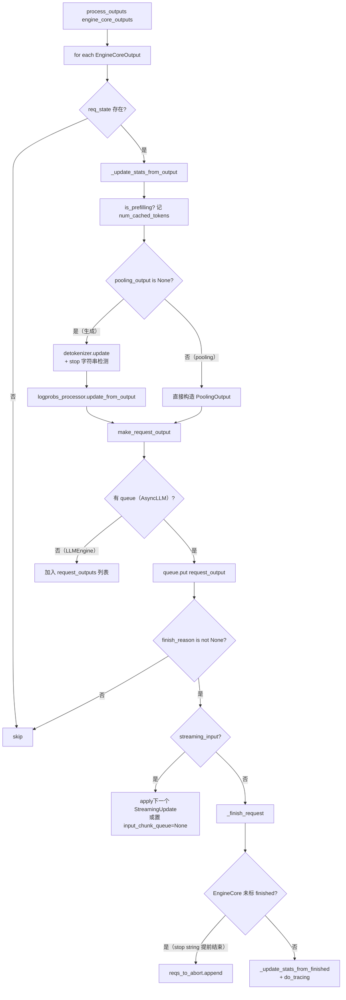
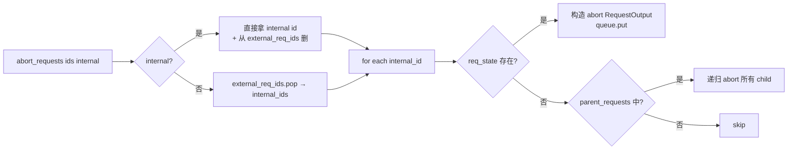

# OutputProcessor（增量输出装配）

[← Wiki 首页](../README.md) > [引擎核心](../README.md) > OutputProcessor

源码：`vllm/v1/engine/output_processor.py`（约 818 行）。`OutputProcessor` 运行在 AsyncLLM 前端进程，把 EngineCore 回送的 `EngineCoreOutput` 流增量还原成对外可见的 `RequestOutput`/`PoolingRequestOutput`，并管理 detokenizer/logprobs/parallel sampling/streaming 等所有"先到先聚合"的状态。

## 是什么

`OutputProcessor`（`output_processor.py:417`）持有：
- `request_states: dict[str, RequestState]`：所有在飞请求的 per-request 状态。
- `parent_requests: dict[str, ParentRequest]`：`n>1` 并行采样的父请求索引。
- `external_req_ids: defaultdict[str, list[str]]`：external id → internal ids 映射，支持按用户 id 批量 abort。
- `lora_states: LoRARequestStates`：LoRA 维度的统计聚合。
- `stream_interval`（来自 `scheduler_config.stream_interval`）：DETOK/输出节流间隔。
- `tracing_enabled`：基于 `otlp_traces_endpoint` 是否启用 tracing。

附属类型：
- `RequestOutputCollector`（`output_processor.py:45`）：per-request 异步队列；`put`/`get`/`get_nowait`/`close`；`aggregate`（DELTA 模式合并）。
- `OutputProcessorOutput`（`output_processor.py:109`）：`process_outputs` 同步返回值（`request_outputs` 仅 LLMEngine 路径使用，AsyncLLM 路径恒空）。
- `StreamingUpdate`（`output_processor.py:115`）：续写输入数据。
- `RequestState`（`output_processor.py:129`）：per-request 全部上下文（prompt/embeds、detokenizer、logprobs_processor、parent_req、queue、stats、streaming_input 队列、routed_experts_chunks 等）。

核心方法：
- `add_request(request, prompt, parent_req, index, queue)`：新建 `RequestState` 或对已有 resumable 请求 enqueue streaming update。
- `process_outputs(engine_core_outputs, engine_core_timestamp, iteration_stats)`（`output_processor.py:576`）：核心装配循环。
- `abort_requests(request_ids, internal)`：按 internal/external id 撤销；处理 parent 的级联 abort；产出 abort `RequestOutput` 给 collector。
- `propagate_error(e)`：把异常注入所有 collector，唤醒 `generate()` 协程。
- `update_scheduler_stats(scheduler_stats)`：转发给 `lora_states`。
- `do_tracing(engine_core_output, req_state, iteration_stats)`：构造 `llm_request` span，记录 TTFT/queue/prefill/decode/e2e 等延迟指标。
- `_update_stats_from_output` / `_update_stats_from_finished`：向 `IterationStats`/`RequestStateStats` 喂数据。
- `_finish_request` / `_update_streaming_request_state`：请求收尾与续写状态机推进。

## 为什么

- **前端唯一全批量循环点**：v1 设计原则之一是"每步只在一个地方遍历整个 batch"（`process_outputs` 注释 `NOTE FOR DEVELOPERS`）。所有 per-request 工作（detokenize、logprobs、stats、stop 判定、构造 CompletionOutput）都在这里完成，避免多处循环拖慢热路径。
- **解耦 EngineCore 节奏与客户端节奏**：EngineCore 以 GPU 步进节奏产出 outputs，但客户端可能是流式 SSE 或最终一次性返回；`RequestOutputCollector` 作为缓冲，producer 快了就 `add` 合并（DELTA），consumer 慢了就 `await get`。
- **DETOK 与 stop 字符串回溯**：detokenizer 在前端检测到 stop 字符串时，`finish_reason=STOP` 但 EngineCore 还不知道；`process_outputs` 把这些 req_id 收进 `reqs_to_abort`，由 `output_handler` 异步 `engine_core.abort_requests_async(reqs_to_abort)` 让 EngineCore 也收尾。
- **并行采样聚合**：`ParentRequest.get_outputs(child_id, completion_output)` 决定 DELTA 模式直接转发子输出、还是 FINAL_ONLY 模式等所有子完成后一次性聚合；`observe_finished_request` 把 `n` 与 `max_num_generation_tokens` 计入 iteration stats。
- **streaming-input 续写**：`RequestState.input_chunk_queue` 在子请求完成但输入流未结束时缓存下一个 `StreamingUpdate`，等当前 prefill 完成后再 `apply_streaming_update`；`STREAM_FINISHED` 哨兵通知 generate 协程退出。
- **tracing 与 metrics**：`do_tracing` 利用 `EngineCoreEvent` 时间戳计算 TTFT/排队/decode 等，写入 OTLP span；与 `StatLoggerManager` 配合提供 prometheus 指标。
- **stream_interval**：通过 `RequestState.sent_tokens_offset` 控制输出颗粒度（首 token、间隔 N token、finish 三种触发），减少 SSE 帧数。

## 怎么做

### process_outputs 主循环



### RequestState 关键字段

- `detokenizer: IncrementalDetokenizer | None`：由 `IncrementalDetokenizer.from_new_request` 工厂按 tokenizer 类型分发（fast/slow/none）。
- `logprobs_processor: LogprobsProcessor | None`：维护 sample/prompt logprobs 累积。
- `parent_req`：若 `n>1`，指向 `ParentRequest`；最终对外 id 用 parent 的 `external_req_id`。
- `queue: RequestOutputCollector | None`：AsyncLLM 路径非空，LLMEngine 路径为空。
- `routed_experts_chunks: list[np.ndarray]`：MoE 路由按步累积，finish 时 `np.concatenate` 一次性返回。
- `streaming_input` + `input_chunk_queue`：续写会话状态。
- `sent_tokens_offset`：stream_interval 节流游标。

### make_request_output 模式判定

```python
final_only = output_kind == FINAL_ONLY
if not finished and final_only: return None  # 仅最终一次返回
if stream_interval > 1:
    # 仅在 finished / 首 token / 达到 interval 时触发
    ...
if delta:
    new_token_ids = detokenizer.output_token_ids[sent_tokens_offset:]
    sent_tokens_offset = detokenizer.num_output_tokens()
```

### abort 级联



### streaming-input 续写

`_update_streaming_request_state(req_state, request, prompt)`（`output_processor.py:543`）：
- 若 `not request.resumable`：标记输入流结束。若 `input_chunk_queue is None`（引擎已跑完），直接 `_finish_request` 并发 `STREAM_FINISHED`；否则把队列里最后一项的 `final=True`。
- 否则构造 `StreamingUpdate` 入队；若引擎已空闲（`input_chunk_queue is None`）则立刻 `apply_streaming_update` 并重建空 deque。

### tracing 字段

`do_tracing` 计算并写入 span attributes：
- `GEN_AI_LATENCY_TIME_TO_FIRST_TOKEN` / `E2E` / `TIME_IN_QUEUE` / `TIME_IN_MODEL_PREFILL` / `TIME_IN_MODEL_DECODE` / `TIME_IN_MODEL_INFERENCE`
- `GEN_AI_USAGE_PROMPT_TOKENS` / `COMPLETION_TOKENS`
- `GEN_AI_REQUEST_TOP_P` / `MAX_TOKENS` / `TEMPERATURE` / `N` / `REQUEST_ID`
- 起点 `arrival_time_ns`，kind=SERVER。

## 与其它模块/系统配合

- **[AsyncLLM](./async-llm-frontend.md)**：`output_handler` task 每步调 `process_outputs`；`abort` 委托 `abort_requests` + `engine_core.abort_requests_async`；`propagate_error` 让 output_handler 异常传播到所有 generate 协程。
- **[Detokenizer](./detokenizer.md)**：`RequestState.detokenizer` 实例由 OutputProcessor 持有；stop 字符串检测在 detokenizer 内做，OutputProcessor 仅消费 `stop_string` 返回值。
- **[LogprobsProcessor](./data-model.md)**：`logprobs.py` 的处理器累积 logprobs，OutputProcessor 调 `update_from_output` / `pop_prompt_logprobs`。
- **[Parallel sampling](./scheduler/parallel-sampling.md)**：`ParentRequest.get_outputs` 在 `make_request_output` 中调用，决定是否对 parent external id 发出。
- **[EngineCore](./engine-core-process.md)**：`reqs_to_abort` 回流到 EngineCore；`scheduler_stats` 与 `IterationStats` 一同送给 `StatLoggerManager`。
- **[IterationStats / metrics](../16-observability/README.md)**：`_update_stats_from_output/finished` 喂入 `IterationStats`，再由 `StatLoggerManager.record` 落 prometheus/log。
- **[LLMEngine（同步）](./async-llm-frontend.md)**：`queue=None` 路径下 `process_outputs` 返回 `request_outputs` 列表，由 `LLMEngine` 同步迭代消费。
- **[KV connector / P-D](../15-kv-cache-offload/README.md)**：`kv_transfer_params` 经 `make_request_output` 透传到 `RequestOutput`，前端据此决定后续动作。

## 历史版本演进

- **v0.5/v0.6（v0）**：`RequestOutput` 装配散落在 `AsyncLLMEngine`，无独立处理器；detokenize 与 stop 判定耦合较深。
- **v0.7（v1 落地）**：`OutputProcessor` + `RequestOutputCollector` 抽出；`RequestState` 统一 per-request 状态；"NOTE FOR DEVELOPERS：唯一全批量循环点"原则确立。
- **v0.8（v1 默认）**：`external_req_ids` 双向映射支持按用户 id abort；`stream_interval` 从 scheduler_config 引入；`do_tracing` 接入 OTLP。
- **v0.9**：streaming-input 路径（`_update_streaming_request_state` + `input_chunk_queue` + `STREAM_FINISHED`）成形；`routed_experts_chunks` 支持 MoE 路由回传；`propagate_error` 让 output_handler 异常能唤醒所有 generate。
- **v0.10**：`prefill_stats` 接入 `num_cached_tokens` 显示；reasoning parser 与 structured output 的协同（trim_reasoning_for_advance 在 scheduler 侧）。
- **v0.11 / v0.12 / main**：`VLLM_V1_OUTPUT_PROC_CHUNK_SIZE` 分块让出事件循环；tracing 字段持续扩充；pooling 模型 `request_output.finished` 在 streaming_input 场景被强制改写为 False。具体版本归属（待核实）。

[← 返回引擎核心首页](../README.md)

## 参见

- [async-llm-frontend.md](./async-llm-frontend.md) — `output_handler` 与 `generate` 的协作。
- [detokenizer.md](./detokenizer.md) — `IncrementalDetokenizer` 的 fast/slow 路径。
- [data-model.md](./data-model.md) — `EngineCoreOutput` / `RequestOutput` 字段。
- [scheduler/parallel-sampling.md](./scheduler/parallel-sampling.md) — `ParentRequest` 在此消费。
- [kv-cache-management/encoder-cache.md](./kv-cache-management/encoder-cache.md) — `num_cached_tokens` 的上游。
