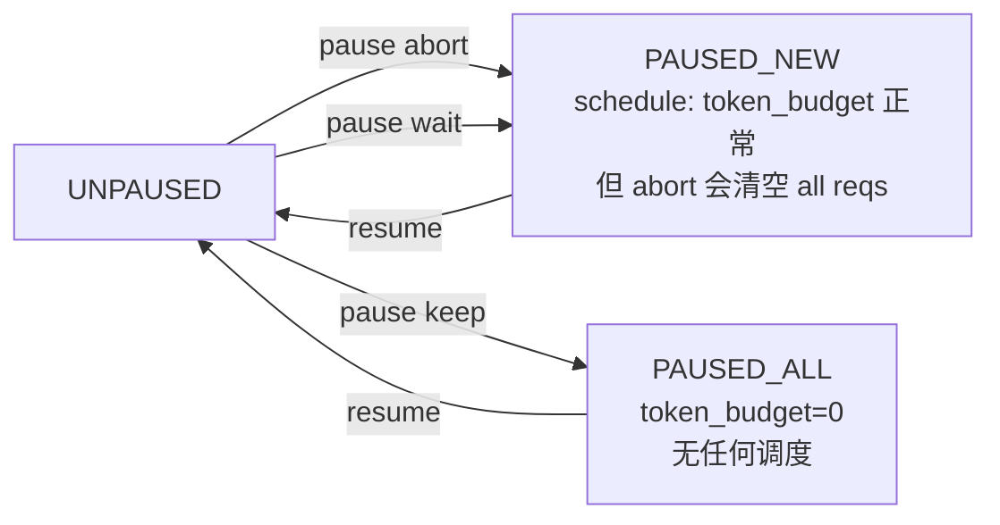

# 队列与 PauseState

[← Wiki 首页](../../README.md) > [引擎核心](../README.md) > [Scheduler](README.md) > 队列与 PauseState

源码：
- `vllm/v1/core/sched/request_queue.py`（约 208 行）：请求队列抽象与 FCFS/Priority 实现。
- `vllm/v1/core/sched/interface.py`（约 250 行）：`SchedulerInterface` 抽象基类与 `PauseState` 枚举。

## 是什么

### `RequestQueue` 抽象（`request_queue.py:20`）

纯抽象基类，定义队列协议：
- `add_request` / `pop_request` / `peek_request`
- `prepend_request` / `prepend_requests`（把请求/另一队列整体插到队首，用于抢占恢复与 skipped_waiting 回填）
- `remove_request` / `remove_requests`
- `__bool__` / `__len__` / `__iter__`

两个实现：
- `FCFSRequestQueue(deque[Request], RequestQueue)`（`request_queue.py:75`）：直接基于 `collections.deque`，`append`/`popleft`/`appendleft`/`extendleft`；`remove_requests` 走过滤重建（deque 不支持原地过滤）。
- `PriorityRequestQueue(RequestQueue)`（`request_queue.py:131`）：基于 `heapq`，按 `Request.__lt__`（`priority, arrival_time, request_id, id()`）排序；`prepend_request` 在优先队列里语义退化为 `add_request`（注释明确说明）；`__iter__` 复制 heap 逐个 heappop 以保证顺序。

工厂：
```python
def create_request_queue(policy: SchedulingPolicy) -> RequestQueue:
    if policy == SchedulingPolicy.PRIORITY: return PriorityRequestQueue()
    elif policy == SchedulingPolicy.FCFS:    return FCFSRequestQueue()
```

`SchedulingPolicy(Enum)`：`FCFS = "fcfs"` / `PRIORITY = "priority"`。

### `PauseState`（`interface.py:22`）

```python
class PauseState(enum.IntEnum):
    UNPAUSED = 0
    PAUSED_NEW = 1    # 不调度新请求，已 running 继续跑
    PAUSED_ALL = 2    # 完全不调度
```

### `SchedulerInterface`（`interface.py:36`）

抽象方法集合，定义调度器契约：
- 构造：`__init__(vllm_config, kv_cache_config, structured_output_manager, block_size, hash_block_size, mm_registry=, include_finished_set=, log_stats=)`
- 调度：`schedule(throttle_prefills=False) -> SchedulerOutput`、`get_grammar_bitmask`、`update_from_output`、`update_draft_token_ids`/`update_draft_token_ids_in_output`
- 请求管理：`add_request`、`finish_requests(ids, status) -> list[(req_id, client_index)]`
- 计数：`get_num_unfinished_requests`、`has_unfinished_requests`、`has_finished_requests`、`has_requests`
- 暂停：`pause_state` 属性、`set_pause_state`
- 缓存重置：`reset_prefix_cache`/`reset_encoder_cache`
- 统计：`get_request_counts() -> (num_running, num_waiting)`、`make_stats`
- 生命周期：`shutdown`
- 可选：`get_kv_connector() -> KVConnectorBase_V1 | None`（默认 None）

`throttle_prefills` 参数文档（`interface.py:71-78`）说明这是 DP prefill 平衡的开关，由 `DPEngineCoreProc._should_throttle_prefills` 设置，在饱和时自动让步。

## 为什么

- **策略可插拔**：把排队算法抽象成 `RequestQueue`，调度器主体只appeal `peek/pop/prepend`，FCFS→Priority 切换只改 `scheduler_config.policy`，无需改 scheduler 主循环。
- **deque 性能**：FCFS 用 `deque` 而非 `list`，`popleft`/`appendleft` 都 O(1)，抢占恢复频繁的 `prepend_request` 不会 O(N)。
- **heap 优先级**：Priority 用 `heapq`，`Request.__lt__` 把 `(priority, arrival_time, request_id, id())` 作为复合键，让"高优先级 + 早到达 + 唯一 id"自然排序；`id()` 兜底避免完全平局。
- **prepend 语义**：抢占后请求要插回 waiting 队首（FCFS 保序）；Priority 队列没有"首"概念，`prepend_request` 退化为 `add_request`，文档显式说明避免误解。
- **skipped_waiting 解耦**：调度器持有 `waiting` 与 `skipped_waiting` 两个队列；后者装 `WAITING_FOR_STRUCTURED_OUTPUT_GRAMMAR`/`WAITING_FOR_REMOTE_KVS`/`WAITING_FOR_STREAMING_REQ` 这些"暂时不能跑"的请求。`_select_waiting_queue_for_scheduling` 决定从哪个队列取：FCFS 选非空者（优先 skipped），Priority 比较两个队首的优先级取小者。
- **`PauseState` 三态**：满足 heat-update 的两种语义——`abort`（撤全部，quick）、`wait`（drain，running 继续）、`keep`（冻结，PAUSED_ALL）；`PAUSED_NEW` 让 `wait` 模式下新请求被排队但不调度。
- **接口稳定**：`SchedulerInterface` 让 `EngineCore` 不绑定具体实现；`AsyncScheduler`、未来自定义调度器都能替换。

## 怎么做

### 调度器的"双队列"管理

`Scheduler.__init__` 创建：
```python
self.waiting = create_request_queue(self.policy)
self.skipped_waiting = create_request_queue(self.policy)
self.running: list[Request] = []
```

**入队规则**（`_enqueue_waiting_request`，`scheduler.py:1861`）：
```python
if self._is_blocked_waiting_status(request.status):  # 3 种 blocked 态
    self.skipped_waiting.add_request(request)
else:
    self.waiting.add_request(request)
```

**出队规则**（`_select_waiting_queue_for_scheduling`，`scheduler.py:1867`）：
```python
if self.policy == FCFS:
    return self.skipped_waiting or self.waiting or None
# Priority:
if self.waiting and self.skipped_waiting:
    return self.waiting if waiting.peek < skipped.peek else self.skipped_waiting
return self.waiting or self.skipped_waiting or None
```

**step 内临时队**（`schedule` 主循环）：每步创建临时 `step_skipped_waiting`，遇到不能调度的请求时 `pop` 出原队列并 `prepend` 到临时队，结束时 `self.skipped_waiting.prepend_requests(step_skipped_waiting)` 把它们重新放回 skipped 头部（保序）。

### PauseState 与 schedule 的交互



`schedule` 在 `PAUSED_ALL` 下直接把 `token_budget = 0`（`scheduler.py:417`），`WAITING` 段被 `self._pause_state == PauseState.UNPAUSED` 门控跳过（`scheduler.py:637`）；`RUNNING` 段在 `PAUSED_NEW` 下仍跑（因 `token_budget` 未归零），但在 `PAUSED_ALL` 下因 token_budget=0 自然不会调度。

`get_num_unfinished_requests`：
- `PAUSED_ALL` → 0（即使 running 非空也认为"暂停即未工作"）
- `PAUSED_NEW` → `len(self.running)`
- `UNPAUSED` → `len(waiting) + len(skipped_waiting) - num_waiting_for_streaming_input + len(running)`

### finish_requests 的批量移除

```python
# scheduler.py:2036
running_requests_to_remove = {reqs in running with id in ids}
waiting_requests_to_remove = [reqs in waiting/skipped with id in ids]
self.running = remove_all(self.running, running_requests_to_remove)
self.waiting.remove_requests(waiting_requests_to_remove)
self.skipped_waiting.remove_requests(waiting_requests_to_remove)
# Second pass: set status + free
for request in valid_requests:
    delay_free_blocks = (status == WAITING_FOR_REMOTE_KVS and not finished_recving)
    request.status = finished_status
    self._free_request(request, delay_free_blocks=delay_free_blocks)
return [(r.request_id, r.client_index) for r in valid_requests]
```

`remove_all`（`utils.py:62`）优化单元素场景走 `list.remove`，多元素走列表推导，避免 `set` 操作 overhead。

### Priority 队列在抢占中的反向选最低优先级

```python
# schedule() running 段抢占逻辑
if self.policy == SchedulingPolicy.PRIORITY:
    preempted_req = max(self.running, key=lambda r: (r.priority, r.arrival_time))
    # 注意：选最低优先级（priority 数值大=低优先级）
else:
    preempted_req = self.running.pop()  # FCFS: 弹尾部
```

## 与其它模块/系统配合

- **[scheduler.md](./scheduler.md)**：本页是其基础设施；`Scheduler` 直接持有两个 `RequestQueue`。
- **[preemption.md](./preemption.md)**：抢占后 `waiting.prepend_request(preempted_req)` 把请求插回队首。
- **[Request 状态机](../data-model.md)**：`RequestStatus` 的 blocked 态驱动 skipped_waiting；`__lt__` 决定 Priority 排序。
- **[EngineCore](../engine-core-process.md)**：`set_pause_state` 由 `EngineCore.pause_scheduler` 调用；`has_requests` 是 busy loop 是否继续的关键。
- **[SchedulerInterface](../data-model.md)**：未来扩展自定义调度器（如 spec-decode 专用）只需实现接口。
- **[KV connector](../../15-kv-cache-offload/README.md)**：`WAITING_FOR_REMOTE_KVS` 是 connector 异步加载期间请求的临时态。

## 历史版本演进

- **v0.5/v0.6（v0）**：v0 用 `Scheduler.running` + `Scheduler.swapped` + `Scheduler.waiting` 三 deque，无抽象基类；不支持 Priority。
- **v0.7（v1 落地）**：`RequestQueue`/`FCFSRequestQueue`/`PriorityRequestQueue` 抽出；`SchedulerInterface` 定义；`skipped_waiting` 引入解耦 blocked 态；`PauseState` 三态硬化。
- **v0.8（v1 默认）**：`AsyncScheduler` 继承 `Scheduler`；`has_requests` 重写加入 connector pending push_work 检测。
- **v0.9**：`WAITING_FOR_STREAMING_REQ` 加入，配合 streaming-input 续写。
- **v0.10**：`prefill_schedule_interval` 通过 `throttle_prefills` 参数传入，`SchedulerInterface.schedule` 签名稳定。
- **v0.11 / main**：保持稳定；`SchedulerInterface` 新增 `has_requests` 默认实现改写以支持 connector push 模式。具体版本归属（待核实）。

[← 返回引擎核心首页](../README.md)

## 参见

- [scheduler.md](./scheduler.md) — 队列的消费者与 `PauseState` 在 schedule 中的门控。
- [preemption.md](./preemption.md) — `prepend_request` 在抢占恢复路径。
- [chunked-prefill.md](./chunked-prefill.md) — `waiting` 队列的 break 语义受 chunked_prefill 控制。
