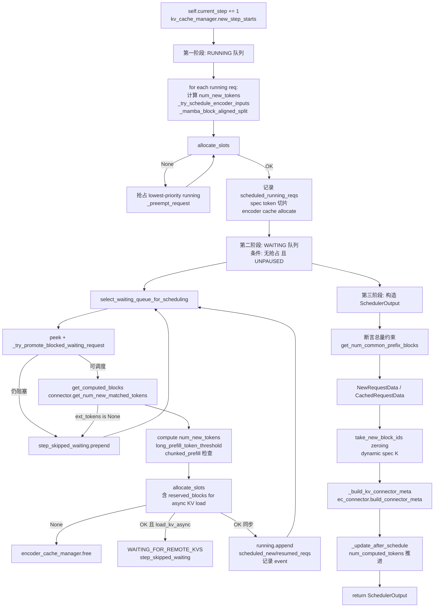

# Scheduler 主体（scheduler.py）

[← Wiki 首页](../../README.md) > [引擎核心](../README.md) > [Scheduler](README.md) > Scheduler 主体

源码：`vllm/v1/core/sched/scheduler.py`（约 2675 行）。`Scheduler` 是 v1 调度器的默认实现，继承 `SchedulerInterface`（`interface.py`）。`AsyncScheduler`（`async_scheduler.py`）继承它并重写 `_update_after_schedule`/`_update_request_with_output` 以支持异步调度与 spec placeholder。

## 是什么

### 构造（`scheduler.py:69`）

`Scheduler.__init__` 接收 `vllm_config`/`kv_cache_config`/`structured_output_manager`/`block_size`/`hash_block_size` 等参数，建立：
- `waiting` / `skipped_waiting` / `running`：三个请求容器（前两者由 `create_request_queue(policy)` 创建，第三者是 `list[Request]`）。
- `requests: dict[str, Request]`：所有未完成请求的索引。
- `kv_cache_manager: KVCacheManager`：KV 缓存门面（见 [kv-cache-management/kv-cache-manager.md](../kv-cache-management/kv-cache-manager.md)）。
- `encoder_cache_manager`：按是否 encoder-decoder 选择 `EncoderDecoderCacheManager` 或 `EncoderCacheManager`。
- 可选 `connector`（`KVConnectorBase_V1`）/`ec_connector`、`kv_event_publisher`。
- 调度约束：`max_num_running_reqs`（=`max_num_seqs`）、`max_num_scheduled_tokens`、`max_model_len`、`num_sampled_tokens_per_step`（diffusion=0）。
- spec decode 配置：`use_eagle`/`num_spec_tokens`/`num_lookahead_tokens`/`dynamic_sd_lookup`。
- `defer_block_free`：当存在 KV consumer + 多 inflight batch（async/PP）时启用，防止正在写的 block 被 connector 重新分配。
- `_pause_state: PauseState`、`_inflight_prefills: set[Request]`、`prefill_capacity_bound`（DP prefill 平衡用）。

核心方法：
- `schedule(throttle_prefills=False) -> SchedulerOutput`（`scheduler.py:396`）
- `update_from_output(scheduler_output, model_runner_output) -> dict[int, EngineCoreOutputs]`（`scheduler.py:1499`）
- `_preempt_request` / `_free_request` / `_free_request_blocks` / `_drain_deferred_frees`
- `add_request` / `finish_requests` / `_handle_stopped_request` / `_update_request_as_session`
- `_try_schedule_encoder_inputs` / `_free_encoder_inputs`
- `update_draft_token_ids` / `update_draft_token_ids_in_output`
- `_update_waiting_for_remote_kv` / `_try_promote_blocked_waiting_request` / `_handle_invalid_blocks`
- `reset_prefix_cache` / `reset_encoder_cache` / `reset_connector_cache`
- `set_pause_state` / `pause_state` / `get_num_unfinished_requests` / `has_requests` / `make_stats` / `shutdown`

### SchedulerOutput（`output.py:181`）

`schedule()` 返回的核心数据结构，字段包括：`scheduled_new_reqs`/`scheduled_cached_reqs`/`num_scheduled_tokens`/`total_num_scheduled_tokens`/`scheduled_spec_decode_tokens`/`scheduled_encoder_inputs`/`num_common_prefix_blocks`/`finished_req_ids`/`free_encoder_mm_hashes`/`preempted_req_ids`（V2 用）/`new_block_ids_to_zero`/`num_spec_tokens_to_schedule`/`kv_connector_metadata`/`ec_connector_metadata` 等。`NewRequestData.from_request` 与 `_make_cached_request_data` 把 Request 状态压缩成 worker 缓存友好的 diff 形式。

## 为什么

- **统一调度模型**：见 [README.md](README.md) 的"关键设计原则"。prefill/decode/speculative 都是对 `num_new_tokens = num_tokens_with_spec - num_computed_tokens` 的不同切分。
- **续传 token 记账**：`_update_after_schedule` 在调度完成后立刻把 `num_computed_tokens += num_scheduled_tokens`，使得同一请求可在下一步再次被调度（chunked prefill 的关键）；若后续 spec token 被拒绝，`update_from_output` 中再回退。
- **资源门控三段式**：running 队列里每请求 `kv_cache_manager.allocate_slots` 失败 → 抢占最低优先级 running 请求；waiting 队列里 `get_computed_blocks` 拿 prefix cache 命中、`allocate_slots` 决定能否 admit。
- **skipped_waiting 解耦**：`WAITING_FOR_STRUCTURED_OUTPUT_GRAMMAR`/`WAITING_FOR_REMOTE_KVS`/`WAITING_FOR_STREAMING_REQ` 这些"暂时不能调度"的请求进入 `skipped_waiting`，`_select_waiting_queue_for_scheduling` 在 FCFS 下优先 `skipped_waiting or waiting`，在 Priority 下比较两个队首的 `(priority, arrival_time)` 取小者；`_try_promote_blocked_waiting_request` 在每步尝试把它们升回 WAITING/PREEMPTED。
- **DP prefill 平衡**：`defer_prefills = throttle_prefills and not prefill_capacity_bound and any(not r.is_prefill_chunk for r in running)`；`prefill_capacity_bound` 记录上一次对齐步是否耗尽 waiting 队列，避免饱和时仍盲目 throttle。
- **deferred free**：async scheduling/PP 下，一个 step 可能在写 freed request 的 block；KV consumer 的 load 不与该写有序，故 `pop_blocks_for_free` 把 block 暂存 `deferred_frees`，等 `processed_step_seq >= fence_seq` 才归还 `block_pool`。
- **stop 判定分层**：scheduler 端 `check_stop`（`utils.py`）处理 eos/stop_token_ids/length/repetition；OutputProcessor 端 detokenizer 处理 stop 字符串（异步回流 abort）。两层互不重复。
- **KV connector 全生命周期**：`get_num_new_matched_tokens` / `update_state_after_alloc` / `request_finished` / `update_connector_output` / `get_kv_connector_stats` / `take_events`，scheduler 把 connector 当作可插拔策略对象。
- **invalid_blocks 恢复**：KV transfer 加载失败时 `kv_load_failure_policy` 决定 `recompute`（重算）或 `fail`（FINISHED_ERROR）；`_handle_invalid_blocks` 区分 async（未 cache）与 sync（已 cache）路径，逾期 block 集合批量 evict。

## 怎么做

### schedule() 主循环结构



### update_from_output 主循环

```mermaid
flowchart TD
    U[update_from_output scheduler_output, model_runner_output] --> D[drain_deferred_frees 若启用]
    D --> IB[处理 invalid_block_ids → _handle_invalid_blocks]
    IB --> RE[store_batch routed_experts<br/>计算 routing_offsets]
    RE --> L[for each req_id, num_tokens_scheduled]
    L --> L1{failed_kv_load?}
    L1 -- 是 --> Skip[skip]
    L1 -- 否 --> L2[generated = sampled[req_index]]
    L2 --> SP[spec token 数量校准: num_computed_tokens -= num_rejected]
    SP --> FE[_free_encoder_inputs]
    FE --> UP[_update_request_with_output<br/>append_output_token_ids + check_stop]
    UP --> SO[structured_output grammar.accept_tokens]
    SO --> ST{stopped?}
    ST -- 是 --> HS[_handle_stopped_request<br/>_free_request → kv_transfer_params]
    ST -- 否 --> EO[构造 EngineCoreOutput]
    HS --> EO
    EO --> N[加入 outputs[client_index]]
    N --> L
    L --> RM[remove stopped from running/waiting]
    RM --> KC[_update_from_kv_xfer_finished<br/>take_events/publish]
    KC --> ECO[构造 dict[client_idx, EngineCoreOutputs]<br/>+ scheduler_stats]
    ECO --> RT[return]
```

### add_request / finish_requests 状态机

`add_request`（`scheduler.py:2012`）处理三种情况：
1. 已存在同 id 且 `resumable`：把 `StreamingUpdate.from_request` 追加到 `streaming_queue`，或在 `WAITING_FOR_STREAMING_REQ` 时直接 promote。
2. 全新请求：`resumable` 时初始化空 `streaming_queue`；`_enqueue_waiting_request` 按 status 分到 waiting/skipped_waiting；调 `connector.on_new_request`；记 QUEUED event。

`finish_requests(ids, status)`（`scheduler.py:2036`）：
- 支持 str/iterable/None（None=全部）。
- 按 running/waiting 分桶批量移除（`remove_all`）。
- WAITING_FOR_REMOTE_KVS 且未在 `finished_recving_kv_req_ids` → `delay_free_blocks=True`，等异步 KV 完成再释放。
- 返回 `[(req_id, client_index), ...]` 供 EngineCore 发 abort 输出。

### 抢占路径（详见 [preemption.md](preemption.md)）

- FCFS 抢占：`running.pop()`（最后一个）。
- Priority 抢占：`max(running, key=lambda r: (r.priority, r.arrival_time))`——反向选最低优先级。
- 抢占后 `_preempt_request`：free blocks、清 encoder cache、`num_computed_tokens=0`、`spec_token_ids=[]`、`num_preemptions+=1`、`waiting.prepend_request`、加入 `reset_preempted_req_ids`（V2 model runner 需要显式 flush）。

### pause_state 与 has_requests

- `set_pause_state` 设 `_pause_state`；`PAUSED_ALL` 时 `schedule` 把 token_budget 置 0；`PAUSED_NEW` 时跳过 waiting 段但保留 running 调度；`get_num_unfinished_requests` 在 PAUSED_ALL 返回 0、PAUSED_NEW 返回 `len(running)`。
- `has_requests` 重写：除了 `has_unfinished_requests or has_finished_requests`，还检查 `connector.has_pending_push_work()`，避免 push-mode 转移未完成时引擎早退。

### reset_prefix_cache

`reset_prefix_cache(reset_running_requests, reset_connector)`（`scheduler.py:2196`）：
- `reset_running_requests=True`：倒序把 running 全部 `_preempt_request`，同时设 `async_tokens_to_discard = num_output_placeholders`（async 调度下排除过期 frame）。
- 调 `kv_cache_manager.reset_prefix_cache()`；可选 `reset_connector_cache()`。

## 与其它模块/系统配合

- **[EngineCore](../engine-core-process.md)**：`step_fn` 的核心；`async_scheduling` 下被 `AsyncScheduler` 替换；`EngineCore._process_aborts_queue` 把 abort 延迟到模型执行后处理。
- **[KVCacheManager](../kv-cache-management/kv-cache-manager.md)**：每个 waiting/running 调度都经 `get_computed_blocks`/`allocate_slots`/`free`；`new_step_starts`/`take_new_block_ids` 与 schedule 同步。
- **[KVCacheCoordinator](../kv-cache-management/coordinator.md)**：Hybrid 模型下 `find_longest_cache_hit_per_group` + `num_uncached_common_prefix_tokens` 喂 Marconi APC。
- **[EncoderCacheManager](../kv-cache-management/encoder-cache.md)**：`_try_schedule_encoder_inputs` 内 `can_allocate`/`allocate`/`free_encoder_input`。
- **[Request 状态机](../data-model.md)**：消费 `Request.num_computed_tokens`/`num_tokens_with_spec`/`spec_token_ids`/`mm_features` 等；产出 `RequestStatus` 变更。
- **[utils.check_stop](./queues.md)**：stop 判定的纯函数。
- **[02-execution](../../02-execution/README.md)**：`SchedulerOutput` → worker；`ModelRunnerOutput` 回流。`prev_step_scheduled_req_ids` 决定 `CachedRequestData.all_token_ids` 是否需要重发。
- **[structured output](../../06-sampling-decoding/README.md)**：`StructuredOutputManager.grammar_init` 在 `preprocess_add_request`；`should_advance` + `grammar.accept_tokens` 在 `update_from_output`；`get_grammar_bitmask` 在 `EngineCore.step`。
- **[KV connector](../../15-kv-cache-offload/README.md)**：scheduler 侧 connector 全生命周期钩子；`SupportsHMA` 决定走 `request_finished_all_groups` 还是 `request_finished`。
- **[Speculative decode](../../06-sampling-decoding/README.md)**：`schedule` 内 spec token 切片；`update_draft_token_ids` 在 EngineCore.post_step 调用；`update_draft_token_ids_in_output` 用于 batch_queue 路径。

## 历史版本演进

- **v0.5/v0.6（v0）**：v0 `Scheduler` 显式分 prefill/decode phase，基于 `SequenceGroup` 与 `SchedulerOutputs`；不支持 chunked prefill 默认。
- **v0.7（v1 落地）**：`Scheduler` 全新实现，统一 `num_computed_tokens` 模型；`SchedulerInterface` 抽象；`SchedulerOutput` 重设计为 diff 形式；`skipped_waiting`/`_try_promote_blocked_waiting_request` 引入。
- **v0.7.x**：chunked prefill 默认开启；prefix caching 默认开启；`EncoderCacheManager` 抽出。
- **v0.8（v1 默认）**：`async_scheduling` 引入 `AsyncScheduler`，`num_output_placeholders`/`async_tokens_to_discard` 字段加入；`defer_block_free` 处理 PP/async 与 KV consumer 的写后释放冲突。
- **v0.9**：KV connector invalid_blocks 恢复路径（`_handle_invalid_blocks`/`_update_requests_with_invalid_blocks`）；`kv_load_failure_policy` 配置；Elastic EP `reinitialize_distributed` 钩子（在 EngineCore 侧调）。R-SWA gap eviction（`remove_skipped_blocks` 带 `num_prompt_tokens`）。
- **v0.10**：DP prefill 节拍（`prefill_schedule_interval`、`prefill_capacity_bound`）；`scheduler_reserve_full_isl` 准入门控；动态 speculative decoding `dynamic_sd_lookup`。
- **v0.11 / v0.12 / main**：`enable_return_routed_experts` + `RoutedExpertsManager`；MRv2 `preempted_req_ids` 显式 flush；Marconi APC（Mamba `mamba_cache_mode='align'`）；`ECConnector`（external encoder cache）成形。具体版本归属（待核实）。

[← 返回引擎核心首页](../README.md)

## 参见

- [queues.md](./queues.md) — `RequestQueue` 抽象与 `PauseState`。
- [chunked-prefill.md](./chunked-prefill.md) — 预算切分的细节。
- [preemption.md](./preemption.md) — 抢占与 deferred free。
- [parallel-sampling.md](./parallel-sampling.md) — `n>1` 在 OutputProcessor 端的聚合。
- [../kv-cache-management/kv-cache-manager.md](../kv-cache-management/kv-cache-manager.md) — `allocate_slots` 的下游。
