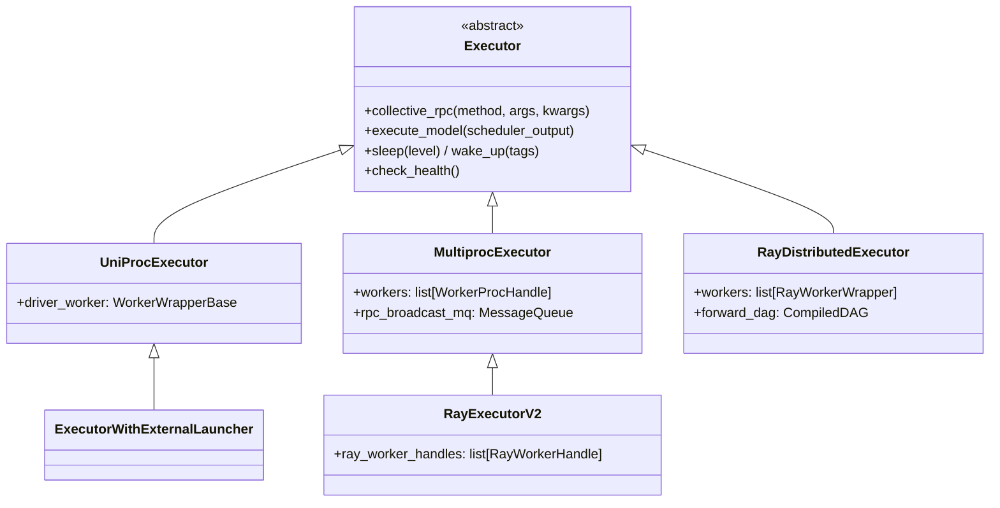

[← Wiki 首页](../../README.md) > [执行层](../README.md) > Executor

# Executor 控制面子目录

> Executor 是引擎主进程里"调度器与设备之间"的控制面代理。它**不直接跑模型**，而是把方法名+参数广播给一组 Worker 进程/Actor，再把 Worker 的输出聚合回流。所有 Executor 共享同一个抽象基类 [`Executor`](abstract.md)。

## 是什么

`vllm/v1/executor/` 目录下共 9 个文件，按职责分三组：

| 文件 | 职责 |
|---|---|
| `abstract.py` | `Executor` ABC + 工厂方法 `get_class()`，定义 `collective_rpc` / `execute_model` / `sleep` / `wake_up` 等控制面 API |
| `uniproc_executor.py` | `UniProcExecutor`（单进程直连）+ `ExecutorWithExternalLauncher`（torchrun） |
| `multiproc_executor.py` | `MultiprocExecutor` + `WorkerProc`：用 `multiprocessing` 拉起 N 个子进程，靠 `MessageQueue` 广播控制消息 |
| `ray_executor.py` | `RayDistributedExecutor`：基于 Ray Actor + Compiled Graph 的经典 Ray 后端 |
| `ray_executor_v2.py` | `RayExecutorV2`：继承 `MultiprocExecutor`，把 Worker 换成 Ray actor，控制面复用 MQ |
| `ray_utils.py` | Ray 共享工具：`RayWorkerWrapper`、`initialize_ray_cluster`、PG 校验、`FutureWrapper`、`detach_zero_copy_from_model_runner_output` |
| `ray_env_utils.py` | `get_driver_env_vars()`：从 driver 进程挑选需要透传给 Ray worker 的环境变量 |
| `vllm_net_devices.py` | GPU↔NIC PCIe 映射（`VLLM_GPU_NIC_PCIE_MAPPING`），为 UCX/NVSHMEM 选 NIC |

## 为什么

控制面要同时支持五种部署形态，但对外只暴露一套 `collective_rpc` API。Executor 家族用"基类+子类换 `_init_executor` 与 `collective_rpc`"的方式，让上层 `EngineCore` 完全无感于底层是进程、Ray actor 还是 torchrun。

## 怎么选 backend

`VllmConfig.__post_init__` 会根据 `world_size`、`pipeline_parallel_size` 和环境变量（`VLLM_USE_RAY_EXECUTOR_BACKEND_FOR_MULTI_NODE` 等）推断默认值；用户也可显式传 `--distributed-executor-backend`。最终在 `Executor.get_class()` (`vllm/v1/executor/abstract.py:48`) 解析为具体类。`mp` 与 `ray-v2` 都支持异步调度（`supports_async_scheduling() == True`）。

## 模块导航

| 文档 | 覆盖源码 |
|---|---|
| [abstract.md](abstract.md) | `vllm/v1/executor/abstract.py` |
| [uniproc.md](uniproc.md) | `vllm/v1/executor/uniproc_executor.py` |
| [multiproc.md](multiproc.md) | `vllm/v1/executor/multiproc_executor.py` (+`ray_utils.py`/`ray_env_utils.py` 工具) |
| [ray.md](ray.md) | `vllm/v1/executor/ray_executor.py` + `vllm_net_devices.py` |
| [ray-v2.md](ray-v2.md) | `vllm/v1/executor/ray_executor_v2.py` |

## 与其它模块配合

- 上游：[引擎核心](../../01-engine-core/README.md) 持有 Executor 并按步调用 `execute_model` / `sample_tokens`。
- 下游：[Worker 数据面](../worker/README.md) 实现 Executor 广播下来的所有方法。
- 编译：`initialize_from_config` → `compile_or_warm_up_model` 聚合每个 Worker 的 `CompilationTimes` (`abstract.py:124`)。
- 分布式：Ray backend 依赖 [分布式子系统](../../07-distributed/README.md) 的 `placement_group`、`parallel_state`。

## 历史版本演进

- **v0.5–v0.6**：V0 时代已有 `ray_executor` 与 `multiproc_executor`，但接口与 V1 不兼容。
- **v0.7.0**：V1 重构落地 `Executor` ABC、`UniProcExecutor`，统一 `collective_rpc`。
- **v0.8–v0.9**：`MultiprocExecutor` 切换到 `MessageQueue` 广播 + 异步调度支持。
- **v0.10–v0.11**：引入 `RayExecutorV2`（继承 `MultiprocExecutor`）、`vllm_net_devices.py`。
- **v0.12 / main**：`VLLM_USE_RAY_V2_EXECUTOR_BACKEND` 开关、`external_launcher` 平台兼容性持续修复。

[← 返回执行层首页](../README.md)

## 参见

- [Worker 数据面](../worker/README.md)
- [引擎核心](../../01-engine-core/README.md)
- [分布式子系统](../../07-distributed/README.md)
