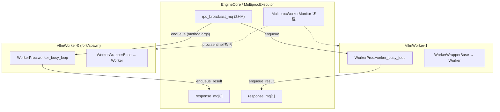

[← Wiki 首页](../../README.md) > [执行层](../README.md) > [Executor](./README.md) > Multiproc

# MultiprocExecutor：多进程执行器

源码：`vllm/v1/executor/multiproc_executor.py`（1075 行）+ 共享工具 `ray_utils.py`（699 行）+ `ray_env_utils.py`（18 行）

## 是什么

`MultiprocExecutor` 用 Python `multiprocessing` 在**单机内**拉起 `world_size` 个 `VllmWorker-{rank}` 子进程，每个子进程跑一个 `WorkerProc`（封装 `WorkerWrapperBase`）。控制面走**共享内存 `MessageQueue`**（`shm_broadcast`）：Executor 把 `(method, args, kwargs, output_rank)` 入队，所有 Worker `dequeue` 后执行，结果再经各自 `worker_response_mq` 回流。

它也作为 `RayExecutorV2` 的父类（见 [ray-v2.md](ray-v2.md)），把 MQ 控制面与 NCCL 数据面复用到 Ray actor 上。

主要类：

- `MultiprocExecutor` — Executor 本体。
- `WorkerProc` — 子进程主循环（`worker_main` → `worker_busy_loop`），持有真实 `WorkerWrapperBase`。
- `UnreadyWorkerProcHandle` / `WorkerProcHandle` — 启动期/process/ready_pipe/death_writer/response_mq 的句柄。
- `FutureWrapper` — 串行保序的"先 enqueue 再逐个 wait"Future（`multiproc_executor.py:70`）。
- `set_multiprocessing_worker_envs()` — fork 前设置 `OMP_NUM_THREADS=1` 等。

## 为什么

- **无 Ray 依赖**：单机多卡 TP/PP 不需要 Ray，纯 `multiprocessing` 即可，部署更轻。
- **控制面零拷贝广播**：`SchedulerOutput` 经过 `cloudpickle` 后写入共享内存，所有 Worker 同地址空间读取，避免 N 次 IPC 拷贝。
- **DP + 多节点支持**：`nnodes_within_dp > 1` 时，leader 节点创建 MQ，follower 节点通过 `get_inner_dp_world_group().create_mq_broadcaster` 跨节点订阅 (`multiproc_executor.py:573-591`)。
- **故障隔离**：每个 Worker 独立进程，崩了由 `MultiprocWorkerMonitor` 线程探活并触发 `failure_callback`。

## 怎么做

### 进程拓扑

### 初始化（`_init_executor`, `multiproc_executor.py:110`）

1. `weakref.finalize(self, self.shutdown)` 注册退出清理。
2. 校验 `world_size == tp*pp*pcp` (`_get_parallel_sizes`)。
3. `set_multiprocessing_worker_envs()`：`_maybe_force_spawn()` + 默认 `OMP_NUM_THREADS=1`（`multiproc_executor.py:1047`）。
4. **Leader 节点**创建 `rpc_broadcast_mq` 并 `export_handle()`；follower 节点跳过（`if node_rank_within_dp == 0`，`multiproc_executor.py:135`）。
5. 循环 `local_world_size` 次：`WorkerProc.make_worker_process()` 创建 `multiprocessing.Process(daemon=True)`，NUMA 绑定 via `numa_utils.configure_subprocess`；返回 `UnreadyWorkerProcHandle`（含 `ready_reader`/`death_writer` pipe）。
6. `WorkerProc.wait_for_ready()`：等所有子进程发回 `{"status":"READY", "handle":..., "peer_response_handles":...}`，构造 `WorkerProcHandle`。
7. 装配 `response_mqs`：本地 rank 用 Worker 自带的，远程 rank 用 `peer_worker_response_mqs`。
8. `wait_until_ready()` 全部 MQ；`start_worker_monitor()`；`_post_init_executor()`；`self.output_rank = _get_output_rank()`（最后一个 PP stage 的 TP rank 0）。

### WorkerProc 生命周期（`multiproc_executor.py:554`）

- `__init__` (`:594`)：构造 `WorkerWrapperBase`，`init_worker(all_kwargs)` 反射 Worker 类，`init_device()`，`load_model()`，按 `async_scheduling` 决定是否启 `async_output_copy_thread`，最后 `_init_message_queues()`。
- `worker_main` (`:807`)：注册 SIGTERM/SIGINT 处理；`set_assigned_physical_gpu_ids`；`set_worker_net_device`；关继承 fd；`maybe_init_worker_tracer`；new `WorkerProc`；起 `monitor_death_pipe` 线程；发 READY；`wait_until_ready()` 自己的 MQ；进入 `worker_busy_loop()`。
- `worker_busy_loop` (`:983`)：死循环 `rpc_broadcast_mq.dequeue(indefinite=True)` → 根据 `method` 是否 bytes 选择 `getattr` 或 `cloudpickle.loads` → 执行 → 若 `output_rank is None or rank==output_rank` 调 `handle_output`（异步则入 `async_output_queue`，否则直接 `enqueue_output`）。

### collective_rpc（`multiproc_executor.py:340`）

1. `cloudpickle.dumps(method)`（若 callable），`rpc_broadcast_mq.enqueue((send_method, args, kwargs, output_rank))`。
2. 选择 `response_mqs`：`output_rank` 指定时只等一个。
3. 构造 `FutureWrapper(futures_queue, get_response, aggregate)`：保序——必须先 drain 队列里更早的 Future（`FutureWrapper.result` 会逐个 `_wait_for_response`，`:88`）。
4. 若 `kv_output_aggregator` 提供，`aggregate = partial(kv_output_aggregator.aggregate, output_rank=...)`。
5. 关键超时由 `envs.VLLM_EXECUTE_MODEL_TIMEOUT_SECONDS` 控制。

### execute_model / sample_tokens

透传到 `collective_rpc`，带 `unique_reply_rank=self.output_rank`、`kv_output_aggregator=self.kv_output_aggregator`、`timeout=VLLM_EXECUTE_MODEL_TIMEOUT_SECONDS` (`multiproc_executor.py:307-329`)。

### 故障恢复

- `start_worker_monitor` (`:268`)：守护线程 `multiprocessing.connection.wait(sentinels)`，任一进程死亡 → `is_failed=True`、`shutdown()`、`failure_callback()`。
- `register_failure_callback`：若已 failed 立即回调，否则缓存。
- `_ensure_worker_termination` (`:405`)：优雅等待 → SIGTERM → SIGKILL 三段式。
- `shutdown` (`:456`)：先关 `death_writer` 通知子进程退出，再 `_ensure_worker_termination`，再关各 MQ。

### 共享工具（ray_utils.py / ray_env_utils.py）

虽然文件名带 "ray"，但部分内容被 `RayExecutorV2` 与 `MultiprocExecutor` 共享，归在此处一并说明：

- **`ray_utils.py`**：
  - `WORKER_SPECIFIC_ENV_VARS` (`:33`)：不可从 driver 透传给 Ray worker 的环境变量集合（`CUDA_VISIBLE_DEVICES`、`LOCAL_RANK`、`VLLM_HOST_IP` 等）。
  - `RayWorkerWrapper(WorkerWrapperBase)` (`:56`)：Ray 版延迟初始化包装器；`adjust_rank`、`execute_method`、`execute_model_ray`（Compiled Graph 入口，处理 PP stage 间 `IntermediateTensors` 传递、mm_features 剥离、AsyncModelRunnerOutput 物化）、`setup_device_if_necessary`（CG 后台线程重设 device）。
  - `FutureWrapper` (`:240`)：Ray 版的 `.result()` 阻塞等待 + 可选 `KVOutputAggregator.aggregate`；`detach_zero_copy_from_model_runner_output` 复制 Ray SHM 零拷贝 ndarray 防 `RAY_CGRAPH_get_timeout`。
  - `initialize_ray_cluster` (`:528`)：`ray.init`、创建/校验 `placement_group`、`_verify_bundles`（TP 越界告警、driver 节点必须含 GPU）、`_wait_until_pg_ready`。
  - `get_bundles_for_indices` / `get_bundles_sorted_by_node`：bundle→node→ip 排序，driver 节点优先。
  - `build_actor_name`：生成可读的 Ray actor 名（`vllm_Worker_<instance>_TP0_PP1`）。
- **`ray_env_utils.py`**：`get_driver_env_vars(worker_specific_vars)` 从 `os.environ` 剔除 `worker_specific_vars` 与 `RAY_NON_CARRY_OVER_ENV_VARS`，用于 `RayExecutorV2` 透传 driver 环境给 worker（`setdefault` 语义，不覆盖节点本地值）。

## 与其它模块/系统配合

- [Worker 基类](../worker/worker-base.md)：每个子进程持有一个 `WorkerWrapperBase`。
- [Ray V2 执行器](ray-v2.md)：继承 `MultiprocExecutor`，复用 MQ 控制面与 `FutureWrapper`。
- [引擎核心](../../01-engine-core/README.md)：`EngineCore` 在 `mp` backend 下持有 `MultiprocExecutor`。
- [分布式](../../07-distributed/README.md)：`get_inner_dp_world_group().create_mq_broadcaster` 跨节点广播；`destroy_distributed_environment` 在 Worker 退出时清理。
- [CPU Worker](../worker/cpu-worker.md)：仅 `mp` backend 支持 CPU 多核；`OMPProcessManager` 设置 OpenMP 亲和性。
- [KV connector mixin](../worker/kv-connector-mixin.md)：`kv_output_aggregator` 跨 Worker 聚合 `KVConnectorOutput`。

## 历史版本演进

- **v0.5–v0.6**：V0 `MultiprocExecutor` 用 `Pipe` 逐 worker 通信，无 MQ。
- **v0.7.0**：V1 重构，引入 `WorkerProc` + `multiprocessing.Process`，`ready_pipe` 握手。
- **v0.8.0**：切换到 `shm_broadcast.MessageQueue` 广播 `SchedulerOutput`；`FutureWrapper` 保序机制建立；`async_output_copy_thread` 后台线程物化 async 输出。
- **v0.9.0**：`MultiprocWorkerMonitor` 守护线程 + `failure_callback`（PR #32xxx，相关 issue 见代码注释）。
- **v0.10.0**：DP + 多节点 (`nnodes_within_dp > 1`) 支持，引入 `peer_worker_response_mqs` 与 `get_inner_dp_world_group`。
- **v0.11.0**：`kv_output_aggregator` 接入；`external_launcher` 分支关 `VLLM_ENABLE_V1_MULTIPROCESSING` 兼容。
- **v0.12 / main**：`numa_utils.configure_subprocess` NUMA 绑定、`_maybe_force_spawn` 强制 spawn、Elastic EP scale-up via `elastic_ep_execute`。

[← 返回执行层首页](../README.md)

## 参见

- [Executor ABC](abstract.md)
- [UniProc 单进程执行器](uniproc.md)
- [Ray V2 执行器](ray-v2.md)
- [Worker 基类](../worker/worker-base.md)
- [分布式子系统](../../07-distributed/README.md)
