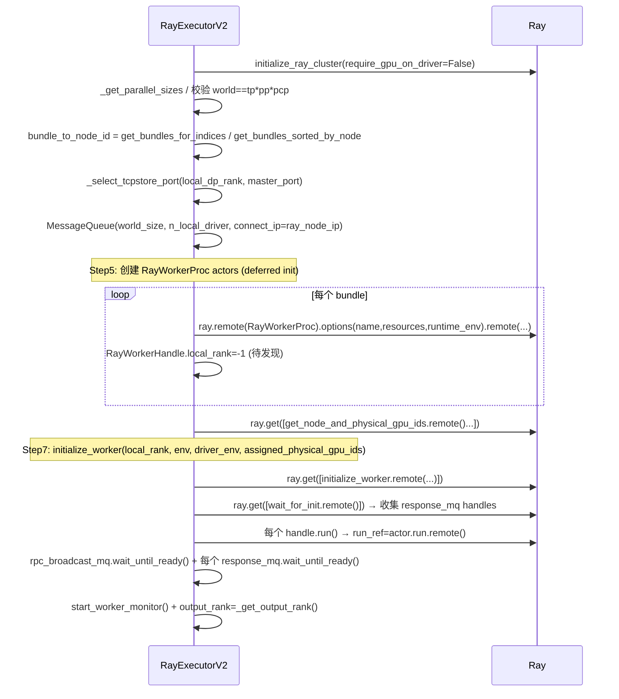

[← Wiki 首页](../../README.md) > [执行层](../README.md) > [Executor](./README.md) > Ray V2

# RayExecutorV2：新版 Ray 执行器（MQ 控制面）

源码：`vllm/v1/executor/ray_executor_v2.py`（574 行）

## 是什么

`RayExecutorV2` 直接**继承 `MultiprocExecutor`**，把"Worker 进程"换成"Ray actor 内的 `RayWorkerProc`"。控制面、`FutureWrapper`、`worker_busy_loop`、`MessageQueue` 广播、`kv_output_aggregator` 全部复用父类，仅在 `_init_executor` / `start_worker_monitor` / `shutdown` 三处替换下"子进程"语义为"Ray actor"。

类属性：`uses_ray = True`、`supports_pp = True`、`supports_async_scheduling() == True`（继承自 `MultiprocExecutor`）。

关键设计：**"Ray 负责 placement/GPU 发现，MQ 负责 step 级广播"**。打开 `RAY_EXPERIMENTAL_NOSET_CUDA_VISIBLE_DEVICES`，Ray 不再设置 `CUDA_VISIBLE_DEVICES`，executor 在 placement 完成后查询每个 actor 的物理 GPU ID，把节点级 `assigned_physical_gpu_ids` 列表传给 `initialize_worker`，由 Worker 自己用 `torch.accelerator.set_device_index` 选卡。

文件内主要类：

- `RayWorkerHandle` (`:49`)：`(actor, rank, local_rank, node_id, bundle_id_idx, run_ref)`。
- `RayWorkerProc(WorkerProc)` (`:76`)：把 `WorkerProc.__init__` 拆成两段——构造只存参数，`initialize_worker` 在 GPU ID 已知后完成真实 init。
- `RayExecutorV2(MultiprocExecutor)` (`:219`)。

## 为什么

- **统一控制面**：与 `mp` backend 共用 `worker_busy_loop` 与 `FutureWrapper`，让 Ray 也能享受 MQ 零拷贝广播 + 异步调度（这对 Ray 性能"critical"，见类 docstring）。
- **消除 Compiled DAG 依赖**：不再需要 `ray[cgraph]`、cupy，部署门槛降低；PP 通信回到 vLLM 原生 `get_pp_group()`。
- **多实例共存**：externally managed placement group + `assigned_physical_gpu_ids` 让多个 vLLM 实例同节点不抢卡（见 `RayWorkerProc` docstring）。
- **环境变量 setdefault 语义**：`driver_env_vars` 用 `setdefault` 填缺失项但不覆盖节点本地值，避免 driver 误覆盖 worker 节点特有配置。

## 怎么做

### 初始化（`_init_executor`, `ray_executor_v2.py:282`）

要点：

1. **TCPStore 端口**：`_select_tcpstore_port` (`:264`) 用 `local_dp_rank` 偏移避免同节点多 DP engine 抢端口冲突；窗口 32，失败回退随机端口。
2. **MQ 创建**：driver 节点的 worker 数 = `n_local`，`connect_ip=ray.util.get_node_ip_address()`（Ray 内部 IP，可跨节点路由；外部 `get_ip()` 通常不行）。
3. **RayWorkerProc 两段初始化**：
   - `__init__` (`:105`) 只存 `_init_kwargs`，**不碰设备/模型**。
   - `get_node_and_physical_gpu_ids` (`:125`) 通过 `ray.get_runtime_context().get_accelerator_ids()[device_key]` 查询 Ray 分配的物理 GPU。
   - `initialize_worker` (`:139`)：`driver_env_vars` 用 `setdefault`，`env_vars` 直接覆盖；写 `vllm_config.parallel_config.assigned_physical_gpu_ids`；调 `super().__init__()`（即 `WorkerProc.__init__`）。
4. **`_init_message_queues` 重写** (`:172`)：所有 worker 用 `MessageQueue.create_from_handle` 接收 `SchedulerOutput`；`worker_response_mq` 按 `is_driver_node` 决定 `n_local_reader` 是 1 还是 0。
5. **`wait_for_init`** (`:195`)：只回 `{"status":READY,"handle":...}` 给 driver，driver 据此构造 `response_mqs`。
6. **`run`** (`:203`)：actor 主入口，先 `wait_until_ready` 两个 MQ，再 `worker_busy_loop()`（继承自 `WorkerProc`）。

### 控制：collective_rpc / execute_model / sample_tokens / check_health

**全部继承自 `MultiprocExecutor`**，因为它们只依赖 `self.rpc_broadcast_mq` 与 `self.response_mqs`，而 V2 已经把这些 MQ 建好。`output_rank = self._get_output_rank()`（继承）。

### start_worker_monitor（重写, `:479`）

不能用 `multiprocessing.connection.wait(sentinels)`，改用 `ray.wait(run_refs, timeout=5.0)` 轮询：

- 每个 `RayWorkerHandle.run_ref` 是 `actor.run.remote()` 返回的 `ObjectRef`，actor 死亡时该 ref 完成/出错。
- 5s 轮询间隔——阻塞式 `ray.wait` 在 Ray teardown 时会 segfault。
- 死亡 → `is_failed=True` → `executor.shutdown()` → `failure_callback()`。

### shutdown（重写, `:548`）

`self._join_monitor_thread()`（必须先 join 监视线程，否则 Ray 在它脚下被拆会 segfault）→ `ray.kill(handle.actor)` → 关闭 `rpc_broadcast_mq` 与所有 `response_mqs`。`shutdown_lock` 防重入。

### SHM Broadcast 细节

- **MessageQueue 两类**：① `rpc_broadcast_mq`driver 写、所有 worker 读（broadcast）；② 每个 worker 一个 `worker_response_mq`driver 单读（response）。
- 单节点：两端都用 SHM；跨节点：`connect_ip` 走 TCP（Ray 内部 IP）。
- `MessageQueue.create_from_handle` 从 driver 导出的 `Handle`（含 SHM fd/sem fd/远端订阅地址）在 worker 端重建。
- 握手：driver `wait_until_ready` ↔ worker `wait_until_ready` 双向 barrier，避免 race。
- 与 [multiproc.md](multiproc.md) 描述的 SHM 机制一致，V2 只是把 Worker 进程换成 Ray actor。

## 与其它模块/系统配合

- [Multiproc 多进程执行器](multiproc.md)：父类，复用 MQ 控制面 + `FutureWrapper` + `worker_busy_loop`。
- [Executor ABC](abstract.md)：`get_class("ray")` 在 `VLLM_USE_RAY_V2_EXECUTOR_BACKEND=1` 时选 V2。
- [Ray 经典执行器](ray.md)：被 V2 取代；V2 不使用 Compiled DAG。
- [Worker 基类](../worker/worker-base.md)：`RayWorkerProc` 内部还是构造 `WorkerWrapperBase`。
- [分布式子系统](../../07-distributed/README.md)：`placement_group`、`get_inner_dp_world_group` 不直接使用（PP 走原生 vLLM pp_group）。
- [vllm_net_devices](ray.md)：`RayWorkerProc` 通过 `set_worker_net_device`（在 `WorkerProc.worker_main` 链路）设置 NIC。
- [引擎核心](../../01-engine-core/README.md)：`EngineCore` 在 `VLLM_USE_RAY_V2_EXECUTOR_BACKEND=1` + `ray` backend 时持有 V2。

## 历史版本演进

- **v0.10.0（实验）**：`RayExecutorV2` 首次进入代码库，作为 `MultiprocExecutor` 子类，目标"用 MQ 替代 Compiled DAG"。
- **v0.11.0**：`RAY_EXPERIMENTAL_NOSET_CUDA_VISIBLE_DEVICES` + 两段初始化（`__init__` + `initialize_worker`）落地；`assigned_physical_gpu_ids` 节点级映射；`get_bundles_for_indices`/`get_bundles_sorted_by_node` 抽到 `ray_utils.py`。
- **v0.11.x**：`start_worker_monitor` 改为 `ray.wait` 5s 轮询（修 segfault）；`_join_monitor_thread` 在 shutdown 前置；`driver_env_vars` setdefault 语义。
- **v0.12.0**：`VLLM_USE_RAY_V2_EXECUTOR_BACKEND` 开关默认 False，保持经典 Ray 兼容；`require_gpu_on_driver=False` 让 driver 节点不必持有 GPU。
- **main**：`_select_tcpstore_port` 用 DP local rank 错开端口；`build_actor_name` 注入 actor 名便于 dashboard 定位。

[← 返回执行层首页](../README.md)

## 参见

- [Executor ABC](abstract.md)
- [Multiproc 多进程执行器](multiproc.md)
- [Ray 经典执行器](ray.md)
- [Worker 基类](../worker/worker-base.md)
- [分布式子系统](../../07-distributed/README.md)
