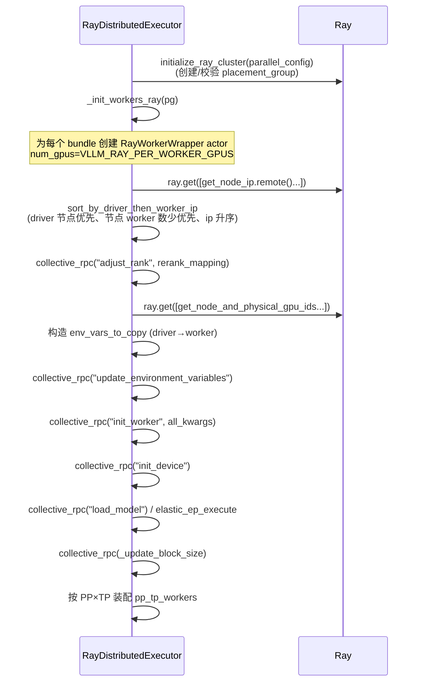

[← Wiki 首页](../../README.md) > [执行层](../README.md) > [Executor](./README.md) > Ray (经典)

# RayDistributedExecutor：经典 Ray 执行器

源码：`vllm/v1/executor/ray_executor.py`（628 行）+ `vllm/v1/executor/vllm_net_devices.py`（243 行）

> 注意：`vLLM_USE_RAY_V2_EXECUTOR_BACKEND=1` 时 `"ray"` backend 会切到 [RayExecutorV2](ray-v2.md)。本页描述的是**经典版** `RayDistributedExecutor`，使用 Ray Compiled Graph 作为数据面。

## 是什么

`RayDistributedExecutor` 把每个 Worker 部署为 **Ray actor**（`RayWorkerWrapper`），控制面是常规 `ray.get(worker.execute_method.remote(...))`，数据面是 **Ray Compiled Graph（`forward_dag`）**：编译期把各 PP stage 的 `execute_model_ray` 串成 DAG，运行时 `forward_dag.execute((scheduler_output, grammar_output))` 一次触发整条流水。

类属性：`uses_ray = True`、`supports_pp = True`。

文件内还定义 `RayWorkerMetaData` dataclass（worker actor + created_rank + adjusted_rank + ip），用于"创建顺序随机，事后按节点排序重排 rank"。

`vllm_net_devices.py` 原本服务 `UniProc`/`Multiproc`，但作为单文件由 Ray 也间接共享，本页一并说明（参见 [uniproc.md](uniproc.md) / [multiproc.md](multiproc.md)）。

## 为什么

- **多机编排**：Ray 的 placement_group 天然支持跨节点 PACK/SPREAD，vLLM 只需声明 `world_size` 个 `{GPU:1}` bundle。
- **Compiled Graph 加速**：PP 场景下 `MultiOutputNode` + `with_tensor_transport("nccl"|"shm")` 让 stage 间张量在 NCCL/SHM 通道上零拷贝流转，overlap comm 由 `VLLM_USE_RAY_COMPILED_DAG_OVERLAP_COMM` 控制 (`ray_executor.py:619`)。
- **CG 通道类型可调**：`VLLM_USE_RAY_COMPILED_DAG_CHANNEL_TYPE` ∈ {`auto`,`nccl`,`shm`}，TPU/XPU 强制 `shm` (`ray_executor.py:74`)。
- **环境变量透传**：driver 的 env 通过 `get_env_vars_to_copy` 跨进程复制到 worker，剔除 `WORKER_SPECIFIC_ENV_VARS`。

## 怎么做

### 初始化（`_init_executor`, `ray_executor.py:70`）

GP 资源声明 (`ray_executor.py:198-213`)：CUDA 用 `num_gpus`，其它（TPU/XPU）用 `resources={ray_device_key: num_gpus}`。`bundle_indices` 来自 `VLLM_RAY_BUNDLE_INDICES`（用户显式指定）或自动取前 N 个 GPU bundle。

### execute_model / sample_tokens（CG 路径）

与 `MultiprocExecutor` 不同，经典 Ray 把"前向+采样"在 CG 内一次完成。`RayDistributedExecutor.execute_model` (`ray_executor.py:390`) 的状态机：

- 若 `uses_sampler` 且 `total_num_scheduled_tokens > 0`：**只缓存** `scheduler_output`，立即返回 `None`（同步）或 `COMPLETED_NONE_FUTURE`（异步）。等 `sample_tokens` 被调用时才真正执行。
- 否则（pooling、EC producer、空步）：直接 `_execute_dag`。

`_execute_dag` (`ray_executor.py:434`)：惰性 `_compiled_ray_dag()` → `forward_dag.execute((scheduler_output, grammar_output))`：
- 无 connector：取 `refs[0]`（output_rank，PP=1 时阻塞，PP>1 时 `FutureWrapper`）；`detach_zero_copy_from_model_runner_output` 复制 SHM 零拷贝。
- 有 connector：`ray.get(refs)` 取全部，`kv_output_aggregator.aggregate`。

### _compiled_ray_dag（`ray_executor.py:527`）

- `_check_ray_cgraph_installation`：要求 `ray>=2.43.0`、`pip install ray[cgraph]`，若用 nccl 通道还要 cupy。
- `RAY_CGRAPH_get_timeout` 默认调到 300s。
- `InputNode` → 每个 PP stage 的 `worker.execute_model_ray.bind(outputs[i])` → `MultiOutputNode(outputs)`；中间 stage 用 `with_tensor_transport(transport)` 指定通道。
- `VLLM_USE_RAY_WRAPPED_PP_COMM=1` 时注册 `RayPPCommunicator`（包装 vLLM `_PPGroupCoordinator`），否则用 Ray 原生 NCCL communicator。

### collective_rpc（非 CG 控制面）

`collective_rpc` (`ray_executor.py:470`)：对每个 worker `worker.execute_method.remote(sent_method, *args, **kwargs)`，同步 `ray.get(..., timeout=timeout)` 或异步 `FutureWrapper(ray_worker_outputs)`。`method` 若 callable 用 `cloudpickle.dumps`。

### check_health / shutdown

- `check_health` (`:625`)：当前假设健康（`TODO: check the health of the Ray workers`），待补。
- `shutdown` (`:99`)：`forward_dag.teardown()` + `ray.kill(worker)`；`__del__` 调 `shutdown`。

### reinitialize_distributed

`reinitialize_distributed(reconfig_request)` (`:380`)：透传到 worker，若 `new_data_parallel_rank == SHUTDOWN_CURRENT_RANK` 则 `self.shutdown()`。服务 EPD 弹性扩缩容。

---

### 附：vllm_net_devices.py

`vllm_net_devices.py`（243 行）提供 GPU↔NIC PCIe 亲和映射，服务 RDMA 传输（UCX/NVSHMEM）。入口 `set_worker_net_device(local_rank, vllm_config)` (`:220`)：

- 必须同时设置 `VLLM_GPU_NIC_PCIE_MAPPING`（`gpu_bdf=nic_bdf,...`）与 `VLLM_NIC_SELECTION_VARS`（`UCX_NET_DEVICES:1,NCCL_IB_HCA:1` 等），否则互斥报错。
- 流程：`_dp_adjusted_local_rank`（DP 偏移）→ `current_platform.get_all_gpu_bus_ids()[physical_id]` → `normalize_pci` → `parse_gpu_nic_mapping` 反查 NIC BDF → `rdma_name_for_nic_pci` 从 `/sys/class/infiniband/<name>/device` 软链解出 RDMA 设备名（`mlx5_*`/`ibp*`）→ 按 `parse_nic_selection_vars` 拼接 `value=rdma_dev+suffix` 写入 `os.environ[var_name]`。
- `normalize_pci` (`:26`) 支持 `domain:bus:dev.fn` 与 `bus:dev.fn`，全部 hex。
- 该函数被 `UniProcExecutor._init_executor`、`WorkerProc.worker_main` 与 `RayWorkerProc.initialize_worker` 同时调用，单文件统一三处后端。

## 与其它模块/系统配合

- [Ray V2 执行器](ray-v2.md)：替代方案，复用 MQ 控制面；新部署建议用 V2。
- [Multiproc 多进程执行器](multiproc.md)：`RayExecutorV2` 继承它，但经典 `RayDistributedExecutor` 不继承。
- [Worker 基类](../worker/worker-base.md)：worker 侧是 `RayWorkerWrapper`（在 `ray_utils.py`，详见 [multiproc.md](multiproc.md) 共享工具节）。
- [分布式子系统](../../07-distributed/README.md)：`placement_group`、`RayPPCommunicator`、`get_pp_group`。
- [KV connector](../worker/kv-connector-mixin.md)：`has_connector` 分支聚合多 Worker 输出。
- [编译子系统](../../09-compilation-ir/README.md)：Compiled DAG 在 Ray 侧编译，与 vLLM 自己的 `torch.compile` 是两套机制。

## 历史版本演进

- **v0.5–v0.6**：V0 经典 `RayDistributedExecutor`，控制面与数据面都用 `ray.get/ray.put`，PP stage 间张量经 CPU 中转。
- **v0.7.0**：引入 Ray Compiled Graph 实验，`forward_dag` 落地。
- **v0.8.0**：`VLLM_USE_RAY_COMPILED_DAG_CHANNEL_TYPE` 与 `VLLM_USE_RAY_COMPILED_DAG_OVERLAP_COMM` 选项加入；TPU/XPU 强制 shm。
- **v0.9.0**：`execute_model`/`sample_tokens` 拆分以支持 structured outputs 并行（先缓存 scheduler_output，sample_tokens 时才跑）。
- **v0.10.0**：`reinitialize_distributed` 接入 EPD 弹性；`build_actor_name`/`get_bundles_*` 工具从 `ray_executor.py` 抽到 `ray_utils.py`。
- **v0.11.0**：`detach_zero_copy_from_model_runner_output` 防 `RAY_CGRAPH_get_timeout`；`VLLM_USE_RAY_WRAPPED_PP_COMM` 加入。
- **v0.12 / main**：`vllm_net_devices.py` 落地；`require_gpu_on_driver` 参数化（为 V2 让路）；`RayWorkerMetaData`/sort 重排持续微调。

[← 返回执行层首页](../README.md)

## 参见

- [Executor ABC](abstract.md)
- [Multiproc 多进程执行器](multiproc.md)
- [Ray V2 执行器](ray-v2.md)
- [UniProc 单进程执行器](uniproc.md)
- [分布式子系统](../../07-distributed/README.md)
