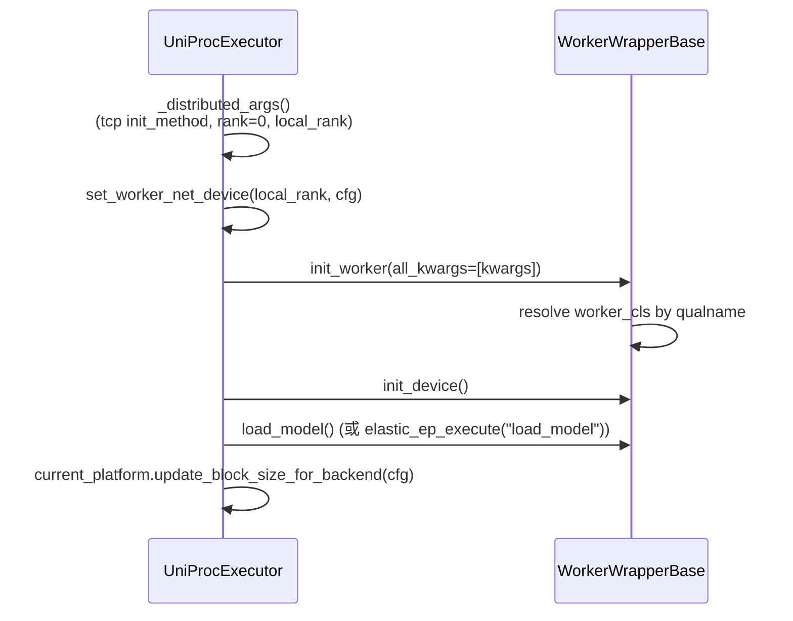

[← Wiki 首页](../../README.md) > [执行层](../README.md) > [Executor](./README.md) > UniProc

# UniProcExecutor：单进程执行器

源码：`vllm/v1/executor/uniproc_executor.py`（196 行）

## 是什么

`UniProcExecutor` 是最简单的 Executor：在引擎主进程内**直接持有一个 `WorkerWrapperBase`**（`self.driver_worker`），所有 `collective_rpc` 就是同进程函数调用。用于 TP=1、单设备（GPU/CPU/XPU）场景，也是开发联调与单元测试的默认路径。

文件内还定义 `ExecutorWithExternalLauncher`，继承 `UniProcExecutor`，服务 torchrun 风格的 SPMD 离线推理。

辅助类 `AsyncOutputFuture`（`uniproc_executor.py:26`）把 `AsyncModelRunnerOutput` 包装成 `concurrent.futures.Future`，用于 `non_block=True` 异步调度路径。

## 为什么

- **零控制面开销**：TP=1 时不需要进程间通信，直接同进程调函数即可，省掉 `MessageQueue`/Ray 的序列化与广播成本。
- **快速路径**：异步调度（`supports_async_scheduling() == True`）下 `execute_model` 返回 `Future`，让 `EngineCore` 可以连续 enqueue 多步。
- **torchrun 兼容**：`ExecutorWithExternalLauncher` 让"`torchrun` 拉起多个独立 engine、靠确定性调度产出相同结果"成为可能（见 issue #11400）。

## 怎么做

### 初始化（`_init_executor`, `uniproc_executor.py:46`）

`_distributed_args` (`uniproc_executor.py:71`)：用 `get_ip()` + `get_open_port()` 构造 TCPStore 地址，rank 恒为 0；`local_rank` 来自 `device_config.device`（如 `cuda:2` → local_rank=2）。

### collective_rpc（`uniproc_executor.py:79`）

- 同步：`run_method(self.driver_worker, method, args, kwargs)`；若返回 `AsyncModelRunnerOutput` 自动 `.get_output()`；按 `single_value` 决定返回单值或 `[值]`。
- 异步（`non_block=True`）：若结果是 `AsyncModelRunnerOutput` 包成 `AsyncOutputFuture`（延迟到 `result()` 才 sync），否则直接 `Future().set_result(...)`。

### execute_model / sample_tokens

重写父类以传 `single_value=True`，并在 `non_block` 时尽早 surface 异常（`execute_model` 后 `if non_block and output.done(): output.result()`，`uniproc_executor.py:118`）。

### ExecutorWithExternalLauncher（`uniproc_executor.py:150`）

- `_init_executor` 额外断言 `VLLM_ENABLE_V1_MULTIPROCESSING=0`（确定性调度要求关多进程）。
- `_distributed_args` 改用 `"env://"`，rank/local_rank 从 `RANK`/`LOCAL_RANK` 环境变量取（由 torchrun 注入）。
- `determine_available_memory` 重写：在 `super()` 之后用 `dist.all_reduce(MIN, cpu_group)` 取所有 rank 的最小可用显存，保证各 engine KV cache 大小一致。

### check_health / shutdown / supports_async_scheduling

- `check_health` 直接 return（同进程内只要有挂掉就会抛异常，无需主动探活）。
- `shutdown` 调 `self.driver_worker.shutdown()`。
- `supports_async_scheduling` 返回 True。

## 与其它模块/系统配合

- [Worker 基类](../worker/worker-base.md)：`WorkerWrapperBase.init_worker()` 反射 `worker_cls`（默认指向 `vllm.v1.worker.gpu_worker.Worker`，由 platform 改写）。
- [GPU Worker](../worker/gpu-worker.md)：默认 `driver_worker` 实例。
- [vllm_net_devices](ray.md)：`set_worker_net_device` 在 `init_device` 前调用以设置 RDMA NIC。
- [引擎核心](../../01-engine-core/README.md)：`EngineCore` 在 `world_size==1` 时默认选 `uni`。
- [分布式](../../07-distributed/README.md)：`ExecutorWithExternalLauncher.determine_available_memory` 用 `get_world_group().cpu_group` 做 all_reduce。

## 历史版本演进

- **v0.7.0**：V1 引入 `UniProcExecutor` 作为 TP=1 默认 backend，替代 V0 中"无 executor 直调 worker"的路径。
- **v0.8.0**：加入 `AsyncOutputFuture` 与 `non_block` 支持，落地异步调度。
- **v0.9.0**：`ExecutorWithExternalLauncher` 从实验特性进入主线（issue #11400），用于 `examples/features/torchrun/`。
- **v0.10.0**：`set_worker_net_device` 接入，把 NIC 选择从 executor 体内抽到 `vllm_net_devices.py`。
- **v0.11–v0.12**：`elastic_ep_execute("load_model")` 分支接入弹性 EP；`VLLM_ENABLE_V1_MULTIPROCESSING` 断言加入。

[← 返回执行层首页](../README.md)

## 参见

- [Executor ABC](abstract.md)
- [Multiproc 多进程执行器](multiproc.md)
- [GPU Worker](../worker/gpu-worker.md)
- [Worker 基类](../worker/worker-base.md)
