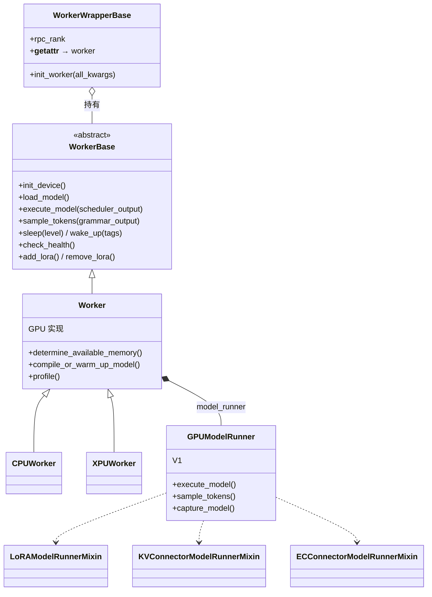

[← Wiki 首页](../../README.md) > [执行层](../README.md) > Worker

# Worker 数据面子目录

> Worker 是执行层的"数据面"：每个设备一个 Worker 进程/Actor，持有模型权重、KV cache、CUDA graph，真正跑前向 + 采样。Worker 内部又把 per-step 的输入组装、cudagraph 重放、采样组装委托给 **ModelRunner**。

## 是什么

`vllm/v1/worker/` 目录下包含 Worker × ModelRunner × 多种 Mixin：

| 文件/子包 | 角色 |
|---|---|
| `worker_base.py` | `WorkerBase` ABC + `WorkerWrapperBase`（延迟初始化包装） |
| `gpu_worker.py` | `Worker`（GPU 主实现）：设备/内存/睡眠/PP/权重热更 |
| `gpu_model_runner.py` | `GPUModelRunner` V1（7689 行，步前向/cudagraph/采样全流程） |
| `cpu_worker.py` + `cpu_model_runner.py` + `cpu/` 子包 | CPU 后端 |
| `xpu_worker.py` + `xpu_model_runner.py` | Intel XPU 后端 |
| `gpu/` 子包 | ModelRunner V2（Experimental）+ 拆分的子模块 |
| `gpu_input_batch.py` / `tpu_input_batch.py` | V1 持久 batch 状态 |
| `ubatching.py` + `ubatch_utils.py` + `gpu_ubatch_wrapper.py` | DBO 微批（Disaggregated Batched Overlap） |
| `lora_model_runner_mixin.py` + `gpu/lora_utils.py` | LoRA 在 ModelRunner 中的钩子 |
| `kv_connector_model_runner_mixin.py` | KV connector hook |
| `ec_connector_model_runner_mixin.py` | Encoder cache connector hook |
| `block_table.py` / `mamba_utils.py` / `cp_utils.py` / `dp_utils.py` / `utils.py` / `workspace.py` / `encoder_cudagraph*.py` | 辅助 |

## 为什么

- **多硬件抽象**：`WorkerBase` 给出 `init_device/load_model/execute_model/sample_tokens/sleep/wake_up/...` 抽象，GPU/CPU/XPU/TPU 各写子类，让上层 Executor 与硬件解耦。
- **执行/采样的两段式**：V1 起 `execute_model` 只跑前向+logits（返回 `None` 表示已缓存状态），由 `sample_tokens` 在稍后做采样——服务 structured outputs 并行与异步输出物化。
- **ModelRunner V1→V2 演进**：V1 把所有逻辑塞在 `gpu_model_runner.py` 一个 7689 行的巨类；V2 拆成 `gpu/` 子包下的 `model_runner.py` + `model_states/` + `sample/` + `spec_decode/` + `mm/` + `pool/` 等独立模块，可维护性大幅改善。
- **Mixin 复用**：LoRA / KV connector / EC connector 都以 Mixin 形式注入 `GPUModelRunner`，多后端共享同一份钩子代码。

## 怎么做

## 模块导航

| 文档 | 覆盖源码 |
|---|---|
| [worker-base.md](worker-base.md) | `vllm/v1/worker/worker_base.py` |
| [gpu-worker.md](gpu-worker.md) | `vllm/v1/worker/gpu_worker.py` |
| [gpu-model-runner.md](gpu-model-runner.md) | `vllm/v1/worker/gpu_model_runner.py` |
| [cpu-worker.md](cpu-worker.md) | `cpu_worker.py` + `cpu_model_runner.py` + `cpu/` |
| [xpu-worker.md](xpu-worker.md) | `xpu_worker.py` + `xpu_model_runner.py` |
| [model-runner-v2.md](model-runner-v2.md) | `vllm/v1/worker/gpu/` |
| [ubatching.md](ubatching.md) | `ubatching.py` + `ubatch_utils.py` + `gpu_ubatch_wrapper.py` |
| [cudagraph-capture.md](cudagraph-capture.md) | `gpu_model_runner` cudagraph + `cuda_graph.py` + `breakable_cudagraph.py` |
| [lora-mixin.md](lora-mixin.md) | `lora_model_runner_mixin.py` + `gpu/lora_utils.py` |
| [kv-connector-mixin.md](kv-connector-mixin.md) | `kv_connector_model_runner_mixin.py` |
| [ec-connector-mixin.md](ec-connector-mixin.md) | `ec_connector_model_runner_mixin.py` |

## 与其它模块/系统配合

- 上游：[Executor 控制面](../executor/README.md) 通过 `collective_rpc` 调 Worker 上的方法。
- 下游：[模型执行](../../03-model-execution/README.md)（model_loader + 层库 + 算子）、[注意力后端](../../05-attention/README.md)（attention metadata + KV cache）、[采样与解码](../../06-sampling-decoding/README.md)（sampler + 投机解码）。
- 横切：[编译](../../09-compilation-ir/README.md)（cudagraph 捕获/重放、torch.compile）、[分布式](../../07-distributed/README.md)（TP/PP/DP/EP 通信）、[平台](../../08-platforms/README.md)（device allocator、sleep mode）。

## 历史版本演进

- **v0.5–v0.6**：V0 时代 Worker 与 ModelRunner 紧耦合在 `worker.py` / `model_runner.py`。
- **v0.7.0**：V1 重构，`WorkerBase`/`WorkerWrapperBase` 抽象落地，`execute_model`/`sample_tokens` 两段式确立。
- **v0.8–v0.9**：`gpu_model_runner.py` 持续膨胀；LoRA/KV connector mixin 拆出；`async_output_copy_thread` 引入。
- **v0.10–v0.11**：DBO 微批 + breakable cudagraph + encoder cudagraph 接入；MLA / cascade attn / SP / DCP 持续扩展。
- **v0.12 / main**：`vllm/v1/worker/gpu/` 下 ModelRunner V2 进入活跃开发；`use_v2_model_runner` 开关；CPU/XPU 也获得 V2 入口。

[← 返回执行层首页](../README.md)

## 参见

- [Executor 控制面](../executor/README.md)
- [模型执行](../../03-model-execution/README.md)
- [注意力后端](../../05-attention/README.md)
- [采样与解码](../../06-sampling-decoding/README.md)
