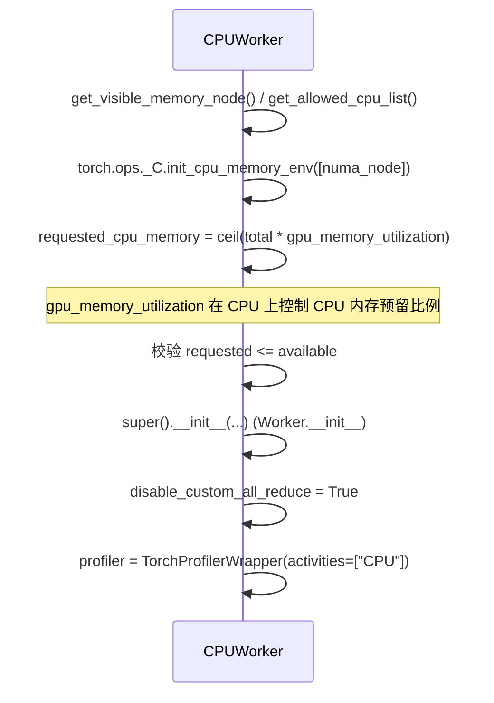

[← Wiki 首页](../../README.md) > [执行层](../README.md) > [Worker](./README.md) > CPU Worker

# CPUWorker + CPUModelRunner + cpu/ 子包

源码：`vllm/v1/worker/cpu_worker.py`（258 行）+ `vllm/v1/worker/cpu_model_runner.py`（239 行）+ `vllm/v1/worker/cpu/{shm.py,buffer_utils.py,model_runner.py}`

## 是什么

CPU 后端通过三层实现：

1. **`CPUWorker(Worker)`** (`cpu_worker.py:33`)：继承 GPU `Worker`，重写 NUMA 绑定、device 设置、内存估算、warmup、profiling、睡眠（不支持）。把 `disable_custom_all_reduce = True`。
2. **`CPUModelRunner(GPUModelRunner)`** (`cpu_model_runner.py:22`)：**V1 路径**。继承 V1 `GPUModelRunner`，通过 monkey-patch 把所有 `torch.accelerator`/`torch.cuda` 调用 stub 掉，再把 device 张量替换为对应 CPU 张量，规格解码 triton kernel 替换为 CPU 实现。
3. **`cpu/` 子包**：
   - `cpu/shm.py`（82 行）：模块顶层就把 `torch.Event`/`torch.cuda.Event`/`torch.cuda.Stream`/`torch.Tensor.pin_memory`/`torch.accelerator.synchronize` 等替换为 CPU-friendly stub，并把 `gpu_buffer_utils.UvaBuffer` 别名指向 `cpu_buffer_utils.UvaBuffer`。`cpu_worker.py` 第一行 `import vllm.v1.worker.cpu.shm` 即生效。
   - `cpu/buffer_utils.py`（16 行）：CPU 版 `UvaBuffer`（`cpu = cpu.zeros`、`np = cpu.numpy`、`uva = cpu`，无 UVA）。
   - `cpu/model_runner.py`（16 行）：**V2 路径**，`CPUModelRunner(GPUModelRunnerV2)` 仅 override `warming_up_model`。

## 为什么

- **复用 V1/V2 主干**：CPU 不重写 ModelRunner 全部逻辑，而是通过 monkey-patch 让 GPU 代码在 CPU 上"看起来能跑"，省去维护两份前向逻辑。
- **NUMA 亲和**：CPU 多 socket 场景必须把 worker 进程绑定到特定 memory node + CPU list，否则跨 socket 访存严重拖慢。
- **Triton-CPU / C++ 路径分支**：当 `HAS_TRITON` 为真（Triton-CPU 后端可用）走原生 triton kernel；否则 monkey-patch 替换为 `vllm.utils.cpu_triton_utils` 的 C++ 实现。
- **CPU sleep 不支持**：显式 warning 而非报错，保证上层 `Executor.sleep` 调用不崩。

## 怎么做

### CPUWorker 构造（`cpu_worker.py:34`）

### CPUWorker.init_device（`cpu_worker.py:107`）

- `self.device = torch.device("cpu")`。
- 检查 `LD_PRELOAD` 中的 `libtcmalloc`（必装）、`libiomp`（spec decode 推荐）。
- `torch.set_num_threads = skip_set_num_threads`（线程绑定后不允许再调）。
- 设 `VLLM_DIST_IDENT`（CPU allreduce SHM 唯一标识）。
- `init_worker_distributed_environment(...)`（backend 为 `gloo`，由 `current_platform.dist_backend` 给出）。
- `set_random_seed`。
- 构造 ModelRunner：V1 用 `CPUModelRunner`，V2 用 `cpu.model_runner.CPUModelRunner`。

### CPUWorker 内存与 warmup

- `determine_available_memory` (`:180`)：先 `warming_up_model`，再读 `get_memory_node_info().available_memory`；若指定 `kv_cache_memory_bytes` 直接用，否则 `requested_cpu_memory - rss`；右侧检查 必须 >0 且 <= available。
- `compile_or_warm_up_model` (`:239`)：若模型无 KV cache（纯 pooling 等）再 warmup 一次；返回 `CompilationTimes`。
- `profile` (`:252`)：透传到 `TorchProfilerWrapper`。
- `sleep`/`wake_up` (`:172`/`176`)：仅 log warning。

### CPUModelRunner V1（`cpu_model_runner.py`）

构造期：

- `_set_torch_accelerator_to_noop()`：把 `torch.accelerator.synchronize`/`empty_cache` 改成 noop。
- 在 `_torch_cuda_wrapper()` context 下 `super().__init__`：临时把 `torch.Event`/`torch.cuda.Stream` 替换为 placeholder（`record`/`synchronize`/`wait_stream` 都是 noop），让父类构造期不触碰真实 CUDA。
- `use_cuda_graph = False`、`cascade_attn_enabled = False`。
- `_postprocess_tensors()`：遍历 `vars(self)`，把所有 `CpuGpuBuffer` 的 `.gpu` 指向 `.cpu`；把 `input_batch` 里 `*_cpu_tensor` 的同名 device 字段指向 cpu；block_table 的 `CpuGpuBuffer` 同样处理。
- `_postprocess_triton()`：若 `HAS_TRITON` 走 triton-CPU 否则把 `block_table._compute_slot_mapping_kernel`、spec decode 各 kernel、`mamba_utils.batch_memcpy_kernel`、rejection sampler kernel 全部替换为 `cpu_triton_utils` 实现。

方法 override：

- `load_model` (`:122`)：调 `get_model(vllm_config)`；若 LoRA 走 `load_lora_model`；drafter `load_model(self.model)`；EAGLE3 aux hidden state 设置。不支持 `load_dummy_weights`。
- `get_model`：透传。
- `warming_up_model` (`:144`)：在 `_set_global_compilation_settings` 下调 `profile_run`（inductor `max_autotune` 时打开 `freezing`）。
- `initialize_kv_cache` (`:151`)：调 super + 若 spec decode 打 log。
- `_init_device_properties`/`_sync_device`：noop。
- `_zero_block_ids` (`:170`)：直接 `.zero_()`，只对 `FullAttentionSpec` 组做（避免 encoder-only 层）。
- `_to_list` (`:191`)：直接 `tolist()`（无 CUDA event）。

### cpu/ 子包

#### cpu/shm.py（82 行）

模块顶层（import 即执行）monkey-patch：

- `torch.Event`/`torch.cuda.Event` → `_EventPlaceholder`（`record`/`synchronize` noop）。
- `torch.cuda.Stream` → `_StreamPlaceholder`（`wait_stream` noop，`__enter__/__exit__`）。
- `torch.cuda.set_stream`/`current_stream` → noop / lambda。
- `torch.accelerator.synchronize`/`empty_cache` → noop。
- `torch.Tensor.pin_memory` → `fake_pin_memory`（返回 self）。
- `torch.accelerator.get_memory_info` → `get_memory_info`（从 `get_memory_node_info()` 取 available/total）。
- `vllm.utils.torch_utils.async_tensor_h2d` → CPU 版（直接 `torch.tensor`/`from_numpy`，无 H2D）。
- `gpu_buffer_utils.UvaBuffer = cpu_buffer_utils.UvaBuffer`：让 GPU buffer utils 在 CPU 上找到替代实现。

#### cpu/buffer_utils.py（16 行）

`UvaBuffer`：`cpu = torch.zeros(size, device="cpu")`、`np = cpu.numpy()`、`uva = cpu`。`is_uva_available()` 必须为 True（CPU 视为"always UVA"）。

#### cpu/model_runner.py（16 行）

`CPUModelRunner(GPUModelRunnerV2)`（继承 V2），仅 `warming_up_model`：`profile_run()` + log。V2 路径下真正逻辑由 `gpu/model_runner.py` + `cpu/shm.py` 的 patch 共同支撑。

## 与其它模块/系统配合

- [GPU Worker](gpu-worker.md)：`CPUWorker` 继承 `Worker`，复用 `init_worker_distributed_environment`、`compile_or_warm_up_model` 框架。
- [GPU Model Runner V1](gpu-model-runner.md) / [V2](model-runner-v2.md)：`CPUModelRunner` 继承二者，靠 monkey-patch 让 GPU 代码跑在 CPU。
- [Executor 控制面](../executor/README.md)：CPU 后端默认 `mp`（多核需多进程）或 `uni`（单核）。
- [分布式](../../07-distributed/README.md)：`dist_backend=gloo`；`VLLM_DIST_IDENT` 用于 CPU allreduce SHM 标识；`disable_custom_all_reduce=True`。
- [平台](../../08-platforms/README.md)：`current_platform.is_cpu()`，提供 `get_cpu_architecture`/`CpuArchEnum`。
- [模型执行](../../03-model-execution/README.md)：MKLDNN/CPPGEMM backend 需要 `torch_inductor_config.freezing=True`，由 `_set_global_compilation_settings` 控制。

## 历史版本演进

- **v0.5–v0.6**：V0 CPU 后端独立 `cpu_worker.py`/`cpu_model_runner.py`，逻辑与 GPU 平行。
- **v0.7.0**：V1 重构，`CPUModelRunner` 改为继承 V1 `GPUModelRunner` + monkey-patch，大幅减少重复代码；`shm.py` 顶层 patch 落地。
- **v0.8.0**：CPU spec decode via `cpu_triton_utils` 替换 rejection sampler kernel；`libtcmalloc`/`libiomp` `LD_PRELOAD` 检查加入。
- **v0.9.0**：`_zero_block_ids` 仅对 `FullAttentionSpec` 以避免 encoder-only 层误清。
- **v0.10–v0.11**：Triton-CPU backend 分支（`HAS_TRITON`）；`VLLM_CPU_KVCACHE_SPACE`/`kv_cache_memory_bytes` 显式控制；`numa_utils` 接入（在 multiproc 的 `OMPProcessManager`）。
- **v0.12 / main**：`use_v2_model_runner` 走 `cpu/model_runner.py` 的 V2 入口；`_torch_cuda_wrapper` 持续适配父类新增的 CUDA 调用。

[← 返回执行层首页](../README.md)

## 参见

- [GPU Worker](gpu-worker.md)
- [GPU Model Runner V1](gpu-model-runner.md)
- [Model Runner V2](model-runner-v2.md)
- [Worker 基类](worker-base.md)
