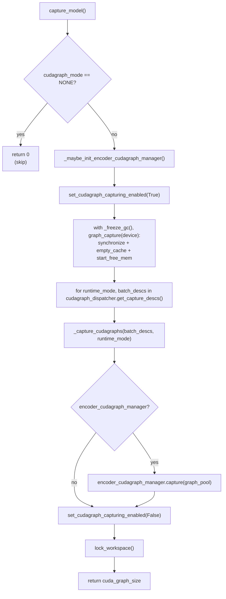

[← Wiki 首页](../../README.md) > [执行层](../README.md) > [Worker](./README.md) > CUDAGraph 捕获/重放

# CUDAGraph 捕获与重放

涉及源码：

- `vllm/v1/worker/gpu_model_runner.py` 的 `capture_model` / `_capture_cudagraphs` / `_warmup_and_capture` / `_dummy_run` / `profile_cudagraph_memory` / `_model_forward`
- `vllm/v1/worker/gpu/model_runner.py` 的 `capture_model` + `gpu/cudagraph_utils.py:ModelCudaGraphManager`
- `vllm/compilation/cuda_graph.py`（361 行，`CUDAGraphWrapper`）
- `vllm/compilation/breakable_cudagraph.py`（424 行，`BreakableCUDAGraphWrapper`/`BreakableCUDagraphCapture`）
- `vllm/v1/worker/encoder_cudagraph.py` + `encoder_cudagraph_defs.py`（多模态 encoder 独立 cudagraph）
- `vllm/v1/worker/gpu_ubatch_wrapper.py`（DBO 微批 cudagraph）

## 是什么

vLLM 把"一步前向"按形状分桶捕获成一组 `torch.cuda.CUDAGraph`，运行时按 `BatchDescriptor` 直接 replay，省掉 kernel launch 与 Python overhead。捕获分三种模式（`CUDAGraphMode`）：

- **`FULL`**：整段前向（含 attention）一次性录制进单图，replay 时只 copy 输入 buffer。性能最高，但要求形状对齐捕获过的 descriptor（含 `uniform_token_count`/`num_reqs`/`num_active_loras`）。
- **`PIECEWISE`**：按层（或更细粒度）录制多张小子图，运行时由编译子系统串联；形状灵活度更高，但 launch 次数多。由 `CUDAGraphWrapper` 在 layer runnable 上各自包裹。
- **`NONE`**：eager，不录图，用于 profile / warmup / 无法入图的形状（如 `calculate_kv_scales` 阶段、cascade attn batch、encoder-decoder 含 encoder 输入的步）。

`BreakableCUDAGraphWrapper` 是 PIECEWISE 的一种实现：捕获期允许"中断-续捕"（`BreakableCUDagraphCapture.add_eager` 在不可入图算子处断开），replay 时按段回放。

`EncoderCudaGraphManager` 为多模态 encoder 单独管理一组 budget-graph（按 token budget 分桶），与 language model 的 cudagraph 解耦。

## 为什么

- **Python/launch overhead**：上千层 × 每步数十 token，eager 模式 CPU launch 成本占比高。
- **形状分桶**：LLM 推理 batch 形状有限（uniform decode、固定 prefill 尺寸），按桶捕获几条 graph 即可覆盖大部分。
- **不破坏动态性**：PIECEWISE + breakable 让 attention metadata、动态perPage 长度等无法静态化的部分仍能 capture 部分。
- **内存预算**：`profile_cudagraph_memory` 在 KV cache 分配前估算 graph pool 占用，避免事后 OOM。
- **多模态 encoder**：图像/视频 encoder 形状由预算决定 (`EncoderItemSpec`)，单独 capture 避免污染 language model graph 池。

## 怎么做

### V1 capture_model（`gpu_model_runner.py:6647`）

- **大形状先捕获**：注释指出先捕大尺寸，小尺寸能复用 graph pool。
- `_freeze_gc` context：捕获期 `gc.freeze` + disable gc.collect，避免 GC 干扰录制。
- `set_cudagraph_capturing_enabled`：全局开关，捕获期外任何 `torch.cuda.graph()` 调用都报错（防误捕）。
- `graph_capture(device)`：vLLM 自有的 context，统一 NCCL graph capture 准备。
- `cudagraph_dispatcher.get_capture_descs()`：迭代 `(runtime_mode, [BatchDescriptor])`，按 `cudagraph_capture_sizes` + `compile_ranges` 给出待捕形状。

### _capture_cudagraphs / _warmup_and_capture（`gpu_model_runner.py:6714`/`:6749`）

每个 `BatchDescriptor` 先跑 N 次 eager warmup（`CUDAGraphMode.NONE`，让 torch.compile / cublas 选择进入稳态），再一次 `is_graph_capturing=True` 的 `_dummy_run(cudagraph_runtime_mode=mode)`：

- `_dummy_run` 内部触发的 `_model_forward` 会调 set_forward_context 带 `cudagraph_runtime_mode = mode`。
- 层 runnable 被 `CUDAGraphWrapper`（FULL）或 `BreakableCUDAGraphWrapper`（PIECEWISE）包裹；wrapper 在 `__call__` 时看到 forward_context 的 `cudagraph_runtime_mode` 与自身 `runtime_mode` 匹配，首次 entry.cudagraph is None → 走 `torch.cuda.graph()` capture；后续 replay。
- `is_graph_capturing=True` 标志向下传，让 attention metadata builder 用 padded 维度、`force_attention` 等保持捕获/运行形状一致。

### V2 capture_model（`gpu/model_runner.py:685`）

调用 `self.cudagraph_manager.capture(...)`（`ModelCudaGraphManager`），把 V1 散落的 `_capture_cudagraphs`/`_warmup_and_capture` 收敛进 `cudagraph_utils.ModelCudaGraphManager`；同时 `encoder_cudagraph_manager.capture(graph_pool)` 与 V1 一致。结束 `lock_workspace()`。

### CUDAGraphWrapper（`compilation/cuda_graph.py:145`）

包裹任意 runnable，加 cudagraph 捕获/重放。**不存 persistent buffer、不 copy 输入**——这是 ModelRunner 的职责（把输入拷到固定地址）。

`__call__` (`:233`)：

1. 若无 `forward_context` 或 `cudagraph_runtime_mode == NONE` 或与自身 runtime_mode 不匹配 → 直接 `runnable(*args)`（mode 不匹配时透传，支持多 wrapper 嵌套 dispatch）。
2. `batch_descriptor` lookup：未命中 → 创建 `CUDAGraphEntry`。
3. `entry.cudagraph is None` → capture：
   - `validate_cudagraph_capturing_enabled()`（防运行时误捕）。
   - 记录 `input_addresses = [x.data_ptr() for x in args if Tensor]`（replay 时 DEBUG 模式校验地址一致）。
   - `ExitStack`：可选 `gc.collect`/`empty_cache` patch 禁用（PIECEWISE 多子图加速）、`set_graph_pool_id(self.graph_pool or current_platform.graph_pool_handle())`。
   - sync offloader copy stream → `torch.cuda.graph(cudagraph)` context 调 `runnable(*args, **kwargs)` → `cudagraph.replay()` 一次 warmup（让输出地址稳定） → 缓存 `entry.output`。
4. 已有 graph → 直接 `entry.cudagraph.replay()` + 返回 `entry.output`。

`CUDAGraphOptions(debug_log_enable, gc_disable, weak_ref_output)` 控制行为；`_all_instances: WeakSet` 支持 `clear_all_graphs`。

### BreakableCUDAGraphWrapper（`compilation/breakable_cudagraph.py:246`）

`CUDAGraphWrapper` 的 drop-in 替代，但用 `BreakableCUDAGraphCapture` 而非单个 `torch.cuda.graph()`：

- 捕获时允许 `add_eager(fn)` 在中间插入"eager break"——遇到不可入图算子（如动态 shape 的 reshape）时，先结束当前 segment 的 graph capture，eager 执行 fn，再开新 segment。各 segment 之间用 cuda event 协调。
- replay 时 `_replay` 按 segment 顺序 `<prev_event_wait>` → `<segment.replay>` → `<eager_fn>` → ...
- key 仅用 `BatchDescriptor`，与 runtime_mode 解耦（"breakable's capture is identical for prefill and decode"）。
- `is_breakable_cudagraph_enabled()` 全局开关；`BreakableCUDAGraphCapture.current()` 类变量跟踪当前激活的 capture session。

### ModelCudaGraphManager（V2, `gpu/cudagraph_utils.py:428`）

`CudaGraphManager` 子类，提供：

- `_init_candidates()`：根据 `cudagraph_capture_sizes`/`compile_ranges`/uniform decode 维度组合候选 `BatchExecutionDescriptor`，含 LoRA `num_active_loras` 各 case（来自 `get_lora_capture_cases`）。
- `capture(...)`：迭代候选，按 FULL / PIECEWISE 两条线分别 `CreateForwardFn` → serve warmup + capture pass。
- `run_fullgraph(desc)` (`:578`)：找匹配 entry → `entry.cudagraph.replay()` → 返回 `entry.output`（输入已在 graph buffer 内，由 ModelRunner 负责拷贝）。
- `run_pw_graph(model, model_inputs)`：先 `init_breakable_cg_runner(model)`（建立 breakable wrapper）；用 wrapper 调 model。
- `dispatch(num_reqs, num_tokens, uniform_token_count, num_active_loras)` → `BatchExecutionDescriptor`：选 cg_mode（FULL/PIECEWISE/NONE），按"PIECEWISE 不需要 request padding"等规则填充。

### Encoder CUDA Graph（`vllm/v1/worker/encoder_cudagraph.py`）

`EncoderCudaGraphManager` 为多模态 encoder（视觉/音频）单独管理：

- `EncoderCudaGraphConfig`（由模型在 init 时通过 `get_encoder_cudagraph_config()` 提供）：`modalities`、`buffer_keys`、`enable_dual_path_graph` 等。
- `EncoderItemSpec`：单条 image/video 的 input_size/output_tokens/global_output_tokens/local_output_tokens。
- `_generate_budgets(min_budget, max_budget)`：枚举 capture 预算（2 的幂次扩展）。
- `_capture_budget_graph(token_budget, path)`：按预算录制"假批量"encoder forward。
- `execute(...)`：runtime 按 mm_kwargs real tokens 选最小可容纳预算的 graph，`_copy_padded_buffer` 把真输入拷进 capture buffer 后 replay；超出最大预算的请求 fallback eager。
- `_execute_local_single_path` / `_execute_local_dual_path`：单路径 vs 双路径（global+local，如 Qwen2-VL dual path）。
- `_dp_shard` / `_dp_gather`：DP 分片处理。

### profile_cudagraph_memory（`gpu_model_runner.py:6498`）

在 `determine_available_memory` 阶段调用：

- 记 free_gpu_memory 前后差 = cudagraph_memory_estimate。
- 受 `VLLM_MEMORY_PROFILER_ESTIMATE_CUDAGRAPHS` 开关（v0.21+ 默认开）控制，默认开则在 KV cache 分配时扣除该估算值并提示用户可提升 `gpu_memory_utilization`；关闭则归零（不扣除，保守）。

### DBO 微批 cudagraph（`gpu_ubatch_wrapper.py`）

见 [ubatching.md](ubatching.md)。`UBatchWrapper.cudagraphs[num_tokens]` 把整个 batch（两 ubatch 合一）一次录制，replay 时双线程各自 replay 自己那段 + 等 cuda event 协调。

## 与其它模块/系统配合

- [GPU Model Runner V1](gpu-model-runner.md) / [V2](model-runner-v2.md)：`capture_model` 入口、`_model_forward` 决定 FULL/PIECEWISE/eager 分支。
- [GPU Worker](gpu-worker.md)：`compile_or_warm_up_model` 调 `capture_model`，回传 `cuda_graph_memory_bytes` 与 `CompilationTimes`。
- [UBatching](ubatching.md)：`UBatchWrapper` 内嵌 `CUDAGraphWrapper`，DBO 时按 num_tokens 缓存合一 graph。
- [编译子系统](../../09-compilation-ir/README.md)：torch.compile / Inductor 与 cudagraph 协作（PIECEWISE 把 compiled subgraph 串成 graph）；`set_cudagraph_capturing_enabled`、`compilation_counter`、`cudagraph_mode` 由 `compilation_config.resolve_cudagraph_mode_and_sizes` 决定。
- [注意力后端](../../05-attention/README.md)：FULL 模式要求 attn metadata 用 padded 维度；某些后端声明 `AttentionCGSupport` 限制只能 PIECEWISE 或 NEVER。
- [LoRA Mixin](lora-mixin.md)：`get_lora_capture_cases` 决定每个 `num_active_loras` 各捕获一张 graph。
- [多模态](../../11-multimodal/README.md)：`EncoderCudaGraphManager` 独立池。
- [平台](../../08-platforms/README.md)：`current_platform.get_global_graph_pool()` 共享 graph pool；XPU 通过 `supports_xpu_graph()` 切换 `torch.cuda.graph`→`torch.xpu.graph`。
- [KV 缓存管理（引擎核心）](../../01-engine-core/README.md)：`determine_available_memory` 用 `profile_cudagraph_memory` 估算扣除。

## 历史版本演进

- **v0.5–v0.6**：V0 已有 cudagraph 支持，但只有 FULL 模式且 capture sizes 固定。
- **v0.7.0**：V1 重构 `CUDAGraphWrapper`（runtime_mode dispatch）、`CUDAGraphEntry` + `BatchDescriptor` key；`capture_model` 框架确立。
- **v0.8.0**：PIECEWISE 模式接入 `torch.compile`；`CUDAGraphOptions.gc_disable`（多层 PW 捕获加速）。
- **v0.9.0**：`profile_cudagraph_memory` 估算 graph pool 大小；`VLLM_MEMORY_PROFILER_ESTIMATE_CUDAGRAPHS` 开关。
- **v0.10.0**：`BreakableCUDAGraphWrapper` 落地——允许在不可入图算子处中断捕获；`EncoderCudaGraphManager`（多模态编码器独立图池）。
- **v0.11.0**：DBO 与 cudagraph 联合（`UBatchWrapper.cudagraphs` 双 ubatch 合一录制）；`cudagraph_dispatcher.get_capture_descs` 按 `(runtime_mode, [descs])` 组织。
- **v0.12 / main**：V2 `ModelCudaGraphManager` 收敛捕获逻辑；`cudagraph_specialize_lora` + `get_captured_lora_counts` 让 LoRA 特化捕获更精细；`set_cudagraph_capturing_enabled` 全局门控；捕获完成后 `lock_workspace` 防运行时 resize。

[← 返回执行层首页](../README.md)

## 参见

- [GPU Model Runner V1](gpu-model-runner.md)
- [Model Runner V2](model-runner-v2.md)
- [UBatching](ubatching.md)
- [LoRA Mixin](lora-mixin.md)
- [编译子系统](../../09-compilation-ir/README.md)
- [注意力后端](../../05-attention/README.md)
