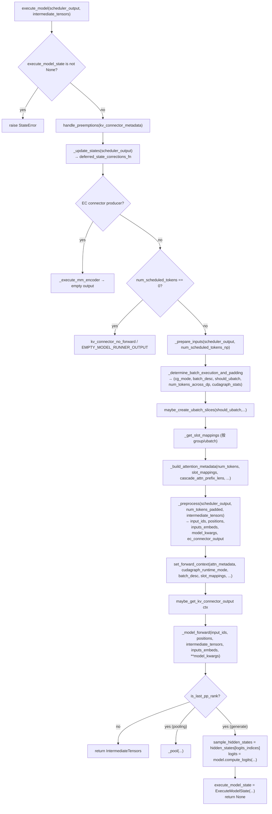
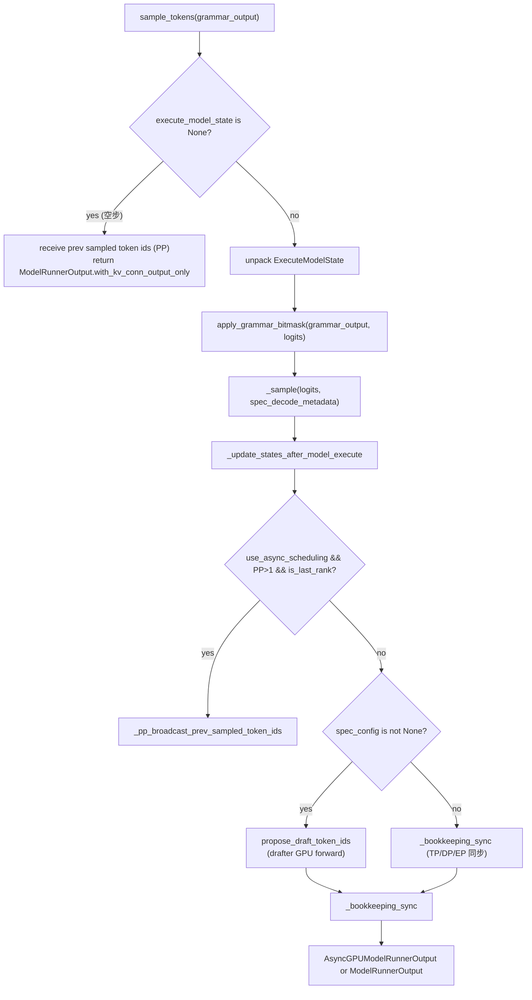
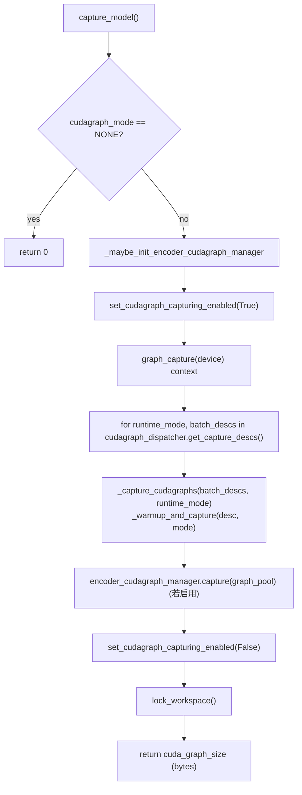

[← Wiki 首页](../../README.md) > [执行层](../README.md) > [Worker](./README.md) > GPU Model Runner V1

# GPUModelRunner V1（gpu_model_runner.py）

源码：`vllm/v1/worker/gpu_model_runner.py`（7689 行）

> V1 是当前默认的 ModelRunner 实现。新代码正在向 [`vllm/v1/worker/gpu/`](model-runner-v2.md) 迁移。

## 是什么

`GPUModelRunner` (`:440`) 是一个多重继承的巨型类：

```
GPUModelRunner(LoRAModelRunnerMixin, KVConnectorModelRunnerMixin, ECConnectorModelRunnerMixin)
```

把"per-step 输入组装、attention metadata 构建、模型前向、logits 计算、采样组装、投机解码 drafter 调度、cudagraph 捕获/重放、KV cache 初始化、内存 profiling"全部塞在单个类。文件内还定义：

- `AsyncGPUModelRunnerOutput` / `AsyncGPUPoolingModelRunnerOutput` (`:246`/`:385`)：把 GPU 上的采样/logprobs/pooling 输出在独立 `copy_stream` 上异步拷贝到 CPU，main stream 不阻塞。
- `ExecuteModelState(NamedTuple)` (`:424`)：`execute_model` 与下一次 `sample_tokens` 之间的状态快递（logits、hidden_states、spec_decode_metadata、attn_metadata 等）。

类属性集中在 `__init__` (`:443`)：约 60+ 个成员，覆盖请求状态、KV cache 配置、PP/DP/DCP/CP、MM/Spec/Pool/EPLB 分支、cudagraph dispatcher、workspace、drafter 等。

## 为什么

- **per-step 全流程一站式**：调度器只给 `SchedulerOutput`，企业级特性（多模态、投机、结构化输出、KV/EC connector、EPLB、cascade attn、SP、DCP、CP、UBO）都需在一步内交错执行，集中一处便于状态管理。
- **异步输出物化**：用 side stream + CUDA event 把"GPU 输出 → CPU list"异步化，让 main stream 立即进入下一步 prefill。
- **cudagraph 分发**：`cudagraph_dispatcher` 按 `(num_tokens, num_reqs, uniform_token_count, num_active_loras)` 选 FULL / PIECEWISE / NONE，配合 breakable cudagraph 兼顾性能与形状灵活。
- **可继承扩展**：CPU/XPU 通过 monkey-patch（`_postprocess_triton`/`_torch_cuda_wrapper`）复用 V1 全部逻辑。

## 怎么做

### execute_model（`:4069`，~370 行）



关键步骤：

- **`_update_states`** (`:1152`)：处理新请求/结束请求/preemption/appended_tokens/block_table 增量/num_computed_tokens/采样参数等，返回 deferred 修正函数（用于异步调度延迟应用）。
- **`_determine_batch_execution_and_padding`** (`:3836`)：根据 token 数/请求数/是否 uniform decode 决定 cg_mode（FULL/PIECEWISE/NONE）与 padding。
- **`_build_attention_metadata`** (`:2238`)：为每个 attn group + ubatch 构造 `AttentionMetadata`，处理 cascade attn、spec decode、PCP/DCP、DCP local seq lens。
- **`_preprocess`** (`:3449`)：组装 `input_ids`/`positions`/`inputs_embeds`/`model_kwargs`，处理 mrope/xdrope/spec decode/encoder-decoder。
- **`_model_forward`** (`:3783`)：根据 `cg_mode` 调用 eager / `CUDAGraphWrapper` / `BreakableCUDAGraphWrapper`。
- **`set_forward_context`** 把 attn_metadata/cg_mode/batch_desc/slot_mappings 写入全局 `forward_context`，供算子层读取。
- **PP**：非 last rank 返回 `IntermediateTensors`，由 [gpu-worker.md](gpu-worker.md) 的 `_pp_send_work` 异步发送。
- **`broadcast_pp_output`**：`external_launcher` + DP 时显式 broadcast logits 到所有 PP rank。
- **EC producer 分支**：仅运行 MM encoder 并返回空输出（让 consumer rank 后续用 ec_connector 拿到 encoder cache）。

### sample_tokens（`:4455`）



要点：

- **`_sample`** (`:3596`)：调 sampler + 写回 `input_batch.set_async_sampled_token_ids`（异步路径）。
- **`_bookkeeping_sync`** (`:3627`)：构造 `AsyncGPUModelRunnerOutput`，在 copy_stream 上把 `sampled_token_ids/logprobs/num_nans/num_sampled_tokens/prompt_logprobs_dict` 拷到 CPU；事件 sync 后再 token-by-token 物化为 Python list。
- **`propose_draft_token_ids`** (`:4913`)：EAGLE/DFlash/DraftModel/ExtractHidden/Gemma4 等 drafter 跑前向产出 draft tokens + copy to CPU。
- **PP**：last rank 在 async 路径下 `_pp_broadcast_prev_sampled_token_ids`，之前 rank 在下一步 `execute_model` 头 `_pp_receive_prev_sampled_token_ids_to_input_batch`。
- **`take_draft_token_ids`** (`:4792`)：让外部获取上一步的 draft tokens（spec decode 接口）。

### capture_model（`:6647`）



- **`_warmup_and_capture`** (`:6714`)：先 `cudagraph_num_of_warmups` 次 eager `_dummy_run`（`cudagraph_runtime_mode=NONE`）热身，再一次 `is_graph_capturing=True` 的 `_dummy_run` 真正捕获。
- **`_capture_cudagraphs`** (`:6749`)：迭代 `batch_descriptors`，把 cudagraph 实例注册进 `cudagraph_dispatcher`。
- **大形状先捕获**：注释指出"large shapes first so smaller ones reuse the memory pool"。
- 捕获完成后 `lock_workspace` 防止运行时 workspace resize。

### _dummy_run（`:5721`）

用 dummy SchedulerOutput 跑一次完整前向+采样，用于：

- 预热 / cudagraph 捕获时的"被捕获 forward"。
- `determine_available_memory` 的 `profile_run`。
- DP 协调（`num_tokens_across_dp`）。

参数包含 `uniform_decode`/`cudagraph_runtime_mode`/`is_graph_capturing`/`skip_eplb`/`remove_lora`/`num_active_loras`/`force_attention`/`allow_microbatching`/`profile_seq_lens` 等，覆盖各种 capture 路径。

### load_model（`:5204`）

- `get_model_loader(load_config).load_model(...)`。
- 若 `lora_config`：`self.model = load_lora_model(...)`。
- 若 spec decode 用 EAGLE3：`_setup_eagle3_aux_hidden_state_outputs`。
- `drafter.load_model(self.model)`（若用 drafter）。
- `prepare_communication_buffer_for_model(model)` 提前物化通信 buffer。
- 显存计量 `model_memory_usage`。

### initialize_kv_cache（`:7405`）

- `maybe_add_kv_sharing_layers_to_kv_cache_config`：把 KV-sharing 层挂到目标层所在 group。
- 调 `attn_backend` 的 `get_kv_cache_shape` 计算形状、`_allocate_kv_cache_tensors` 分配、`_reshape_kv_cache_tensors` reshape、`bind_kv_cache` 注册到 `static_forward_context`。
- 若 `use_uniform_kv_cache`：`allocate_uniform_kv_caches` 走 cross-layer 连续 buffer（KV connector 高效传输路径）。
- 不分配实际 KV cache 的 `EncoderOnlyAttentionSpec` 层跳过。

### profile_run / profile_cudagraph_memory（`:6290`/`:6498`）

- `profile_run`：临时建最小 KV cache 跑一次 `_dummy_run(is_profile=True)`，结束清理。
- `profile_cudagraph_memory`：记录捕获前后 free memory 差，作为 `cudagraph_memory_estimate` 给 `determine_available_memory`。

### 其他重要方法

- `_update_states` / `_update_states_after_model_execute` / `_update_streaming_request`：per-step 状态机。
- `_execute_mm_encoder` (`:2940`)：多模态 encoder 前向，写入 `encoder_cache`。
- `_gather_mm_embeddings` (`:3149`)：把 encoder 输出 gather 成 `inputs_embeds`。
- `_compute_cascade_attn_prefix_lens` (`:2567`)：cascade attention 共享前缀计算。
- `_calc_mrope_positions` / `_calc_xdrope_positions`：多模态 rope 位置编码。
- `_calc_spec_decode_metadata` (`:2798`)：投机解码 attn metadata 构造。
- `propose_draft_token_ids` (`:4913`)：drafter 主逻辑。
- `_pp_broadcast_prev_sampled_token_ids` / `_pp_receive_prev_sampled_token_ids_to_input_batch`：PP 广播采样结果。
- `init_routed_experts_capturer` / `_bind_routed_experts_capturer`：MoE 路由专家捕获器。
- `get_encoder_timing_stats` / `timed_encoder_operation`：encoder 计时。
- `eplb_step` / `setup_eplb_from_mapping`：专家并行负载均衡 step。

## 与其它模块/系统配合

- [GPU Worker](gpu-worker.md)：持有 `GPUModelRunner` 作为 `self.model_runner`。
- [Worker 基类](worker-base.md)：所有 `execute_model`/`sample_tokens`/`add_lora` 最终落到 ModelRunner。
- [LoRA Mixin](lora-mixin.md) / [KV Connector Mixin](kv-connector-mixin.md) / [EC Connector Mixin](ec-connector-mixin.md)：三重继承提供横向能力。
- [cudagraph 捕获/重放](cudagraph-capture.md)：`capture_model` + `CUDAGraphWrapper`/`BreakableCUDAGraphWrapper`。
- [UBatching](ubatching.md)：`should_ubatch` 分支 + `maybe_create_ubatch_slices`。
- [注意力后端](../../05-attention/README.md)：`_build_attention_metadata` + `attn_groups` + `static_forward_context`。
- [采样与解码](../../06-sampling-decoding/README.md)：`_sample` + `propose_draft_token_ids` + drafter。
- [编译子系统](../../09-compilation-ir/README.md)：`cudagraph_dispatcher`、`set_forward_context`、capturing 标志。
- [分布式](../../07-distributed/README.md)：`get_pp_group`/`get_tp_group`/`get_dcp_group`/`get_ep_group`/EPLB/EC transfer/KV transfer。
- [多模态](../../11-multimodal/README.md)：`_execute_mm_encoder`、`encoder_cache`、`mm_registry`。
- [模型执行](../../03-model-execution/README.md)：`model_loader`、`compute_logits`、`make_empty_intermediate_tensors`。

## 历史版本演进

- **v0.7.0**：V1 GPUModelRunner 落地，从 V0 `model_runner.py` 重写，引入 `GPUInputBatch` 与 `CachedRequestState`。
- **v0.8.0**：异步输出物化（`AsyncGPUModelRunnerOutput` + `copy_stream`）；LoRA mixin 拆出。
- **v0.9.0**：`execute_model`/`sample_tokens` 两段式确立（structured outputs 并行化）；KV connector mixin / EC connector mixin 接入。
- **v0.10.0**：cascade attn、DCP、CP、SP、PCP 接入；encoder cudagraph (`EncoderCudaGraphManager`) 加入；spec decode 重构为 drafter proposer 多实现的 `propose_draft_token_ids`。
- **v0.11.0**：breakable cudagraph + UBO 微批 + `cudagraph_dispatcher` 统一分发；EAGLE3/DFlash/DSpark/Gemma4 proposer；routed experts capturer；`use_uniform_kv_cache`。
- **v0.12 / main**：`use_v2_model_runner` 开关让 Worker 可选 V2；encoder timing stats；`mm_ipc_gpu_memory_gb` 预留；持续重构把单文件逻辑向 `gpu/` 子包抽离。

[← 返回执行层首页](../README.md)

## 参见

- [Model Runner V2](model-runner-v2.md)
- [GPU Worker](gpu-worker.md)
- [cudagraph 捕获/重放](cudagraph-capture.md)
- [UBatching](ubatching.md)
- [LoRA Mixin](lora-mixin.md)
- [KV Connector Mixin](kv-connector-mixin.md)
- [EC Connector Mixin](ec-connector-mixin.md)
