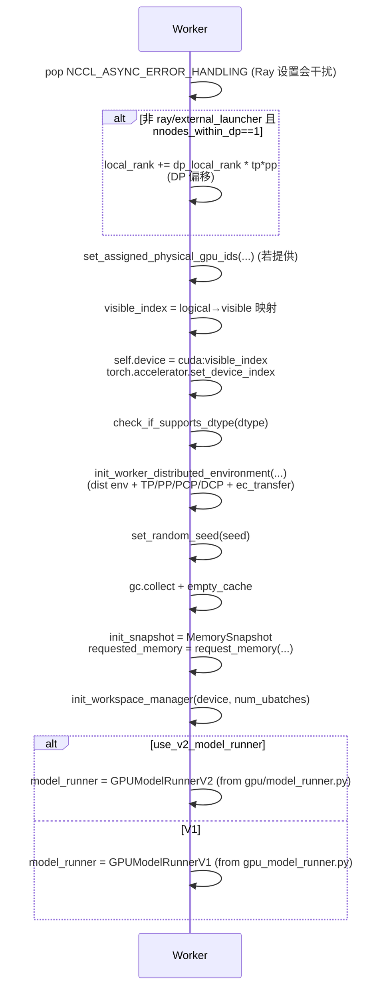
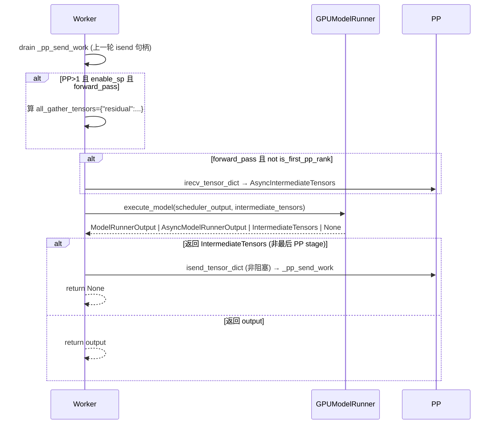

[← Wiki 首页](../../README.md) > [执行层](../README.md) > [Worker](./README.md) > GPU Worker

# GPU Worker（gpu_worker.py）

源码：`vllm/v1/worker/gpu_worker.py`（1295 行）

## 是什么

`Worker`（`vllm/v1/worker/gpu_worker.py:126`）是 GPU 后端的默认 Worker 实现，继承 `WorkerBase`。它把"设备初始化、内存 profiling、KV cache 分配、torch.compile+warmup+cudagraph 捕获、step 执行、睡眠/恢复、权重热更、profiling"等设备级职责统一在 `Worker` 层，把"per-step 输入组装/前向/采样"委托给 `GPUModelRunner`（V1 或 V2，由 `use_v2_model_runner` 决定）。

文件内还定义：

- `AsyncIntermediateTensors(IntermediateTensors)` (`:94`)：包裹 `comm_handles` 与 `comm_postprocess`，在 `.tensors` 被访问时 lazy `wait_for_comm()`，配合 PP 非阻塞 `irecv_tensor_dict` 实现"边收边算"。
- `init_worker_distributed_environment(...)` (`:1253`)：模块级函数，初始化 `init_distributed_environment` + `ensure_model_parallel_initialized`（TP/PP/PCP/DCP）+ `ensure_ec_transfer_initialized`。

## 为什么

- **职责分层**：Worker 管"设备/编译/内存"，ModelRunner 管"步内部状态/算子调度"，两层便于多后端共享逻辑（CPU/XPU 都继承 `Worker`）。
- **内存预算自洽**：`determine_available_memory` 跑一次 `profile_run` + `memory_profiling`，扣除权重/激活/cudagraph 之后给出 KV cache 字节数；`_reserve_mm_ipc_gpu_memory` 再为前端 API server 的硬件视频解码预留显存。
- **睡眠/恢复**：通过 `SleepModeBackend`（cumem/xpumem）在不退出进程的前提下释放/恢复显存，支持 elastic EP scale-up 与多实例分时复用。
- **PP 异步收发**：`AsyncIntermediateTensors` + `_pp_send_work` 让 PP stage 间张量 irecv/isend 与下一步前向重叠。

## 怎么做

### 构造（`gpu_worker.py:127`）

- 设 `torch.set_float32_matmul_precision(envs.VLLM_FLOAT32_MATMUL_PRECISION)`。
- 构造 `ElasticEPScalingExecutor(self)`，挂在 `self.elastic_ep_executor`（供 `elastic_ep_execute` 调用）。
- `weight_transfer_engine = None`（`load_model` 后才有）、`profiler = None`、`use_v2_model_runner = vllm_config.use_v2_model_runner`、`_pp_send_work = []`、`_sleep_mode_backend = None`。

### init_device（`gpu_worker.py:278`）

非 cuda 设备类型直接抛 `RuntimeError`（CPU/XPU 各自重写 `init_device`）。

### load_model（`gpu_worker.py:406`）

在 `_maybe_get_memory_pool_context("weights")`（cumem 池）+ `set_current_vllm_config` + `_scoped_allocator_max_split(20MiB)` 三重 context 下调 `model_runner.load_model`。若 `weight_transfer_config` 存在，构造 `WeightTransferEngineFactory.create_engine`。

### determine_available_memory（`gpu_worker.py:430`）

- 若 `kv_cache_memory_bytes` 已显式指定：仍跑 `profile_run`（让模型编译），但跳过 `memory_profiling`，直接返回指定值（`_reserve_mm_ipc_gpu_memory` 扣除前端 mm IPC 显存）。
- 否则进入 `memory_profiling` 上下文：
  1. `model_runner.profile_run()`。
  2. 收集 `torch_peak`、`non_torch_increase`、`weights_memory`。
  3. 若 CUDA + cudagraph_mode!=NONE，调 `model_runner.profile_cudagraph_memory()` 估算 cudagraph pool；受 `VLLM_MEMORY_PROFILER_ESTIMATE_CUDAGRAPHS` 开关影响。
  4. `available_kv_cache_memory_bytes = requested_memory - non_kv_cache_memory - cudagraph_estimate`。
  5. 日志给出"建议 `--kv-cache-memory=...`"提示。
- `_reserve_mm_ipc_gpu_memory`：扣除 `mm_ipc_gpu_memory_gb` × 单 API server + 硬件视频解码器常驻显存 × `num_api_servers`（见 `:598`）。

### compile_or_warm_up_model（`gpu_worker.py:724`）

顺序：

1. 对 `warmup_sizes`（不属于 cudagraph 捕获尺寸但仍想编译的尺寸，如 chunked prefill max）逐个 `_dummy_run`。
2. `kernel_warmup(self)`：vLLM 自有内核预热（kernel_warmup 模块）。
3. `cuda_graph_memory_bytes = model_runner.capture_model()`（除非 `enforce_eager`）。
4. V1：在 `is_last_rank` 上 `_dummy_sampler_run`/`_dummy_pooler_run` 预分配采样与 logits 缓冲，防 fragmentation；V2：`warmup_kernels(model_runner, execute_model, sample_tokens)` 跑完整 step JIT 编译 triton。
5. 重置随机种子；触发 Inductor 一次性 lazy init；激活 `jit_monitor`；`freeze_gc_heap` 冻结静态对象；`enable_gpu_sync_check`。

返回 `CompilationTimes(language_model=compilation_config.compilation_time, encoder=encoder_compilation_time)`。

### execute_model（`gpu_worker.py:955`）

关键点：

- `@torch.inference_mode()` + `@with_gpu_sync_check` 装饰。
- 非 last PP rank 的返回值是 `IntermediateTensors`，Worker 立即 `isend_tensor_dict` 并把句柄存入 `_pp_send_work`，下一步开头 drain。
- pooling + V2 特例：若 V2 pooling 模型且 `execute_model` 返回 None，调 `model_runner.pool()`。

### sample_tokens（`gpu_worker.py:948`）

`@torch.inference_mode` + `@with_gpu_sync_check`，透传给 `model_runner.sample_tokens(grammar_output)`。

### sleep / wake_up（`gpu_worker.py:187`/`217`）

- `sleep(level)`：`torch.accelerator.synchronize` → 记 `free_bytes_before_sleep` → level=2 时把 `named_buffers` 复制到 CPU 备份 → `_get_sleep_mode_backend().suspend(level)` → 等显存释放。
- `wake_up(tags)`：`resume(tags)` → 恢复 buffers → 若 `tags is None or "kv_cache" in tags` 调 `model_runner.post_kv_cache_wake_up()`。
- `SleepModeBackendFactory.create_backend(model_config)` 根据 platform 选 cumem / xpumem 后端。

### initialize_from_config（`gpu_worker.py:695`）

更新 `cache_config.num_gpu_blocks` → `ensure_kv_transfer_initialized(vllm_config, kv_cache_config)` → 在 `_maybe_get_memory_pool_context("kv_cache")` 下 `model_runner.initialize_kv_cache` → 可选 `init_routed_experts_capturer` → 可选 `_init_kv_zero_meta`。

### 权重热更（`gpu_worker.py:1143-1219`）

`init_weight_transfer_engine` / `start_weight_update` / `update_weights` / `finish_weight_update` 四阶段，全部委托给 `self.weight_transfer_engine`，并维护 `_weight_update_active` 重入保护。

### profile（`gpu_worker.py:1048`）

惰性构造 `TorchProfilerWrapper`（activities=["CPU","CUDA"]）或 `CudaProfilerWrapper`，按 `--profiler-config` 启停；`annotate_profile` 给 trace 加 context/generation 标注。

### shutdown（`gpu_worker.py:1221`）

`gc.unfreeze` → `ensure_kv_transfer_shutdown` / `ensure_ec_transfer_shutdown` / `profiler.shutdown` / `weight_transfer_engine.shutdown` / `model_runner.shutdown` → 释放 `CuMemAllocator` 池（cumem 场景）。

### init_worker_distributed_environment（`gpu_worker.py:1253`）

`init_batch_invariance` → `override_envs_for_eplb` → `set_custom_all_reduce` → `init_distributed_environment(world_size, rank, init_method, local_rank, backend, timeout)` → `ensure_model_parallel_initialized(tp, pp, pcp, dcp)` → `ensure_ec_transfer_initialized(vllm_config)`。

## 与其它模块/系统配合

- [Worker 基类](worker-base.md)：`Worker` 是 `WorkerBase` 的 GPU 实现。
- [GPU Model Runner V1](gpu-model-runner.md) / [V2](model-runner-v2.md)：`self.model_runner` 持有前向+采样逻辑。
- [Executor 控制面](../executor/README.md)：`execute_model`/`sample_tokens`/`sleep`/`wake_up`/`profile` 全由 Executor 广播调用。
- [编译子系统](../../09-compilation-ir/README.md)：`compile_or_warm_up_model` 触发 `torch.compile` + cudagraph 捕获；`CompilationTimes` 上报。
- [分布式](../../07-distributed/README.md)：`init_worker_distributed_environment`、`get_pp_group().irecv/isend_tensor_dict`、`ensure_kv/ec_transfer_initialized`、EPLB。
- [平台](../../08-platforms/README.md)：`current_platform` 提供 dist_backend / ray_device_key / sleep_mode_backend / `update_block_size_for_backend`。
- [KV 缓存管理（引擎核心）](../../01-engine-core/README.md)：`determine_available_memory` 决定可用 KV cache 上限。
- [采样与解码](../../06-sampling-decoding/README.md)：`sample_tokens` 透传给 ModelRunner 的 sampler / speculator。
- [UBatching](ubatching.md)：`num_ubatches = 2 if enable_dbo else 1`，workspace manager 据 DBO 决定缓冲数。
- [cudagraph 捕获](cudagraph-capture.md)：`capture_model` 入口。

## 历史版本演进

- **v0.5–v0.6**：V0 `worker.py` 含完整 GPU Worker，无 V1/V2 区分。
- **v0.7.0**：V1 重构落地 `Worker(WorkerBase)`；`determine_available_memory` 走 `memory_profiling`。
- **v0.8.0**：`AsyncIntermediateTensors` + `_pp_send_work` 引入 PP async send/recv；`sleep`/`wake_up` 初版（cumem backend）。
- **v0.9.0**：`VLLM_MEMORY_PROFILER_ESTIMATE_CUDAGRAPHS` + `profile_cudagraph_memory` 估算 cudagraph pool；`mm_ipc_gpu_memory_gb` 前端视频解码预留。
- **v0.10–v0.11**：`weight_transfer_engine` 热更接口；`enable_dbo` workspace；EPLB step；`freeze_gc_heap` + `jit_monitor` + `enable_gpu_sync_check` 加入 warmup 收尾。
- **v0.12 / main**：`use_v2_model_runner` 分支，V2 走 `warmup_kernels`；`SleepModeBackendFactory` 抽象；`elastic_ep_executor`、`assigned_physical_gpu_ids`、`_api_process_count` 持续打磨。

[← 返回执行层首页](../README.md)

## 参见

- [GPU Model Runner V1](gpu-model-runner.md)
- [Model Runner V2](model-runner-v2.md)
- [cudagraph 捕获/重放](cudagraph-capture.md)
- [Worker 基类](worker-base.md)
- [CPU Worker](cpu-worker.md)
- [XPU Worker](xpu-worker.md)
