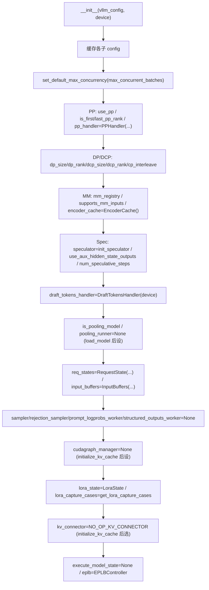
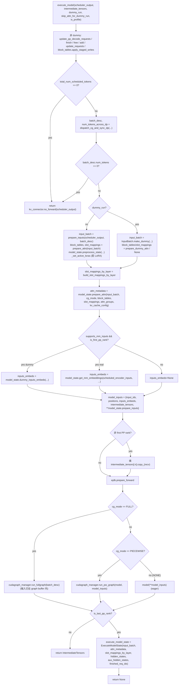

[← Wiki 首页](../../README.md) > [执行层](../README.md) > [Worker](./README.md) > Model Runner V2

# Model Runner V2（vllm/v1/worker/gpu/）

源码目录：`vllm/v1/worker/gpu/`（Experimental）

> 仓库内 `vllm/v1/worker/gpu/README.md` 自述："This directory contains the new model runner which is under active development. Ping Woosuk Kwon for any changes."

## 是什么

`vllm/v1/worker/gpu/` 是 ModelRunner V2 的工作目录，目标是把 V1 的 7689 行 `gpu_model_runner.py` 巨类拆成按职责分目录的小模块，**只有"每个模型都共享的最小代码"留在 `model_runner.py`**（文件头 docstring 明确："Be paranoid about changing this file. It should remain stable."）。

入口仍是 `GPUModelRunner(LoRAModelRunnerMixin)` (`gpu/model_runner.py:120`)，但把"模型相关态"、"采样"、"投机解码"、"多模态"、"pooling"、"cudagraph"、"注意力元数据构建"、"输入批次"等分别下沉到独立子模块，由 `GPUModelRunner` 持有为成员。

`gpu_worker.py` 通过 `use_v2_model_runner = vllm_config.use_v2_model_runner` 在 `init_device` 末尾选择 V1 还是 V2 (`gpu_worker.py:384`)。CPU/XPU 也各自有 V2 入口（`cpu/model_runner.py`、`xpu_model_runner.py:XPUModelRunnerV2`）。

## 为什么

- **可维护性**：V1 单文件难以扩展；V2 按"模型无关/模型相关/采样/投机/MM/Pooling/通信"切分，新增特性只动一个子包。
- **模型相关代码隔离**：`model_states/` 把"不同模型（encoder-decoder / mamba-hybrid / mm-pruning / default）"的差异封进 `ModelState` 子类，`model_runner.py` 本身只调 `self.model_state.prepare_inputs/prepare_attn/get_mm_embeddings`。
- **cudagraph 单独管理**：`cudagraph_utils.py:ModelCudaGraphManager` 集中 full/piecewise/breakable 三种模式的捕获与重放，runner 只看 `batch_desc.cg_mode`。
- **DP 协调独立**：`dp_utils.py:dispatch_cg_and_sync_dp` 把 DP rank 间的 cg_mode 对齐与 padding 隔离。
- **统一异步输出**：`async_utils.py:AsyncOutput/AsyncPoolingOutput` 把 V1 散落各处的 copy_stream 输出物化集中。

## 怎么做

### 子包布局

```
vllm/v1/worker/gpu/
├── model_runner.py            (1608 行) GPUModelRunner 主体（最小集）
├── model_states/              模型相关状态与差异
│   ├── interface.py           ModelState ABC + ModelSpecificAttnMetadata
│   ├── default.py             DefaultModelState
│   ├── encoder_decoder.py     EncoderDecoderModelState
│   ├── mamba_hybrid.py        Mamba-Hybrid 模型
│   ├── mm_pruning.py          多模态裁剪模型
├── sample/                    采样子模块
│   ├── sampler.py             Sampler
│   ├── output.py              SamplerOutput
│   ├── prompt_logprob.py      PromptLogprobsWorker
│   ├── states.py              采样相关态
│   ├── logit_bias.py / min_p.py / penalties.py / bad_words.py / gumbel.py / logprob.py
├── spec_decode/               投机解码
│   ├── speculator.py          DraftModelSpeculator
│   ├── rejection_sampler.py
│   ├── eagle/ dflash/ dspark/ gemma4/ mtp/ autoregressive/   各 drafter 实现
│   └── utils.py               DraftTokensHandler
├── mm/                        多模态
│   ├── encoder_cache.py       EncoderCache
│   ├── encoder_runner.py      EncoderRunner
│   ├── lora.py                set_active_mm_loras
│   └── rope.py
├── pool/                      Pooling 模型
│   ├── pooling_runner.py      PoolingRunner
│   └── late_interaction_runner.py
├── cudagraph_utils.py         CudaGraphManager / ModelCudaGraphManager / BatchExecutionDescriptor
├── dp_utils.py                dispatch_cg_and_sync_dp / sync_cudagraph_and_dp_padding
├── pp_utils.py                PPHandler（采样结果跨 PP stage 广播/延迟接收）
├── eplb_utils.py              EPLBController + step_eplb_after 装饰器
├── kv_connector.py            KVConnector / ActiveKVConnector / NO_OP_KV_CONNECTOR
├── lora_utils.py              LoraState / get_lora_capture_cases / create_lora_capture_hook
├── input_batch.py             InputBatch / InputBuffers / combine_sampled_and_draft_tokens ...
├── block_table.py             BlockTables
├── attn_utils.py              get_kv_cache_spec / init_attn_backend / build_slot_mappings_by_layer
├── buffer_utils.py            UvaBuffer / UvaBufferPool / StagedWriteTensor / async_copy_to_gpu / set_default_max_concurrency
├── cp_utils.py                prepare_dcp_local_seq_lens
├── structured_outputs.py      StructuredOutputsWorker（grammar bitmask）
├── states.py                  RequestState（per-request 持久态，UVA-backed）
├── async_utils.py             AsyncOutput / AsyncPoolingOutput / stream ctx
├── warmup.py                  run_mixed_prefill_decode_warmup / warmup_kernels
├── shutdown.py                free_before_shutdown
└── metrics/                   logits.py 等
```

### GPUModelRunner 构造（`gpu/model_runner.py:121`）



### load_model（`gpu/model_runner.py:273`）

- `eplb.prepare_load()` → `get_model_loader(load_config).load_model(...)`。
- LoRA：`load_lora_model(...)`（mixin）。
- EAGLE3 aux hidden state layers 设置。
- `DraftModelSpeculator.load_model(model)` + `eplb.maybe_register_speculator`。
- `model_memory_usage` 记量。
- `prepare_communication_buffer_for_model(model)` + speculator model。
- `init_model_state(...)` 反射出具体 `ModelState` 子类（按 `is_encoder_decoder` / mamba / mm_pruning 选）。
- `decode_query_len = num_speculative_steps + num_new_sampled_tokens_per_step`。
- 在 last PP rank 构造 `Sampler` / `RejectionSampler`（或 custom_sampler） / `PromptLogprobsWorker` / `StructuredOutputsWorker`。
- pooling 模型构造 `PoolingRunner(model)`。
- 非 first PP rank 构造 `intermediate_tensors`（最大 size，便于 cudagraph 切片复用）。

### initialize_kv_cache（`gpu/model_runner.py:399`）

- `block_table_max_model_len`：encoder-decoder 时取 `max(model_len, max_num_encoder_input_tokens, max_source_positions)`。
- 对每个 group 计算 `block_size`、`max_num_blocks`（按 DCP `block_size*cp_size` 折算、128 对齐、MambaSpec 加 spec blocks）。
- `init_attn_backend(...)` → `attn_groups`、`AttentionCGSupportInfo`、`kernel_block_sizes`。
- `BlockTables(block_sizes, max_num_reqs, max_num_batched_tokens, max_num_blocks_per_group, cp_size, cp_rank, cp_interleave)`。
- `initialize_mamba_ssu_backend`。
- `compilation_config.resolve_cudagraph_mode_and_sizes(...)` → `cudagraph_mode`。
- `ModelCudaGraphManager(vllm_config, device, cudagraph_mode, decode_query_len, lora_capture_cases)`；speculator 也 `init_cudagraph_manager`。
- `check_attention_cp_compatibility`。
- `init_kv_cache(kv_caches, static_forward_context, kv_cache_config, attn_groups, device, cache_dtype, kernel_block_sizes, vllm_config)`。
- `kv_connector = get_kv_connector(vllm_config, kv_caches_dict)`。
- `_init_kv_zero_meta()` 由 Worker 显式触发。

### execute_model（`gpu/model_runner.py:1113`）



与 V1 相比的关键差异：

- `model_state` 把 prepare_inputs/prepare_attn/preprocess_state/dummy_inputs_embeds/get_mm_embeddings 全部代理出去。
- DP 同步用 `dispatch_cg_and_sync_dp`（不在 runner 主流程内做手工 all_reduce）。
- cudagraph 三态全在 `cudagraph_manager`：`run_fullgraph` / `run_pw_graph` / eager。
- 不再手工维护 `_update_states` 巨函数，state diff 由 `RequestState` + `InputBatch` + `BlockTables` 各自 staged write 管理（`add_requests`/`update_requests`/`free_states`/`finish_requests`/`update_pp_decode_requests`）。

### sample_tokens（`gpu/model_runner.py:1357`）

带 `@step_eplb_after` 装饰。从 `execute_model_state` 取出 `input_batch`/`attn_metadata`/`hidden_states`/`aux_hidden_states`，调 `sample(logits=...)`、`postprocess_sampled(...)`、`rejection_sampler`（若配置）、`speculator.propose(...)`（若配置，并 EAGLE3 aux hidden states）、`draft_tokens_handler` 处理；构造 `AsyncOutput`（或同步 `ModelRunnerOutput`）；非 last PP rank 提前 return with `kv_conn_output_only`。

### prepare_inputs / prepare_attn（`:840`/`:1021`）

- `prepare_inputs(scheduler_output, batch_desc)`：从 `RequestState` 收集 req_ids/num_scheduled_tokens/idx_mapping/positions/input_ids，构造 `InputBatch`，应用 padding，处理 spec decode draft tokens 的 expand。
- `prepare_attn(input_batch)`：调 `BlockTables` build + `build_slot_mappings_by_layer`。

### _dummy_run / capture_model / profile_run

- `_dummy_run` (`:505`)：用 `SchedulerOutput.make_empty()` 装填假请求；`maybe_dummy_run_with_lora` 包裹；`kv_connector.set_disabled(True)`；调 `execute_model(dummy_run=True)`；末尾跑 speculator propose / sampler / pooling 假跑。
- `capture_model` (`:685`)：`cudagraph_manager.capture(...)` + `encoder_cudagraph_manager.capture(...)`（若启用）。
- `profile_run` (`:648`)：临时最小 KV cache + `_dummy_run(is_profile=True)`。

### RequestState / InputBatch / BlockTables / InputBuffers

- **`states.RequestState`**：`(max_num_reqs, max_model_len, max_num_batched_tokens, num_speculative_steps, vocab_size, device)`。`all_token_ids` 用 `StagedWriteTensor(uva_instead_of_gpu=True)`（可能数 GB，故 UVA）；`prompt_len`/`prefill_len`/`total_len`/`num_computed_tokens` 等用 `UvaBackedTensor`/`StagedWriteTensor`。
- **`input_batch.InputBatch`**：dataclass，per-step 实际跑的批次快照（`req_ids`/`idx_mapping`/`num_scheduled_tokens`/`query_start_loc`/`seq_lens`/`dcp_local_seq_lens`/`input_ids`/`positions`/`is_padding` 等）。
- **`input_batch.InputBuffers`**：persistent device buffers（`input_ids`/`positions`/`is_padding`/`query_start_loc`/`seq_lens`/`dcp_local_seq_lens`）。
- **`block_table.BlockTables`**：多 group 的 block table 管理 + staged writes（`apply_staged_writes` 在 `execute_model` 头调用）。

### cudagraph_utils.py（V2 核心）

- `BatchExecutionDescriptor` (`:53`)：`(cg_mode, num_tokens, num_reqs, uniform_token_count, num_active_loras)`，dispatch key + capture key。
- `CudaGraphManager` (`:112`)：维护 `concrete_cudagraph_entries: dict[BatchExecutionDescriptor, CUDAGraphEntry]`，`_build_lora_dispatch_map` 处理 LoRA 特化捕获，`capture(...)` 由 `ModelCudaGraphManager` 实例化时驱动。
- `ModelCudaGraphManager(CudaGraphManager)` (`:428`)：实现 `capture(...)` / `run_fullgraph` / `run_pw_graph`，集成 breakable cudagraph runner。
- `get_uniform_token_count(num_reqs, num_toks, max_query)`：判断是否均匀 decode（决定是否能用 FULL graph）。

### pp_utils.py / dp_utils.py

- `PPHandler`：在 side stream 上 broadcast/recv sampled tokens，`get_prev_sampled_outputs` 在 `pp_size` 步后消费；`compute_need_sampled_mask` 只对需要的请求广播。
- `dispatch_cg_and_sync_dp`：dp_size==1 直接 `cudagraph_manager.dispatch`；否则 `sync_cudagraph_and_dp_padding` 做 all_reduce 取 min cg_mode（任一 eager 则全 eager）、max num_tokens、uniform_token_count 一致性。

### eplb_utils.py

- `EPLBController`：包装 `EplbState`；`prepare_load` / `step` / `maybe_register_model` / `maybe_register_speculator` / `maybe_start_async_loop`。`step_eplb_after` 装饰器装饰 `execute_model`/`sample_tokens`/`_dummy_run`，结束后自动 `eplb.step`。

### lora_utils.py / kv_connector.py / structured_outputs.py

- `LoraState` + `get_lora_capture_cases` + `get_num_active_loras_for_dispatch` + `create_lora_capture_hook`：把 V1 `LoRAModelRunnerMixin` 的复杂逻辑简化为状态对象 + 工厂函数。
- `KVConnector`/`ActiveKVConnector`/`NO_OP_KV_CONNECTOR`：把 KV connector 的 `pre_forward`/`post_forward`/`no_forward`/`set_disabled` 封装成对象，runner 调用清晰。
- `StructuredOutputsWorker`：在独立 copy_stream 上把 grammar bitmask + logits_indices 拷 GPU，再跑 triton `_apply_grammar_bitmask_kernel`。

### async_utils.py

`AsyncOutput`/`AsyncPoolingOutput` 在 copy_stream 上 async copy `sampled_token_ids`/`logprobs_tensors`/`num_nans`/`num_sampled_tokens`/`pooler_output` 到 CPU，`copy_event(blocking=True)` 防止 busy-polling CUDA driver lock。`.get_output()` sync 后物化为 Python list。

### warmup.py

`run_mixed_prefill_decode_warmup`：构造混合 prefill+decode 的假 step 跑过 `worker_execute_model`/`worker_sample_tokens`，让 cudagraph 覆盖混合 batch。`warmup_kernels` 由 `gpu/warmup.py` 暴露给 `gpu_worker.compile_or_warm_up_model` V2 分支调用。

## 与 V1 的区别

| 维度 | V1 (`gpu_model_runner.py`) | V2 (`gpu/model_runner.py`) |
|---|---|---|
| 文件结构 | 单文件 7689 行 | 子包拆分，主文件 1608 行 |
| 模型差异 | runner 内 `if is_encoder_decoder / is_mamba_hybrid / ...` 分支 | `model_states/` 下独立 `ModelState` 子类 |
| 状态管理 | `GPUInputBatch` 长 dataclass，`_update_states` 巨函数 | `RequestState`(持久) + `InputBatch`(per-step) + `BlockTables`(staged write) 分离 |
| 异步输出 | `AsyncGPUModelRunnerOutput` 在 runner 内 | `async_utils.AsyncOutput` 独立模块 |
| cudagraph | `cudagraph_dispatcher` + `CUDAGraphWrapper` 外部 | `cudagraph_utils.ModelCudaGraphManager` 内嵌，三态统一 |
| DP 协调 | runner 主流程内手工 all_reduce | `dp_utils.dispatch_cg_and_sync_dp` 独立函数 |
| KV connector | mixin `maybe_get_kv_connector_output` ctx | `kv_connector.KVConnector` 对象（NO_OP 默认） |
| LoRA | mixin `maybe_dummy_run_with_lora` 等 | `lora_utils.LoraState` + 工厂函数 |
| Spec decode | `propose_draft_token_ids` 内联 | `spec_decode/` 子包多 drafter 实现 |
| Sampling | `_sample` + `_bookkeeping_sync` 内联 | `sample/` 子包 + `async_utils` |
| 注释约束 | 较宽松 | 主文件 docstring 严格限制"只放所有模型共享代码" |
| 稳定性 | 主线 | Experimental，仍频繁重构 |

## 与其它模块/系统配合

- [GPU Worker](gpu-worker.md)：`use_v2_model_runner` 开关，V2 由 `init_device` 末尾实例化；`compile_or_warm_up_model` 走 `warmup_kernels`。
- [GPU Model Runner V1](gpu-model-runner.md)：V2 共存，部分方法（`reload_weights`/`update_config`/`profile_cudagraph_memory`）仍借 V1 辅助（见 `model_runner.py:376`）。
- [LoRA Mixin](lora-mixin.md)：V2 仍继承 `LoRAModelRunnerMixin`（`gpu/lora_utils.py` 是 V2 专用辅助）。
- [KV Connector Mixin](kv-connector-mixin.md)：V2 不再用 mixin，改用 `kv_connector.KVConnector` 对象。
- [cudagraph 捕获/重放](cudagraph-capture.md)：V2 用 `ModelCudaGraphManager`，但底层 `CUDAGraphWrapper`/`BreakableCUDAGraphWrapper` 共享。
- [UBatching](ubatching.md)：V2 通过 `BatchExecutionDescriptor` 支持微批，但具体微批执行细节仍在 `gpu_ubatch_wrapper.py`。
- [注意力后端](../../05-attention/README.md)：`attn_utils.init_attn_backend` + `attn_groups` + `model_state.prepare_attn`。
- [采样与解码](../../06-sampling-decoding/README.md)：`sample/sampler.py` + `spec_decode/`。
- [编译子系统](../../09-compilation-ir/README.md)：`resolve_cudagraph_mode_and_sizes` + `ModelCudaGraphManager`。
- [分布式](../../07-distributed/README.md)：`pp_utils.PPHandler`、`dp_utils`、`eplb_utils`。
- [多模态](../../11-multimodal/README.md)：`mm/encoder_cache.py`/`encoder_runner.py`、`model_states/mm_pruning.py`。
- [平台](../../08-platforms/README.md)：`buffer_utils.UvaBuffer`/`UvaBufferPool`/`StagedWriteTensor` 依赖 platform UVA 能力。

## 历史版本演进

- **v0.11.x（实验）**：`vllm/v1/worker/gpu/` 子包首次出现，仅作为 V1 的轻量拆分实验；`gpu/README.md` 标 "Experimental"。
- **v0.12.0**：`model_runner.py` 主体成型（1608 行），`model_states/`/`sample/`/`spec_decode/`/`mm/`/`pool/` 子包铺开；`use_v2_model_runner` 开关接入。
- **main**：`RequestState` / `InputBatch` / `BlockTables` staged write 取代 V1 `_update_states`；`KVConnector` 对象化；`LoraState` + `get_lora_capture_cases` 接入；`warmup_kernels` 接入 `gpu_worker`；持续把 V1 单文件逻辑迁移至子包。具体路线由 Woosuk Kwon 主导，未公开完整迁移时间表 `(待补充)`。

[← 返回执行层首页](../README.md)

## 参见

- [GPU Model Runner V1](gpu-model-runner.md)
- [GPU Worker](gpu-worker.md)
- [cudagraph 捕获/重放](cudagraph-capture.md)
- [UBatching](ubatching.md)
- [LoRA Mixin](lora-mixin.md)
- [KV Connector Mixin](kv-connector-mixin.md)
- [注意力后端](../../05-attention/README.md)
