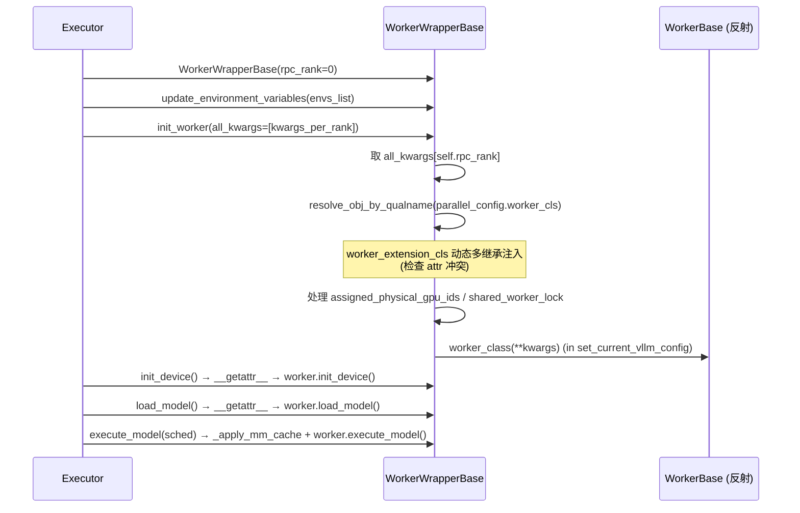

[← Wiki 首页](../../README.md) > [执行层](../README.md) > [Worker](./README.md) > Worker Base

# WorkerBase / WorkerWrapperBase（worker_base.py）

源码：`vllm/v1/worker/worker_base.py`（358 行）

## 是什么

定义两个核心抽象：

- **`WorkerBase`**：设备无关 Worker 接口。规定 `init_device` / `load_model` / `execute_model` / `sample_tokens` / `get_kv_cache_spec` / `compile_or_warm_up_model` / `sleep` / `wake_up` / `add_lora` / `check_health` / `shutdown` 等方法（多数 `raise NotImplementedError`，由具体后端重写）。
- **`WorkerWrapperBase`**：Executor 侧的"延迟初始化包装器"。**先实例化 Wrapper（仅记 `rpc_rank`），再在 `init_worker(all_kwargs)` 时反射真实 `worker_cls` 并构造 `WorkerBase` 实例**。所有未定义属性 `__getattr__` 透传到内部 `self.worker`。

`CompilationTimes = NamedTuple(language_model, encoder)` 用于上报编译耗时给 Executor。

## 为什么

- **延迟初始化**：在 Ray 后端，actor 创建时 `CUDA_VISIBLE_DEVICES` 尚未确定，必须等 placement 完成后才能构造真正的 Worker。Wrapper 把"创建"与"初始化"解耦。
- **环境变量与 worker_cls 注入**：`init_worker` 从 `parallel_config.worker_cls`（字符串全名）反射类，从 `parallel_config.worker_extension_cls` 动态多继承扩展类，把"配哪种 worker"完全交给 config。
- **多模态 SHM 接收缓存**：当 `mm_processor_cache_type='shm'` 时，`init_worker` 用 `shared_worker_lock` 构建 `mm_receiver_cache`（`MULTIMODAL_REGISTRY.worker_receiver_cache_from_config`），让子进程从 SHM 取多模态预处理结果。
- **统一控制面**：Executor 看到的永远是 `WorkerWrapperBase`，不用关心下层是 `Worker` / `CPUWorker` / `XPUWorker` / 自定义类。

## 怎么做

### WorkerBase 构造（`worker_base.py:45`）

把 `VllmConfig` 各子配置暴露为属性（`model_config`/`cache_config`/`lora_config`/`load_config`/`parallel_config`/`scheduler_config`/`device_config`/`speculative_config`/`observability_config`/`kv_transfer_config`/`compilation_config`），并：

- 缓存 `current_platform`。
- 写 `parallel_config.rank = rank`。
- 设 `vllm_config.kernel_config.ir_op_priority.set_default()` 与 `vllm.ir.set_default_torch_wrap(ir_enable_torch_wrap)`。
- `device` / `model_runner` 默认 None，子类在 `init_device` / `load_model` 中赋值。

### WorkerBase 关键方法（默认 NotImplementedError）

- `init_device()`：设置 CUDA device、初始化 `dist` 环境、取内存快照、构造 ModelRunner。由 [gpu-worker](gpu-worker.md) / [cpu-worker](cpu-worker.md) / [xpu-worker](xpu-worker.md) 重写。
- `load_model(load_dummy_weights=False)`：调 `model_runner.load_model`。
- `execute_model(scheduler_output) → ModelRunnerOutput | AsyncModelRunnerOutput | None`：返回 None 表示"已缓存状态，需调 sample_tokens"。
- `sample_tokens(grammar_output)`：紧跟 `execute_model` 返回 None 之后。
- `get_kv_cache_spec() → dict[str, KVCacheSpec]`：透传给 model_runner。
- `compile_or_warm_up_model() → CompilationTimes`：编译 + cudagraph 捕获 + warmup。
- `sleep(level) / wake_up(tags)`：睡眠/恢复（CPU 不支持，会被 worker 覆盖为 warning）。
- `apply_model(fn)` / `get_model_inspection()`：工具方法。
- `check_health()`：默认 return（同进程内崩了会抛异常）。
- `shutdown()`：默认 return。

### WorkerWrapperBase（`worker_base.py:187`）

要点：

- **`rpc_rank` vs `global_rank`**：Wrapper 自身用 `rpc_rank`（在 Executor 内的标识），可能与 TP group 的 rank 不同（SPMD 多 executor 场景全为 0）。`global_rank` 默认回退到 `rpc_rank`，`multiproc_executor` 显式传 `global_rank`。
- **`worker_extension_cls` 注入**（`:261`）：若扩展类不是 `worker_class` 的基类，先检查属性冲突（`assert not hasattr(worker_class, attr)`），再用 `worker_class.__bases__ = worker_class.__bases__ + (worker_extension_cls,)` 动态多继承；记录 `extended_calls`。
- **`shared_worker_lock` 缺失检测**：若 `mm_processor_cache_type='shm'` 但未提供 lock，直接抛错；否则 `warning_once`。
- **`__getattr__`**（`:333`）：未定义属性一律 `getattr(self.worker, attr)`，让 Wrapper 透明转发。
- **`execute_model` 重写**（`:346`）：先 `_apply_mm_cache(scheduler_output)`（把跨进程 SHM 的 mm_features 在 worker 侧就地更新），再 `worker.execute_model`。
- **`reset_mm_cache`**（`:353`）：同时清 `mm_receiver_cache` 与 `worker.reset_mm_cache()`。
- **`initialize_from_config(kv_cache_configs)`**（`:321`）：取 `kv_cache_configs[self.global_rank]`，在 `set_current_vllm_config` 下调 `worker.initialize_from_config`。
- **`init_device`**（`:327`）：包 `set_current_vllm_config` 后透传。

## 与其它模块/系统配合

- [Executor 控制面](../executor/README.md)：Holder；`collective_rpc` 的方法名都打在 Wrapper 上。
- [GPU Worker](gpu-worker.md)：默认 `worker_cls` 指向 `vllm.v1.worker.gpu_worker.Worker`。
- [CPU Worker](cpu-worker.md) / [XPU Worker](xpu-worker.md)：通过 platform 在 `VllmConfig.__post_init__` 改写 `worker_cls`。
- [多模态](../../11-multimodal/README.md)：`mm_receiver_cache` 让 mm_features 跨进程零拷贝。
- [LoRA](../../12-lora/README.md)：`add_lora`/`remove_lora`/`pin_lora`/`list_loras` 透传给 ModelRunner 的 LoRA manager。
- [配置体系](../../10-config/README.md)：`worker_cls`/`worker_extension_cls` 字符串全名 + `parallel_config` 决定具体类。

## 历史版本演进

- **v0.5–v0.6**：V0 已有 Worker 抽象，但无 Wrapper，worker 与 executor 强耦合。
- **v0.7.0**：V1 引入 `WorkerWrapperBase`，确立"先创建 Wrapper → `init_worker` 反射构造"两段式；`worker_cls` 改为字符串全名（`passing worker_cls is no longer supported`，见 `:255`）。
- **v0.8.0**：`worker_extension_cls` 动态多继承注入，支持外部插件扩展 worker 方法（不重写 worker 类）。
- **v0.9.0**：`CompilationTimes` NamedTuple 引入，把编译耗时回传给 Executor。
- **v0.10–v0.11**：`_apply_mm_cache` 在 Wrapper 层做 SHM mm_features 解析；`assigned_physical_gpu_ids` 注入（为 `RayExecutorV2` 让路）。
- **v0.12 / main**：`ir_op_priority.set_default()` 与 `set_default_torch_wrap` 在 Worker 构造时即落定；`global_rank` 与 `rpc_rank` 区分明确化。

[← 返回执行层首页](../README.md)

## 参见

- [GPU Worker](gpu-worker.md)
- [CPU Worker](cpu-worker.md)
- [XPU Worker](xpu-worker.md)
- [Executor 控制面](../executor/README.md)
- [GPU Model Runner V1](gpu-model-runner.md)
