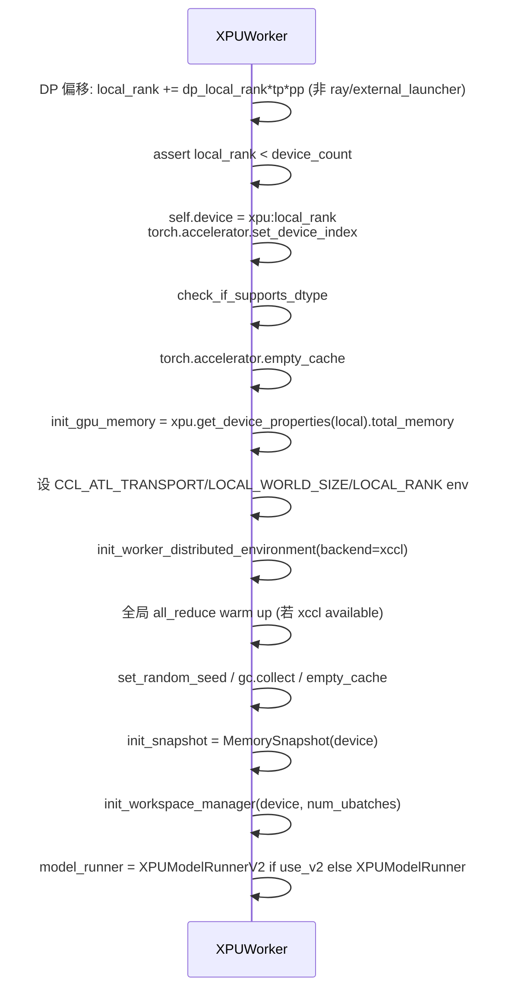

[← Wiki 首页](../../README.md) > [执行层](../README.md) > [Worker](./README.md) > XPU Worker

# XPUWorker + XPUModelRunner（Intel XPU）

源码：`vllm/v1/worker/xpu_worker.py`（181 行）+ `vllm/v1/worker/xpu_model_runner.py`（63 行）

## 是什么

Intel XPU 后端（Arc/PVC/MAX 等）通过两个轻量子类实现：

- **`XPUWorker(Worker)`** (`xpu_worker.py:24`)：继承 GPU `Worker`，重写 `init_device`、`profile`、`shutdown`。设备初始化逻辑与 GPU 类似（DP 偏移、distributed env、workspace manager、model runner 构造），但用 `torch.xpu` API 与 `ccl` backend。
- **`XPUModelRunner` / `XPUModelRunnerV2`** (`xpu_model_runner.py:16`/`:30`)：分别继承 V1 / V2 `GPUModelRunner`，在构造期用 `_torch_cuda_wrapper()` 临时把 `torch.cuda.*` 别名到 `torch.xpu.*`，使父类代码无感。

## 为什么

- **API 别名而非重写**：`torch.xpu` 提供 `Stream`/`Event`/`graph`/`XPUGraph`/`graph_pool_handle`/`current_stream` 等 CUDA 对应 API，只需把 `torch.cuda.*` 指过去即可让 V1/V2 ModelRunner 跑在 XPU。
- **`functools.partial` 防重复**：`torch._get_handlers()`（Dynamo）会断言 cuda handler 不重复，所以 `_torch_cuda_wrapper` 用 `partial(torch.xpu.current_stream)` 而非直接 `torch.xpu.current_stream`。
- **OneCCL 透传**：`CCL_ATL_TRANSPORT`/`LOCAL_WORLD_SIZE`/`LOCAL_RANK` 环境变量为 OneCCL 设置。
- **XpuMem 睡眠**：shutdown 时 `XpuMemAllocator.instance.release_pools()`（与 GPU cumem 对应）。

## 怎么做

### XPUWorker 构造（`xpu_worker.py:27`）

super 调 GPU `Worker.__init__`（不进 `init_device` 那段，因为 `device_config.device_type == "xpu"` 会让 GPU `init_device` 直接抛 `RuntimeError`）；断言 `device_type == "xpu"` 与 `current_platform.is_xpu()`。

### XPUWorker.init_device（`xpu_worker.py:42`）

### XPUWorker.profile（`xpu_worker.py:139`）

惰性构造 `TorchProfilerWrapper(activities=["CPU","XPU"])`，trace 名含 rank suffix；后调 `super().profile()`。

### XPUWorker.shutdown（`xpu_worker.py:166`）

`super().shutdown()` 后 `XpuMemAllocator.instance.release_pools()`，log rank 信息。

### XPUModelRunner / V2

`_torch_cuda_wrapper()` context（`xpu_model_runner.py:42`）临时设置：

- `torch.cuda.Stream = torch.xpu.Stream`
- `torch.cuda.default_stream`/`current_stream`/`stream`/`set_stream = partial(torch.xpu.*)`
- `torch.cuda.Event = _xpu_event`：去掉 `blocking` kwarg（`torch.xpu.Event` 不接受）。
- 若 `supports_xpu_graph()`：`torch.cuda.graph`/`CUDAGraph`/`graph_pool_handle` 也别名到 xpu。

`XPUModelRunner.__init__` 额外 `cascade_attn_enabled = False`（`(FIXME: To be verified)`，XPU cascade attn 待支持）。

## 与其它模块/系统配合

- [GPU Worker](gpu-worker.md)：父类，复用 `compile_or_warm_up_model`/`determine_available_memory`/`execute_model`/`sample_tokens`/`sleep`/`wake_up`。
- [GPU Model Runner V1](gpu-model-runner.md) / [V2](model-runner-v2.md)：父类，靠 `_torch_cuda_wrapper` 让 xpu 代码无感。
- [Executor 控制面](../executor/README.md)：`distributed_executor_backend` 可为 `mp`/`ray`/`external_launcher`；Ray 经典版会强制 `VLLM_USE_RAY_COMPILED_DAG_CHANNEL_TYPE=shm`（`ray_executor.py:74`）。
- [分布式](../../07-distributed/README.md)：`dist_backend = xccl`（OneCCL）；`torch.distributed.all_reduce(torch.zeros(1).xpu())` warm up。
- [平台](../../08-platforms/README.md)：`current_platform.is_xpu()`、`XpuMemAllocator`、`supports_xpu_graph()`。
- [UBatching](ubatching.md)：`enable_dbo` 时 `num_ubatches=2`，workspace manager 同样多缓冲。

## 历史版本演进

- **v0.5–v0.6**：V0 时代 `xpu_worker.py`/`xpu_model_runner.py` 已存在，类似 CPU 的 monkey-patch 路线。
- **v0.7.0**：V1 重构，`XPUWorker(Worker)` + V1 `XPUModelRunner(GPUModelRunner)` 落地。
- **v0.8.0**：DP 偏移逻辑接入（与 GPU 对齐）；`MemorySnapshot`/`request_memory` 接入。
- **v0.9.0**：`init_workspace_manager` + `num_ubatches`（DBO）接入；`profile` 用 rank suffix trace 名。
- **v0.10–v0.11**：`XPUModelRunnerV2` 加入（V2 入口）；`_xpu_event` 去掉 `blocking` kwarg；Ray CG channel 强制 shm。
- **v0.12 / main**：`XpuMemAllocator.release_pools` shutdown；`cascade_attn_enabled = False`（待支持）；持续跟随 V1/V2 父类演进。

[← 返回执行层首页](../README.md)

## 参见

- [GPU Worker](gpu-worker.md)
- [GPU Model Runner V1](gpu-model-runner.md)
- [Model Runner V2](model-runner-v2.md)
- [CPU Worker](cpu-worker.md)
- [Worker 基类](worker-base.md)
