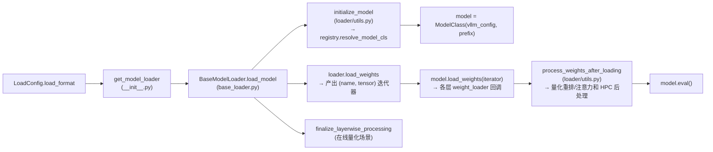

# 模型执行子系统

[← Wiki 首页](../README.md) > **模型执行**

> 源码根目录：`vllm/model_executor/`

---

## 是什么

模型执行子系统是 vLLM 把"一份磁盘上的权重文件 + 一份模型架构描述"变成"一张可在目标设备上做前向推理的 `torch.nn.Module`"的整套基础设施。它覆盖**加载 → 装配 → 算子分发 → 卸载/预热**四个阶段，是连接 [`#04 模型库`](../04-model-zoo/README.md)（架构注册表）与 [`#02 执行层`](../02-execution/README.md)（Worker/ModelRunner）之间的桥梁。

本子系统由三大块组成：

| 块 | 职责 | 源码位置 |
|---|---|---|
| **加载器**（model_loader） | 选择 load format、下载/定位权重、把权重张量喂进模型参数 | `vllm/model_executor/model_loader/` |
| **层库**（layers） | 模型所用各类 `nn.Module` 层：注意力、线性、RoPE、norm、fused MoE、量化方法等 | `vllm/model_executor/layers/` |
| **算子 & 卸载 & 预热** | 低层 GEMM/注意力/mHC 算子按平台分发、权重 CPU 卸载、启动期 kernel 自动调优 | `vllm/model_executor/kernels/`、`vllm/model_executor/offloader/`、`vllm/model_executor/warmup/` |

顶层还有几个公共文件：`parameter.py`（`BasevLLMParameter`/`PackedvLLMParameter`，量化权重参数基类）、`custom_op.py`（`CustomOp`/`PluggableLayer`，按平台分派 forward 的层基类与 OOT 替换机制）、`utils.py`（`set_weight_attrs`、`replace_parameter`、`process_weights_after_loading` 的入口位置在 loader utils）。这些是层库与加载器共同依赖的黏合层。

---

## 为什么

把"加载"从"模型定义"中抽离出来，是为了让**同一套模型架构代码**能够吃多种权重来源（HF safetensors、PT bin、预分片 TP checkpoint、tensorizer 序列化、bnb 在线量化、Run:ai 流式、ModelExpress……）而无需改模型本身。每个 loader 只负责"产出 `(name, tensor)` 迭代器"，模型层的 `weight_loader` 回调负责"把张量塞进正确参数、做 TP 切分/重排"。

把"算子选择"从"层定义"中抽离（`kernels/linear/` 的 kernel 选择器 + `layers/quantization/` 的 quant method），是为了让**同一层**（如 `RowParallelLinear`）能按平台、按量化格式、按 `--linear-backend` 用户意图，在十几个后端 kernel（CUTLASS/FlashInfer/Marlin/DeepGEMM/Triton/Humming/Aiter…）里挑出当前最快且可实现的那个，而层代码本身保持稳定。

"卸载/预热"则是 vLLM 走向大模型 + 受限显存场景的产物：UVA/prefetch offloader 让权重部分常驻 CPU；warmup 在 CUDA graph 捕获前把所有 JIT/tilelang/cutedsl kernel 提前编译，避免首请求付出编译代价。

---

## 怎么做

### 加载一条权重张量的端到端流水

### Loader 选择流程

`get_model_loader(load_config)` 以 `_LOAD_FORMAT_TO_MODEL_LOADER` 字典做一次性分派，详见 [`model-loader/dispatch.md`](model-loader/dispatch.md)。基类装配流程详见 [`model-loader/default.md`](model-loader/default.md)。

### 算子分发

`kernels/linear/__init__.py` 维护若干 `_POSSIBLE_*_KERNELS: dict[PlatformEnum, list[type]]` 优先级表，由 `choose_scaled_mm_linear_kernel` / `choose_mp_linear_kernel` / `init_*_linear_kernel` 按"平台 → 算力 → 用户 `--linear-backend` 过滤 → `is_supported` → `can_implement` → 命中即返回"的顺序选择，详见 [`kernels.md`](kernels.md)。

### 卸载/预热

- offloader 由 `create_offloader(OffloadConfig)` 在 Worker 初始化期决定，uva/prefetch/noop 三选一，详见 [`offloader.md`](offloader.md)。
- warmup 由 `v1/worker/gpu_worker.py` 在 compile + CUDA graph 捕获前调用 `kernel_warmup(worker)`，详见 [`warmup.md`](warmup.md)。

---

## 与其它模块/系统配合

| 协作方 | 关系 | 链接 |
|---|---|---|
| #04 模型库 | loader 通过 `model_config.registry.resolve_model_cls` 拿到模型类 | [`../04-model-zoo/registry.md`](../04-model-zoo/registry.md)（待补充） |
| #05 注意力 | layers 里的 `Attention` 后处理与 kernels/attention 配合 | [`../05-attention/`](../05-attention/README.md) |
| #07 分布式 | TP/PP/EP 分片权重、`sharded_state`、EP weight filter | [`../07-distributed/`](../07-distributed/README.md) |
| #08 平台 | kernels/offloader 按 `PlatformEnum`/`current_platform` 分派 | [`../08-platforms/`](../08-platforms/README.md) |
| #09 编译 | warmup 在 compile 之后、CUDA graph 捕获之前；prefetch offloader 用 custom op 与 torch.compile 兼容 | [`../09-compilation-ir/`](../09-compilation-ir/README.md) |
| #02 执行层 | Worker 调 `get_model` 拿到模型，再调 offloader/warmup | [`../02-execution/`](../02-execution/README.md) |
| #10 配置 | `LoadConfig`/`OffloadConfig`/`KernelConfig` 驱动全部行为 | [`../10-config/`](../10-config/README.md)（待补充） |

---

## 历史版本演进

| 时间锚 | 变更要点 | 触发动机 / 影响 |
|---|---|---|
| 早期（v0.3–v0.5） | 只有 `default_loader` + `tensorizer_loader`，权重装配相对朴素 | vLLM 初期仅支持 HF safetensors/bin |
| 中期（v0.6–v0.8） | 引入 `sharded_state_loader`、`bitsandbytes_loader`、`runai_streamer_loader`；`LoadConfig` 从 `ModelConfig` 拆出 | 支持 TP 预分片、在线 4bit 量化、对象存储流式加载 |
| v0.7+ | `model_loader/__init__.py` 引入 `register_model_loader` 插件机制 | 允许 out-of-tree loader 注册 |
| 近期（main） | 新增 `ep_weight_filter`（#37136）、`modelexpress_loader`（#43105）、`InstantTensor` loader（#36139）、`reload/` 层次化重载子包 | MoE EP 加载 I/O 削减、外部加载生态、RL 热重载 |
| 近期（main） | `kernels/` 从 `layers/quantization/` 之下独立出来，按 mixed_precision/mxfp4/mxfp8/nvfp4/scaled_mm 分目录 | 算子代码量膨胀后的解耦（模块注释明确"将按 provider 重组"） |
| 近期（main） | `offloader/`（UVA + prefetch）与 `warmup/`（DeepGEMM/CuTeDSL/FlashInfer autotune/DSv4 mHC）子系统化 | 大模型 CPU offload + JIT kernel 预热成一等公民 |

> 上表"近期"对应 main 分支（当前 tag 已到 v0.25）。具体 PR 号已在各子页"演进"小节给出，未能在 CHANGELOG 核实对应发行版本号的标 `(待核实)`。

---

## 导航

### 加载器（model-loader）

| 页面 | 主题 |
|---|---|
| [`model-loader/README.md`](model-loader/README.md) | 加载器总览：基类契约与所有 loader 一览 |
| [`model-loader/dispatch.md`](model-loader/dispatch.md) | `__init__.py` 的 LoadFormat → Loader 分派 + registry 对接 |
| [`model-loader/default.md`](model-loader/default.md) | `default_loader.py` + `base_loader.py`：默认权重装配 |
| [`model-loader/weight-utils.md`](model-loader/weight-utils.md) | `weight_utils.py`：HF 下载、safetensors 解析、迭代器 |
| [`model-loader/sharded-state.md`](model-loader/sharded-state.md) | `sharded_state_loader.py`：TP/PP 预分片权重 |
| [`model-loader/tensorizer.md`](model-loader/tensorizer.md) | `tensorizer_loader.py`：tensorizer 序列化加载 |
| [`model-loader/bnb.md`](model-loader/bnb.md) | `bitsandbytes_loader.py`：在线 8/4-bit 量化 |
| [`model-loader/runai.md`](model-loader/runai.md) | `runai_streamer_loader.py`：对象存储流式 |
| [`model-loader/modelexpress.md`](model-loader/modelexpress.md) | `modelexpress_loader.py`：ModelExpress 桥接 |
| [`model-loader/ep-weight-filter.md`](model-loader/ep-weight-filter.md) | `ep_weight_filter.py`：EP 专家权重过滤 |
| [`model-loader/reload.md`](model-loader/reload.md) | `reload/`：层次化热重载机制 |

### 层库（layers）—— 由 layer 子任务完成

| 页面 | 状态 |
|---|---|
| `./layers/README.md` | 由 layer 子任务完成，路径见 `./layers/README.md`（待补充） |
| `./layers/quantization/README.md` | 由 layer 子任务完成（待补充） |

> `layers/` 子树（含 `quantization/`、`attention/`、`linear/`、`fused_moe/`、`rotary/`、`normalization/` 等）由另外的 agent 负责，本子系统仅描述其与加载器/算子的边界，不写其下任何文件。

### 算子 & 卸载 & 预热（顶层）

| 页面 | 主题 |
|---|---|
| [`kernels.md`](kernels.md) | `vllm/model_executor/kernels/`：低层算子分布与按平台分发 |
| [`offloader.md`](offloader.md) | `vllm/model_executor/offloader/`：CPU offload + UVA 预取 |
| [`warmup.md`](warmup.md) | `vllm/model_executor/warmup/`：启动期 kernel 自动调优与编译预热 |

---

## 参见

- [`../02-execution/README.md`](../02-execution/README.md) —— Worker/ModelRunner 如何调用本子系统
- [`../04-model-zoo/README.md`](../04-model-zoo/README.md) —— 模型架构注册表
- [`../09-compilation-ir/README.md`](../09-compilation-ir/README.md) —— torch.compile / CUDA graph 与 warmup/offloader 的时序
