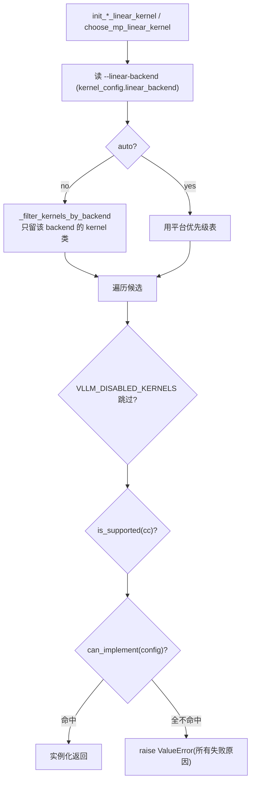

# kernels/：低层算子分布与按平台分发

[← Wiki 首页](../README.md) > [模型执行](./README.md) > **算子库**

> 源码目录：`vllm/model_executor/kernels/`

> 注意：`layers/quantization/` 下的 quant method 与本目录关系密切，但由 layer 子任务负责，本页只描述 `kernels/` 本身。

---

## 是什么

`kernels/` 是 vLLM 把"同一类线性/注意力/mHC 计算"在**多种后端 kernel** 之间做抽象与按平台分发的目录。它不是"所有手写 kernel 的堆放处"——vLLM 的大量 kernel 仍散落在 `csrc/`、`layers/`、`v1/attention/` 等处；本目录特指那些"形态可互换、需要运行期选择"的算子族。

三个子目录：

| 子目录 | 算子族 | 子结构 |
|---|---|---|
| `linear/` | 量化线性 GEMM | `base.py` + `mixed_precision/` + `mxfp4/` + `mxfp8/` + `nvfp4/` + `scaled_mm/` + `zentorch_utils.py` |
| `attention/` | 注意力相关辅助算子 | `dsa/`（DeepSeek Sparse Attention 的 DCP indexer） |
| `mhc/` | DeepSeek v4 hybrid Conv（mHC）算子 | `aiter.py`/`tilelang.py`/`torch.py`/`triton.py` |

`kernels/__init__.py` 为空（仅作包标记）。`linear/__init__.py` 是本目录最重的文件——它既是 re-export 集散地，也是 kernel 选择器实现处。

---

## 为什么

同一层（如 FP8 `RowParallelLinear`）在不同硬件/算力/量化粒度下最优 kernel 完全不同：Hopper 用 CUTLASS/FlashInfer/DeepGEMM/Marlin，Blackwell 用 NVFP4 CuteDSL/FlashInfer TRT-LLM，ROCm 用 Aiter，CPU 用 zentorch/dynamic_4bit，XPU 用 XPU 专属。把"层定义"与"kernel 选择"解耦，让：

- `layers/linear.py::RowParallelLinear` 保持稳定，不随 kernel 增删而改。
- 新增 kernel 只在 `__init__.py` 的优先级表里加一行 + `register_linear_kernel`。
- 用户用 `--linear-backend <name>` 强制选某后端，便于性能对照与绕过回归。
- `--linear-backend` 不命中时直接报错而非静默回退，尊重用户意图。

`linear/__init__.py` 顶部注释明确："upcoming PRs will remove the scaled_mm and mixed_precision subdirectories and reorganize kernels by provider"——即按 provider（aiter/cutlass/flashinfer/…）重组，目前的按 precision 分目录是过渡态。

---

## 怎么做

### linear/base.py：抽象基类

- `MMLinearKernel`（ABC）：所有"新一代"量化线性 kernel 的基类，定义 `is_supported`/`can_implement`/`get_min_capability`/`process_weights_after_loading`/`apply` 等接口。
- `MMLinearLayerConfig`：描述一个线性层的量化配置（weight/activation quant key、shape、dtype 等），作为 kernel 选择的输入。
- `Params` / `FP8Params`：从 layer 模块抽取权重的参数容器，`WEIGHT`/`WEIGHT_SCALE`/`INPUT_SCALE`/`INPUT_SCALE_UB` 等 ClassVar 必须与 quant method 的 `create_weights` 属性名对齐（`base.py:36` 注释）。

### linear/__init__.py：选择器与优先级表

维护多张 `dict[PlatformEnum, list[type]]` 优先级表（按性能从高到低），见 `linear/__init__.py:311` 起：

| 表 | 类型族 |
|---|---|
| `_POSSIBLE_INT8_KERNELS` | Int8 scaled MM |
| `_POSSIBLE_FP8_KERNELS` | FP8 per-tensor/per-channel/per-token scaled MM |
| `_POSSIBLE_FP8_BLOCK_KERNELS` | FP8 block-scaled（含 DeepGEMM/CUTLASS block） |
| `_POSSIBLE_WFP8A16_KERNELS` | weight-FP8 / activation-A16 |
| `_POSSIBLE_KERNELS` | 混合精度 WNA16（W4A16/W4A8 等）MPLinear |
| `_POSSIBLE_MXFP8_KERNELS` | MXFP8 |
| `_POSSIBLE_NVFP4_KERNELS` | NVFP4 |
| `_POSSIBLE_MXFP4_KERNELS` | MXFP4 |

每张表按 `PlatformEnum.CUDA/ROCM/CPU/XPU` 列出候选 kernel 类，顺序即优先级。

### 选择函数

- `choose_scaled_mm_linear_kernel`（`linear/__init__.py:504`）：通用选择器，支持 `force_kernel` 覆盖。
- `init_fp8_linear_kernel`（`:576`）：按 activation scale 的 group_shape 是否 per-group 选 block 表或 per-tensor 表。
- `init_int8_linear_kernel`（`:649`）、`init_mxfp8_linear_kernel`（`:758`）、`init_mxfp4_linear_kernel`（`:804`）、`init_nvfp4_linear_kernel`（`:879`）、`init_wfp8_a16_linear_kernel`（`:844`）。
- `choose_mp_linear_kernel`（`:685`）：WNA16 混合精度专用，额外用 `get_min_capability` 按 compute capability 过滤。
- `register_linear_kernel`（`:983`）：把新 kernel 类追加到指定平台/类型表，供 out-of-tree 注册。

### `--linear-backend` 过滤

`_LINEAR_BACKEND_KERNEL_MAP`（`:213`）把 backend 名映射到 kernel 类集合：`cutlass`/`flashinfer_cutlass`/`flashinfer_cutedsl`/`flashinfer_trtllm`/`flashinfer_cudnn`/`flashinfer_b12x`/`humming`/`marlin`/`triton`/`deep_gemm`/`torch`/`aiter`/`machete`/`fbgemm`/`conch`/`exllama`/`emulation`/`xpu`/`xpu_woq`。`_filter_kernels_by_backend` 用它把平台表收敛到该 backend 子集；空集直接报错。

### NVFP4 的特殊选择

`init_nvfp4_linear_kernel` 有两条覆盖路径：

- `VLLM_BATCH_INVARIANT` 为真：强制 `CutlassNvFp4LinearKernel`（batch-invariant 确定性），不支持则退 `EmulationNvFp4LinearKernel`，忽略 `--linear-backend`。
- `use_a16=True`（weight-only 量化）+ auto：强制 `MarlinNvFp4LinearKernel`。

### 子目录详情

#### mixed_precision/

W4A16/W4A8 等"权重低比特、激活高精度"的 MPLinear kernel。`MPLinearKernel` 基类在 `MPLinearKernel.py`。按 provider 实现的 backends：`marlin`/`machete`/`allspark`/`conch`/`exllama`/`cutlass`（W4A8）/`triton_w4a16`/`humming`/`rdna3_w4a16`/`dynamic_4bit`/`cpu`/`xpu`/`zentorch`。每个实现 `is_supported`/`can_implement`/`get_min_capability`/`process_weights_after_loading`/`apply`。

#### scaled_mm/

FP8/Int8 scaled MM kernel（per-tensor/per-channel/per-token/block-scaled）。`ScaledMMLinearKernel`/`Fp8BlockScaledMMLinearKernel`/`Int8ScaledMMLinearKernel` 基类。backends：`cutlass`/`flashinfer`/`marlin`/`pytorch`（per-tensor/channel/row-wise torch）/`triton`/`deep_gemm`/`aiter`/`rocm`/`cpu`/`xpu`/`zentorch`/`humming`。

#### mxfp8/、nvfp4/、mxfp4/

Microscaling FP8/FP4 kernel。每子目录一个 `base.py`（基类与 LayerConfig）+ 按 provider 实现。例如 `mxfp8/` 含 `flashinfer`（cutedsl+cutlass）、`marlin`、`rocm_native`、`humming`、`xpu`、`emulation`。`nvfp4/` 含 `cutlass`/`flashinfer`（cutedsl/cutlass/trtllm/cudnn/b12x）/`fbgemm`/`marlin`/`humming`/`emulation`。

#### attention/dsa/

DeepSeek Sparse Attention 的 `dcp_indexer_cutedsl.py`——DCP（Dynamic Contextual Partitioning）indexer 的 CuTeDSL 实现。`attention/__init__.py` 几乎为空。`kernels/attention/` 整体偏薄，因为大多数注意力后端 kernel 在 `v1/attention/backends/` 与 `csrc/attention/`，不在本目录（见 `#05 注意力`）。

#### mhc/

DeepSeek v4 的 hybrid Conv（mHC，multi-head hybrid convolution）算子，每个 decoder 层每 token 跑 `hc_pre`/`hc_post`/`hc_head_op`。按 provider 有四套实现：`torch.py`（参考）、`triton.py`、`tilelang.py`/`tilelang_kernels.py`、`aiter.py`。`mhc/__init__.py` 统一 re-export `mhc_pre_*`/`mhc_post_*`/`mhc_fused_post_pre_*`/`hc_head_fused_*` 四族 × 四 provider。这些 kernel 的 JIT 预热见 [`warmup.md`](warmup.md)。

### zentorch_utils.py

CPU zentorch 相关辅助（与 `scaled_mm/zentorch.py`/`mixed_precision/zentorch.py` 配合）。

---

## 与其它模块/系统配合

| 协作方 | 关系 |
|---|---|
| `layers/quantization/` | quant method 的 `create_weights` 决定参数布局，`process_weights_after_loading` 调 kernel 的重排；本目录 kernel 由 quant method 或 linear layer init 时选择 |
| `layers/linear.py` | `LinearBase`/`UnquantizedLinearMethod`/各 quant linear method 在 `create_weights`/`apply` 调用选中的 kernel |
| `vllm/platforms` | `current_platform._enum` 决定查哪张平台表；`get_device_capability` 提供 compute capability |
| `config/kernel_config.py` | `linear_backend`、`enable_flashinfer_autotune`、`enable_cutedsl_warmup` 等 |
| `vllm/envs` | `VLLM_DISABLED_KERNELS`（按类名禁用）、`VLLM_BATCH_INVARIANT`、`VLLM_USE_DEEP_GEMM` |
| `#08 平台` | PlatformEnum 定义见 [`../08-platforms/`](../08-platforms/README.md) |
| `#05 注意力` | attention kernel 分布在 `v1/attention/`，本目录仅含 DSA 辅助 |
| warmup | DeepGEMM/mHC/CuTeDSL kernel 的 JIT 预热见 [`warmup.md`](warmup.md) |

---

## 历史版本演进

| 时间锚 | 变更要点 |
|---|---|
| 中期 | `layers/quantization/` 下出现 `compressed_tensors/`/`fp8.py` 等含 kernel 选择逻辑 |
| 近期（main） | `kernels/` 从 `layers/quantization/` 之下独立为 `model_executor/kernels/`，按 precision 分目录 |
| main（#46393） | `FlashInferCutedslMxfp8LinearKernel` 加入 mxfp8 |
| main（#43645） | XPU W8A8 FP8 multi-granularity kernel |
| main（#41652） | humming moe backend 加入所有 dense/moe oracle |
| main | `--linear-backend` 与 `_LINEAR_BACKEND_KERNEL_MAP` 引入，统一按 backend 过滤 |
| main（计划中） | 注释明示将按 provider 重组，移除 scaled_mm/mixed_precision 子目录 |

> 具体发行版本号（v0.5–v0.12）对应关系 `(待核实)`；上述以 PR 号为准。

---

## 参见

- [`./layers/README.md`](./layers/README.md)（待补充） —— 层库与 quant method
- [`warmup.md`](warmup.md) —— kernel 预热
- [`../08-platforms/`](../08-platforms/README.md) —— 平台枚举
- [`../README.md`](../README.md) —— 返回模型执行首页
