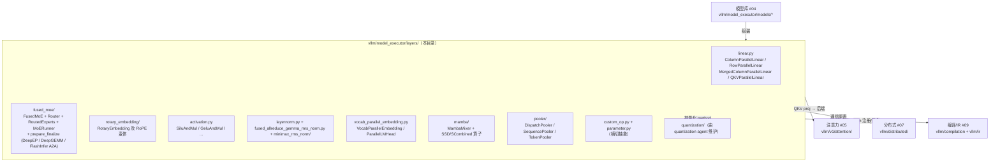

# 层库（Layers）

[← Wiki 首页](../../README.md) > [模型执行](../README.md) > 层库

本目录系统性地拆解 `vllm/model_executor/layers/`（不含 `quantization/` 子树）提供的一系列可复用 `torch.nn.Module`。这些层是 vLLM 拼装所有模型架构的"原子积木"，由 [`04-model-zoo`](../../04-model-zoo/README.md) 中 ~280 个模型实现复用，并通过 [`05-attention`](../../05-attention/README.md)、[`07-distributed`](../../07-distributed/README.md)、[`09-compilation-ir`](../../09-compilation-ir/README.md) 与硬件/分布式/编译子系统协作完成实际计算。

> 备注：本 Wiki 由层库 sub-agent 维护，**只覆盖非 quantization 部分**；`layers/quantization/` 子树另由专门的 quantization sub-agent 撰写，参见 [`./quantization/README.md`](./quantization/README.md)（占位链接，由 quantization agent 产出）。

## 是什么

层库（Layers）是 vLLM 在 `torch.nn.Module` 之上封装的一组工程化算子层，提供以下共性能力：

- **张量并行（TP）感知**：线性层与嵌入层内置列并行/行并行切分，权重加载时自行 `narrow` 到当前 rank。
- **量化方法注入**：通过 `LinearBase.quant_method` / `FusedMoE.quant_method` 把量化/反量化策略注入到 forward，由 `QuantizationConfig.get_quant_method(layer, prefix=...)` 在层实例化时分发。
- **自定义算子切换**：每个算子层要么继承 `CustomOp`（按平台 dispatch `forward_cuda/forward_hip/...`），要么继承 `PluggableLayer`（支持 out-of-tree 替换整层）。
- **权重加载规范化**：通过 `BasevLLMParameter` 体系（见 [parameter.md](parameter.md)）将"切分、解包、缩放"等逻辑下沉到 Parameter 上，使层实现保持简洁。
- **Custom Op / 编译可融合**：所有热点层均通过 `direct_register_custom_op` 或 `CustomOp` 注册，可作为 `torch.compile` 黑盒算子；同时部分层（如 RMSNorm、SiluAndMul）的 `forward_native` 会被 Inductor Pass 内联融合（见 [custom-op.md](custom-op.md)）。

## 为什么

抽象出独立层库的动机主要有四点：

1. **统一权重的 TP 加载**：早期 vLLM 每个模型实现都重复写"按 tp_rank 切权重"的样板；统一到 `ColumnParallelLinear` 等基类后，模型代码只描述几何（`output_sizes`、`head_size`）而无需关心切片细节。
2. **量化方式与计算路径解耦**：同一个 `LinearBase` 可以挂 `UnquantizedLinearMethod`、`Fp8LinearMethod`、`GPTQMarlinLinearMethod`……，模型实现无需为每种量化方案写一份新的 forward，只要在 `__init__` 里把 `quant_config` 透传过来即可。
3. **跨平台内核可插拔**：CUDA / ROCm / XPU / CPU / TPU / OOT 共用同一组高层语义，但底层内核不同。`CustomOp.dispatch_forward` 在实例化期就把 `forward_*` 方法指针绑死，避免运行期分支开销。
4. **与 torch.compile / cudagraph 协同**：所有热路径都注册为不透明 custom op 或可被 IR 优化的 `forward_native`，从而可以在编译期与运行期之间无缝切换。

## 怎么做

层库的总体组织见下图。模型 `__init__` 阶段由各模型实现按需 `import` 单个层，并把这些层组合成 transformer block；运行期 forward 则由 `ModelRunner` 在 cudagraph 捕获/重放上下文中调用。

## 与其它模块/系统配合

| 配合方 | 关系 |
|---|---|
| [`04-model-zoo`](../../04-model-zoo/README.md) | 模型实现直接 `from vllm.model_executor.layers.linear import ColumnParallelLinear` 等拼装 transformer block；模型文档里出现的 `qkv_proj`、`gate_up_proj`、`o_proj`、`down_proj` 等都来自 [linear.md](linear.md)。 |
| [`05-attention`](../../05-attention/README.md) | `QKVParallelLinear` 的切分方式与 attention 后端的 head 分配严格对齐；Mamba/SSM 块则通过 `AttentionLayerBase` 抽象与 KV 缓存 spec 衔接（见 [mamba-ssm.md](mamba-ssm.md)）。 |
| [`07-distributed`](../../07-distributed/README.md) | `tensor_model_parallel_all_reduce/all_gather` 直接消费 `ColumnParallelLinear.gather_output`/`RowParallelLinear.reduce_results` 标志；FusedMoE 的 EP/DeepEP 路径调用 `get_ep_group()`。 |
| [`09-compilation-ir`](../../09-compilation-ir/README.md) | CustomOp/PluggableLayer 通过 `op_registry` 与 `compilation_config.custom_ops` 互动；RMSNorm 等 `forward_native` 由 IR ops 内联（见 [custom-op.md](custom-op.md)、[norm.md](norm.md)）。 |
| [`12-LoRA`](../../12-lora/README.md) | `VocabParallelEmbedding` 的"base + LoRA-added"权重布局、`MergedColumnParallelLinear` 的 partition 概念都为 LoRA 留好钩子；`LinearBase.quant_method.is_lora_enabled` 等标志用于切换 LoRA 路径。 |
| [Samplers（#06）](../../06-sampling-decoding/README.md) | `LogitsProcessor` 与 `ParallelLMHead` 直接为 [sampler-layer.md](sampler-layer.md) 中的 `Sampler` 提供输入；[rejection-sampler-layer.md](rejection-sampler-layer.md) 接管投机解码采样。 |
| [量化子目录](./quantization/README.md) | `LinearBase.quant_method` / `VocabParallelEmbedding.quant_method` / `FusedMoE.quant_method` 在实例化时由 `QuantizationConfig.get_quant_method` 注入；详见 quantization agent 输出。 |

## 历史版本演进

层库随 vLLM 主线持续重构，关键里程碑（部分版本号标记为 `(待核实)` 表示由 commit 推断）：

- **v0.5–v0.6**：`ColumnParallelLinear` / `RowParallelLinear` 基本成形，`VocabParallelEmbedding` 引入"base + padding + LoRA-added + padding"四段布局。
- **v0.6**：`FusedMoE` 首次落地（`Mixtral`）——`fused_experts` 单体 Triton 内核 + per-channel 量化。
- **v0.6–v0.7**：`RotaryEmbedding` 拆分为 `base + scaling 子类`，引入 `yarn` / `dynamic_ntk` / `linear` 缩放。
- **v0.7–v0.8**：`CustomOp` 抽象引入；`SiluAndMul`、`RMSNorm` 迁移过来，并首次与 `torch.compile` 协同。
- **v0.8–v0.9**：`FusedMoE` 拆出 `RoutedExperts` / `MoERunner` 内部结构，开始支持 EP（`fused_moe/prepare_finalize/`）。
- **v0.9–v0.10**：DeepEP / DeepGEMM 路径接入，`FusedMoE` 引入 `moe_forward` 不透明 custom op；`MRotaryEmbedding`（多模态 RoPE）落地。
- **v0.10–v0.11**：`PluggableLayer`（PR #32744，`[PluggableLayer][1/N] Define PluggableLayer`）将 `LinearBase`/`VocabParallelEmbedding`/`MambaMixer` 等从 `CustomOp` 解耦，形成"全层 OOT 替换 vs. 平台 dispatch"两条路径。`weight_loader_v2` 在 `ColumnParallelLinear`/`RowParallelLinear` 上启用，把权重加载逻辑下沉到 `BasevLLMParameter`。
- **v0.10+**：`Sampler` 从 v0 引擎迁入 `vllm/v1/sample/`；`RejectionSampler` 重写以支持 v1 spec decode。
- **v0.11–v0.12**：`FusedMoEConfig` / `MoEKernel`（modular）重构；`MoERunner`（PR #41184，`[MoE Refactor] FusedMoE/MoERunner inversion refactor`）成为统一入口，`FusedMoE(...)` 工厂返回 `MoERunner`。
- **v0.12–v0.25（main）**：DeepEP v2、FlashInfer A2A、NIXL EP、AITER 等多条 EP 后端并行演进；`mamba_mixer2`、`fla/`、`minimax_rms_norm/` 等新模型专用层引入；`RMSNorm` 的 `forward_native` 改走 `vllm.ir.ops.rms_norm`，与 IR priority 联动。

详细演进见各模块页"历史版本演进"小节。

## 文档导航

| 文档 | 简介 |
|---|---|
| [README.md](README.md) | 本页（层库首页） |
| [linear.md](linear.md) | `linear.py`：TP 线性层家族（Column/Row/Merged/QKV/Replicated） |
| [fused-moe.md](fused-moe.md) | `fused_moe/`：`FusedMoE` 工厂 + Router + RoutedExperts + MoERunner + DeepEP/DeepGEMM 等 EP 内核 |
| [rotary.md](rotary.md) | `rotary_embedding/`：RoPE 基类与 phone/longrope/yarn/mrope/xdrope 等变体 |
| [activation.md](activation.md) | `activation.py`：`SiluAndMul` / `GeluAndMul` / `SwigluOAIAndMul` 等门控激活 |
| [norm.md](norm.md) | `layernorm.py` / `fused_allreduce_gemma_rms_norm.py` / `minimax_rms_norm/`：RMSNorm 及其融合变体 |
| [embedding.md](embedding.md) | `vocab_parallel_embedding.py`：`VocabParallelEmbedding` / `ParallelLMHead` |
| [sampler-layer.md](sampler-layer.md) | `vllm/v1/sample/sampler.py` + `metadata.py`：v1 采样层与采样元数据 |
| [pooler.md](pooler.md) | `pooler/`：序列/Token 池化与分类头（DispatchPooler / SequencePooler / TokenPooler / BgeM3Pooler 等） |
| [rejection-sampler-layer.md](rejection-sampler-layer.md) | `vllm/v1/sample/rejection_sampler.py`：投机解码拒绝采样（含 synthetic / mps / sync 等路径） |
| [mamba-ssm.md](mamba-ssm.md) | `mamba/`：`MambaMixer` / `MambaMixer2` / SSD/SCombined/SSU 等状态空间算子 |
| [custom-op.md](custom-op.md) | `vllm/model_executor/custom_op.py`：`CustomOp` / `PluggableLayer` + `op_registry` + OOT 替换 |
| [parameter.md](parameter.md) | `vllm/model_executor/parameter.py`：`BasevLLMParameter` 体系与 `weight_loader_v2` |
| [`./quantization/README.md`](./quantization/README.md) | 量化子树（由 quantization sub-agent 维护，占位链接） |

[← 返回模型执行首页](../README.md)
