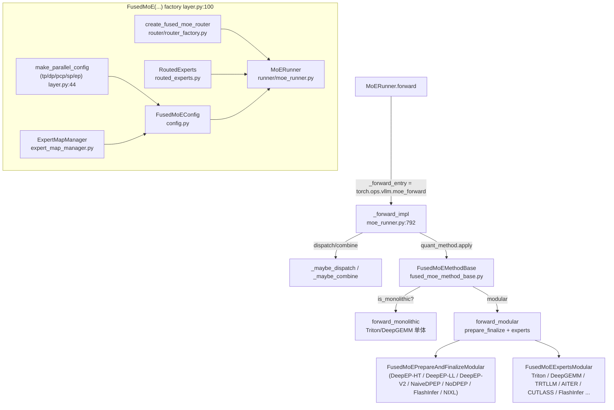
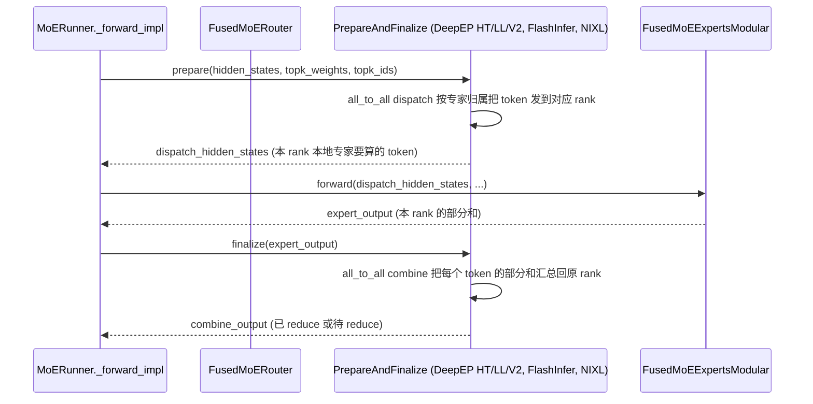

# 融合 MoE（fused_moe/）

[← Wiki 首页](../../README.md) > [模型执行](../../README.md) > [层库](../README.md) > 融合 MoE

`vllm/model_executor/layers/fused_moe/` 是 vLLM 中规模最大的子层模块（~30 个 Python 文件、~12K 行代码），承担全部 Mixture-of-Experts 模型的前向执行：从 router logits 到 top-k 路由、再到专家分组 GEMM、最后跨 rank 的 dispatch/combine。它支持 TP、EP（含 DeepEP / DeepGEMM / FlashInfer A2A / NIXL / naive DP-EP）、PCP（pipeline context parallel）、SP（sequence parallel）、EPLB 等多种并行拓扑。

## 是什么

顶层入口是工厂函数 `FusedMoE(...)`（`vllm/model_executor/layers/fused_moe/layer.py:100`），它返回一个 `MoERunner` 实例。模型实现里写 `self.mlp = FusedMoE(num_experts=..., top_k=..., hidden_size=..., intermediate_size=..., quant_config=..., prefix=...)` 即可；后续 `forward(hidden_states, router_logits)` 由 `MoERunner` 接管。



主要子模块概览：

| 子模块 | 文件 | 角色 |
|---|---|---|
| 工厂/入口 | `layer.py` | `FusedMoE(...)` 工厂、`make_parallel_config`、`determine_expert_counts`、`fused_moe_make_expert_params_mapping` |
| 配置 | `config.py` | `FusedMoEConfig` / `FusedMoEParallelConfig` / `FusedMoEQuantConfig` / `RoutingMethodType` |
| Router | `router/fused_moe_router.py` 等 | `FusedMoERouter` 抽象 + 多种实现：`FusedTopkRouter`、`FusedTopkBiasRouter`、`GroupedTopkRouter`、`CustomRoutingRouter`、`RoutingSimulatorRouter`、`ZeroExpertRouter`、`AiterSharedRoutedFusedMoERouter`；`GateLinear` 提供路由用的 GEMM。 |
| RoutedExperts | `routed_experts.py` | 持有 `w13`（`MergedColumnParallelLinear`：gate+up）与 `w2`（`RowParallelLinear`：down）权重，支持 `forward_monolithic` / `forward_modular` 两条路径；`FusedMoeWeightScaleSupported` 枚举支持的 scale 形态 |
| Runner | `runner/moe_runner.py` | `MoERunner`（主实现）+ `SharedExperts` 包装器 + `MoERunnerInterface` |
| Method | `fused_moe_method_base.py`、`unquantized_fused_moe_method.py`、`fused_moe_modular_method.py` | 量化 method 基类与未量化实现；modular method 桥接 `MoEKernel` |
| 单体内核 | `fused_moe.py` | Triton `fused_moe_kernel` / `invoke_fused_moe_wna16_cuda_kernel` / `fused_experts` op + 配置选取 (`get_default_config`、`try_get_optimal_moe_config`) + 静态 JSON 配置目录 `configs/` |
| Modular Kernel | `modular_kernel.py` | `MoEKernel` 抽象（`FusedMoEExpertsModular` + `FusedMoEPrepareAndFinalizeModular`），让 EP 通信、专家计算、activation format 解耦组件化 |
| Prepare/Finalize | `prepare_finalize/` | EP 的 dispatch/combine 后端族：`batched.py`、`deepep_ht.py`（high-throughput）、`deepep_ll.py`（low-latency）、`deepep_v2.py`、`flashinfer_nvlink_one_sided.py`、`flashinfer_nvlink_two_sided.py`、`mori.py`、`nixl_ep.py`、`naive_dp_ep.py`、`no_dp_ep.py` |
| Experts 内核 | `experts/` | 各硬件/量化专家内核实现：Triton（`triton_moe.py`、`triton_deep_gemm_moe.py`、`triton_cutlass_moe.py`）、DeepGEMM（`deep_gemm_moe.py` / `batched_deep_gemm_moe.py`）、TRTLLM（`trtllm_fp8_moe.py` 等）、CUTLASS（`cutlass_moe.py`）、ROCm AITER（`rocm_aiter_moe.py` / `aiter_mxfp8_moe.py`）、FlashInfer（`flashinfer_*`）、XPU/CPU/Fallback 等 |
| Oracle | `oracle/` | 各量化模式对应的"oracle"配置选取器（用于内核 shape/auto-tuning 选择） |
| 杂项 | `activation.py`（`MoEActivation` 枚举）、`moe_align_block_size.py`、`moe_fused_mul_sum.py`、`moe_permute_unpermute.py`、`topk_weight_and_reduce.py`、`all2all_utils.py`、`eep_reconfigure.py`、`expert_map_manager.py`、`routed_experts_capturer.py`、`cpu_fused_moe.py`、`hpc_moe.py`、`fused_flydsl_moe.py`、`deep_gemm_utils.py` | 辅助算子、配置、调度工具 |

## 为什么

MoE 的计算/通信复杂度远高于普通 MLP，把这套逻辑独立成大型子模块是为了：

1. **统一调度入口**：`MoERunner` 把"路由 → dispatch → 专家 GEMM → combine → 可选 all-reduce → shared experts"这条流水线封装成一次 `torch.ops.vllm.moe_forward` 调用，使得无论后端是 Triton、DeepGEMM、AITER 还是 TRTLLM，模型代码都长一个样。
2. **支持多种并行拓扑**：`FusedMoEParallelConfig`（`config.py`）描述 `tp_size/dp_size/pcp_size/sp_size/ep_size/use_all2all_kernels/is_sequence_parallel` 等，`MoERunner._maybe_dispatch / _maybe_combine` 据此决定 `get_ep_group().dispatch_router_logits` / `get_pcp_group().all_gather` / `reduce_scatter` 的调用顺序。
3. **专家权重布局规范化**：`RoutedExperts` 把所有专家的 `w13`、`w2` 沿 `num_experts` 维 cat 成单个胖张量（按 `local_num_experts` 切分），从而一次 grouped GEMM 即可处理；同时 `expert_params_mapping` 通过 `RoutedExperts.make_expert_params_mapping` 输出统一的 `(ckpt_name, loaded_name, idx, shard_id)`，把"专家维度磁盘布局 → vLLM 张量布局"的映射下沉到加载器。
4. **量化可注入但是又有专门 method 体系**：量化子树（[quantization/](quantization/README.md)）会提供 `FusedMoEMethodBase` 子类（如 `Fp8MoEMethod`、`CompressedTensorsFusedMoEMethod`、`MarlinMoEMethod`…），把"是否使用 monolithic Triton kernel vs modular kernel"、"topk_indices_dtype"、"是否 `output_is_reduced`"等关键属性暴露给 `MoERunner`。
5. **EP 后端可插拔**：`prepare_finalize/` 里每种 A2A 后端是一个独立 class，都实现 `FusedMoEPrepareAndFinalizeModular` 接口；模型运行时由 `moe_config.moe_backend`（来自 `kernel_config.moe_backend`）选择具体后端。

## 怎么做

### `FusedMoE(...)` 工厂的流水线

`layer.py:213-420` 的关键步骤：

1. **解析并行配置**：`make_parallel_config(...)` 把 `tp_size/dp_size/pcp_size/sp_size` 解析成 `FusedMoEParallelConfig`（`layer.py:44-70`），并断言 `is_sequence_parallel == is_sequence_parallel`。
2. **决定 expert 数量**：`determine_expert_counts(...)`（`layer.py:73-96`）计算 `global_num_experts`、`logical_num_experts`、`num_fused_shared_experts`；后者是 ROCm AITER "Fused Shared Experts"（FSE）路径的特化，把 shared expert 当作额外的 routed slot 拼进 grouped GEMM。
3. **创建 `ExpertMapManager`**（`expert_map_manager.py`）：基于 `expert_placement_strategy` 计算"global expert id → 本 rank local expert id"映射、本地专家数、EPLB 重平衡 hook。
4. **创建 `FusedMoERouter`**：若调用方未传 `router`，调用 `create_fused_moe_router(...)`（`router/router_factory.py`），按 `use_grouped_topk`、`scoring_func`、`e_score_correction_bias`、`zero_expert_type`、`hash_indices_table` 等选择 router 子类。
5. **创建 `RoutedExperts`**：持有 `w13`/`w2` 权重和 `quant_method`，通过 `routed_experts_cls` 支持模型层自定义。
6. **组装 `MoERunner`**：传入 `gate`、`shared_experts`、`shared_expert_gate`、`routed_input_transform`、`routed_output_transform` 等"周边"模块；EPLB / DBO（DeepSeek off-by-one）/ latent MoE / shared-expert overlap 都在这里挂载。
7. **注册 custom op**：`MoERunner.__init__` 调 `register_layer_for_moe_forward_op(vllm_config, self)`（`moe_runner.py:60-70`），把 `self` 塞进 `compilation_config.static_forward_context[prefix]`，让 `moe_forward` custom op 能按 `layer_name` 反查到本层。

### 前向调用链

`MoERunner.forward`（`moe_runner.py:641`）的调用链是：

```
forward(hidden_states, router_logits)
  → apply_routed_input_transform(...)          # latent MoE: hidden → moe_latent
  → _maybe_pad_hidden_states(...)              # pad 到 moe_config.hidden_dim
  → _forward_entry = torch.ops.vllm.moe_forward # 不透明 custom op（TPU/CPU 除外）
      → _forward_impl(...)                      # 真正执行
        → _maybe_sync_shared_experts_stream
        → 若 self.gate：F.linear(...) 生成 router_logits（FSE 模式可融合 gate + shared_gate）
        → with _sequence_parallel_context():
            _maybe_dispatch(hidden_states, router_logits)  # EP dispatch + PCP all-gather
            _apply_quant_method(...)                        # 路由 + 专家 GEMM
              ├─ is_monolithic: routed_experts.forward_monolithic(router_logits)
              └─ modular: router.select_experts → routed_experts.forward_modular(topk_weights, topk_ids)
            _maybe_combine(...)                             # EP combine + PCP reduce-scatter
  → _maybe_reduce_shared_expert_output / _maybe_apply_routed_scale_to_output
  → apply_routed_output_transform(...)         # latent MoE: latent → full dim
  → shared_output + fused_output → _maybe_reduce_final_output
  → _maybe_add_zero_expert_output
```

### 路由（Router）

`FusedMoERouter.select_experts`（`router/fused_moe_router.py:45`）是统一入口，所有 router 子类只需实现 `_select_experts`。返回 `(topk_weights, topk_ids)`。`select_experts` 还会：

- 把 `topk_ids` 写入 `_routing_replay_out`（如果设置了，用于 routing capturer，参见 `routed_experts_capturer.py`）。
- EPLB 启用时把 `topk_ids` 重映射到物理 expert id。
- 调用 `eplb_state` 记录 statistic（如果 EPLB 启用）。

`GroupedTopk`（`router/grouped_topk_router.py`）实现 DeepSeek-MoE 的"组内 top-k"路由；`FusedTopkBiasRouter` 在 topk 前加上 `e_score_correction_bias`（用于 DeepSeek-V2/V3）；`ZeroExpertRouter` 提供 GPT-OSS 的"零号专家偏置"路径。

### EP all-to-all 流（DeepEP / FlashInfer A2A / NIXL）



`_maybe_dispatch / _maybe_combine`（`moe_runner.py:737-790`）是"naive dispatch/combine"路径，针对不支持内部 dispatch 的 monolithic 内核；而对支持 `supports_internal_mk` 的 modular 内核，dispatch/combine 由 `PrepareAndFinalize` 在 `prepare/finalize` 中完成，runner 不再显式调用 `ep_group.dispatch/combine`。

### Shared Experts 与 overlap

`SharedExperts`（`runner/shared_experts.py`）包装模型层传入的 `shared_experts` 模块，提供三种执行顺序枚举 `SharedExpertsOrder`：

- `NO_OVERLAP`：与 routed experts 串行执行（在 `_apply_quant_method` 起点调用，`moe_runner.py:560`）。
- `MULTI_STREAM_OVERLAP`：在 separate CUDA stream 上与 fused MoE 并行（`moe_runner.py:588`），通过 `maybe_sync_shared_experts_stream` 在下次前向同步。
- （`SharedExperts` 内部还处理 `enable_dbo`、`mk_can_overlap_shared_experts` 等 quant-method 相关 hint。）

### 配置选取（auto-tuning）

单体 Triton 路径需要按 `(num_experts, N, device, dtype, block_shape)` 选 warp/block 配置：`fused_moe.py` 里的 `get_default_config` / `try_get_optimal_config` / `get_config_file_name` 配合 `configs/` 目录下的预调优 JSON 完成。`MoEActivationFormat`（`modular_kernel.py`）描述 token-major vs expert-major 等 activation 排布，由 `PrepareAndFinalize.activation_format` 属性告知 runner 与 experts。

### Custom op 与 cudagraph

`moe_forward` / `moe_forward_shared` 通过 `direct_register_custom_op`（`moe_runner.py:195-209`）注册，带 `mutates_args=["hidden_states"]` 与 `torch.Tag.needs_fixed_stride_order`。这一不透明性是 MoE-LoRA 双流路径的"load-bearing assumption"（注释 `moe_runner.py:193`）。`_forward_entry` 在 `__init__` 时通过 `_select_forward()` 决定（TPU/CPU 直接走 Python 函数 `_moe_forward*`，其余走 `torch.ops.vllm.moe_forward*`）。

### 权重加载

`MoERunner.load_weights` 直接委托 `RoutedExperts.load_weights`（`moe_runner.py:295-298`）。`RoutedExperts` 通过 `make_expert_params_mapping` 暴露 `(ckpt_name, loaded_name, idx, shard_id)` 给 `DefaultModelLoader`，对每个专家维度的 `gate_proj`/`down_proj`/`up_proj` shard 做 `(expert_idx, shard_id)` 注入；加载时根据参数的 `BasevLLMParameter` 类型走 `load_merged_column_weight` / `load_qkv_weight`（层间共享同一逻辑，参见 [linear.md](linear.md) 与 [parameter.md](parameter.md)）。

## 与其它模块/系统配合

- [linear.md](linear.md)：`RoutedExperts` 内部就是 `MergedColumnParallelLinear`（w13）+ `RowParallelLinear`（w2）的"专家 batched"版本；权重加载逻辑与层库线性层完全一致。
- [model-zoo #04](../../04-model-zoo/README.md)：Mixtral、DeepSeek-V2/V3、GPT-OSS、Qwen-MoE、Granite-MoE、MiniMax-M3 等模型直接调用 `FusedMoE(...)`，并按需传 `n_shared_experts`、`use_grouped_topk`、`e_score_correction_bias`、`routed_input_transform`（latent MoE）等参数。
- [distributed #07](../../07-distributed/README.md)：`get_ep_group()`、`get_pcp_group()`、`get_dp_group()`、`tensor_model_parallel_all_reduce`；EPLB 状态由 `vllm/distributed/eplb/eplb_state.py` 持有，`MoERunner` 通过 `router.eplb_state` 间接交互。DeepEP / DeepGEMM 内核位于 `vllm/` 目录之外（外部包 `deep_ep`、`deep_gemm`），但调用入口在 `prepare_finalize/deepep_*.py` 与 `experts/deep_gemm_moe.py`。
- [attention #05](../../05-attention/README.md)：MoE 经常与 MLA / sparse-attention 同模型共存；MiniMax-M3 的 lightning-attn indexer 通过 `MinimaxM3QKVParallelLinearWithIndexer` 与 MoE 共享 hidden_states。
- [compilation-ir #09](../../09-compilation-ir/README.md)：`moe_forward` 是不透明 custom op，被 `compilation_config.static_forward_context` 注册； cudagraph 捕获时本层算作 `no_compile_layer`。EPLB 重平衡与 `eep_reconfigure.py`（`layer.py` 注释提及）由编译/调度协同触发。
- [LoRA #12](../../12-lora/README.md)：MoE-LoRA 双流路径依赖 `moe_forward` 的不透明性，把 LoRA 副流藏在 custom op 之外；`FusedMoEConfig.is_lora_enabled`（由 `vllm_config.lora_config is not None` 决定）会传递到 quant method 用以切换实现。
- [quantization/](quantization/README.md)：所有 `FusedMoEMethodBase` 子类均由 quantization agent 维护；modular method 引入的 `MoEKernel`（`FusedMoEExpertsModular` + `FusedMoEPrepareAndFinalizeModular`）让 quant 子树与 EP 后端组件化协作。

## 历史版本演进

- **v0.6（PR #5970 `[Misc] Refactor MoE to isolate Fp8 From Mixtral`）**：`FusedMoE` 从 Mixtral 模型代码中抽离成独立层；`fused_moe.py` 单体 Triton kernel 首次落地；`layer.py`（命名为此）由此 commit 添加。
- **v0.6–v0.7**：仅支持 TP；`fused_experts` op 由 `dispatch_fused_moe_kernel` 在 `fused_moe_kernel` / `fused_moe_kernel_gptq_awq` / `invoke_fused_moe_wna16_cuda_kernel` 间分派。
- **v0.8**：引入 `use_grouped_topk` 与 `GroupedTopk`（DeepSeek-MoE 风格路由）；`e_score_correction_bias` 支持。
- **v0.9**：`prepare_finalize/` 出现第一版（`naive_dp_ep.py`、`no_dp_ep.py`），EP 路径启用；`get_moe_configs` + `configs/` JSON 静态调优表覆盖 A100/H100/H200 等多卡。
- **v0.10–v0.11**：`fused_moe/modular_kernel.py`（PR `#32567` 系列）引入 `MoEKernel` 抽象；`fused_moe/routed_experts.py`（PR #41184 `[MoE Refactor] FusedMoE/MoERunner inversion refactor`）—原本由 `FusedMoE` 层直接做前向，重构后由 `MoERunner` 主导、`RoutedExperts` 仅持有权重。`moe_forward` / `moe_forward_shared` custom op 上线（v0.10 末）。
- **v0.10末–v0.11**：DeepEP-HT 与 DeepEP-LL 后端引入（`prepare_finalize/deepep_ht.py` / `deepep_ll.py`），支持大规模 EP 的 all-to-all；`RoutedExpertsCapturer`（`routed_experts_capturer.py`）落地，用于 EPLB 重平衡前抓取 router 统计。
- **v0.11–v0.12**：DeepGEMM 专家内核接入（`experts/deep_gemm_moe.py`、`batched_deep_gemm_moe.py`、`triton_deep_gemm_moe.py`），主要服务 DeepSeek-V3 的 FP8 MoE；AITER（ROCm）路径扩张（`rocm_aiter_moe.py`、`aiter_mxfp8_moe.py`、`aiter_mxfp4_w4a8_moe.py`）。
- **v0.12–v0.25（main）**：DeepEP-V2、FlashInfer NVLink A2A（`flashinfer_nvlink_one_sided.py` / `two_sided.py`）、NIXL EP（`nixl_ep.py`）、Mori（`mori.py`）等多条 EP 后端并行接入；`FusedMoEActivationFormat` 引入；TRTLLM 系列（`trtllm_fp8_moe.py` / `trtllm_mxfp4_moe.py` / `trtllm_mxint4_moe.py` / `trtllm_nvfp4_moe.py` / `trtllm_bf16_moe.py`）落地 Blackwell；`fused_flydsl_moe.py`（AMD MI350X flydsl 后端）等厂商特定路径持续整合。`enable_dbo`、`apply_routed_scale_to_output`、`routed_input_transform/routed_output_transform`（latent MoE 如 NemotronH / Nemotron-3 Nano）在 v0.12 之后逐步添加。`moe_backend`（来自 `kernel_config`）成为运行期切换 EP 后端的统一开关。

[← 返回层库首页](../README.md)

## 参见

- [linear.md](linear.md)：`RoutedExperts` 的权重构造本质上是 batched 的 `MergedColumnParallelLinear`+`RowParallelLinear`。
- [parameter.md](parameter.md)：`ModelWeightParameter` 等被 `RoutedExperts` 大量使用。
- [custom-op.md](custom-op.md)：`moe_forward` 作为不透明 custom op 的注册细节。
- [compilation-ir #09](../../09-compilation-ir/README.md)：`static_forward_context` 注册与 cudagraph 协同。
- [`./quantization/README.md`](quantization/README.md)：各 `FusedMoEMethodBase` 子类的具体实现。
