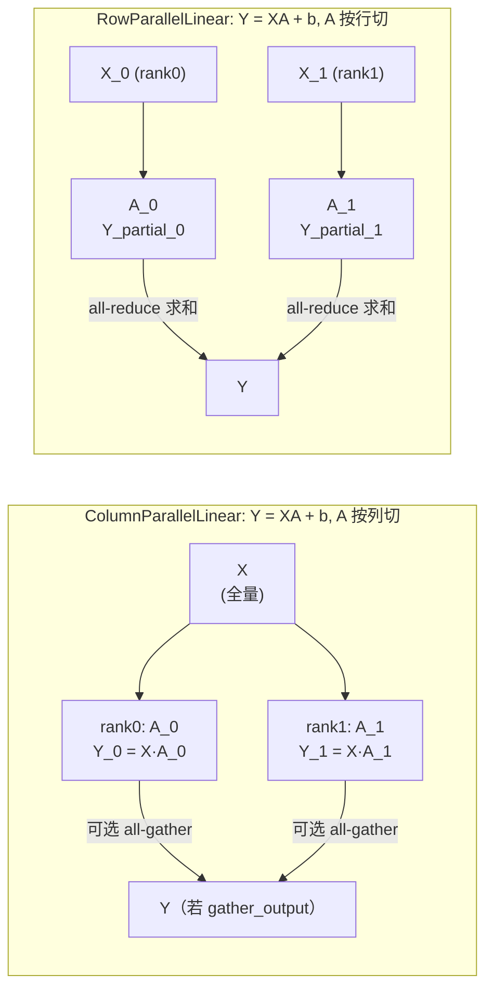

# 线性层（linear.py）

[← Wiki 首页](../../README.md) > [模型执行](../../README.md) > [层库](../README.md) > 线性层

`vllm/model_executor/layers/linear.py`（共 ~1700 行）是层库中体量最大、被模型库引用最密集的模块。它把 PyTorch 原生 `nn.Linear` 改造成"张量并行感知 + 量化可注入 + 权重加载规范化"的线性层家族，是所有 transformer block 里 `qkv_proj` / `o_proj` / `gate_up_proj` / `down_proj` 等投影矩阵的真正实现。

## 是什么

`linear.py` 提供下列公开类（按继承关系）：

| 类 | 角色 | 是否 `PluggableLayer.register` |
|---|---|---|
| `LinearBase` (`linear.py:231`) | 所有线性层的抽象基类，持有 `quant_method`、`tp_rank/tp_size`、`disable_tp` 等共同属性 | —（继承 `PluggableLayer`） |
| `LinearMethodBase` (`linear.py:141`) | 量化/反量化方法接口，定义 `create_weights` / `apply` 等抽象方法（继承自 `QuantizeMethodBase`） | — |
| `UnquantizedLinearMethod` (`linear.py:182`) | 默认 method：用 `dispatch_unquantized_gemm()` 分派 bf16/fp16 GEMM | — |
| `ReplicatedLinear` (`linear.py:292`) | 不做 TP 切分的线性层（命名 `replicated_linear`），权重在所有 rank 上完整复制 | 是 |
| `ColumnParallelLinear` (`linear.py:397`) | 列并行：权重沿输出维切，可选 `gather_output` 走 all-gather（命名 `column_parallel_linear`） | 是 |
| `MergedColumnParallelLinear` (`linear.py:580`) | 列并行 + 多个逻辑矩阵在输出维拼接（如 `gate_up_proj`），逐 shard 切分加载 | 继承自 Column |
| `QKVParallelLinear` (`linear.py:942`) | 列并行 + Q/K/V 三段在输出维拼接，且按 head 切分（K/V 可被 TP 复制） | 继承自 Column |
| `MinimaxM3QKVParallelLinearWithIndexer` (`linear.py:1351`) | M3 模型专用：在 QKV 后再拼 `index_q` / `index_k` 两段，与 lightning-attn indexer 共用一次 GEMM | 继承自 Column |
| `RowParallelLinear` (`linear.py:1537`) | 行并行：权重沿输入维切，前向后 `reduce_results` 走 all-reduce（命名 `row_parallel_linear`） | 是 |

除上述 `nn.Module` 外，文件还提供辅助函数：`adjust_marlin_shard`、`adjust_block_scale_shard`、`adjust_bitsandbytes_4bit_shard`、`adjust_scalar_to_fused_array`，以及 `WEIGHT_LOADER_V2_SUPPORTED` 列表与 `register_weight_loader_v2_supported_method` 装饰器（`linear.py:48-70`），用于把 method 标记为支持新 `weight_loader_v2`。

## 为什么

把线性层抽象成这套家族，是为了同时解决四件事：

1. **TP 切分自动化**：模型实现只需声明"`qkv_proj` 的 `output_sizes = [Q, K, V]`"，至于"每张卡拿哪一段、bias 怎么切、Q/K/V head 副本系数是多少"全部由 `ColumnParallelLinear`/`QKVParallelLinear` 在 `__init__` 与 `weight_loader_v2` 里处理。
2. **量化路径透明注入**：`quant_config.get_quant_method(self, prefix=prefix)` 在 `LinearBase.__init__` 时被调用（`linear.py:272-277`），返回的 `QuantizeMethodBase` 既负责"创建权重"也负责"执行 GEMM"，使得同一份层代码可同时跑 bf16 / fp8 / GPTQ-int4 / Marlin……
3. **权重加载支持"磁盘上已融合"和"按 shard 分开"两种布局**：例如 Phi-3 的 `gate_up_proj` 在 HF 仓库里是合并的，`MergedColumnParallelLinear._load_fused_module_from_checkpoint` 会在加载时自动拆开并按 rank 切。同样 QKV 也允许磁盘融合（见 `QKVParallelLinear._load_fused_module_from_checkpoint`，`linear.py:1049`）。
4. **新旧两套权重加载共存**：旧 `weight_loader(param, loaded_weight, shard_id)` 在层里直接 `narrow + copy_`；新 `weight_loader_v2(param, loaded_weight, shard_id)` 把 `narrow` 下沉到 `BasevLLMParameter.load_*_weight`（见 [parameter.md](parameter.md)）。哪些 method 走 v2 由 `WEIGHT_LOADER_V2_SUPPORTED` 决定。

## 怎么做

### 列并行 vs 行并行的几何



- **Column**（`linear.py:423-491`）：`output_size_per_partition = output_size // tp_size`，权重 `W` 的 `output_dim`（通常 dim=0）按 `tp_rank * shard_size` 切；若 `gather_output=True` 则前向后 `tensor_model_parallel_all_gather`（`linear.py:560-562`）。
- **Row**（`linear.py:1572-1639`）：`input_size_per_partition = input_size // tp_size`，前向阶段 `split_tensor_along_last_dim` 切输入（`linear.py:1676-1682`），GEMM 后 `reduce_results=True` 走 `tensor_model_parallel_all_reduce`（`linear.py:1690-1691`）。bias 仅 rank0 加（`linear.py:1687`），避免重复累加。

### QKV 的 head 副本系数

`QKVParallelLinear` 的特殊之处：当 `tp_size > total_num_kv_heads` 时，K/V head 需要复制（`num_kv_head_replicas = tp_size / total_num_kv_heads`），Q head 则按 `num_heads = total_num_heads / tp_size` 切。计算输出大小时把 `tp_size` 乘回去（`linear.py:1003-1008`），保证"全局视角"下的形状与未切分时一致；加载时根据 `shard_id` 区分 q/k/v，并使用 `shard_rank = tp_rank // num_kv_head_replicas`（k/v 路径，`linear.py:1300-1303`）来定位真正的逻辑 rank。

### MergedColumn：按 shard_id 走预定义 offset 表

`MergedColumnParallelLinear` 持有 `self.output_sizes`（例如 `[intermediate, intermediate]` 对应 `gate`/`up`）。`weight_loader_v2`（`linear.py:850-914`）支持三种 `loaded_shard_id`：

- `None`：磁盘上整段已融合（如 Phi-3）→ 调 `_load_fused_module_from_checkpoint`（`linear.py:810`）按 offset 表逐段 narrow 后递归调用 `weight_loader_v2`。
- `tuple[int, ...]`：连续多个 shard 已合并（例如某些 GPTQ checkpoint 把 `gate_up` 写到一起）→ 遍历子 shard。
- `int`：常规情况，单 shard 加载，按 `output_sizes[shard_id] // tp_size` 计算 `shard_offset/shard_size`，最后委托给 `param.load_merged_column_weight(...)`。

### 量化 method 的注入与权重创建

```python
# linear.py:271-277
self.quant_method: QuantizeMethodBase
if quant_config is None:
    self.quant_method = UnquantizedLinearMethod()
elif quant_method := quant_config.get_quant_method(self, prefix=prefix):
    self.quant_method = quant_method
else:
    raise ValueError("All linear layers should support quant method.")
```

随后 `ColumnParallelLinear.__init__` 调用 `self.quant_method.create_weights(...)`（`linear.py:464-476`），并把 `weight_loader=self.weight_loader_v2 if method 支持新 loader else self.weight_loader` 传进去。`UnquantizedLinearMethod.create_weights` 创建 `ModelWeightParameter`（见 [parameter.md](parameter.md)），而各类量化 method 会创建带 `packed_factor` / `weight_block_size` 等属性的派生 Parameter。

`UnquantizedLinearMethod.apply` 走 GEMM 分派：`dispatch_unquantized_gemm()`（`linear.py:228`）。在 CUDA 上是 `torch.dot` 或 cuBLAS；CPU 上会经 `dispatch_cpu_unquantized_gemm` 替换为 CPU 内存友好算子。

### 前向：bias / skip_bias_add / return_bias 的语义

`RowParallelLinear.forward` 中的关键约定（`linear.py:1672-1698`）：

- `skip_bias_add=True`：GEMM 不带 bias，bias 通过 `output_bias` 返回给上层，由下游算子（如 RMSNorm 或 activation）融合加 bias，省一次访存。
- `reduce_results=True and tp_size>1`：`all_reduce`。
- `reduce_results=False`：表示上层会自己融合 all-reduce（编译期 fusion pass 或 MoE 的 late-AR 路径），但要求 bias 也必须 `skip_bias_add`（`linear.py:1622-1626`）。

### 不透明性：PluggableLayer 而非 CustomOp

注意 `LinearBase` 继承自 `PluggableLayer` 而不是 `CustomOp`（`linear.py:231`）。也就是说，线性层的 GEMM 通常作为 model-level `torch.compile` 图里的 aten/inductor 节点处理，而不是被黑盒成一个 custom op。`PluggableLayer.register("column_parallel_linear")` 主要起到"允许第三方厂商用 `register_oot` 整层替换"的作用，见 [custom-op.md](custom-op.md)。

## 与其它模块/系统配合

- [模型库 #04](../../04-model-zoo/README.md)：几乎所有 transformer 模型的 `__init__` 都直接 `from vllm.model_executor.layers import ColumnParallelLinear, RowParallelLinear, MergedColumnParallelLinear, QKVParallelLinear`。
- [注意力 #05](../../05-attention/README.md)：注意力的 `qkv_proj` 用 `QKVParallelLinear`（其输出直接喂给 attention backend），`o_proj` 用 `RowParallelLinear`。Q shard 切分方式与 attention 后端的 head 分布严格对齐。
- [分布式 #07](../../07-distributed/README.md)：消费 `tensor_model_parallel_all_reduce/all_gather/split_tensor_along_last_dim`；`disable_tp=True` 时绕过 TP，给 MoE 的专家本地权重等场景使用。
- [量化子树](quantization/README.md)：`QuantizationConfig.get_quant_method(self, prefix=...)` 的派发是量化子树的入口；`WEIGHT_LOADER_V2_SUPPORTED` 列表为新加入的 `LinearMethod` 走新加载路径开绿灯。
- [LoRA #12](../../12-lora/README.md)：`MergedColumnParallelLinear` 的 partition 概念与 LoRA 的"per-shard lora A/B"权重一一对应；LoRA 通过替换 `quant_method` 或包装层在外部加 lora 路径，参见 [LoRA](../../12-lora/README.md)。
- [编译/IR #09](../../09-compilation-ir/README.md)：`PluggableLayer` 是 OOT 整层替换的注册点；`VLLM_BATCH_INVARIANT=1` 时 `UnquantizedLinearMethod.apply` 改走 `linear_batch_invariant`（`linear.py:226-228`），与 cudagraph 分桶协同。
- [parameter.md](parameter.md)：`ModelWeightParameter` / `RowvLLMParameter` / `PackedColumnParameter` / `PerTensorScaleParameter` / `BlockQuantScaleParameter` 是 `weight_loader_v2` 调用 `load_*_weight` 的实际实现载体。

## 历史版本演进

- **早期（~v0.5）**：`ColumnParallelLinear`/`RowParallelLinear` 已存在，但权重加载采用 per-model 自定义 loader，重复代码很多。
- **v0.5–v0.6**：`QKVParallelLinear` 与 `MergedColumnParallelLinear` 引入，把已融合的 QKV/gate_up 加载逻辑统一到 `weight_loader`。
- **v0.6–v0.7**：`LinearMethodBase` 抽象引入，开始把量化路径从模型代码逐步下沉到 method。
- **v0.7**：`skip_bias_add` / `return_bias` 双标志确立，与 `RMSNorm` 的 fused add 路径协同。
- **v0.8**：`disable_tp` 引入，用于 MoE 专家权重在 EP 模式下的本地化。
- **v0.10（PR #32744）**：`PluggableLayer` 抽象拆出，`LinearBase` 改为继承 `PluggableLayer` 而非 `CustomOp`，整层 OOT 替换成为官方扩展点。
- **v0.10–v0.11**：`weight_loader_v2` 引入（PR 标题 `[v2] weight loader` 系列），把 `narrow` 下沉到 `BasevLLMParameter.load_*_weight`；`WEIGHT_LOADER_V2_SUPPORTED` 从初期的 `UnquantizedLinearMethod`、`Fp8LinearMethod` 扩到当前 14 个 method（`linear.py:48-64`）。
- **v0.10+**：`mamba_mixer2` 等模型通过 `SharedWeightParameter` 复用 `in_proj` 的两段，触发 `MergedColumnParallelLinear` 的 partition 共享机制。
- **v0.12 / main**：新增 `MinimaxM3QKVParallelLinearWithIndexer`（`linear.py:1351`），把 MiniMax-M3 lightning-attn 的 `index_q`/`index_k` 与 QKV 合并到一次 GEMM；`allow_fp8_block_shape_mismatch` 用于在 block 量化时容忍 partition 不整除 block_n（`linear.py:493-518`）。

[← 返回层库首页](../README.md)

## 参见

- [parameter.md](parameter.md)：`weight_loader_v2` 的实际 weight-loading 实现。
- [custom-op.md](custom-op.md)：`PluggableLayer.register` / `register_oot` 的注册机制。
- [fused-moe.md](fused-moe.md)：`RoutedExperts` 内部直接 instantiate `MergedColumnParallelLinear`/`RowParallelLinear`，并把 `num_experts` 维度折叠进权重张量。
- [`./quantization/README.md`](quantization/README.md)：各 `LinearMethod` 子类（Fp8/GPTQ/Marlin/CompressedTensors/...）。
