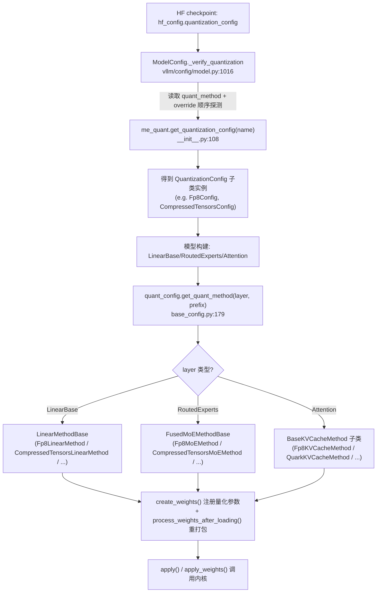

[← Wiki 首页](../../../README.md) > [模型执行](../../README.md) > [层库](../README.md) > 量化

# 模型执行子系统 — 量化层库

> 源码根目录：`vllm/model_executor/layers/quantization/`
>
> 本目录承担 vLLM 所有"推理期"量化方案的实现：从 checkpoint 量化配置解析、到为每个 `LinearBase`/`RoutedExperts`/`Attention` 层挑选并实例化合适的 `QuantizeMethodBase`，再到权重加载后的重打包/重量化。它是 `ModelConfig.quantization` 与底层 GEMM/MoE/Attention 内核之间的中间层。

本页是量化子库的**首页/导航**。各量化方案的详细说明见下方导航表。通用机制（配置基类、方案抽象、工具函数）单独成页。

---

## 是什么

量化层库是一个"配置工厂 + 层替换器"：

- **入口注册表**：`__init__.py:108` 的 `get_quantization_config(quantization)` 把一个字符串方法名（如 `"fp8"`、`"compressed-tensors"`）映射到一个 `QuantizationConfig` 子类。
- **方法字符串表**：`__init__.py:12` 的 `QuantizationMethods` Literal 列出全部内置方法名；`QUANTIZATION_METHODS`（`__init__.py:47`）是其可变列表形式，自定义方法可通过 `register_quantization_config`（`__init__.py:58`）追加。
- **废弃名单**：`DEPRECATED_QUANTIZATION_METHODS`（`__init__.py:49`）目前含 `fbgemm_fp8`、`fp_quant`，需 `--allow-deprecated-quantization` 才能使用（见 `vllm/config/model.py:1105`）。
- **两个抽象基类**（`base_config.py`）：
  - `QuantizationConfig`（`base_config.py:87`）：解析 checkpoint 的 `quantization_config` dict，按层分发 `get_quant_method()`。
  - `QuantizeMethodBase`（`base_config.py:20`）：单个层级的"创建权重/前向/加载后处理"契约，被 `LinearMethodBase`、`FusedMoEMethodBase`、`BaseKVCacheMethod` 等进一步细化。

### 支持的量化方案总表

下表"以代码为准"，对应 `__init__.py:140` 的 `method_to_config` 映射。

| 方法名（`quant_method`/`--quantization`） | Config 类 | 源码位置 | 类型 | 状态 | 详见 |
|---|---|---|---|---|---|
| `awq` / `auto_awq` / `awq_marlin` | `AutoAWQConfig` | `auto_awq.py` | INT4 weight-only（Marlin/MP 内核） | 活跃 | [awq.md](awq.md) |
| `gptq` / `auto_gptq` / `gptq_marlin` | `AutoGPTQConfig` | `auto_gptq.py` | INT4/INT8 group + act_order（Marlin/MP 内核） | 活跃 | [gptq.md](gptq.md) |
| `fp8` | `Fp8Config` | `fp8.py` | FP8 e4m3 per-tensor/block（离线/在线） | 活跃（核心） | [fp8.md](fp8.md) |
| `fbgemm_fp8` | `FBGEMMFp8Config` | `fbgemm_fp8.py` | FBGEMM per-channel FP8 weight-only | **已废弃** | [fbgemm.md](fbgemm.md) |
| `fp_quant` | `FPQuantConfig` | `fp_quant.py` | FP-Quant（Hadamard+mxfp4/nvfp4，需 sm100） | **已废弃** | [fp8.md](fp8.md) |
| `mxfp4` / `gpt_oss_mxfp4` | `Mxfp4Config` / `GptOssMxfp4Config` | `mxfp4.py` | OCP MXFP4 MoE | 活跃 | [fp8.md](fp8.md) |
| `modelopt` | `ModelOptFp8Config` | `modelopt.py` | NVIDIA ModelOpt FP8 | 活跃 | [modelopt.md](modelopt.md) |
| `modelopt_fp4` | `ModelOptNvFp4Config` | `modelopt.py` | ModelOpt NVFP4 | 活跃 | [modelopt.md](modelopt.md) |
| `modelopt_mxfp8` / `mxfp8`(checkpoint) | `ModelOptMxFp8Config` | `modelopt.py` | ModelOpt MXFP8 | 活跃 | [modelopt.md](modelopt.md) |
| `modelopt_mixed` | `ModelOptMixedPrecisionConfig` | `modelopt.py` | ModelOpt 混合精度 | 活跃 | [modelopt.md](modelopt.md) |
| `deepseek_v4_fp8` | `DeepseekV4FP8Config` | `vllm/models/deepseek_v4.py` | DeepSeek V4 FP8 专用 | 活跃 | (待补充，归 model-zoo) |
| `humming` | `HummingConfig` | `humming.py` | Humming 通用 schema 驱动量化 | 活跃 | [humming.md](humming.md) |
| `compressed-tensors` | `CompressedTensorsConfig` | `compressed_tensors/` | llmcompressor 通用框架（W8A8/W4A16/W4A4…） | 活跃（核心） | [compressed-tensors.md](compressed-tensors.md) |
| `bitsandbytes` | `BitsAndBytesConfig` | `bitsandbytes.py` | BNB NF4/INT8 在线量化 | 活跃 | [bnb.md](bnb.md) |
| `experts_int8` | `ExpertsInt8Config` | `experts_int8.py` | MoE INT8 在线（遗留） | 遗留，建议用 `int8_per_channel_weight_only` | [moe-wna16.md](moe-wna16.md) |
| `quark` | `QuarkConfig` | `quark/` | AMD Quark 导出格式 | 活跃 | [quark.md](quark.md) |
| `moe_wna16` | `MoeWNA16Config` | `moe_wna16.py` | MoE W8A16/W4A16（gptq/awq 后端） | 活跃 | [moe-wna16.md](moe-wna16.md) |
| `torchao` | `TorchAOConfig` | `torchao.py` | torchao 量化解包代理 | 活跃 | [torchao.md](torchao.md) |
| `inc` | `INCConfig` | `inc/` | Intel Neural Compressor（CPU/XPU） | 活跃 | [inc.md](inc.md) |
| `online` + shorthand | `OnlineQuantizationConfig` | `online/` | 在线量化（fp16/bf16→量化） | 活跃（核心） | [online.md](online.md) |
| `fp8_per_tensor` / `fp8_per_block` / `fp8_per_channel` / `mxfp8` / `int8_per_channel_weight_only` | `OnlineQuantizationConfig` | `online/` | `--quantization` 在线 shorthand | 活跃 | [online.md](online.md) |
| —（KV cache 量化层） | `BaseKVCacheMethod` 等 | `kv_cache.py` | KV cache FP8 量化（跨方案） | 活跃 | [kv_cache.md](kv_cache.md) |
| —（TurboQuant KV cache） | `TurboQuantConfig` | `turboquant/` | KV cache Hadamard+Lloyd-Max | 活跃 | [turboquant.md](turboquant.md) |

> 子目录实际清单：`compressed_tensors/`、`quark/`、`inc/`、`online/`、`turboquant/`、`utils/`。不存在 `fp8/`、`awq/`、`gptq/`、`gptq_marlin/`、`marlin/`、`bitsandbytes/`、`fbgemm/`、`aik/`、`kv_cache/` 子目录——这些均为扁平 `.py` 文件；Marlin 内核工具集中在 `utils/marlin_utils*.py`。`aik/`（AIK 量化）在主线**不存在**，故无 `aik.md`，由 `inc.md` 承担 Intel 系量化说明。

### 量化方案导航表

| 主题 | 文档 | 一句话 |
|---|---|---|
| 通用配置/方法基类、QuantKey、各 `schemes/` 抽象 | [schemes.md](schemes.md) | 所有方案的公共接口 |
| 通用工具（marlin/fp8/int8/mxfp/nvfp4/flashinfer…） | [utils.md](utils.md) | 跨方案的内核胶水 |
| llmcompressor 通用框架 | [compressed-tensors.md](compressed-tensors.md) | 最主流的"通用量化"入口 |
| 在线量化（无 checkpoint） | [online.md](online.md) | `--quantization fp8_per_tensor` 等 |
| AMD Quark 导出 | [quark.md](quark.md) | Quark/jaffe 格式 |
| Intel Neural Compressor | [inc.md](inc.md) | CPU/XPU 系 |
| KV cache 量化 | [kv_cache.md](kv_cache.md) | `BaseKVCacheMethod` 通用机制 |
| TurboQuant KV cache | [turboquant.md](turboquant.md) | Hadamard+Lloyd-Max |

---

## 为什么

量化层库存在的目的：

1. **解耦 checkpoint 格式与推理内核**。同一个"FP8"在 vLLM 下有 per-tensor、per-block(128×128)、per-channel、MXFP8、NVFP4 等多种布局，对应不同的 CUTLASS/Marlin/DeepGEMM/FlashInfer/Triton 内核。本库把"解析 checkpoint→选内核"封装在 `get_quant_method()` 里，上层 `LinearBase`/`FusedMoE` 只调用 `apply()`。
2. **统一权重加载流程**。所有量化方案复用 `AutoWeightsLoader` + `process_weights_after_loading()` 钩子，在权重全部载入后做重打包（如 AWQ 非标准位序→标准 GPTQ 位序，见 `auto_awq.py:93`）、重量化（per-shard scale→per-tensor max scale）、FNUZ 格式转换（ROCm，`fp8.py:730`）等。
3. **支持在线量化**。无量化 checkpoint 时，用 `--quantization fp8_per_tensor` 等在加载期把 bf16/fp16 权重即时量化（meta device + 逐层处理以降峰值显存，见 `online/base.py`、`QuantizeMethodBase.uses_meta_device` 于 `base_config.py:23`）。
4. **多平台/多后端调度**。每个 MoE 方案都有 `select_*_moe_backend()`（如 `fp8.py:527` 的 `select_fp8_moe_backend`），按 GPU capability/TP/编译模式在 AITER/CUTLASS/Triton/DeepGEMM 间挑选。
5. **可扩展性**。`register_quantization_config()`（`__init__.py:58`）允许外部插件注册自定义 `QuantizationConfig`，并自动加入 `current_platform.supported_quantization`（`__init__.py:95`）。

---

## 怎么做

### 总流程：quant_config → quant scheme → layer 替换

### 选择机制（override 探测）

`ModelConfig._verify_quantization()`（`vllm/config/model.py:1016`）负责把 checkpoint 的 `quant_method` 解析为最终生效的 `QuantizationConfig` 方法名：

1. 读取 `hf_config.quantization_config["quant_method"]`（`vllm/config/model.py:1025`）。
2. 维护一个 `overrides` 优先级表（`vllm/config/model.py:1029`），顺序为：`auto_gptq`→`gptq`→`gptq_marlin`→`auto_awq`→`awq`→`awq_marlin`→`inc`→`moe_wna16`→`modelopt*`→`mxfp8`→`modelopt_mixed`→`mxfp4`→`gpt_oss_mxfp4`→`deepseek_v4_fp8`→`humming`。
3. 对每个候选 `name`，调用其 `QuantizationConfig.override_quantization_method(quant_cfg, user_quant, hf_config)`（`base_config.py:141`）。各 Config 通过检查 checkpoint 内部字段（如 `quant_method=="gptq"`+`bits`+`sym`、`weights.dtype=="mxfp4"` 等）决定是否"认领"该 checkpoint。首个返回非 `None` 的即生效；若用户已显式 `--quantization` 则必须与探测结果一致，否则报错（`vllm/config/model.py:1089`）。
4. `current_platform.verify_quantization()`（`vllm/config/model.py:1103`）做平台级校验（如某方案在 ROCm/CPU 不可用）。

> override 机制的意义：不同量化器导出的 checkpoint 可能 `quant_method` 同名但内部格式不同（如 GPTQ 的 Marlin 变体、ModelOpt 的多种子格式）。各 Config 用 `override_quantization_method` 自我匹配，避免误派发。

### 与 `ModelConfig.quantization` 的对接

- `ModelConfig.quantization`（`vllm/config/model.py:208`）：用户 `--quantization` 或 checkpoint `quant_method`，字符串。
- `ModelConfig.quantization_config`（`vllm/config/model.py:208`）：`dict | QuantizationConfigArgs | None`，用于**在线量化**的细粒度规格（`linear`/`moe` 的 `QuantSpec`）。由 `vllm/config/quantization.py:147` 的 `resolve_quantization_config()` 把 `--quantization` shorthand 与 `--quantization-config` dict 合并。
- 在线 shorthand 表 `_ONLINE_SHORTHANDS`（`vllm/config/quantization.py:114`）与 `__init__.py:41` 处的字符串列表保持同步（`__init__.py:176` 的断言式 `setdefault`）。
- 最终 `VllmConfig._get_quantization_config()`（`vllm/config/vllm.py:622`）实例化 `QuantizationConfig`，存于 `VllmConfig.quant_config`（`vllm/config/vllm.py:926`），供模型构建期全局访问。
- KV-cache scale 名映射：`QuantizationConfig.get_cache_scale_mapper()`（`base_config.py:194`）把各 checkpoint 千差万别的 `kv_scale`/`q_scale`/`v_scale` 命名统一到 vLLM 的 `.attn.{q,k,v}_scale`，由 `AutoWeightsLoader` 自动应用，模型 `load_weights` 无需感知。

### 各方案自选内核的通用模式

- **Linear**：经 `vllm/model_executor/kernels/linear` 的 `choose_mp_linear_kernel` / `init_*_linear_kernel`（如 `fp8.py:387` 的 `init_fp8_linear_kernel`）按 `QuantKey`（见 [schemes.md](schemes.md)）选 CUTLASS/Marlin/Triton/等等。
- **MoE**：经 `select_*_moe_backend()`（`fp8.py:527`、`mxfp4.py` 的 `select_mxfp4_moe_backend`、`humming.py` 的 `select_humming_moe_experts`）选 AITER/CUTLASS/Triton/DeepGEMM，再 `make_*_moe_kernel()` 构造 modular kernel。
- **KV cache**：见 [kv_cache.md](kv_cache.md)。

---

## 与其它模块/系统配合

- **[平台](../../../08-platforms/README.md)**：`current_platform` 决定 `fp8_dtype()`（e4m3fn vs fnuz）、`has_device_capability`（Marlin FP8 在 <sm89 回退）、`verify_quantization`（平台黑白名单）、`supported_quantization`（注册自定义时自动追加）。
- **[分布式](../../../07-distributed/README.md)**：权重的 `input_dim`/`output_dim`/`packed_dim` 属性供 TP 切分；block 量化要求 `intermediate_size_per_partition % block_k == 0`（`fp8.py:568`）。MoE 后端选择依赖 `get_tensor_model_parallel_world_size()`。
- **[编译-IR](../../../09-compilation-ir/README.md)**：`get_quantization_config()` 在 `__init__.py:108` 内用"lazy import"避免过早触发 `torch.compile`；`CustomOp`（如 `input_quant_fp8.py:29` 的 `QuantFP8`）支持 `compile_native`/`torch.compile`；`QuantizeMethodBase.uses_meta_device` 与层式加载（`model_loader/reload/layerwise`）配合降显存。
- **LinearBase / FusedMoE / Attention**（`03-model-execution/layers/`）：本库是它们的"策略对象"提供者。`LinearBase` 在 `__init__` 时调用 `quant_config.get_quant_method(self, prefix)` 拿到 `LinearMethodBase` 并持有。
- **权重加载器**（`03-model-execution/model-loader/`）：`AutoWeightsLoader` 依据 `packed_modules_mapping`（`base_config.py:105`）把 fused 模块（qkv→q/k/v）拆分，并执行 `get_cache_scale_mapper()`。
- **Model Zoo**（`04-model-zoo/`）：各模型的 `get_quantization_config`/`packed_modules_mapping` 钩子在此对接；`DeepseekV4FP8Config` 直接位于 `vllm/models/deepseek_v4.py`（`__init__.py:115`）。

---

## 历史版本演进

> 以下按 vLLM 版本号梳理量化层库的整体演进；具体方案的演进见各自页面。标注 (待核实) 表示需对照 Release Note 进一步确认。

- **v0.5 及之前**：量化层库初具规模，GPTQ/AWQ/FBGMEM-FP8/bitsandbytes 为早期方案；`QuantizationConfig`/`LinearMethodBase` 抽象已建立。
- **v0.6**（待核实）：FP8（`fp8.py`）成为主流，支持 per-tensor 静态/动态；compressed-tensors 框架引入（`compressed_tensors/`）。
- **v0.7–v0.8**（待核实）：block-wise FP8（128×128，DeepGEMM）、Marlin FP8/INT 内核路径成熟；Quark（`quark/`）接入。
- **v0.9–v0.10**（待核实）：ModelOpt 多子格式（nvfp4/mxfp8/mixed）、MXFP4（`mxfp4.py`）、Humming（`humming.py`）引入；MoE modular kernel + `select_*_moe_backend` 调度。
- **v0.11**（待核实）：在线量化 shorthand（`online/` + `vllm/config/quantization.py` 的 `QuantizationConfigArgs`/`QuantSpec`/`QuantKey`）统一化；`fp_quant` 与 `fbgemm_fp8` 标记 deprecated（`__init__.py:49`）。
- **v0.12 / main**：TurboQuant KV cache（`turboquant/`）、`deepseek_v4_fp8`、`gpt_oss_mxfp4`、INC（`inc/`）WNA16、Humming schema 驱动、online `mxfp8`/`int8_per_channel_weight_only` 等持续扩展；`override_quantization_method` 候选表与平台 `supported_quantization` 动态化。

---

## 参见

- [Wiki 首页](../../../README.md)
- [模型执行子系统](../../README.md)
- [层库](../README.md)
- 子页：[schemes.md](schemes.md) · [utils.md](utils.md) · [compressed-tensors.md](compressed-tensors.md) · [fp8.md](fp8.md) · [awq.md](awq.md) · [gptq.md](gptq.md) · [bnb.md](bnb.md) · [fbgemm.md](fbgemm.md) · [kv_cache.md](kv_cache.md) · [modelopt.md](modelopt.md) · [humming.md](humming.md) · [torchao.md](torchao.md) · [moe-wna16.md](moe-wna16.md) · [quark.md](quark.md) · [inc.md](inc.md) · [online.md](online.md) · [turboquant.md](turboquant.md)
