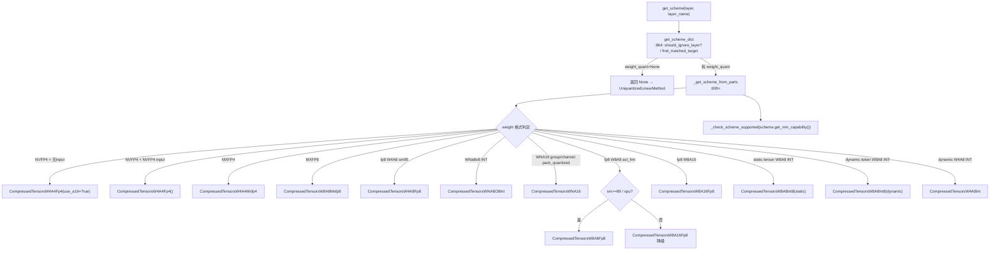

[← Wiki 首页](../../../README.md) > [模型执行](../../README.md) > [层库](../README.md) > [量化](README.md) > Compressed Tensors

# compressed_tensors — llmcompressor 通用量化框架

> 源码目录：`vllm/model_executor/layers/quantization/compressed_tensors/`
>
> 依赖外部库：`compressed_tensors`（Neural Magic 的 [llmcompressor](https://github.com/vllm-project/llmcompressor) 输出格式）。

---

## 是什么

`compressed_tensors/` 是 vLLM 对 **llmcompressor 导出的 compressed-tensors 格式 checkpoint** 的完整运行时支持。它是当前 vLLM 中**最通用、覆盖面最广**的量化入口——一个 checkpoint 内可同时存在多个 `config_groups`，每个 group 用正则/模块名 target 匹配一批层，各自指定不同的 weight/input/output 量化方案。vLLM 在 `get_scheme()` 里把这些声明映射到内部的 `CompressedTensorsScheme` 子类，再由统一的 `CompressedTensorsLinearMethod`/`CompressedTensorsMoEMethod` 驱动。

目录结构：

| 路径 | 角色 |
|---|---|
| `compressed_tensors.py` | `CompressedTensorsConfig`、`CompressedTensorsLinearMethod`、scheme 分发（`get_scheme`/`_get_scheme_from_parts`） |
| `compressed_tensors_embedding.py` | `CompressedTensorsEmbeddingWNA16Int`：INT WNA16 embedding lookup |
| `compressed_tensors_moe/compressed_tensors_moe.py` | `CompressedTensorsMoEMethod` + `get_moe_method` 按方案路由到各 `compressed_tensors_moe_w*.py` |
| `compressed_tensors_moe/compressed_tensors_moe_w{4a4_mxfp4,4a4_nvfp4,4a8_fp8,4a8_int8,8a8_fp8,8a8_int8,8a8_mxfp8,na16,na16_marlin,na16_rdna3}.py` | 各具体 MoE 方案实现 |
| `compressed_tensors_moe/rocm_moe_rdna.py` | ROCm RDNA3 MoE 路径 |
| `schemes/compressed_tensors_scheme.py` | 抽象 `CompressedTensorsScheme`（见 [schemes.md](schemes.md)） |
| `schemes/compressed_tensors_w{4a4_mxfp4,4a4_nvfp4,4a8_fp8,4a8_int,8a16_fp8,8a8_fp8,8a8_int8,8a8_mxfp8,Na16,Na8o8}.py` | 各具体 Linear 方案（Fp4 = NVFP4A16 见下） |
| `transform/` | `CompressedTensorsLinearTransformMethod` + `transform/schemes/linear_qutlass_nvfp4.py`：权重运行期 transform（如 NVFP4 CUTLASS 重排） |
| `triton_scaled_mm.py` | Triton scaled mm 后备路径 |
| `utils.py` | `find_matched_target`/`is_activation_quantization_format`/`should_ignore_layer` |

---

## 为什么

- **一份格式覆盖几乎所有现代方案**。W8A8 (FP8/INT8)、W4A16 (group/channel WNA16)、W4A8 (FP8/INT)、W4A4 (MXFP4/NVFP4)、W8A8-MXFP8、WNA8O8 INT、稀疏……都能用同一套 `config_groups` 声明，避免每个方案一个 Config 类。
- **支持 per-layer 异构**。不同层可用不同方案（如 lm_head 跳过、attention 用 W8A8、其余 W4A16），通过 target 匹配完成，无需改模型代码。
- **与 llmcompressor 生态对齐**。llmcompressor 是 vLLM 官方推荐的离线量化工具，其输出直接被本目录消费，闭环最短。
- **内核后端可降级**。如 `_is_fp8_w8a8` 在 sm<89 或 XPU 非 `xpu` backend 时自动从 `CompressedTensorsW8A8Fp8` 降级到 `CompressedTensorsW8A16Fp8`（`compressed_tensors.py:750`）。

---

## 怎么做

### Config 解析与 scheme 分发

`CompressedTensorsConfig.__init__`（`compressed_tensors.py:80`）保存 `target_scheme_map`（target→`QuantizationArgs` dict）、`ignore`、`quant_format`、`kv_cache_scheme`、`transform_config`。`from_config`（`:227`）跳过"仅 Attention 量化"的 config group（vLLM 把 attention 量化与 KV-cache 量化耦合）。

`get_scheme(layer, layer_name)`（`:815`）流程：

判定谓词（`_is_nvfp4_format`/`_is_mxfp4`/`_is_fp8_w8a8` 等）封装于 `compressed_tensors.py`。`CompressedTensorsLinearMethod`（`:910`）本身不关心方案，只把 `create_weights`/`apply`/`process_weights_after_loading` 委托给 `layer.scheme`。

### `get_quant_method` 分发（`compressed_tensors.py:151`）

按 layer 类型：
- `LinearBase` → 选 scheme 存 `layer.scheme`，返回 `CompressedTensorsLinearMethod`；若有 input/output transform 则包成 `CompressedTensorsLinearTransformMethod`（`:171`）。
- `ParallelLMHead` → 同 Linear（量化 lm_head）。
- `VocabParallelEmbedding` → 仅支持 INT WNA16 group/channel，返回 `CompressedTensorsEmbeddingWNA16Int`（`:203`）。
- `Attention` → `CompressedTensorsKVCacheMethod`。
- `RoutedExperts` → `CompressedTensorsMoEMethod.get_moe_method(self, layer, prefix)` 按 scheme 路由到 `compressed_tensors_moe_w*.py`。

### MoE 路由（`compressed_tensors_moe/compressed_tensors_moe.py:30`）

`CompressedTensorsMoEMethod.get_moe_method` 依据 weight/input 组合挑选：`w4a4_mxfp4`/`w4a4_nvfp4`/`w4a8_fp8`/`w4a8_int8`/`w8a8_fp8`/`w8a8_int8`/`w8a8_mxfp8`/`wna16[_marlin/_rdna3]`。每个子文件实现 `create_weights`/`process_weights_after_loading`/`apply`，内部再调用 `utils/` 与 `fused_moe/oracle/` 的后端选择。

### transform 子系统（`transform/`）

`CompressedTensorsLinearTransformMethod`（`transform/linear.py`）把"量化方法+输入/输出权重 transform"组合。`transform/schemes/linear_qutlass_nvfp4.py` 提供 NVFP4 CUTLASS 运行期重排方案。`get_linear_transform_schemes`（`transform/linear.py`，被 `:159` 调用）从 `transform_config` 提取 transform scheme。

---

## 与其它模块/系统配合

- **[平台](../../../08-platforms/README.md)**：`_check_scheme_supported` 用 `current_platform.has_device_capability`；XPU 上 W8A8 FP8 依赖 `kernel_config.linear_backend=="xpu"`（`:751`）；ROCm RDNA3 走 `rocm_moe_rdna.py`。
- **[分布式](../../../07-distributed/README.md)**：`get_tensor_model_parallel_rank/world_size` 影响 MoE 重量化；`find_matched_target` 考虑 `packed_modules_mapping` 的 fused 模块名匹配。
- **[编译-IR](../../../09-compilation-ir/README.md)**：`triton_scaled_mm.py` 作为 W8A8 的 torch.compile 友好后备；scheme 的 `apply_weights` 多走 `CustomOp`。
- **llmcompressor（外部）**：`from compressed_tensors.quantization import QuantizationArgs/QuantizationStrategy/QuantizationType`、`from compressed_tensors.config import CompressionFormat`——直接消费其数据模型。
- **KV-cache**：`CompressedTensorsKVCacheMethod`（`:206`）复用 `BaseKVCacheMethod`（见 [kv_cache.md](kv_cache.md)）。

---

## 历史版本演进

- **v0.6**（待核实）：compressed-tensors 框架首次引入，最初支持 W8A8 FP8/INT8 与 W4A16 WNA16。
- **v0.7–v0.8**（待核实）：`config_groups` 多 group + target 匹配成熟；MoE 方案补齐（`compressed_tensors_moe/` 子目录）。
- **v0.9–v0.10**（待核实）：W4A4 MXFP4/NVFP4、W8A8 MXFP8、W4A8 FP8/INT、WNA8O8 INT、transform 子系统加入；embedding WNA16 支持。
- **v0.11–v0.12 / main**（待核实）：`CompressedTensorsLinearTransformMethod` + NVFP4 CUTLASS transform；RDNA3 MoE、XPU backend 分支、per-token-head KV cache scales 适配持续完善。

---

[← 返回量化首页](README.md)

## 参见

- [量化首页](README.md) · [schemes.md](schemes.md) · [utils.md](utils.md) · [fp8.md](fp8.md) · [quark.md](quark.md) · [kv_cache.md](kv_cache.md)
