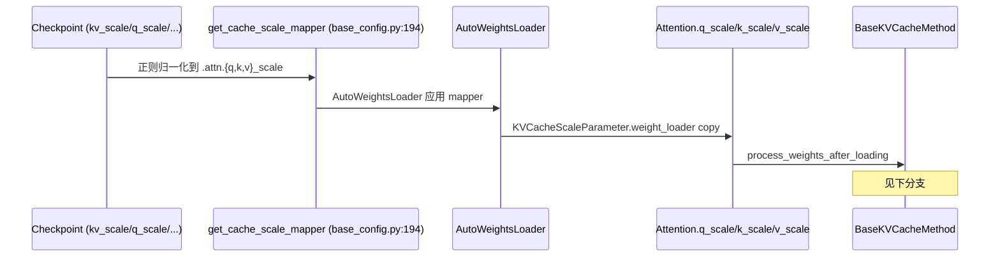

[← Wiki 首页](../../../README.md) > [模型执行](../../README.md) > [层库](../README.md) > [量化](README.md) > KV Cache 量化

# kv_cache — KV Cache 量化层

> 源码（扁平 `.py`，**不存在 `kv_cache/` 子目录**）：`vllm/model_executor/layers/quantization/kv_cache.py`
>
> 与 KV cache 本身的存储/管理（子系统 `15-kv-cache-offload`、`01-engine-core/kv-cache-management`）不同：本页只讲"Attention 层的 k/v 量化 scale 装载与解/重量化钩子"。

---

## 是什么

`kv_cache.py` 定义 **KV-cache 量化的通用机制**，被几乎所有 FP8/INT checkpoint 方案复用作为 Attention 层的量化方法：

- `KVCacheScaleParameter`（`:18`）：标量参数，初值 `-1.0`（sentinel）。`weight_loader`（`:33`）只接受 `()` 或 `(1,)` 形状（per-head scale 走 compressed-tensors 的 `_tp_aware_loader`）。
- `BaseKVCacheMethod`（`:42`）：继承 `QuantizeMethodBase`。每个具体方案（`Fp8KVCacheMethod`、`CompressedTensorsKVCacheMethod`、`QuarkKVCacheMethod`、`ModelOptKVCacheMethod` 等）只需传 `quant_config` 给基类即可复用全部逻辑。

它负责把 checkpoint 里形形色色的 `{q,k,v}_scale`/`kv_scale`/`prob_scale` 装载到 Attention 层，并在 `process_weights_after_loading`（`:74`）把它们规整为运行期 `_k_scale`/`_v_scale`/`_q_scale`/`_prob_scale`（float + tensor 双重缓存）。

---

## 为什么

- **统一所有方案的 KV scale 装载**。不同量化器命名不同（`kv_scale` 融合、`k_proj.output_scale`、`self_attn.k_proj.k_scale`…），命名归一化放在 `QuantizationConfig.get_cache_scale_mapper()`（`base_config.py:194` 正则），vLLM Attention 只读 `_k_scale_float`/`_v_scale_float`，无需关心来源。
- **支持 fp8 / int8 / per-token-head 多种 KV dtype**。`is_quantized_kv_cache(layer.kv_cache_dtype)`（`:101`，`vllm/utils/torch_utils.py`）区分；`kv_cache_uses_per_token_head_scales`（`:85`，`vllm/v1/kv_cache_interface.py`）走动态 per-(token,head) scale，忽略 checkpoint scale。
- **FP8 attention 的 q/prob scale**。除 k/v 外，FP8 attention（flash-attn/flashinfer）还需 `q_scale`/`prob_scale`（softmax(QK^T) 量化），本类一并装载；缺失则警告并置 1.0（`:186`）。
- **FNUZ 系数**。ROCm FP8 FNUZ 的 scale 需 ×2（`:108/124/156/163`），集中处理避免散落。
- **动态 KV scale 计算**。`layer.calculate_kv_scales=True` 时运行期动态算 scale，不读 checkpoint（`:102` 分支）。

---

## 怎么做

### 装载流程

### `create_weights`（`:57`）

在 Attention 层注册 `q_scale`/`k_scale`/`v_scale`/`prob_scale`，全部初值 `-1.0`（invalid sentinel）。

### `process_weights_after_loading`（`:74`）分支

1. **per-token-head KV cache**（`:85`）：动态算 scale，`_k_scale/_v_scale=1.0`，删 `q/k/v/prob_scale`。
2. **未量化 KV cache 或 calculate_kv_scales**：若 `is_quantized_kv_cache` 且非动态算，则强制 k/v_scale=1.0；否则跳过。
3. **量化 KV cache 读 checkpoint**（`:104`）：
   - k&v 都有效 → 各自用。
   - k&v 都 <0 → 置 1.0，警告。
   - 仅一个有效（旧式融合 `kv_scale` 已在 mapper 重映射到 k_scale）→ 复制到两者。
   - FNUZ ×2。
   - 校验 per-tensor float。
   - q_scale <0 → 用 k_scale 警告提示（`:133`）；prob_scale 同理。
4. 写回 `_k_scale`/`_v_scale`/`_q_scale`/`_prob_scale`（tensor）+ `_k_scale_float`/`_v_scale_float`/`_q_scale_float`（python float，供 Attention.forward 用）。
5. 删除临时 `q/k/v/prob_scale` 以省显存（`:194`）。

### `apply`（`:71`）

`BaseKVCacheMethod.apply` 直接 `raise RuntimeError`——KV cache 量化不参与"前向计算"语义（k/v 的量化解量化发生在 cache 写入/读出 kernel 内），此方法仅为满足 ABC 而存在。

### `get_cache_scale_mapper` 正则（`base_config.py:202`）

| checkpoint 命名 | 归一化 |
|---|---|
| `.kv_scale`（废弃融合） | `.attn.k_scale` |
| `.self_attn.{k,v}_proj.{k,v}_scale`（ModelOpt） | `.self_attn.attn.{k,v}_scale` |
| `.self_attn.qk(qk)v_proj.{k,v}_scale`（fused QKV） | `.self_attn.attn.{k,v}_scale` |
| `.mixer.{k,v}_proj.{k,v}_scale`（NemotronH） | `.mixer.attn.{k,v}_scale` |
| `.self_attn.q.scale`（HYV3） | `.self_attn.attn.q_scale` |
| `.self_attn.{k,v}_cache.scale`（HYV3） | `.self_attn.attn.{k,v}_scale` |
| `.{q,k,v}_scale`（默认，非 `.attn` 后缀） | `.attn.{q,k,v}_scale` |
| `.{q,k,v}_zero_point` | `.attn.{q,k,v}_zero_point` |

各 Config 可 `|`（pipe）叠加自家映射（如 `Fp8Config.get_cache_scale_mapper` 于 `fp8.py:222` 把 `.q_proj.output_scale`→`.attn.q_scale` 等再并入基类）。

---

## 与其它模块/系统配合

- **Attention 层**（`05-attention`、`03-model-execution/layers/`）：`Attention.__init__` 调 `quant_config.get_quant_method(self, prefix)` 拿 `*KVCacheMethod`；`Attention.forward` 读 `_k_scale_float`/`_q_scale_float`/`_prob_scale`。
- **KV cache 存储**（`15-kv-cache-offload`、`01-engine-core/kv-cache-management`）：本层只产 scale，cache tensor 的实际量化解量化在 attention backend kernel（flashinfer/flashattn/农业）内。
- **[平台](../../../08-platforms/README.md)**：`current_platform.is_fp8_fnuz()` 决定 ×2；kv_cache_dtype 字符串（`"fp8"`/`"fp8_e4m3"`/`"int8"`/TurboQuant 预设…）由平台/配置决定。
- **[编译-IR](../../../09-compilation-ir/README.md)**：scale 进 kernel 作为标量参数；per-token-head 动态 scale 与编译兼容。
- **TurboQuant**（`turboquant/`）：另一种 KV cache 量化思路（Hadamard+Lloyd-Max），见 [turboquant.md](turboquant.md)。它在 `kv_cache_dtype` 维度而非本 `BaseKVCacheMethod` 维度工作。
- **各方案**：`Fp8KVCacheMethod`（`fp8.py:859`）、`CompressedTensorsKVCacheMethod`、`QuarkKVCacheMethod`、`ModelOptKVCacheMethod` 等都只是 `BaseKVCacheMethod` 的薄包装。

---

## 历史版本演进

- **v0.5 及之前**：FP8 KV cache 量化首次支持，`kv_scale` 融合字段。
- **v0.6–v0.7**（待核实）：`BaseKVCacheMethod` 抽象提取，q/v 分离 scale，ModelOpt/CT/Quark 各自 KVCacheMethod 共用。
- **v0.8–v0.9**（待核实）：`get_cache_scale_mapper` 正则化引入，覆盖 fused QKV/NemotronH/HYV3 等命名；`prob_scale`/`q_scale` for FP8 attention 加入。
- **v0.10–v0.11**（待核实）：per-token-head KV cache scales 适配（`v1/kv_cache_interface.py`）；动态 `calculate_kv_scales`。
- **v0.12 / main**：`_k_scale_float` 等双缓存完善；TurboQuant 作为独立 KV cache dtype 路径（不走本基类）。

---

[← 返回量化首页](README.md)

## 参见

- [量化首页](README.md) · [fp8.md](fp8.md) · [modelopt.md](modelopt.md) · [compressed-tensors.md](compressed-tensors.md) · [quark.md](quark.md) · [turboquant.md](turboquant.md) · [schemes.md](schemes.md)
