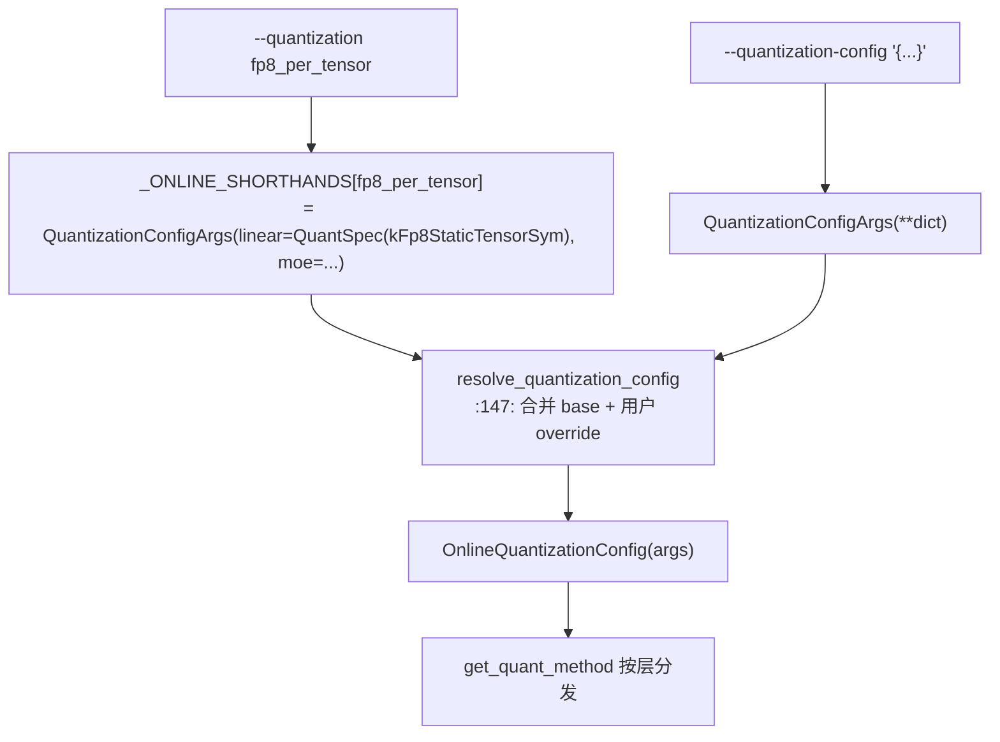

[← Wiki 首页](../../../README.md) > [模型执行](../../README.md) > [层库](../README.md) > [量化](README.md) > 在线量化

# online — 在线量化（无 checkpoint 量化）

> 源码目录：`vllm/model_executor/layers/quantization/online/`
> 配置对接：`vllm/config/quantization.py`（`QuantizationConfigArgs`/`QuantSpec`/`_ONLINE_SHORTHANDS`/`resolve_quantization_config`）
>
> 方法名 `"online"` + shorthand：`fp8_per_tensor`/`fp8_per_block`/`fp8_per_channel`/`mxfp8`/`int8_per_channel_weight_only`（`__init__.py:37-46`，`vllm/config/quantization.py:114`）。

---

## 是什么

"在线量化"指**无需预量化 checkpoint**——加载普通 fp16/bf16 模型，在权重加载期（或首前向）即时把权重量化为 FP8/INT8/MXFP8 等低比特，激活在运行期动态量化。`OnlineQuantizationConfig`（`online/base.py:74`）是统一入口，按用户的 `QuantizationConfigArgs`（`linear`/`moe` 的 `QuantSpec`）为每个 `LinearBase`/`RoutedExperts` 分发具体 online method。

目录：

| 路径 | 角色 |
|---|---|
| `base.py` | `OnlineQuantizationConfig` + 分发表 `_ONLINE_LINEAR_METHODS`/`_ONLINE_MOE_METHODS`（`:58/65`） |
| `fp8.py` | `Fp8PerTensorOnlineLinearMethod`(`fp8_per_tensor`)、`Fp8PerBlockOnlineLinearMethod`(`fp8_per_block`)、`Fp8PtpcOnlineLinearMethod`(`fp8_per_channel`, per-tensor-per-channel)、对应 MoE method |
| `int8.py` | `Int8OnlineMoEMethod`(`int8_per_channel_weight_only`) |
| `mxfp8.py` | `Mxfp8OnlineLinearMethod`/`Mxfp8OnlineMoEMethod`(`mxfp8`) |
| `moe_base.py` | `OnlineMoEMethodBase`（在线 MoE 公共基类） |

`QuantSpec`（`vllm/config/quantization.py:64`）= `{weight: QuantKey, activation: QuantKey|None}`；`QuantizationConfigArgs`（`:79`）= `{linear: QuantSpec, moe: QuantSpec, ignore: list[str]}`。

---

## 为什么

- **零成本体验量化**。用户无需离线量化，`--quantization fp8_per_tensor` 即可对任意 bf16 模型启用 FP8，降低试用门槛。
- **统一 shorthand**。`_ONLINE_SHORTHANDS`（`:114`）把 CLI shorthand 映射到 `QuantSpec`，`resolve_quantization_config`（`:147`）合并 `--quantization` 与 `--quantization-config` dict，支持细粒度 per-layer 覆盖。
- **降峰值显存**。`uses_meta_device=True`（`base_config.py:23`，`online/fp8.py:66` 的 `_Fp8OnlineLinearBase`）让权重在 meta device 创建、逐层 `process_weights_after_loading` 量化，避免同时持有 fp16+fp8 双份（见 `model_loader/reload/layerwise.py` 的 `initialize_online_processing`，`online/fp8.py:48` import）。
- **复用离线内核**。online FP8 method 复用 `init_fp8_linear_kernel`（同 QuantKey）与 `select_fp8_moe_backend`，与离线路径同内核。
- **`fp8`（离线感）Config 也走 online 分支**。`Fp8Config.get_quant_method` 在 `is_checkpoint_fp8_serialized=False` 时直接返回 `Fp8PerTensorOnlineLinearMethod`（`fp8.py:186`）——即 `--quantization fp8` 对未量化 checkpoint 触发 online。`online/` 是"纯 online"入口，与 `fp8.py` 的"双模式"互补。

---

## 怎么做

### shorthand 解析（`vllm/config/quantization.py`）

shorthand 表（`:114`）：

| shorthand | linear weight | moe weight |
|---|---|---|
| `fp8_per_tensor` | `kFp8StaticTensorSym` | `kFp8StaticTensorSym` |
| `fp8_per_block` | `kFp8Static128BlockSym` | `kFp8Static128BlockSym` |
| `fp8_per_channel` | `kFp8StaticChannelSym` | `kFp8StaticChannelSym` |
| `mxfp8` | `kMxfp8Dynamic` | `kMxfp8Dynamic` |
| `int8_per_channel_weight_only` | （无 linear） | `kInt8StaticChannelSym` |

### `get_quant_method`（`online/base.py:145`）

- `LinearBase` → `should_ignore_layer`? → `UnquantizedLinearMethod`；否则 `_dispatch(args.linear, _ONLINE_LINEAR_METHODS, layer)`，未命中返回 `UnquantizedLinearMethod`。
- `RoutedExperts` → 同理用 `_ONLINE_MOE_METHODS`，未命中返回 `UnquantizedFusedMoEMethod`。

### `_dispatch`（`:118`）

按 `spec.weight` QuantKey 查表得 method 类；`spec.activation` 非 None 时报错（"activation override 暂不支持 online"，`:136`——online method 内部自选激活量化）。`RoutedExperts` 传 `layer=`，Linear 无参。

### online method 实现要点

- `_Fp8OnlineLinearBase`（`online/fp8.py:62`）：`uses_meta_device=True`，复用 `init_fp8_linear_kernel`（同离线 FP8 的 QuantKey 选择），`process_weights_after_loading` 在 meta→真实 device 时即时量化（per-tensor/per-block/per-channel）。
- `Fp8PerBlockOnlineMoEMethod`：复用 `select_fp8_moe_backend` + `convert_to_fp8_moe_kernel_format`。
- `Int8OnlineMoEMethod`：MoE 专家权重 INT8 per-channel，激活动态 INT8（服务 `experts_int8`/`int8_per_channel_weight_only`）。
- `Mxfp8Online*`：MXFP8 在线（权重块尺度运行期算）。

---

## 与其它模块/系统配合

- **[平台](../../../08-platforms/README.md)**：min capability 75（`online/base.py:101`）；FP8/INT8/MXFP8 平台支持差异。
- **[分布式](../../../07-distributed/README.md)**：在线量化在 TP 下逐 rank 独立量化；`should_ignore_layer` 考虑 fused_mapping。
- **[编译-IR](../../../09-compilation-ir/README.md)**：`uses_meta_device` 与层式加载（`model_loader/reload/layerwise.py`）配合降显存并兼容编译；`QuantFP8` CustomOp（`input_quant_fp8.py`）参与激活量化。
- **`vllm/config/quantization.py`**：`QuantKey` 名称表 `QUANT_KEY_NAMES`（`:24`）让 `--quantization-config` dict 用字符串（如 `"fp8_per_block_static"`）指定 spec。
- **`fp8.py`**：`Fp8Config` 在未 serialized 时复用 `online/fp8.py` 的 `Fp8PerTensorOnlineLinearMethod`/`Fp8PerTensorOnlineMoEMethod`。
- **experts_int8**：`ExpertsInt8Config` 直接复用 `online/int8.py`（见 [moe-wna16.md](moe-wna16.md)）。

---

## 历史版本演进

- **v0.10–v0.11**（待核实）：`online/` 子目录与 `QuantizationConfigArgs`/`QuantSpec` 统一化引入，替代散落的在线分支。
- **v0.11**（待核实）：`_ONLINE_SHORTHANDS` 与 `__init__.py` 字符串列表同步（`__init__.py:176` setdefault）；`uses_meta_device` + 层式加载降显存。
- **v0.12 / main**：`fp8_per_channel`（per-tensor-per-channel，对齐 llmcompressor `FP8_DYNAMIC`）、`mxfp8`/`int8_per_channel_weight_only` shorthand 加入；`activation override` 显式 reject 待 method 类 opt-in。

---

[← 返回量化首页](README.md)

## 参见

- [量化首页](README.md) · [fp8.md](fp8.md) · [moe-wna16.md](moe-wna16.md) · [modelopt.md](modelopt.md) · [schemes.md](schemes.md) · [10-config](../../../10-config/README.md)
