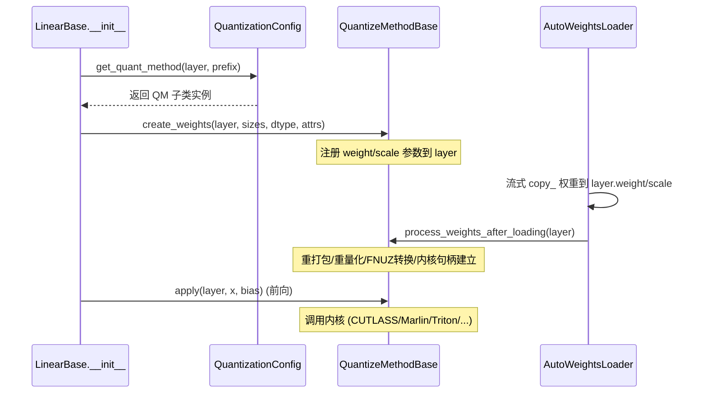

[← Wiki 首页](../../../README.md) > [模型执行](../../README.md) > [层库](../README.md) > [量化](README.md) > 通用方案接口

# schemes — 量化方案通用接口

> 涉及源码：
> - `vllm/model_executor/layers/quantization/base_config.py`（抽象基类）
> - `vllm/model_executor/layers/quantization/utils/quant_utils.py`（`QuantKey`/`GroupShape`/`ScaleDesc`）
> - 各包内 `schemes/` 子目录：`compressed_tensors/schemes/`、`quark/schemes/`、`inc/schemes/`

---

## 是什么

本页汇总量化层库中**跨方案共享的抽象接口**与"量化方案（scheme）"的描述原语。注意：任务原始清单中的 `quantization/schemes.py` **在主线并不存在**——通用契约由 `base_config.py` 的两个 ABC 承担，而"方案"一词在各量化包内有各自的 `schemes/` 子目录实现。

三个层次的抽象：

1. **`QuantizationConfig`**（`base_config.py:87`）——"模型级"配置，解析整个 checkpoint 的 `quantization_config` dict，按层分发方法。
2. **`QuantizeMethodBase`**（`base_config.py:20`）——"层级"方法契约：`create_weights` → `apply` → `process_weights_after_loading` 三段式。被 `LinearMethodBase`（`vllm/model_executor/layers/linear.py`）、`FusedMoEMethodBase`、`BaseKVCacheMethod`（`kv_cache.py:42`）继承。
3. **`QuantKey` + `GroupShape` + `ScaleDesc`**（`utils/quant_utils.py:99/44/73`）——描述"一种量化布局"的不可变数据类，是内核选择表（`_ONLINE_*_METHODS`、`init_*_linear_kernel`）的 key。
4. **各包 `schemes/` 抽象**——`CompressedTensorsScheme`（`compressed_tensors/schemes/compressed_tensors_scheme.py:11`）、`QuarkScheme`（`quark/schemes/quark_scheme.py:11`）、`INCScheme`（`inc/schemes/inc_scheme.py`）——三者接口几乎一致（`get_min_capability`/`create_weights`/`apply_weights`/`process_weights_after_loading`），是对 `QuantizeMethodBase` 的"单 Linear 方案"再细化。

---

## 为什么

- **统一内核选择的 key**。`QuantKey` 用 `(dtype, scale_desc, scale2, symmetric)` 唯一标识一种"权重/激活量化布局"（如 `kFp8Static128BlockSym` = FP8 + 128×128 block 静态 + 对称，`utils/quant_utils.py:151`）。Linear 内核选择器（`vllm/model_executor/kernels/linear/__init__.py` 的 `init_fp8_linear_kernel`）以 `(activation_quant_key, weight_quant_key)` 查表选 CUTLASS/Marlin/Triton。这让"量化布局"与"内核实现"解耦。
- **避免每个量化器重复实现 create/apply 模板**。compressed-tensors/quark/inc 都把"按 layer 名匹配 target→挑一个 scheme 类"的逻辑放在 Config 里，scheme 类只负责该布局的权重创建与前向。新增一种 W8A8 变体只需写一个 scheme 类，不改 Config。
- **支持抽象能力探测**。`QuantizeMethodBase.uses_meta_device`（`base_config.py:23`）标识在线量化方法是否需要 meta device 创建权重；`method_has_implemented_embedding`（`base_config.py:75`）检测某方法是否实现了 embedding 路径，供 tied word embeddings 处理。
- **统一 KV-cache scale 命名**。`get_cache_scale_mapper()`（`base_config.py:194`）用正则把五花八门的 checkpoint 命名收敛到 `.attn.{q,k,v}_scale`，模型代码无感知。

---

## 怎么做

### `QuantizeMethodBase` 三段式生命周期

关键钩子（`base_config.py`）：

| 方法 | 行号 | 作用 |
|---|---|---|
| `create_weights` | `:31` | 注册量化权重/尺度参数到 `layer`，记录 `logical_widths` 等元信息 |
| `apply` | `:40` | 前向：用 layer 上已就绪的权重跑内核 |
| `embedding` | `:47` | （可选）量化 embedding lookup |
| `tie_weights` | `:54` | tied word embeddings 的权重共享，重打包权重需覆盖 |
| `process_weights_after_loading` | `:67` | 加载后重打包/重量化/选内核 |
| `uses_meta_device` | `:23` | 在线量化时是否用 meta device 降峰值显存 |

### `QuantizationConfig` 关键抽象

| 成员 | 行号 | 作用 |
|---|---|---|
| `get_name` | `:108` | 返回 `QuantizationMethods` 名 |
| `get_supported_act_dtypes` | `:113` | 支持的激活 dtype（通常 bf16/fp16） |
| `get_min_capability` | `:119` | 最低 GPU capability（70=Volta…100=Blackwell） |
| `get_config_filenames` | `:130` | checkpoint 中要读的额外 json 名（多为 `[]`） |
| `from_config` | `:136` | 由 dict 构造 Config |
| `override_quantization_method` | `:141` | 自我认领 checkpoint（见 [README.md](README.md) override 探测） |
| `get_quant_method` | `:180` | **核心**：按层返回 `QuantizeMethodBase` |
| `get_cache_scale_mapper` | `:194` | KV-cache scale 命名归一化（正则） |
| `apply_vllm_mapper` | `:229` | 把 ignore 列表等按 HF→vLLM 模块名映射更新 |
| `maybe_update_config` | `:243` | 模型名/hf_config 已知后更新（如 Quark 对 DeepSeek-V3 开启动态 mxfp4） |
| `is_mxfp4_quant` | `:262` | 是否 mxfp4（影响 hidden_size 对齐，在 moe_config 创建前判定） |
| `packed_modules_mapping` | `:105` | fused 模块映射（`{"qkv_proj": ["q_proj","k_proj","v_proj"]}`），模型设置 |

### `QuantKey` 与常见常量

`QuantKey`（`utils/quant_utils.py:99`）字段：`dtype`、`scale: ScaleDesc`、`scale2`（二级尺度，NVFP4 用）、`symmetric`。`ScaleDesc`（`:73`）= `(dtype, static, group_shape)`。`GroupShape`（`:44`）= `(row, col)`，含 `PER_TENSOR(-1,-1)`、`PER_TOKEN(1,-1)`、`PER_CHANNEL(-1,1)` 静态成员。

| 常量 | 行号 | 含义 |
|---|---|---|
| `kFp8StaticTensorSym` | `:124` | FP8 per-tensor 静态对称 |
| `kFp8DynamicTensorSym` | `:127` | FP8 per-tensor 动态 |
| `kFp8DynamicTokenSym` | `:136` | FP8 per-token 动态 |
| `kFp8StaticChannelSym` | `:133` | FP8 per-channel 静态 |
| `kFp8Static128BlockSym` | `:152` | FP8 128×128 block 静态 |
| `kFp8Dynamic128Sym` | `:149` | FP8 per-block(1,128) 动态 |
| `kMxfp8Dynamic` / `kMxfp8Static` | `:158/155` | MXFP8（uint8 scale, 1×32） |
| `kNvfp4Dynamic` / `kNvfp4Static` | `:139/144` | NVFP4（FP4 + 一级 group(1,16) FP8 scale + 二级 tensor scale） |
| `kMxfp4Dynamic` | (待核实行号) | OCP MXFP4 动态 |
| `kInt8StaticChannelSym` | (待核实行号) | INT8 per-channel 静态 |
| `kInt4Static` / `kInt4StaticGroupScale` / `kInt8StaticGroupScale` | (待核实) | GPTQ/AWQ 用 |

### 各包 `schemes/` 抽象对照

| 包 | scheme 抽象 | 文件 | 主要具体 scheme |
|---|---|---|---|
| compressed_tensors | `CompressedTensorsScheme` | `compressed_tensors/schemes/compressed_tensors_scheme.py:11` | W8A8Fp8/Int8、W8A16Fp8、W4A8Fp8/Int、W4A4Mxfp4/NvFp4/Fp4、WNA16、WNA8O8Int（见 [compressed-tensors.md](compressed-tensors.md)） |
| quark | `QuarkScheme` | `quark/schemes/quark_scheme.py:11` | QuarkW8A8Fp8/Int8、QuarkW4A8_MXFP4_FP8、QuarkNVFP4、QuarkOCP_MX（见 [quark.md](quark.md)） |
| inc | `INCScheme` | `inc/schemes/inc_scheme.py` | `INCWna16Scheme`（`inc/schemes/factory.py:11` 的 `resolve_scheme` 分发） |

三者抽象方法签名一致：`get_min_capability`、`create_weights`、`apply_weights(layer, x, bias)`、`process_weights_after_loading`。

---

## 与其它模块/系统配合

- **[平台](../../../08-platforms/README.md)**：`get_min_capability` 与 `current_platform.has_device_capability`/`verify_quantization` 联动；`FP8_DTYPE = current_platform.fp8_dtype()`（`utils/quant_utils.py:20`）决定 e4m3fn vs fnuz。
- **[编译-IR](../../../09-compilation-ir/README.md)**：`apply_weights`/`apply` 内核调用多为 `CustomOp`/custom op，支持 `torch.compile`；`QuantizeMethodBase.uses_meta_device` 配合层式加载与编译。
- **Linear/FusedMoE/Attention 层**：`LinearMethodBase`/`FusedMoEMethodBase`/`BaseKVCacheMethod` 是 `QuantizeMethodBase` 的衍生契约。
- **权重加载器**：`packed_modules_mapping` + `get_cache_scale_mapper` 由 `AutoWeightsLoader` 消费。
- **内核选择**：`QuantKey` 是 `vllm/model_executor/kernels/linear/` 与各 MoE `select_*_backend` 的 key（详见 [utils.md](utils.md)）。

---

## 历史版本演进

- **v0.5 及之前**：`QuantizationConfig`/`LinearMethodBase` 抽象确立；GPTQ/AWQ 各自有独立 scheme 逻辑，未抽象为公共 scheme 类。
- **v0.6–v0.7**（待核实）：`QuantKey`/`GroupShape`/`ScaleDesc` 引入以统一 Linear 内核选择；compressed-tensors 引入 `CompressedTensorsScheme` 抽象。
- **v0.8–v0.9**（待核实）：Quark `QuarkScheme`、INC `INCScheme` 复用相同模板；`override_quantization_method` 成为多格式认领的统一入口。
- **v0.10–v0.11**（待核实）：`get_cache_scale_mapper` 用正则收敛 KV-cache 命名；`apply_vllm_mapper`/`maybe_update_config`/`is_mxfp4_quant` 增量加入以支撑 mxfp4/ModelOpt/DeepSeek-V3/Quark 动态行为。
- **v0.12 / main**：`uses_meta_device`/`tie_weights`/`method_has_implemented_embedding` 完善在线量化与 tied embedding；`scale2` 字段为 NVFP4 双级尺度引入。

---

[← 返回量化首页](README.md)

## 参见

- [量化首页](README.md) · [utils.md](utils.md) · [compressed-tensors.md](compressed-tensors.md) · [quark.md](quark.md) · [inc.md](inc.md) · [online.md](online.md)
