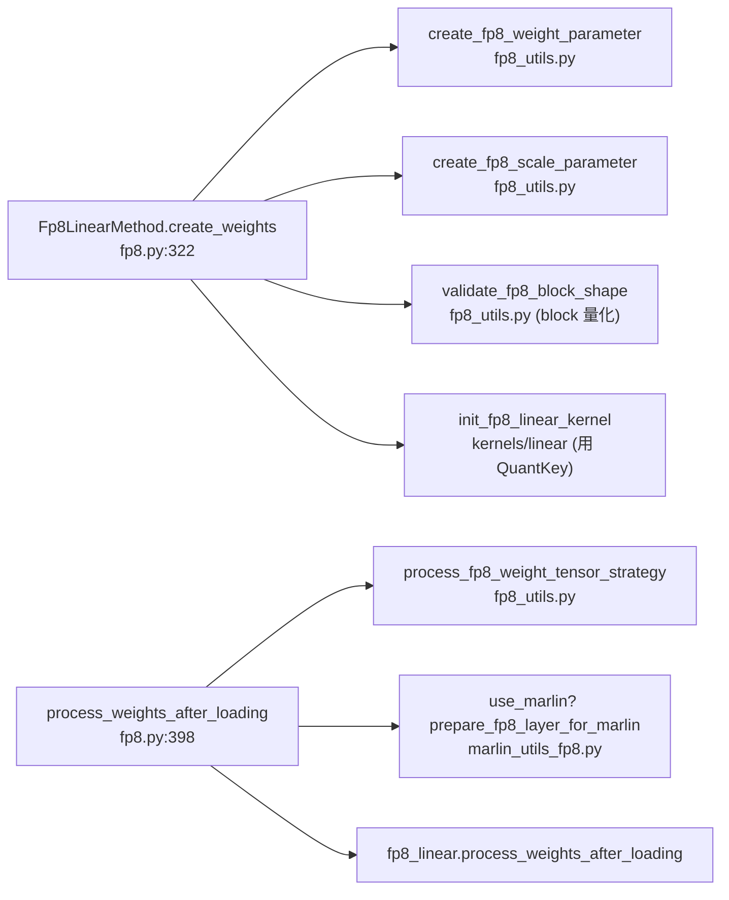

[← Wiki 首页](../../../README.md) > [模型执行](../../README.md) > [层库](../README.md) > [量化](README.md) > 通用工具

# utils — 量化通用工具集合

> 源码：`vllm/model_executor/layers/quantization/utils/`

---

## 是什么

`utils/` 是量化层库的"工具箱"，集中存放**跨方案共享**的内核胶水、权重重打包、尺度处理、平台兼容与配置查找逻辑。它本身不定义任何 `QuantizationConfig`，而是被各 `Config`/`Method` 复用。

实际文件清单：

| 文件 | 作用一句话 |
|---|---|
| `quant_utils.py` | 核心原语：`QuantKey`/`GroupShape`/`ScaleDesc`（见 [schemes.md](schemes.md)）、`is_layer_skipped`、`create_fp8_quant_key`、各 `kXxx` 常量；用于 /tests 与 /benchmarks |
| `fp8_utils.py` | FP8 权重/尺度参数创建、`process_fp8_weight_tensor_strategy[_moe]`、`validate_fp8_block_shape`、FNUZ 归一化辅助 |
| `w8a8_utils.py` | `cutlass_fp8_supported`/`cutlass_block_fp8_supported`、`normalize_e4m3fn_to_e4m3fnuz`、`requantize_with_max_scale`（per-shard→per-tensor） |
| `int8_utils.py` | INT8 w8a8/在线相关工具 |
| `marlin_utils.py` | Marlin 内核通用：`check_marlin_supported`/`verify_marlin_supported`/`check_moe_marlin_supports_layer`/`get_marlin_input_dtype`/`marlin_make_workspace_new`/`marlin_repeat_scales_on_all_ranks` |
| `marlin_utils_fp8.py` | Marlin FP8 重量化准备 `prepare_fp8_layer_for_marlin` |
| `marlin_utils_fp4.py` | Marlin FP4 相关 |
| `mxfp4_utils.py` / `mxfp6_utils.py` / `mxfp8_utils.py` | MXFP4/6/8 块大小、尺度 dtype 常量与转换（如 `MXFP8_BLOCK_SIZE`/`MXFP8_SCALE_DTYPE`/`MXFP8_VALUE_DTYPE`，`modelopt.py:71` 引用） |
| `nvfp4_utils.py` / `nvfp4_emulation_utils.py` | NVFP4 工具与仿真（无 Blackwell 硬件时） |
| `ocp_mx_utils.py` | OCP MX 标准（mxfp4/mxfp8 共用） |
| `gptq_utils.py` | GPTQ 专用：`get_dynamic_override`/`override_config`/`get_linear_quant_method`（per-module 动态规则，`auto_gptq.py:40` 引用） |
| `humming_utils.py` | Humming MoE kernel 格式转换、backend 选择、schema↔QuantKey 映射（`humming.py:33` 引用） |
| `flashinfer_utils.py` / `flashinfer_fp4_moe.py` / `flashinfer_mxint4_moe.py` | FlashInfer MoE 后端胶水（w13→w31 互换 `swap_w13_to_w31`，FP4/MXINT4 MoE） |
| `machete_utils.py` | Machete（Hopper）混合精度 Linear 内核胶水 |
| `layer_utils.py` | 通用层处理小工具 |
| `allspark_utils.py` | AllSpark 量化工具 (待核实来源) |
| `quant_utils.py` 内 `QuantKey` 等 | 见 [schemes.md](schemes.md) |
| `configs/` | **预生成内核调优配置**（JSON），文件名编码 `(N,K,device_name,dtype,block_shape)`，由 `benchmarks/kernels/` 脚本生成（见 `utils/configs/README.md`） |
| `marlin_utils_test.py` | Marlin 工具单测 |

---

## 为什么

- **避免在各 `Config` 里重复内核探测与重打包**。例如 per-tensor CUTLASS 要求单一 weight scale，但 checkpoint 里 fused QKV 有 N 个 shard scale——`requantize_with_max_scale`（`w8a8_utils.py`）和 `process_fp8_weight_tensor_strategy`（`fp8_utils.py`）把"多 shard→单 scale 重量化"集中实现，FP8/GPTQ/CT 都复用。
- **平台兼容集中化**。ROCm 的 FP8 FNUZ 与 NVIDIA 的 e4m3fn 不同，`normalize_e4m3fn_to_e4m3fnuz`（`w8a8_utils.py`）在 `fp8.py:730` 与 `fbgemm_fp8` 路径统一调用；`current_platform.fp8_dtype()` 通过 `quant_utils.py:20` 注入。
- **内核选择去重**。`check_marlin_supported` 等把 capability/workspace 检查封装，AWQ/GPTQ/MarlinFP8/CT-WNA16 共用。
- **性能调优可外置**。`configs/*.json` 把"某 N×K×dtype×block 在某 device 上选哪个内核"的决策外置成数据，便于离线 benchmark 更新而不改代码。

---

## 怎么做

### 典型调用链（以 FP8 Linear 为例）

### 常用工具速查

- **跳层判定**：`is_layer_skipped(prefix, ignored_layers, fused_mapping)`（`quant_utils.py`），各 `get_quant_method` 用它返回 `UnquantizedLinearMethod`。
- **GPTQ 动态规则**：`get_dynamic_override`/`override_config`（`gptq_utils.py`）支持 per-module `+:`/`-:` 正则匹配，`auto_gptq.py:82` 使用。
- **MoE 后端选择**：分散在各 `oracle/` 子模块（`fused_moe/oracle/fp8.py` 等），`utils` 提供底层转换如 `swap_w13_to_w31`（FlashInfer）、`convert_to_*_moe_kernel_format`。
- **configs 查找**：内核选择器按 `(N,K,device_name,dtype,block_shape)` 拼文件名在 `configs/` 找 JSON；未命中则用默认策略 (待核实具体查找函数位置)。
- **Marlin 能力**：`check_marlin_supported()` → `current_platform` capability；`check_marlin_supports_layer(layer)` 还看 group_size/num_bits；`marlin_make_workspace_new()` 分配workspace。

### `configs/` 预置覆盖矩阵

`utils/configs/` 下现存 JSON 覆盖的轴：
- **dtype**：`fp8_w8a8`、`int8_w8a8`
- **block_shape**：`[128,128]`
- **device**：NVIDIA（H100/H200/H20/L20/L20Y/L40S/A100/A800/B200）、AMD（MI300X/MI325X/MI325_OAM）
- **N×K**：覆盖 1536×7168、7168×多种K、24576×7168 等常见 Llama/Qwen/DeepSeek 形状

由 `benchmarks/kernels/` 脚本生成（`utils/configs/README.md`）。

---

## 与其它模块/系统配合

- **[平台](../../../08-platforms/README.md)**：`current_platform` 决定 fp8 dtype、capability、是否 ROCm/XPU；`verify_quantization` 黑白名单。
- **[编译-IR](../../../09-compilation-ir/README.md)**：custom op 注册（`direct_register_custom_op`，见 `bitsandbytes.py`/`fp_quant.py`）与 `torch.compile` 兼容性处理。
- **Linear/FusedMoE 内核**（`model_executor/kernels/`）：`utils` 是 Config 与 kernel 之间的转换层；`QuantKey` 是 kernel 选择 key。
- **MoE modular kernel**（`layers/fused_moe/`）：`oracle/` 内的 `select_*_moe_backend`/`convert_to_*_moe_kernel_format` 与 `utils/flashinfer_*`、`humming_utils.py` 协作。
- **benchmarks**：`utils/configs/` 由 `benchmarks/kernels/` 产出并被其消费。

---

## 历史版本演进

- **v0.5–v0.6**（待核实）：`quant_utils.py` 起初服务 /tests 与 /benchmarks；`marlin_utils.py` 随 GPTQ-Marlin/AWQ-Marlin 引入。
- **v0.7–v0.8**（待核实）：`fp8_utils.py`/`w8a8_utils.py` 抽出以支撑 FP8/INT8 W8A8；`marlin_utils_fp8.py`/`marlin_utils_fp4.py` 随 Marlin FP8/FP4 内核加入。
- **v0.9–v0.10**（待核实）：`mxfp4/mxfp8/nvfp4/ocp_mx` 系 工具随 ModelOpt/MXFP4/NVFP4 加入；`humming_utils.py`、`flashinfer_*_moe.py` 随对应后端加入。
- **v0.11–v0.12 / main**（待核实）：`configs/` 预置矩阵扩到 AMD MI325/B200/H200；`allspark_utils.py`/`machete_utils.py` 等新后端胶水持续增补。

---

[← 返回量化首页](README.md)

## 参见

- [量化首页](README.md) · [schemes.md](schemes.md) · [fp8.md](fp8.md) · [gptq.md](gptq.md) · [awq.md](awq.md) · [compressed-tensors.md](compressed-tensors.md)
