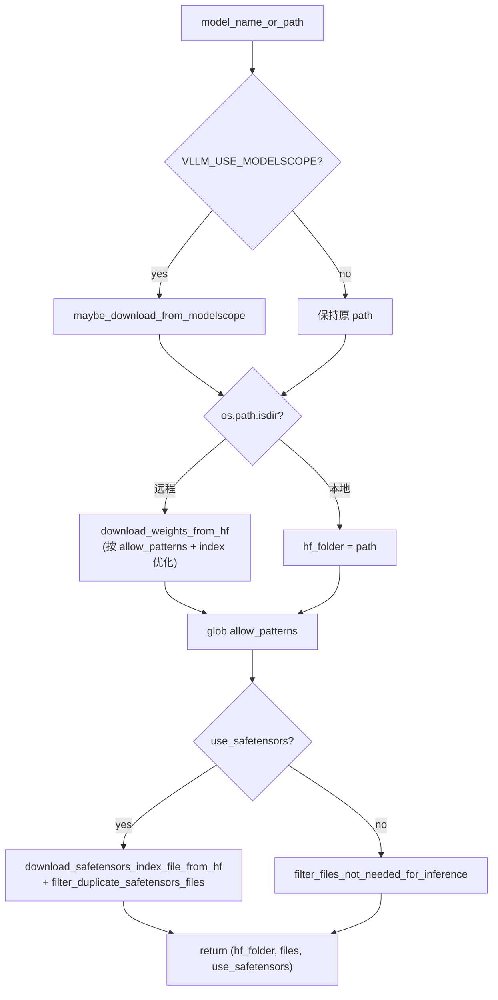

# 默认加载器：DefaultModelLoader / BaseModelLoader

[← Wiki 首页](../../README.md) > [模型执行](../README.md) > [模型加载器](./README.md) > **默认加载**

> 源码：`vllm/model_executor/model_loader/base_loader.py`、`vllm/model_executor/model_loader/default_loader.py`

---

## 是什么

`DefaultModelLoader`（`default_loader.py:43`）是 vLLM 默认权重装配路径，承载 `auto`/`hf`/`safetensors`/`pt`/`npcache`/`mistral`/`fastsafetensors`/`instanttensor` 八种 load format。它的父类 `BaseModelLoader`（`base_loader.py:25`）把"构造模型 + 喂权重 + 后处理"这套模板固化在 `load_model` 里，子类只需实现"产出 `(name, tensor)` 迭代器"。

`base_loader.py` 还提供两个工具函数：`log_model_inspection`（受 `VLLM_LOG_MODEL_INSPECTION=1` 控制，打印模型结构）与 `_has_online_quant`（检测是否存在 `quant_method.uses_meta_device=True` 的模块，决定是否触发 `finalize_layerwise_processing`）。

---

## 为什么

把"装配模板"放进基类、把"权重来源"留给子类，是模板方法模式。好处：

- 所有 loader 共享同一套 dtype/device 上下文、同一套 `process_weights_after_loading` 收尾，避免子类各自实现时漏掉在线量化 finalize 或 HPC 后处理。
- Default loader 把"格式探测 → 下载 → 选迭代器"集中到 `_prepare_weights` / `_get_weights_iterator`，新增一种文件格式只需在两处加分支。
- `Source` dataclass（`default_loader.py:49`）抽象出"一个权重来源"，使**主权重 + 次权重**（`secondary_weights`，如多模态视觉编码器权重）能用同一套迭代器逻辑串联。
- EP 权重过滤（`_init_ep_weight_filter`）在读取前就跳过非本 rank 专家张量，对 MoE 模型可省 85–90% 的存储 I/O。

---

## 怎么做

### `DefaultModelLoader.__init__`

`default_loader.py:74` 解析 `model_loader_extra_config`，仅允许三个 key：`enable_multithread_load`、`num_threads`、`enable_weights_track`。若 `enable_multithread_load=True` 且 `safetensors_load_strategy` 不在 `(None, "lazy")`，直接报错——多线程 loader 只实现 lazy 策略（`default_loader.py:118`）。

### `_prepare_weights`（`default_loader.py:128`）



`auto` 格式会先探测 `consolidated*.safetensors` 是否存在，存在则改判 `mistral`（`default_loader.py:151`）。各 format 的 `allow_patterns` 与 `index_file` 见 `default_loader.py:166` 起。

### `_get_weights_iterator`（`default_loader.py:244`）

按 `load_format` + `use_safetensors` + `enable_multithread_load` 选迭代器：

| 分支 | 迭代器 |
|---|---|
| `npcache` | `np_cache_weights_iterator` |
| safetensors + `fastsafetensors` | `fastsafetensors_weights_iterator` |
| safetensors + `instanttensor` | `instanttensor_weights_iterator` |
| safetensors + multithread | `multi_thread_safetensors_weights_iterator` |
| safetensors（普通） | `safetensors_weights_iterator`（带 `safetensors_load_strategy`/EP filter/预取线程参数） |
| pt + multithread | `multi_thread_pt_weights_iterator` |
| pt（普通） | `pt_weights_iterator` |

迭代器产出后套一层 `source.prefix` 前缀（`default_loader.py:319`），用于 `secondary_weights` 命名空间隔离。这些迭代器实现都在 `weight_utils.py`，见 [`weight-utils.md`](weight-utils.md)。

### `get_all_weights`（`default_loader.py:321`）

```python
primary_weights = Source(model_config.model, model_config.revision, prefix="", ...)
yield from self._get_weights_iterator(primary_weights)
for source in getattr(model, "secondary_weights", ()):
    yield from self._get_weights_iterator(source)
```

`secondary_weights` 是模型自定义的额外权重来源（如多模态模型的视觉塔），同样用 `Source` 描述。`fall_back_to_pt` 与 `allow_patterns_overrides` 都从模型属性读取（`getattr(model, ...)`），让模型能干预自己的加载模式。

### `load_weights`（`default_loader.py:414`）

1. 若 `quantization == "torchao"` 且 checkpoint 是 torchao 序列化 + torchao≥0.15，把 `safetensors_load_strategy` 改为 `"torchao"`。
2. `_init_ep_weight_filter(model_config)` —— 计算 `self.local_expert_ids`，供迭代器里 `should_skip_weight` 用。
3. `model.load_weights(self.get_all_weights(...))` —— 进入模型自己的 `load_weights`（通常由 `AutoWeightsLoader` 驱动，逐层 dispatch 到 `weight_loader` 回调）。返回 `loaded_weights: set[str] | None`。
4. 计时并 `logger.info_once("Loading weights took %.2f seconds", ...)`。
5. `track_weights_loading`：仅对**非量化**且 `loaded_weights is not None` 的模型默认开启严格校验；若开启，则把"模型全部参数名 − 已加载名"差集非空时 `raise ValueError`（`default_loader.py:447`）。在线量化/后处理量化模块的参数会被显式加入 `loaded_weights` 以免误报。

### EP 权重过滤初始化

`_init_ep_weight_filter`（`default_loader.py:351`）条件：`is_moe` + `enable_expert_parallel` + `enable_ep_weight_filter`，且 `enable_eplb=False`（EPLB 开启时冗余物理槽需要全量逻辑专家权重，故不过滤）。计算 `ep_size = dp_size*pcp_size*tp_size`、`ep_rank` 后调 `compute_local_expert_ids`（见 [`ep-weight-filter.md`](ep-weight-filter.md)）。

### `BaseModelLoader.load_model` 模板

见总览 [`./README.md`](./README.md) 与 `base_loader.py:43`。关键点：

- `with set_default_torch_dtype(...)` + `with target_device:` 保证新建参数直接落在目标设备/dtype。
- `process_weights_after_loading`（在 `loader/utils.py:101`）遍历所有模块，对 `QuantizeMethodBase` 调 `quant_method.process_weights_after_loading`；对 `Attention`/`MLAAttention`/`MMEncoderAttention` 调其 `process_weights_after_loading(dtype)`；对 `HpcModule` 调 `process_weights_after_loading(model)`（Dummy loader 场景下兜底）。CPU offloading 时用 `device_loading_context` 把模块临时搬回目标设备处理后搬回。
- `_has_online_quant` → `finalize_layerwise_processing`（见 [`reload.md`](reload.md)）。

---

## 与其它模块/系统配合

| 协作方 | 关系 |
|---|---|
| `weight_utils.py` | 提供 `download_weights_from_hf`、所有迭代器、`get_quant_config`、`default_weight_loader` |
| `loader/utils.py::initialize_model` / `process_weights_after_loading` | `load_model` 模板里调用 |
| `ep_weight_filter.py` | `_init_ep_weight_filter` + 迭代器内 `should_skip_weight` |
| `reload/` | `_has_online_quant` → `finalize_layerwise_processing`；`record_metadata_for_reloading` 在 `initialize_model` 内调用 |
| `vllm/distributed` | EP filter 计算 dp/tp/pcp rank |
| 模型层 `weight_loader` 回调 | 接收 `(param, loaded_weight)`，做 TP 切分/融合 |
| `vllm/transformers_utils/repo_utils` | `list_filtered_repo_files` 探测 mistral 格式 |

---

## 历史版本演进

| 时间锚 | 变更要点 |
|---|---|
| 早期 | `default_loader` 含 `_prepare_weights`/`_get_weights_iterator` 基本骨架 |
| 中期 | 引入 `safetensors_load_strategy`（lazy/eager/prefetch/torchao）与 `multi_thread_*` 迭代器 |
| main | `Source` dataclass + `secondary_weights` 抽象（多模态主/次权重分离） |
| main（#37136） | `_init_ep_weight_filter` 与 `local_expert_ids` 注入迭代器 |
| main（#36139） | `instanttensor` 分支 |
| main | `track_weights_loading` 对在线量化模块显式豁免，避免误报 |

---

## 参见

- [`weight-utils.md`](weight-utils.md) —— 迭代器与下载细节
- [`ep-weight-filter.md`](ep-weight-filter.md) —— EP 过滤
- [`reload.md`](reload.md) —— 在线量化 finalize
- [`../README.md`](../README.md) —— 返回模型执行首页
