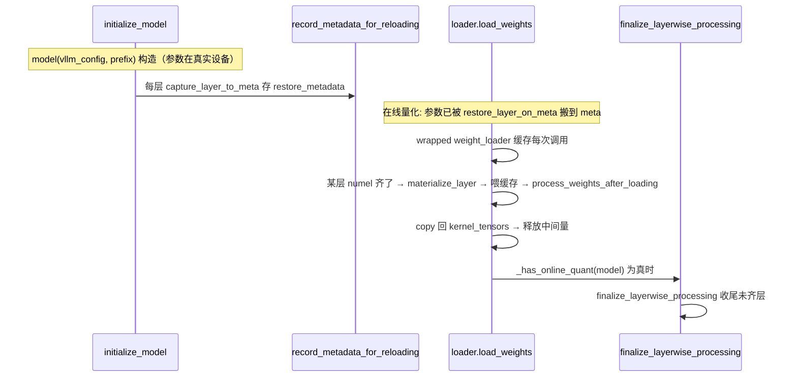

# reload/：层次化热重载

[← Wiki 首页](../../README.md) > [模型执行](../README.md) > [模型加载器](./README.md) > **热重载**

> 源码目录：`vllm/model_executor/model_loader/reload/`

---

## 是什么

`reload/` 子包提供**层次化权重热重载**能力：在不重建模型的前提下，把一张已经量化/处理过的模型恢复到 meta device，再逐层喂入新高精度权重、逐层做在线量化与后处理，最后把处理后的张量写回原 kernel 格式存储。它服务于两类场景：

1. **在线量化**（online quantization）：`quant_method.uses_meta_device=True` 的方法在 `initialize_model` 时参数落在 meta device，加载期边喂高精度权重边量化，全部喂完后 `finalize_layerwise_processing` 收尾。
2. **torchao 模型从高精度权重重载**：RL 训练循环里模型已是 torchao 量化态，需用一份新的 bf16/fp16 checkpoint 重新在线量化。

文件构成：

| 文件 | 职责 |
|---|---|
| `__init__.py` | 统一导出 `record_metadata_for_reloading`/`initialize_layerwise_reload`/`finalize_layerwise_processing`/`finalize_layerwise_reload`/`set_torchao_reload_attrs`/`support_quantized_model_reload_from_hp_weights` |
| `types.py` | `LayerReloadingInfo` dataclass：每层重载所需状态 |
| `layerwise.py` | 核心：记录/初始化/终结层次化重载，包裹 weight_loader 做延迟处理 |
| `meta.py` | meta tensor 捕获/物化、`SKIP_TENSORS` 清单 |
| `utils.py` | `get_layer_tensors`/`get_layer_params_buffers`/`get_layer_size`/`has_device_tensors` |
| `sanitize.py` | `sanitize_layer_refs`/`restore_layer_refs`：消除循环引用 |
| `torchao_decorator.py` | torchao 专用：`set_torchao_reload_attrs` + `support_quantized_model_reload_from_hp_weights` 装饰器 |

---

## 为什么

普通加载是"建空模型 → 喂权重 → 后处理"的一次性流水。但在线量化要求"喂完一层就能量化一层、量化完再丢掉高精度中间量"，否则显存炸。层次化重载把"延迟处理"做成了通用机制：

- 每层用 `WeakKeyDictionary` 存 `LayerReloadingInfo`，记录其 meta 元数据、kernel 格式张量、已加载 numel。
- 包裹层的 `weight_loader` 回调：先把每次 `(param, loaded_weight)` 调用缓存起来，直到该层"numel 齐了"才物化层 → 喂缓存权重 → 跑 `quant_method.process_weights_after_loading` → 把结果 copy 回原 kernel_tensors 存储 → 释放高精度中间量。
- meta device 让"建空模型"阶段不分配显存，`materialize_meta_tensor` 才真正分配。

这让 sleep/wake_up（vLLM 的显存释放/恢复机制）和 RL 热重载共享同一套 weight_loader 回调，不 require 模型层改写。

### 已知限制（`__init__.py:9` 起文档）

1. 与 CPU offloading 组合未实现。
2. tied 参数只反映其中一个父层的处理（如 `embed_tokens`）。
3. 假设"从磁盘加载的权重数量 = 模型 init 时创建的参数数量"，对会 pad 或 qkv 合并的 quant 方法当前无碍，但未来 quant 可能打破。

---

## 怎么做

### 数据结构

`LayerReloadingInfo`（`types.py:15`）：

| 字段 | 含义 |
|---|---|
| `restore_metadata: LayerTensors` | 参数/buffer 的 meta 元数据（`capture_layer_to_meta` 产出） |
| `restore_device: torch.device` | 物化时用的设备 |
| `load_numel` / `load_numel_total` | 已加载/总 numel，用于判定"层是否齐了" |
| `loaded_weights: list[(str, BoundArguments)]` | 缓存的 weight_loader 调用 |
| `kernel_tensors: LayerTensors \| None` | 该层 kernel 格式张量（重载写回目标） |
| `can_load()` | `load_numel_total is not None` |

### 生命周期

### 关键函数

- `record_metadata_for_reloading(model)`（`layerwise.py:70`）：在 `initialize_model`（`loader/utils.py:42`）末尾调用，每层 `capture_layer_to_meta`。
- `initialize_layerwise_reload(model)`（`layerwise.py:84`）：把每层参数搬到 meta、保存 kernel_tensors、包裹 weight_loader。`can_load()` 的层跳过。
- `initialize_online_processing(layer)`（`layerwise.py:120`）：包裹 weight_loader，缓存调用直到层齐。
- `finalize_layerwise_processing(model, model_config)`（`layerwise.py` 后半）：在 `BaseModelLoader.load_model`（`base_loader.py:78`）里当 `_has_online_quant` 为真时调用，处理未齐层与 online quant 收尾。
- `finalize_layerwise_reload(model, model_config)`：torchao 重载收尾，由 `support_quantized_model_reload_from_hp_weights` 装饰器调。

### meta device 工具（`meta.py`）

- `to_meta_tensor`：保留类与属性，data 搬到 meta。
- `materialize_meta_tensor`：按 size/stride `torch.empty_strided` 物化。
- `capture_layer_to_meta` / `restore_layer_on_meta` / `materialize_layer`。
- `SKIP_TENSORS = {"_expert_map","expert_mask","expert_global_to_physical","expert_physical_to_global","expert_local_to_global","e_score_correction_bias"}`：这些永不进 meta、不走 weight_loader，重载时跳过（`meta.py:25`）。

### torchao 装饰器（`torchao_decorator.py`）

`support_quantized_model_reload_from_hp_weights(original_load_weights)` 包装 `AutoWeightsLoader.load_weights`：若 `model._do_torchao_reload` 为真，则 `initialize_layerwise_reload` → 原始 load_weights（逐层触发在线量化）→ `finalize_layerwise_reload`。`set_torchao_reload_attrs` 在 `process_weights_after_loading`（`loader/utils.py:140`）末尾对 torchao 模型设 `_do_torchao_reload=True`/`_model_config`。

### Dummy loader 的复用

`DummyModelLoader.load_weights`（`dummy_loader.py:36`）用 `get_layerwise_info(layer).can_load()` 判断：能加载的层走 `_process_online_quant_layer`（materialize + dummy 权重 + process_weights_after_loading）；其余层直接 `initialize_dummy_weights`。

---

## 与其它模块/系统配合

| 协作方 | 关系 |
|---|---|
| `BaseModelLoader.load_model` | `_has_online_quant` → `finalize_layerwise_processing` |
| `loader/utils.py::initialize_model` | 末尾 `record_metadata_for_reloading`；`process_weights_after_loading` 末尾 `set_torchao_reload_attrs` |
| `DummyModelLoader` | 复用 `get_layerwise_info`/`materialize_layer`/`_get_original_loader` |
| `layers/quantization/online/` | 在线量化方法（`uses_meta_device=True`） |
| `layers/quantization/torchao` | torchao 重载路径 |
| `models/utils.py::AutoWeightsLoader` | `support_quantized_model_reload_from_hp_weights` 装饰其 `load_weights` |
| `#09 编译` | sleep/wake_up 与 CUDA graph 稳定性受重载影响（`prefer_copy` 见 `utils.py`） |

---

## 历史版本演进

| 时间锚 | 变更要点 |
|---|---|
| 中期 | 在线量化（meta device + 逐层处理）首次引入，函数散落在 loader 模块 |
| main | 整理为 `reload/` 子包（`layerwise.py`/`meta.py`/`types.py`/`utils.py`/`sanitize.py`/`torchao_decorator.py`） |
| main（#44814） | Bugfix：composed weight loader 后漏参数问题 |
| main（#44589） | 移除冗余 `load_weights` 方法，统一走 `AutoWeightsLoader` |
| main | `SKIP_TENSORS` 扩充（`_expert_map` 等 EPLB/EP 相关 buffer） |

---

## 参见

- [`default.md`](default.md) —— `finalize_layerwise_processing` 调用点
- [`bnb.md`](bnb.md) —— 在线量化同类场景对比
- [`../README.md`](../README.md) —— 返回模型执行首页
