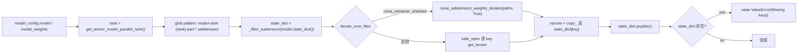

# ShardedStateLoader：TP/PP 预分片权重

[← Wiki 首页](../../README.md) > [模型执行](../README.md) > [模型加载器](./README.md) > **ShardedState**

> 源码：`vllm/model_executor/model_loader/sharded_state_loader.py`

---

## 是什么

`ShardedStateLoader`（`sharded_state_loader.py:29`）对应 `load_format="sharded_state"` 与 `"runai_streamer_sharded"`。它直接加载"已经按 TP rank 切好的 checkpoint"，每个 worker 只读属于自己的那个分片，而不必像默认 loader 那样每 rank 都读全量再切。默认文件名 pattern：`model-rank-{rank}-part-{part}.safetensors`。

配套提供 `save_model` 静态方法，可把一张已加载的模型按 rank 落盘成这套分片格式，便于下次快速加载（示例脚本：`examples/features/sharded_state/save_sharded_state_offline.py`）。

---

## 为什么

大 TP 模型（如 TP=8 的 70B）若用默认 loader，每个 rank 都要从全量 checkpoint 读自己那份再丢掉其余，I/O 浪费严重。预分片 checkpoint 让每个 rank 只读自己那 `1/N` 的权重，加载时间近线性下降。代价是 checkpoint 体积略增（无法共享 tied weight 存储），且只能用于 vLLM 自产自销的场景——分发到第三方时不通用。

另一个场景是 PP：pipeline 并行下各 rank 拥有不同层，预分片能让每个 PP rank 只读自己的层权重。

---

## 怎么做

### `__init__`

`sharded_state_loader.py:40` 从 `model_loader_extra_config` 读 `pattern`（默认 `DEFAULT_PATTERN = "model-rank-{rank}-part-{part}.safetensors"`），其余 key 报错。

### `_prepare_weights`（`sharded_state_loader.py:94`）

- 若 `is_s3(path)` 或本地目录，直接用 path。
- 否则 `download_weights_from_hf` 下载 `*.safetensors`。

### `load_weights`（`sharded_state_loader.py:110`）

- `model_weights_override`：若 `model_config.model_weights` 非空则覆盖路径（支持权重与配置分离存放）。
- `_filter_subtensors`（`sharded_state_loader.py:57`）：剔除共享同一段 storage 的子张量，避免重复写。按 `(device, data_ptr)` 分组，保留覆盖范围最大的那个。
- LoRA 场景下参数可能被 pad，用 `narrow(dim, 0, size)` 只 copy 实际权重部分（`sharded_state_loader.py:144`）。

### `save_model`（`sharded_state_loader.py:178`）

按 `max_size` 分 part，逐 part `save_file` 落盘 `model-rank-{rank}-part-{part}.safetensors`，同样先 `_filter_subtensors` 去重。可用于离线生成分片 checkpoint。

---

## 与其它模块/系统配合

| 协作方 | 关系 |
|---|---|
| `vllm/distributed` | `get_tensor_model_parallel_rank` 决定读哪个 rank 的 shard |
| `weight_utils.py` | `download_weights_from_hf`、`runai_safetensors_weights_iterator` |
| `vllm/transformers_utils/s3_utils` | `is_s3`/`s3_glob` 支持 S3 路径 |
| `config/load.py::LoadConfig` | `model_loader_extra_config.pattern`、`ignore_patterns` |
| `#07 分布式` | TP/PP 分片语义见 [`../../07-distributed/`](../../07-distributed/README.md) |

---

## 历史版本演进

| 时间锚 | 变更要点 |
|---|---|
| 早期 | 引入 `ShardedStateLoader` + `save_model`，pattern 固定 |
| 中期 | 支持 S3 路径（`is_s3`/`s3_glob`） |
| main | 支持 `runai_streamer_sharded` 复用 `iterate_over_files` 分支 |
| main | `model_weights_override` 支持权重与配置路径分离 |

---

## 参见

- [`weight-utils.md`](weight-utils.md) —— 下载与 runai 迭代器
- [`runai.md`](runai.md) —— runai_streamer_sharded 共用迭代器
- [`../README.md`](../README.md) —— 返回模型执行首页
