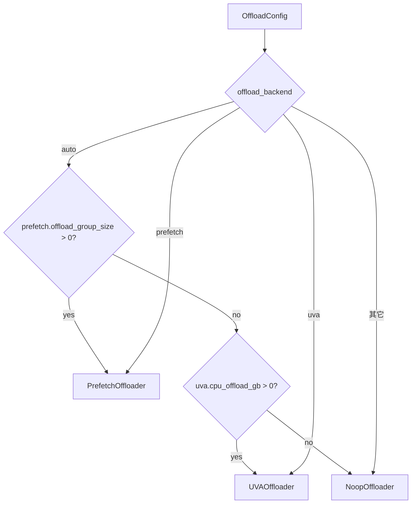

# offloader/：权重 CPU 卸载与 UVA 预取

[← Wiki 首页](../README.md) > [模型执行](./README.md) > **权重卸载**

> 源码目录：`vllm/model_executor/offloader/`

---

## 是什么

`offloader/` 子系统在模型参数装好后、推理前，把部分参数从 GPU 挪到 CPU（pinned memory），推理时按需搬回，从而在显存不足以装下整模型时仍能运行。它提供三种策略，由 `OffloadConfig.offload_backend` 选择：

| 策略 | 类 | 机制 | 何时用 |
|---|---|---|---|
| `uva` | `UVAOffloader` | 参数放 CPU pinned，建 CUDA UVA view 零拷贝访问；禁用 UVA 时退化为 `functional_call` 按需 `.to(device)` | 显存不够、有快 CPU-GPU 互连（如 NVLink/GH200） |
| `prefetch` | `PrefetchOffloader` | 按 layer group 把参数搬 CPU，推理时用独立 copy stream 异步 H2D 预取到 GPU 静态 buffer，事件同步 | 显存不够、且要兼容 torch.compile + CUDA graph |
| `noop` | `NoopOffloader` | 不卸载 | 显存够 |

`offloader/__init__.py` 导出 `BaseOffloader`/`NoopOffloader`/`UVAOffloader`/`PrefetchOffloader`/`create_offloader`/`get_offloader`/`set_offloader`/`should_pin_memory`。全进程单例：`_instance`（`base.py:108`），默认 `NoopOffloader`。

---

## 为什么

大模型（如 70B BF16 ≈ 140GB）单卡装不下。两种解法：

1. **UVA**：在统一虚拟寻址的卡上（CUDA UVA），GPU 直接读 CPU pinned 内存，无需显式 H2D copy。简单但每次 forward 都走 PCIe，延迟高，依赖快互连。GH200 等统一内存机型尤其受益。
2. **Prefetch**：把模型按 layer group 分，每组最后几层卸 CPU，其余在 GPU。forward 到某层前用 copy stream 异步预取，用 event 保证计算流等 copy 完。静态 GPU buffer 双/三缓冲复用，显存占用 = `prefetch_step × 层大小`。兼容 torch.compile 与 CUDA graph（custom op + event）。

两者都靠 `OffloadConfig` 子配置激活：

- `uva.cpu_offload_gb > 0` → UVA（按字节预算卸载，可选 `cpu_offload_params` 指定卸哪些参数）。
- `prefetch.offload_group_size > 0` → prefetch（按 layer group 卸，`offload_num_in_group` 控制每组卸几层，`offload_prefetch_step` 控制预取深度）。

`offload_backend="auto"` 时优先 prefetch（同时配置则 prefetch 中选，发 warning）。

---

## 怎么做

### create_offloader（`base.py:126`）

### UVAOffloader（`uva.py:21`）

`wrap_modules`（`uva.py:51`）逐模块 `_maybe_offload_to_cpu`：

1. 跳过已在 CPU / 无参数 / 超字节预算的模块。
2. 对每个参数：若设了 `cpu_offload_params`，按段匹配（`f".{param}." in f".{name}."`）决定是否卸；否则全卸直到预算用尽。
3. `cpu_data = p.data.to("cpu")`，`should_pin_memory()` 为真则 `pin_memory()`。
4. UVA 开启（`is_uva_available() and not VLLM_WEIGHT_OFFLOADING_DISABLE_UVA`）：`p.data = get_accelerator_view_from_cpu_tensor(cpu_data)`，标 `p._vllm_is_uva_offloaded = True`。
5. UVA 关闭：直接 `p.data = cpu_data`，并包裹 `module.forward`：每次 forward 把 state_dict `.to(device, non_blocking=True)` 后用 `functional_call(module, device_state, ...)` 调用（避免改原参数引用）。

`should_pin_memory`（`base.py:23`）：`is_pin_memory_available() and not VLLM_WEIGHT_OFFLOADING_DISABLE_PIN_MEMORY`。GH200 等统一内存机型 pinned memory 吃 GPU 显存，故可禁。

### PrefetchOffloader（`prefetch.py:127`）

核心组件：

- `ParamInfo`（`prefetch.py:29`）：name/shape/stride/dtype，`key` 含 name 防同层不同参数共享 buffer，如图。
- `StaticBufferPool`（`prefetch.py:60`）：按 `(name, shape, stride, dtype)` 分组，每组预分配 `slot_capacity` 个 GPU buffer（双/三缓冲），`get_buffer` 按 `slot_idx % slot_capacity` 取。
- `_ModuleOffloader`：每个被卸 layer 一个，持 CPU 存储 + copy_stream + `_copy_done_event`，`start_onload_to_static` 发起 async H2D。
- `prefetch_ops.py`：custom op `vllm::wait_prefetch`/`vllm::start_prefetch`，用 `mutates_args` 造数据依赖，让 torch.compile 不重排。

`wrap_modules`（`prefetch.py:163`）：按 `module_index % group_size >= group_size - num_in_group` 选要卸的层，建 `_ModuleOffloader`，装 forward hook。hook 内：

1. `torch.ops.vllm.wait_prefetch(input_tensor, index)` 等本层 copy 完。
2. 跑原始 forward。
3. `torch.ops.vllm.start_prefetch(output, next_index)` 启动下一层预取（循环索引）。

`post_init`（`prefetch.py:310`）：先 `sync_cpu_storage`（因 `process_weights_after_loading` 可能改了 CPU 存储），收 `ParamInfo`，建 `StaticBufferPool`（slot 数 = `prefetch_step`），给每个 `_ModuleOffloader` 分配 slot 并把参数指向 GPU buffer，启动初始预取。

`_wait_for_layer`（`prefetch.py:243`）分两种同步：

- CUDA graph 捕获中：用 `wait_event(_copy_done_event)`（graph 兼容），跳过捕获前的预取 event。
- eager：event 有效则 `wait_event`，否则 `wait_stream` 全清。

`sync_prev_onload`/`join_after_forward`：CUDA graph 捕获前后用，把未 join 的预取 event 全 join。

### 与加载器/后处理的衔接

`device_loading_context`（`loader/utils.py:144`）在 `process_weights_after_loading` 里把 CPU 模块临时搬回目标设备处理后搬回，并对 UVA offload 参数重新做 UVA view（`uva.py` 注释 + `loader/utils.py:159`）。`prefetch.post_init` 末尾 `sync_cpu_storage` 正是为了拿到 `process_weights_after_loading` 后的最新 CPU 存储。

---

## 与其它模块/系统配合

| 协作方 | 关系 |
|---|---|
| `config/offload.py::OffloadConfig` | `offload_backend`/`uva`/`prefetch` 子配置驱动创建；`compute_hash` 纳入编译缓存因子 |
| `v1/worker/gpu_worker.py` | 初始化期 `create_offloader` + `set_offloader` + `wrap_modules` + `post_init` |
| `loader/utils.py::device_loading_context` | quant method 后处理时把卸载参数临时搬回 |
| `vllm/utils/platform_utils` | `is_pin_memory_available`/`is_uva_available` |
| `vllm/utils/torch_utils` | `get_accelerator_view_from_cpu_tensor`/`get_dtype_size`/`direct_register_custom_op` |
| `#09 编译` | prefetch 的 custom op 与 CUDA graph 兼容性 |
| `#08 平台` | UVA 可用性、pin memory 可用性 |
| `#02 执行层` | Worker 调 `join_after_forward`/`sync_prev_onload` |

---

## 历史版本演进

| 时间锚 | 变更要点 |
|---|---|
| 中期 | `cpu_offload_gb` 首次引入（UVA 路径），参数按字节预算卸到 CPU pinned |
| 近期（main） | 从 sglang 适配引入 `PrefetchOffloader`（`base.py`/`prefetch.py` 头部注释明示 Adapted from sglang），支持 torch.compile + CUDA graph |
| main | `offload_backend` 显式选择器 + `auto` 规则（prefetch 优先于 uva） |
| main | `prefetch_ops.py` 注册 `wait_prefetch`/`start_prefetch` custom op，用 `mutates_args` 造依赖 |
| main（#47140/#47668） | `torch.cuda.Event` ↔ `torch.Event` 替换与 revert |
| main | `StaticBufferPool` key 含 `name` 防同层异参共享；`_filter_subtensors` 风格的 stride 保留 |

---

## 参见

- [`warmup.md`](warmup.md) —— offload 与 warmup 的时序（warmup 在 offload 装好后）
- [`model-loader/default.md`](model-loader/default.md) —— `device_loading_context` 与 `process_weights_after_loading`
- [`../09-compilation-ir/`](../09-compilation-ir/README.md) —— custom op 与 CUDA graph
- [`../README.md`](../README.md) —— 返回模型执行首页
