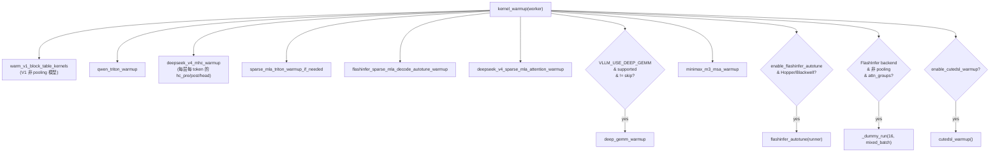

# warmup/：启动期 kernel 自动调优与编译预热

[← Wiki 首页](../README.md) > [模型执行](./README.md) > **预热**

> 源码目录：`vllm/model_executor/warmup/`

---

## 是什么

`warmup/` 子系统在 Worker 启动、模型加载完成、`torch.compile` 预热之后、**CUDA graph 捕获之前**，把所有"会在推理期触发 JIT/autotune 的 kernel"提前编译/调优一遍，避免首请求承担编译延迟。入口是 `kernel_warmup(worker)`（`kernel_warmup.py:46`），由 `v1/worker/gpu_worker.py:758` 调用。

它不"热身显存"（那是 profiling/dummy run 的职责），而是"热身 kernel 代码本身"——DeepGEMM/CuTeDSL/TileLang/Triton 这些 JIT 后端第一次跑会编译 source，FlashInfer 首次会 autotune 选 tactic。

文件构成：

| 文件 | 预热对象 |
|---|---|
| `kernel_warmup.py` | 总入口，编排所有 warmup |
| `deep_gemm_warmup.py` | DeepGEMM FP8 block-scaled GEMM JIT |
| `qwen_triton_warmup.py` | Qwen3-Next/3.5 Triton kernel（GDN/zero_kv/slot_mapping/post_conv） |
| `deepseek_v4_mhc_warmup.py` | DeepSeek v4 mHC TileLang kernel（hc_pre/post/head） |
| `sparse_mla_triton_warmup.py` | sparse MLA Triton metadata kernel |
| `flashinfer_sparse_mla_warmup.py` | FlashInfer sparse MLA decode autotune + DSv4 warmup |
| `flashinfer_autotune_cache.py` | FlashInfer autotune cache 文件解析/写入 |
| `cutedsl_warmup.py` | CuTeDSL compile unit 注册与批量编译 |
| `fa4_cutedsl_config.py` | FA4 MLA prefill CuTeDSL compile 形状计划 |
| `v1_block_table_warmup.py` | v1 block table / slot mapping Triton |
| `minimax_m3_msa_warmup.py` | MiniMax M3 sparse attention |

---

## 为什么

JIT 类后端（DeepGEMM 用 CUTLASS JIT、CuTeDSL 用 cute-dsl、TileLang、Triton）首次执行会编译 source 并缓存到 `~/.cache`，耗时毫秒到秒级。FlashInfer 对同一 op 有多套实现，autotune 跑 benchmark 选最优 tactic。若把这些延迟放到首请求：

- 首请求 P99 飙高（"冷启动慢"）。
- CUDA graph 捕获期若触发 JIT，图重放时 kernel 已变，行为不一致。
- 分布式下各 rank tactic 不一致导致 collectives 错位。

warmup 把这些一次性成本前移到启动期，且对 FlashInfer 在 rank 0 调优后 `broadcast_object` 同步给所有 rank（`kernel_warmup.py:196`），保证 tactic 一致。

---

## 怎么做

### kernel_warmup 总编排（`kernel_warmup.py:46`）

调用顺序（按 `gpu_worker.py` 时序：compile 预热 → `kernel_warmup` → CUDA graph 捕获）：

### DeepGEMM warmup（`deep_gemm_warmup.py`）

`deep_gemm_warmup(model, max_tokens)`：

- 从模型里找 `Fp8LinearMethod`/`Mxfp8OnlineLinearMethod` 的 `LinearBase` 与 `DeepGemmExperts`/`TritonOrDeepGemmExperts` 的 MoE。
- `_generate_optimal_warmup_m_values`（`:39`）按 DeepGEMM 的 block size 枚举（block_ms=[64,128,256]，block_ns=16..256 step 16）生成覆盖所有 kernel 配置的 M 值集合。
- 对每个 M 调 `fp8_gemm_nt`/`m_grouped_fp8_gemm_nt_contiguous` 触发 JIT 编译。
- 受 `VLLM_USE_DEEP_GEMM`/`VLLM_DEEP_GEMM_WARMUP`（`skip` 可禁）控制。

### Qwen Triton warmup（`qwen_triton_warmup.py`）

针对 `qwen3_next`/`qwen3_5`/`qwen3_5_moe` 等 model_type，从 `model_runner.compile_keys` 反推要预热的 GDN/zero_kv/slot_mapping/post_conv 形状，覆盖 L=1 constexpr、非整除、整除三种 length。`_QWEN_MODEL_TYPES` 白名单外直接 no-op。

### DSv4 mHC warmup（`deepseek_v4_mhc_warmup.py`）

`deepseek_v4_mhc_warmup(model, max_tokens, cudagraph_capture_sizes)`：对每 decoder 层的 `hc_pre`/`hc_post`/`hc_head_op` TileLang kernel，跨 `_DEFAULT_TOKEN_SIZE_CANDIDATES`（1..16384）与 cudagraph capture sizes 预热。非 DSv4 模型或无 `hc_*` 属性早退。`_AUTO_WARMUP_MAX_TOKENS=16384` 封顶。

### sparse MLA Triton warmup（`sparse_mla_triton_warmup.py`）

仅当 attention backend 在 `_DEEPSEEK_V4_SPARSE_MLA_BACKENDS`/`_GENERIC_SPARSE_MLA_BACKENDS`/`_INDEXER_PREFILL_CHUNK_METADATA_BACKENDS` 时执行。覆盖 prefill chunk metadata 的多种 compress ratio、seq_len multiplier、query_slice_offset 组合，以及 `combine_topk_swa` 输入变体。

### FlashInfer autotune（`kernel_warmup.py:133`）

`flashinfer_autotune(runner)`：

- 分布式（world_size>1）：每 rank 都 `autotune()` + `_dummy_run(max_tokens)`，`barrier`，不开持久 cache（保证各 rank tactic 同步）。
- 单机/分布式 rank 0 leader：`resolve_flashinfer_autotune_file` 算 cache 路径，`autotune(tune_mode=True, cache=path)` 跑 dummy run，写 cache；非 leader rank 同步 dummy run。
- `broadcast_object` 把 rank 0 的 cache bytes 广播给所有 rank，各 rank `write_flashinfer_autotune_cache` + `AutoTuner.get().load_configs`。
- 仅 Hopper（SM 9.0）/Blackwell（SM 10.0）+ `enable_flashinfer_autotune` 为真（默认）时执行。

### CuTeDSL warmup（`cutedsl_warmup.py`）

`cutedsl_warmup()`：遍历 `register_cutedsl_warmup_provider` 注册的对象，取其 `get_cutedsl_warmup_compile_units()`，去重（按 `unit.key`），在 `torch.inference_mode()` 下逐 unit `compile()`，最后 `synchronize`。`CuTeDSLCompileUnit(name, key, compile)` 是 dataclass。非 CUDA 平台早退。FA4 MLA prefill 的 compile 形状计划在 `fa4_cutedsl_config.py`（`FA4_MLA_PREFILL_*` 常量，覆盖 sm90/sm100f/sm120）。

### v1 block table warmup（`v1_block_table_warmup.py`）

`warm_v1_block_table_kernels(device, max_tokens)`：构造 `BlockTable(block_size∈{3,16}, ...)`，`commit_block_table` + `compute_slot_mapping` 触发 slot mapping Triton kernel 编译。仅 V1 且非 pooling 模型。

### MiniMax M3 MSA warmup（`minimax_m3_msa_warmup.py`）

仅当模型含 `MiniMaxM3SparseAttention` 且 CUDA SM100 时，`_dummy_run(16, mixed_batch, force_attention=True)` 触发 sparse prefill。

---

## 与其它模块/系统配合

| 协作方 | 关系 |
|---|---|
| `v1/worker/gpu_worker.py` | `init_worker` 时序：compile 预热 → `kernel_warmup(self)`（`:758`）→ `capture_model` |
| `v1/worker/gpu_model_runner.py` | `_dummy_run(num_tokens, skip_eplb, is_profile, force_attention, create_mixed_batch)` 是通用预热原语 |
| `v1/worker/gpu/warmup.py` | `run_mixed_prefill_decode_warmup` 供 flashinfer_sparse_mla 调 |
| `model_executor/kernels/` | DeepGEMM/mHC kernel 实现在此 |
| `utils/deep_gemm.py`/`utils/flashinfer.py` | `is_deep_gemm_supported`/`has_flashinfer`/`autotune` |
| `config/kernel_config.py` | `enable_flashinfer_autotune`/`enable_cutedsl_warmup` |
| `vllm/envs` | `VLLM_USE_DEEP_GEMM`/`VLLM_DEEP_GEMM_WARMUP` |
| `vllm/distributed/parallel_state` | `get_world_group`/`get_dp_group`/`is_global_first_rank` |
| `models/minimax_m3/nvidia/model.py` | `MiniMaxM3SparseAttention` 类型判定 |
| `#09 编译` | warmup 必须在 compile 之后、CUDA graph 之前 |
| `#05 注意力` | FlashInfer/FA4/sparse MLA backend 选择 |

---

## 历史版本演进

| 时间锚 | 变更要点 |
|---|---|
| 中期 | `v1_block_table_warmup` 等基础 Triton 预热引入 |
| main（#46634） | 扩展 Triton kernel warmup 覆盖，DSv4 sparse MLA metadata |
| main（#46182） | CuTeDSL warmup 基础设施 + FA4 MLA compile warmup |
| main | DeepGEMM warmup 从 `_generate_optimal_warmup_m_values` 按硬件 SM 数生成最优 M 集合 |
| main | FlashInfer autotune cache 广播机制（rank0 调优 + broadcast_object） |
| main | DSv4 mHC TileLang 热启动（移除两个 env 开关，改为内禀 gating） |
| main | MiniMax M3 MSA warmup 加入 |

> 具体发行版本号（v0.5–v0.12）对应关系 `(待核实)`；上述以 PR 号为准。

---

## 参见

- [`kernels.md`](kernels.md) —— 被预热的 kernel 在哪定义
- [`offloader.md`](offloader.md) —— 预热与卸载的时序关系
- [`../09-compilation-ir/`](../09-compilation-ir/README.md) —— compile 与 CUDA graph 时序
- [`../README.md`](../README.md) —— 返回模型执行首页
