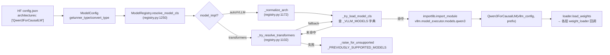

# 模型库子系统

[← Wiki 首页](../README.md) > **模型库**

> 源码根目录：`vllm/model_executor/models/`（~290 个 `.py` 文件）+ 顶层 `vllm/models/`（厂商隔离实现）。
> 注册表入口：`vllm/model_executor/models/registry.py`。

---

## 是什么

模型库子系统是 vLLM 与"外部世界模型架构"之间的边界层。它把 HuggingFace `config.json` 里 `architectures` 字段所声明的模型类名（如 `LlamaForCausalLM`、`Qwen3ForCausalLM`、`DeepseekV3ForCausalLM`）翻译成一个可在 vLLM 执行框架里跑起来的 `torch.nn.Module` 子类。这个子系统不负责"权重如何加载"（那是 [`03-model-execution/model-loader`](../03-model-execution/model-loader/README.md) 的职责），也不负责"算子如何分发"（那是 [`03-model-execution/layers`](../03-model-execution/layers/README.md) 与 [`03-model-execution/kernels`](../03-model-execution/kernels.md) 的职责），它只回答一个问题：

> 给定一份模型架构描述，应该用 vLLM 内的哪个 `nn.Module` 类去装配它？这个类具备哪些能力（生成 / 池化 / 多模态 / 投机解码 / 流水并行 / Mamba 状态…）？

### 子系统构成

| 块 | 职责 | 源码位置 |
|---|---|---|
| **注册表**（registry） | 维护 `architectures → (module, class)` 字典，做架构归一化、Transformers 后端 fallback、能力探测 | `vllm/model_executor/models/registry.py` |
| **能力接口**（interfaces） | 用 `Protocol` + `ClassVar` 标签描述模型能力契约（多模态 / LoRA / PP / Mamba / EAGLE / 转写…） | `vllm/model_executor/models/interfaces.py`、`interfaces_base.py` |
| **模块映射**（module_mapping） | `MultiModelKeys` 数据类，把多模态模型的权重划分成 LM / connector / tower / generator 四组，供 LoRA 使用 | `vllm/model_executor/models/module_mapping.py` |
| **适配器**（adapters） | `as_embedding_model` / `as_seq_cls_model` 动态子类化，把一个生成模型在线改造成 embedding / 分类 / 重排模型 | `vllm/model_executor/models/adapters.py` |
| **Transformers 后端**（transformers/） | 当 vLLM 没有原生实现时，包装 `transformers.AutoModel` 跑通；注入 vLLM Attention 算子 | `vllm/model_executor/models/transformers/` |
| **厂商隔离实现**（vllm/models/） | DeepSeek V3.2 / V4、MiniMax M3 等重度依赖平台特化算子的模型，按 `nvidia/` `amd/` `xpu/` 分目录放 | `vllm/models/deepseek_v32/`、`vllm/models/deepseek_v4/`、`vllm/models/minimax_m3/` |
| **视觉工具**（vision.py） | 视觉塔共享工具：encoder info、ViT 注意力后端选择、DP 分片、M-RoPE 位置计算、特征选择 | `vllm/model_executor/models/vision.py` |
| **模型家族**（~280 个 `.py`） | 按家族实现的各类模型架构文件，每个导出 `*ForCausalLM` / `*ForConditionalGeneration` 类 | `vllm/model_executor/models/*.py` |

详见各模块专题页：[`registry`](registry.md) · [`interfaces`](interfaces.md) · [`module-mapping`](module-mapping.md) · [`adapters`](adapters.md) · [`transformers-backend`](transformers-backend.md) · [`vendor-split-models`](vendor-split-models.md) · [`vision`](vision.md)，以及 [`architecture-families/`](architecture-families/README.md) 的家族分组导航。

---

## 为什么

把"架构名 → 类"的映射从执行框架里独立出来，是为了：

1. **把 280+ 模型挡在主流程之外**。`registry.py` 用惰性导入（`_LazyRegisteredModel`）把所有模型类的实加载推迟到真正需要的那一刻，否则单是 `import` 全部模型就会触发 CUDA 初始化、拖慢启动。
2. **能力按需探测**。调度器、注意力后端、KV 缓存管理器需要知道一个模型"是否多模态、是否有内部状态、是否 attention-free、是否支持 PP"。这些能力不放配置文件，而是由模型类自身通过 `ClassVar` 标签声明，注册表在子进程里探测并缓存到 `modelinfos/*.json`（见 `registry.py:838` 的 `_LazyRegisteredModel`）。
3. **多后端共存**。同一个 `architectures` 名可能：(a) 有 vLLM 原生实现；(b) 走 Transformers 后端 fallback；(c) 走厂商隔离的 `vllm/models/<name>` 平台实现。注册表的 `resolve_model_cls` 统一这三条路径并按优先级裁决。
4. **在线任务转换**。一个 `LlamaForCausalLM` 可以通过 `as_embedding_model` / `as_seq_cls_model` 被动态子类化成 `LlamaForEmbedding` / `LlamaForSequenceClassification`，无需为每个任务单独写模型文件。这让"一份权重，多种 API"成为可能（generate / embed / classify / score 都能挂）。

---

## 怎么做

### 从 HF config 到模型类的端到端拼装

### 注册表的三层字典

`_VLLM_MODELS`（`registry.py:688`）是顶层聚合，由若干按任务划分的子字典合并而成：

| 子字典 | 任务 | 代表架构 |
|---|---|---|
| `_TEXT_GENERATION_MODELS` | 文本生成 | `LlamaForCausalLM`、`Qwen3ForCausalLM`、`DeepseekV3ForCausalLM` |
| `_EMBEDDING_MODELS` | 句向量 | `BertModel`、`LlamaModel`、`CLIPModel` |
| `_LATE_INTERACTION_MODELS` | 逐 token 检索 | `ColPaliForRetrieval`、`ColQwen3` |
| `_REWARD_MODELS` | 奖励模型 | `InternLM2ForRewardModel`、`Qwen2ForRewardModel` |
| `_TOKEN_CLASSIFICATION_MODELS` | token 分类 | `BertForTokenClassification` |
| `_SEQUENCE_CLASSIFICATION_MODELS` | 序列分类 | `BertForSequenceClassification`、`RobertaForSequenceClassification` |
| `_MULTIMODAL_MODELS` | 多模态生成 | `LlavaForConditionalGeneration`、`Qwen2VLForConditionalGeneration`、`PixtralForConditionalGeneration` |
| `_SPECULATIVE_DECODING_MODELS` | 投机解码 draft | `Eagle3LlamaForCausalLM`、`DeepSeekMTP`、`MedusaModel` |
| `_TRANSFORMERS_SUPPORTED_MODELS` | 走 HF 后端的优先项 | `GPTBigCodeForCausalLM`、`Starcoder2ForCausalLM` |
| `_TRANSFORMERS_BACKEND_MODELS` | 动态映射的 HF 后端类名 | `TransformersForCausalLM`、`TransformersMultiModalForCausalLM` |

每条记录是 `(module_relname, class_name)` 二元组；`module_relname` 若以 `vllm.` 开头则视为全限定路径（厂商隔离模型走这条路，如 `vllm.models.deepseek_v4`），否则前缀 `vllm.model_executor.models.`。

### 能力探测与缓存

`_ModelInfo`（`registry.py:752`）是冻结的 dataclass，承载 17 个能力布尔位（`supports_multimodal`、`is_attention_free`、`supports_pp`…）。为了避免在主进程内 import 模型类（会触发 CUDA），`inspect_model_cls` 在子进程里跑 `_ModelInfo.from_model_cls` 并把结果以 JSON 缓存到 `$VLLM_CACHE_ROOT/modelinfos/<module>-<cls>.json`，key 为模型源码文件 hash（`registry.py:855`）。源码变了缓存失效。

---

## 与其它模块/系统配合

- **[模型执行-加载器](../03-model-execution/model-loader/README.md)**：`initialize_model` 调 `ModelRegistry.resolve_model_cls` 拿到类，再 `ModelClass(vllm_config, prefix)` 实例化（见 `loader/utils.py`）。本子系统只管"选类 + 装配"，不管"喂权重"。
- **[模型执行-层库](../03-model-execution/layers/README.md)**：模型文件大量复用 `RowParallelLinear`、`FusedMoE`、`RotaryEmbedding`、`RMSNorm` 等层库；层库里的量化方法（`quant_config`）通过 `SupportsQuant` 接口挂到模型上。
- **[注意力](../05-attention/README.md)**：模型层的 `Attention(...)` 调用由注意力后端抽象承接；MLA / Sparse MLA / Cross-attention 各有专门通道。`vision.py` 的 `get_vit_attn_backend` 单独为 ViT 选后端。
- **[多模态](../11-multimodal/README.md)**：`SupportsMultiModal` 接口 + `MultiModalRegistry` 双向耦合：模型文件里用 `@MULTIMODAL_REGISTRY.register_processor` 注册 processor，注册表通过 `supports_multimodal` 决定是否走多模态路径。
- **[采样-投机](../06-sampling-decoding/speculative-decoding/README.md)**：`_SPECULATIVE_DECODING_MODELS` 字典列出所有 draft 模型；`SupportsEagle` / `SupportsEagle3` 接口由 target 模型声明，draft 模型对应 `Eagle3LlamaForCausalLM`、`DeepSeekMTP` 等。
- **[配置](../10-config/README.md)**：`ModelConfig.runner_type` / `convert_type` 决定一个架构被当生成模型还是池化模型加载；`_SUFFIX_TO_DEFAULTS`（`config/model.py:1951`）按架构后缀给默认值。`VllmConfig` 作为唯一构造参数贯穿所有模型 `__init__`。
- **[LoRA](../12-lora/README.md)**：`SupportsLoRA.packed_modules_mapping` + `MultiModelKeys`（`module-mapping.md`）把多模态模型的权重按 LM/tower/connector 切分，让 LoRA 适配器知道哪些层可挂。
- **[分布式](../07-distributed/README.md)**：`SupportsPP` 接口要求实现 `make_empty_intermediate_tensors` + 在 `forward` 里收发 `IntermediateTensors`；`MixtureOfExperts` 接口供 EPLB / 专家迁移使用。

---

## 历史版本演进

| 版本 | 变更要点 | 触发/影响 |
|---|---|---|
| 早期（v0.3–v0.5） | 注册表是一个扁平 `dict[str, (str, str)]`，每个架构名硬编码指向 `vllm/model_executor/models/*.py`。能力判断靠 `isinstancelike` 散落各处。 | 模型数 < 50，扁平结构足够。 |
| v0.5–v0.6 | 引入 `interfaces.py` 的 `SupportsMultiModal` / `SupportsPP` / `HasInnerState` Protocol；Mamba / Jamba（hybrid SSM）入场。 | SSM 模型需要 `has_inner_state` 让调度器分配 Mamba 状态缓存。 |
| v0.6.0 | DeepSeek-V2 引入 MLAattention 与 auxiliary-loss-free MoE 路由；`deepseek_v2.py` 成为后续 V3/V3.2/V4 的基类。 | MLA 通道在 [`05-attention`](../05-attention/README.md) 单独维护。 |
| v0.7–v0.8 | Qwen2-VL / Llava-OneVision / Pixtral 多模态家族入场；`vision.py` 抽出共享 ViT 工具；`SupportsMRoPE` 接口出现。 | 多模态池子扩大，开始需要 DP 分片视觉塔。 |
| v0.8.5 | Transformers 后端（`transformers/`）落地，可包装任意 `transformers.AutoModel`；`_TRANSFORMERS_BACKEND_MODELS` 上线。 | 不必为每个新架构写原生实现即可运行。 |
| v0.10.0 | EAGLE-3 投机解码入场；`SupportsEagle3` + `EagleModelMixin`；`_SPECULATIVE_DECODING_MODELS` 字典快速膨胀。 | Draft 模型与 target 模型通过接口解耦。 |
| v0.10.2 | 清退一批 V0 时代模型入 `_PREVIOUSLY_SUPPORTED_MODELS`（`Motif`、`Phi3Small`、`Phi4Flash`、encoder-decoder 除 Whisper 外的全部）。 | V0 退役 + 维护成本控制。 |
| v0.11–v0.12 | DeepSeek-V3.2 DSA、DeepSeek-V4 Sparse MLA、MiniMax M3 稀疏注意力入场；引入 `vllm/models/` 顶层厂商隔离布局（`vllm.models.deepseek_v4` 等）。 | 单个架构文件无法兼容多平台，按 `nvidia/amd/xpu/` 拆目录。 |
| main | GLM-5.2（`GlmMoeDsaForCausalLM` 复用 DeepSeek V3.2 实现）、Gemma4、Qwen3.5、Llama4、Kimi K25、Step3.x 大批新家族入场；架构数突破 280。`SupportsEncoderCudaGraph` 接口让视觉编码器也能 CUDA graph 捕获。 | 厂商模型与开源模型并行扩张；视觉编码器 CUDA graph 成为性能关键路径。 |

---

## 参见

- [`registry.md`](registry.md) — 注册机制与架构归一化
- [`interfaces.md`](interfaces.md) — 模型能力接口契约
- [`module-mapping.md`](module-mapping.md) — HF 模块到 vLLM LoRA 层映射
- [`adapters.md`](adapters.md) — 序列化与适配器封装
- [`transformers-backend.md`](transformers-backend.md) — HF 后端 fallback
- [`vendor-split-models.md`](vendor-split-models.md) — 厂商分流路径
- [`vision.md`](vision.md) — 视觉塔共享工具
- [`architecture-families/`](architecture-families/README.md) — 按家族分组的模型文件导航
- 跨子系统：[模型执行-加载器](../03-model-execution/model-loader/README.md) · [模型执行-层库](../03-model-execution/layers/README.md) · [注意力](../05-attention/README.md) · [多模态](../11-multimodal/README.md) · [采样-投机](../06-sampling-decoding/speculative-decoding/README.md) · [配置](../10-config/README.md)
