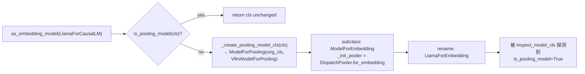

# 序列化与适配器封装（adapters）

[← Wiki 首页](../README.md) > [模型库](../README.md) > **适配器**

> 源码：`vllm/model_executor/models/adapters.py`（645 行）。

---

## 是什么

`adapters.py` 提供"在线任务转换"：把一个原本只做生成的模型类（如 `LlamaForCausalLM`、`Qwen2ForCausalLM`）**动态子类化**成 embedding/classify/score 模型，而不必为每个任务写一个独立文件。核心导出：

- `as_embedding_model(cls) -> cls`：把生成模型转成 `*ForEmbedding` 类（默认 LAST token 池化）。
- `as_seq_cls_model(cls) -> cls`：把生成模型转成 `*ForSequenceClassification` 类（cross-encoder rerank / 分类），自动新增 `score` 头。
- `_create_pooling_model_cls(orig_cls)`：两者共用的内部子类化工厂，产出的 `ModelForPooling` 同时继承 `orig_cls` 与 `VllmModelForPooling`，并在 `__init__` 里用 `no_init_weights` 跳过 LM head 初始化（省显存）。
- `SequenceClassificationConfig(VerifyAndUpdateConfig)`：在 `ModelConfig` 构造期校准 `num_labels`、`method`、`classifier_from_token` 等。
- `seq_cls_model_loader` + `SEQ_CLS_LOAD_METHODS`：支持"在线从 LM head 推导 score 权重"的两种 method——`from_2_way_softmax`（Qwen3-Reranker、mxbai-rerank-v2）与 `no_post_processing`（bge-reranker-v2-gemma）。
- 辅助：`_load_st_projector` 从 HF Hub 加载 Sentence-Transformers 的 `dense_modules.json` 并装配成 `nn.Sequential` 投影栈。

注册表与 `ModelConfig` 在归一化阶段会按 `runner_type` / `convert_type` 调用这些适配器（见 [registry.md](registry.md) `_normalize_arch` 与 `config/model.py` 的 `_get_convert_type`）。

---

## 为什么

- **一份权重，多种 API**：同一个 `Qwen3-0.6B` checkpoint 既可作为 generate 模型服务 `/v1/completions`，也可作为 reranker 服务 `/v1/score`，还可作为 embedder 服务 `/v1/embeddings`。写三份模型代码冗余，统一用动态子类化解决。
- **LM head 在 pooling 任务里无价值**：`LogitsProcessor` 与 `ParallelLMHead` 在序列分类/嵌入任务里是死参数（数百万/数亿参数），`ModelForPooling.__init__` 用 `no_init_weights(..., targets=(LogitsProcessor, ParallelLMHead))` 让这些子模块用 `StageMissingLayer` 占位，加载后既不占显存也不参与 forward。
- **在线推导 score 权重**：有些 reranker 把"是/否"两个 token 的 logit 差当作 score，而不是单独训练 score 头。`load_weights_using_from_2_way_softmax` 借 LM head 权重做一次差分计算后再 `del lm_head`，省得用户手动转换 checkpoint。
- **与量化解耦**：在线推导 score 时不让 score 头量化（`quant_config=None`），因为 `num_labels` 太小会破坏 FP8/Marlin 的 tile 对齐；checkpoint-based 转换则保留原 `quant_config`（见 `adapters.py:314`）。

---

## 怎么做

### as_embedding_model 流程



`ModelForPooling.__init__` 的关键步骤（`adapters.py:136`）：

1. `with no_init_weights(targets=(LogitsProcessor, ParallelLMHead))`：用 `StageMissingLayer` 替换 head 初始化。
2. 若模型已有 `pooler` 属性（VLM 可能从 LM backbone 继承），保留；否则调 `self._init_pooler(vllm_config, prefix)`。
3. `load_weights` 重载：扫描权重名自动判别是相对 `*ForCausalLM` 还是 `*Model` 命名，加 `target_prefix`（"" 或 `"model."`）对齐后再走原 `load_weights`。

### as_seq_cls_model 的两种权重路径

```python
# adapters.py:336  load_weights 重载
if tokens is None and method is None:
    return super().load_weights(weights)        # checkpoint-based：直接加载 score.weight
else:
    return seq_cls_model_loader(self, weights)  # 在线推导：用 LM head 算 score
```

`seq_cls_model_loader`（`adapters.py:630`）按 `text_config.method` 分派：

- `from_2_way_softmax`（`adapters.py:473`）：取 `classifier_from_token` 里两个 token（如 `"no"`/`"yes"`）的词表 id，从临时挂上的 `lm_head` 取对应行向量做差 `W_score = W_lm[true] - W_lm[false]`，再 `del lm_head`。
- `no_post_processing`（`adapters.py:555`）：取多个 token 的 LM head 行直接作为 `score.weight`。

两种路径都通过 `_disable_seq_cls_loading_on_inner_model` 上下文（`adapters.py:436`）临时屏蔽 VLM inner LM 的 `method`/`classifier_from_token`，避免递归调用。

### ST projector 装配

`_load_st_projector`（`adapters.py:40`）从 HF repo 拉 `dense_modules.json`（Sentence-Transformers 格式），按 `in_features/out_features/bias/activation_function` 逐层重建 `nn.Linear` + 激活，再走 vLLM 的 `default_weight_loader` 从 `model.safetensors`/`pytorch_model.bin` 加载权重。

---

## 与其它模块/系统配合

- **[registry.md](registry.md)**：`_normalize_arch` + `try_match_architecture_defaults` 决定一个架构要走 `generate` 还是 `pooling` runner；适配器是后者的实际执行者。
- **[interfaces.md](interfaces.md)**：动态子类化新增 `VllmModelForPooling`（`is_pooling_model=True`）与 `SupportsCrossEncoding`（`score_type="cross-encoder"`）标签；inspect 探测时这些新生标签生效。
- **[配置](../10-config/README.md)**：`SequenceClassificationConfig.verify_and_update_config` 在 ModelConfig 构造期被调，校准 `num_labels` 与 `use_sep_token`。
- **[模型执行-层库](../03-model-execution/layers/README.md)**：`DispatchPooler` / `ReplicatedLinear` 由 `layers/pooler.py` / `layers/linear.py` 提供；`StageMissingLayer` 来自 `models/utils.py`。
- **[模型执行-加载器](../03-model-execution/model-loader/README.md)**：`ModelForPooling.load_weights` 自适应 `*ForCausalLM` 与 `*Model` 命名，免去用户改权重路径。
- **[transformers-backend.md](transformers-backend.md)**：HF 后端的 `TransformersEmbeddingModel`/`TransformersForSequenceClassification` 走另一条路（mixin），但语义对标本文件。
- **[tokenizers-transformers](../14-tokenizers-transformers/README.md)**：在线推导 score 时需要 `get_tokenizer` 把 token 字符串映射到 id。

---

## 历史版本演进

| 版本 | 变更 | 动机 |
|---|---|---|
| 早期 | embedding/classify 模型需各自实现独立文件。 | 维护成本高。 |
| v0.5 | `as_embedding_model` / `as_seq_cls_model` 引入动态子类化。 | "一份权重多任务"需求。 |
| v0.6–v0.7 | `_create_pooling_model_cls` 抽出共用工厂；`no_init_weights` + `StageMissingLayer` 让 LM head 不占显存。 | Pooling 任务在 7B+ 模型上节省可观头部显存。 |
| v0.8 | `from_2_way_softmax` method 上线，支持 Qwen3-Reranker / mxbai-rerank-v2 在线转换。 | "LLM as Reranker" 范式兴起，免 checkpoint 转换。 |
| v0.9 | `_disable_seq_cls_loading_on_inner_model` 引入，支持 VLM 在线 rerank（处理 inner LM 的 method 字段）。 | VLM rerank 需求。 |
| v0.10 | `no_post_processing` method 加入，适配 bge-reranker-v2-gemma。 | Gemma reranker 不走 softmax 差分。 |
| main | `_load_st_projector` 加载 ST `dense_modules`；量化兼容（在线转换时 `quant_config=None`）细化。 | 让 ST 训练的投影层在 vLLM 可直接复用。 |

---

## 参见

- [← 返回模型库首页](../README.md)
- [`interfaces.md`](interfaces.md) — `VllmModelForPooling` / `SupportsCrossEncoding`
- [`registry.md`](registry.md) — runner_type/convert_type 决定何时调适配器
- [LoRA 子系统](../12-lora/README.md) — `_create_pooling_model_cls` 的 `StageMissingLayer` 与 LoRA skip 协同
