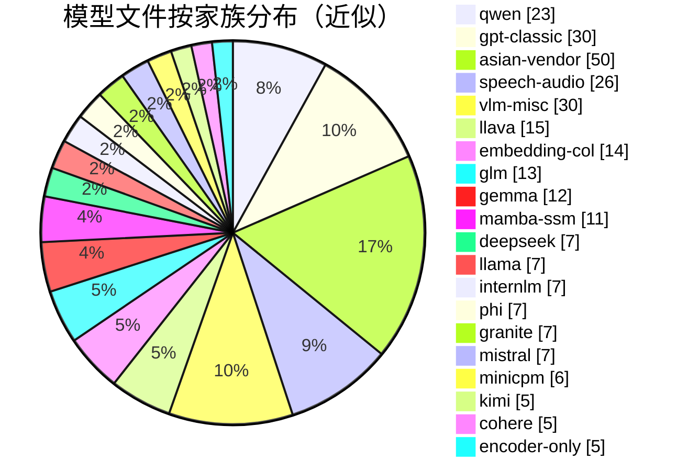

# 模型家族分组导航

[← Wiki 首页](../../README.md) > [模型库](../README.md) > **家族分组**

> `vllm/model_executor/models/` 下 ~290 个 `.py` 文件按架构家族分组浏览。
> 每页列举代表文件、关键架构差异、与投机解码（spec decode）的对接实现。

---

## 家族导航表

| 家族页 | 代表架构 | 文件数（含 spec draft） | 关键特征 |
|---|---|---:|---|
| [`llama.md`](llama.md) | Llama / Llama4 / Fairseq2-Llama | 7 | Llama 系底座；Llama4 引入 MoE + ViT；InternLM3/TeleChat3/IQuest 复用 `LlamaForCausalLM` |
| [`qwen.md`](qwen.md) | Qwen2 / Qwen3 / Qwen3-Next / Qwen3-VL / Qwen2-Audio | ~23 | Qwen 系最庞大；含 MoE、VLM、Audio、Omni、ASR、DFlash/DSpark 投机、Col 系列检索 |
| [`glm.md`](glm.md) | GLM / GLM4 / GLM4-MoE / GLM4v / GLM-ASR / GLM-OCR | ~13 | 智谱系；GLM4-MoE-Lite 简化版；MTP 走多套；GLM-5.2（DSA）复用 `deepseek_v2` 实现 |
| [`gemma.md`](gemma.md) | Gemma / Gemma2/3/3n/4 / PaLI-Gemma / Diffusion-Gemma | ~12 | Google 系；Gemma3+ 含局部 attention + sliding；Gemma4 unified + MTP；FP16 禁用 |
| [`mistral.md`](mistral.md) | Mistral / Mixtral / Mistral3 / Pixtral / Ministral3 | ~7 | 含 MoE（Mixtral）、VLM（Pixtral/Mistral3）；EAGLE draft 两套 |
| [`deepseek.md`](deepseek.md) | DeepSeek V2 / V3 / V3.2 / V4 / VL2 / OCR | ~7（flat）+ `vllm/models/` 3 包 | MLA + aux-loss-free MoE；V3.2 引入 DSA；V4 引入 Sparse MLA + Compressor |
| [`internlm.md`](internlm.md) | InternLM2 / InternVL / InternS1 / InternS2 | ~7 | InternLM2 含 reward model；InternVL/ViT 系视觉塔；InternS1-Pro 复用 |
| [`phi.md`](phi.md) | Phi / Phi3 / Phi3V / Phi4MM / PhiMoE | ~7 | Phi3 起改为 Llama 系子类；Phi4MM 多模态；PhiMoE 含 MoE |
| [`minicpm.md`](minicpm.md) | MiniCPM / MiniCPM3 / MiniCPMO / MiniCPMV | 6 | MiniCPM3 复用 MiniCPM；MiniCPMV 系视觉；MiniCPMO 全模态 |
| [`llava.md`](llava.md) | Llava / Llava-Next / Llava-OneVision / H2OVL / Idefics / Molmo / SmolVLM | ~15 | 经典 VLM 套件；视觉塔共享 `vision.py` |
| [`mamba-ssm.md`](mamba-ssm.md) | Mamba / Mamba2 / Jamba / Zamba2 / LFM2 / Nemotron-H / Olmo-Hybrid | ~11 | SSM 系；`HasInnerState` + `IsAttentionFree`/`IsHybrid`；`SupportsMambaPrefixCaching` |
| [`cohere.md`](cohere.md) | Cohere / Cohere2-MoE / Cohere2-Vision / Cohere-ASR | 5 | sliding window attention + qk-norm；含 MoE 与视觉变体 |
| [`granite.md`](granite.md) | Granite / Granite-MoE / Granite-MoE-Hybrid / Granite-MoE-Shared / Granite-Speech / Granite4-Vision | 7 | IBM 系；含 shared-expert MoE、hybrid SSM、speech |
| [`kimi.md`](kimi.md) | Kimi-Linear / Kimi-VL / Kimi-K25 / Kimi-Audio | 5 | Moonshot 系；Kimi-Linear 含 MLA + MoE + hybrid SSM；K25 视觉 |
| [`gpt-classic.md`](gpt-classic.md) | GPT2 / GPT-J / GPT-NeoX / Bloom / Falcon / OPT / MPT / DBRX / GPT-OSS / OLMo* / Starcoder 等 | ~30+ | 经典 decoder；多为早期支持；`Starcoder2`/`GPTBigCode`/`SmolLM3` 走 HF 后端 |
| [`asian-vendor.md`](asian-vendor.md) | MiniMax M2 / Bailing / Hunyuan / Step / MiMo / Longcat / Ernie / Pangu / TeleChat / Exaone / Plamo / Skywork-R1V / Keye / Kanana 等 | ~50+ | 亚洲厂商系；多数带 MTP；含大量 OCR/VL 变体 |
| [`encoder-only.md`](encoder-only.md) | BERT / RoBERTa / ModernBERT / BERT-with-RoPE / Jina | 5 | 编码器底座；用于 embedding/classification |
| [`embedding-col.md`](embedding-col.md) | ColBERT / ColPali / ColQwen3 / ColQwen3.5 / GritLM / Voyage / ColModernVBert / 各类 EmbeddingModel | ~14 | pooler 任务族；late-interaction 与 cross-encoder rerank |
| [`speech-audio.md`](speech-audio.md) | Whisper / Voxtral / Parakeet / FunASR / FireRedASR / Kimi-Audio / GLM-ASR / Granite-Speech / Qwen2-Audio / Qwen3-ASR / Ultravox / Cohere-ASR / AIMv2 | ~26 | ASR/语音对话；`SupportsTranscription` + `SupportsRealtime` 接口 |
| [`vlm-misc.md`](vlm-misc.md) | Aria / Bagel / Bee / Blip2 / Cosmos3 / Deepseek-VL2 / Deepseek-OCR / Dots-OCR / Eagle2.5-VL / Isaac / NVLM-D / Ovis / OpenVLA / R-vL / SmolVLM / Step-VL / Terratorch / Unlimited-OCR 等 | ~30 | 杂集 VLM/多模态；含 OCR/agent/geo-spatial 等 |

> 文件数为近似值，含 MTP/Eagle 等 spec draft 文件；以 `ls vllm/model_executor/models/ | wc -l` 的 ~290 为总量基准。

---

## 文件计数表

> 部分文件跨家族被引用（如 `pixtral.py` 同时属 mistral 与 vlm-misc、`molmo.py` 同时属 llava 与 vlm-misc），故计数有重叠，仅作导航参考。

---

## 投机解码（spec decode）家族映射

draft 模型与 target 模型对应表（详见 [registry.md `_SPECULATIVE_DECODING_MODELS`](../registry.md)）：

| 类型 | 代表 draft 文件 | target 家族 |
|---|---|---|
| **EAGLE-1/2** | `llama_eagle.py`、`llama4_eagle.py`、`mistral_eagle.py`、`mistral_large_3_eagle.py`、`cohere_eagle.py`、`minicpm_eagle.py`、`deepseek_eagle.py`、`eagle2_5_vl.py` | 多家族 |
| **EAGLE-3** | `llama_eagle3.py`（多 VLM 共用）、`qwen3_eagle3.py`、`deepseek_eagle3.py` | Llama/Qwen/DeepSeek/MiniMaxM2/各 VLM |
| **MTP** | `deepseek_mtp.py`、`mimo_mtp.py`、`mimo_v2_mtp.py`、`gemma4_mtp.py`、`glm4_moe_mtp.py`、`glm4_moe_lite_mtp.py`、`glm_ocr_mtp.py`、`ernie_mtp.py`、`exaone_moe_mtp.py`、`exaone4_5_mtp.py`、`nemotron_h_mtp.py`、`longcat_flash_mtp.py`、`openpangu_mtp.py`、`qwen3_next_mtp.py`、`qwen3_5_mtp.py`、`step3p5_mtp.py`、`hy_v3_mtp.py`、`bailing_moe_mtp.py`、`DeepSeekV4MTP`/`MiniMaxM3MTP`（`vllm/models/` 下） | DeepSeek/MiMo/Gemma4/GLM4-MoE/Ernie/Exaone/Nemotron-H/LongCat/Pangu/Qwen3-Next/Step3.5/HY-V3/Bailing |
| **Medusa** | `medusa.py` | 通用 |
| **MLP Speculator** | `mlp_speculator.py`（registry 中暂时禁用，V1 待支持） | 通用 |
| **DFlash / DSpark** | `qwen3_dflash.py`、`qwen3_dspark.py`、`laguna_dflash.py`、`DSparkDeepseekV4`（vendor） | Qwen3 / Laguna / DeepSeek V4 |
| **ExtractHiddenStates** | `extract_hidden_states.py` | 通用，提取 hidden state 给外部 draft |

---

## 参见

- [← 返回模型库首页](../README.md)
- [`registry.md`](../registry.md) — 架构到文件的注册机制
- [`vendor-split-models.md`](../vendor-split-models.md) — `vllm/models/` 顶层厂商隔离模型
- [采样-投机解码](../../06-sampling-decoding/speculative-decoding/README.md) — draft 与 target 的协作流程
