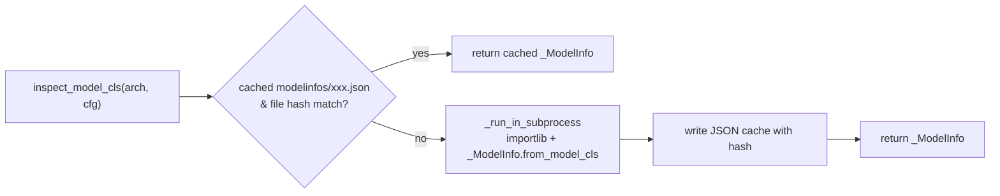

# 模型注册表（registry）

[← Wiki 首页](../README.md) > [模型库](../README.md) > **注册表**

> 源码：`vllm/model_executor/models/registry.py`（1460 行，单文件）。

---

## 是什么

`registry.py` 是 vLLM 全部模型架构的中央登记簿。它维护一个 `architectures_name → 模型实现` 的映射表，并提供：

1. **架构归一化**（`_normalize_arch`）：把带任务后缀的架构名（如 `FooForSequenceClassification`）映射回生成实现（`FooForCausalLM`），或按 `try_match_architecture_defaults` 给出默认 `runner_type`/`convert_type`。
2. **类解析**（`resolve_model_cls`）：给定 `architectures` 列表 + `ModelConfig`，返回 `(nn.Module 类, 实际命中的架构名)`。
3. **能力探测**（`inspect_model_cls`）：在不加载模型权重的前提下，获取模型类的 17 个能力布尔位（`_ModelInfo`），用于调度器/注意力后端/KV 缓存的早期决策。
4. **Transformers 后端裁决**（`_try_resolve_transformers`）：当 vLLM 没有原生实现时，检查 `transformers` 库是否提供了与 vLLM 后端兼容的实现，并把架构名改写成 `TransformersXxxForCausalLM`。
5. **失败兜底**（`_raise_for_unsupported`）：对曾经支持过、现已清退的架构给出版本回退指引（`_PREVIOUSLY_SUPPORTED_MODELS`），对 OOT 插件模型给出安装链接（`_OOT_SUPPORTED_MODELS`）。

---

## 为什么

- **惰性加载**：vLLM 有 280+ 模型文件，若在启动时 `import` 全部，单是触发各自 `torch`/`transformers` 依赖就会拖慢启动并可能初始化 CUDA。`_LazyRegisteredModel` 只存 `(module_name, class_name)` 字符串，等到真正要实例化时才 `importlib.import_module`。
- **能力探测不能在主进程跑**：`inspect_model_cls` 需要先 import 模型类才能读 `ClassVar`，但 import 会触发 CUDA fork 报错。`_run_in_subprocess` 用 `cloudpickle` 把任务序列化后丢给子进程跑，再以文件 pickle 回收结果（`registry.py:1415`）。结果按源码文件 hash 缓存到 `modelinfos/*.json`，文件没变就直接复用。
- **优先级裁决**：同一个架构名可能既在 vLLM 原生表里、又能走 HF 后端。`ModelConfig.model_impl` 取 `auto`/`transformers`/`vllm` 决定偏好；`resolve_model_cls` 内部分两段 fallback：先 vLLM 原生，后 HF 后端，再 raise。

---

## 怎么做

### 字典分层

`_VLLM_MODELS`（`registry.py:688`）合并自 10 个子字典，详见 [README 表格](../README.md#注册表的三层字典)。每条记录形如：

```python
"DeepseekV4ForCausalLM": ("vllm.models.deepseek_v4", "DeepseekV4ForCausalLM"),
#                  key           module_relname                class_name
```

`_resolve_module_name`（`registry.py:1393`）做规范化：以 `vllm.` 开头的全限定路径直接保留（厂商隔离模型），否则前缀补 `vllm.model_executor.models.`。

### 三种"注册态"

`_BaseRegisteredModel` 是抽象基类，两个具体实现：

| 类 | 含义 | 用途 |
|---|---|---|
| `_RegisteredModel`（`registry.py:815`） | 已在主进程 import 的类，直接持有 `model_cls` | OOT 插件用 `ModelRegistry.register_model(arch, ActualClass)` 注册 |
| `_LazyRegisteredModel`（`registry.py:838`） | 仅存字符串 `(module_name, class_name)` | 99% 的内置模型走这条；`load_model_cls` 时才 import |

`ModelRegistry` 单例在模块导入时就由 `_VLLM_MODELS` 字典推导出来（`registry.py:1402`），全机器只有一个。

### resolve_model_cls 的决策顺序

```
1. model_impl=="transformers"?  → _try_resolve_transformers + 走 _TRANSFORMERS_BACKEND_MODELS
2. model_impl=="terratorch"?    → 固定 "Terratorch"
3. convert_type=="none" 且原生表里都没有? → 尝试 HF 后端 (后置 fallback 提前)
4. for arch in architectures:
       normalized = _normalize_arch(arch)        # 按后缀规则回退到基础架构
       cls = _try_load_model_cls(normalized)
       if cls: return (cls, arch)                # 注意返回的是原始 arch 而非 normalized
5. 还没命中? → 再试一次 HF 后端 (前置 fallback)
6. 全失败 → _raise_for_unsupported
```

`_normalize_arch`（`registry.py:1172`）的逻辑：如果架构名在表里直接命中就返回；否则用 `try_match_architecture_defaults` 匹配后缀（如 `ForSequenceClassification` → `(pooling, classify)`），再扫描 `iter_architecture_defaults` 把别的后缀替换回来，看替换后的名字是否在表里。

### inspect_model_cls 的缓存



`_get_modelinfo_module_hash`（`registry.py:855`）会哈希整个模块源码文件；模块若是包入口（`__init__.py`），连包内所有 `.py` 一起哈希，保证厂商隔离包改一行也失效。

### 外部注册接口

`ModelRegistry.register_model(model_arch, model_cls)`（`registry.py:1011`）接受两种形式：

- 一个 `nn.Module` 子类 → 直接构造 `_RegisteredModel`。
- 字符串 `"<module>:<class>"` → 构造 `_LazyRegisteredModel`，可避免 `import` 时初始化 CUDA（OOT 插件推荐做法）。

已注册同名架构会被覆盖并记 debug 日志。

---

## 与其它模块/系统配合

- **[模型执行-加载器](../03-model-execution/model-loader/README.md)**：`initialize_model` 调 `resolve_model_cls` 拿类；`resolve_model_arch` / `inspect_model_cls` 在 `ModelConfig` 构造早期用于推断 `runner_type`、`is_pooling_model` 等。
- **[配置](../10-config/README.md)**：`ModelConfig.model_impl`、`runner_type`、`convert_type` 是 resolve 的输入；`iter_architecture_defaults`（`config/model.py:1963`）定义后缀到默认 `(runner, convert)` 的映射，被 `_normalize_arch` 复用。
- **[多模态](../11-multimodal/README.md)**：`is_multimodal_model` 等 `is_*` 方法在 `ModelConfig` 构造时被调，决定 processor 注册路径与 KV 预算。
- **[采样-投机](../06-sampling-decoding/speculative-decoding/README.md)**：draft 模型有自己的架构名（`DeepSeekMTPModel` 等），通过 `_SPECULATIVE_DECODING_MODELS` 字典单独登记；target 模型的 EAGLE 能力由 `SupportsEagle3` 接口探测。
- **`transformers_utils.dynamic_module`**：`_try_resolve_transformers` 在判定 `auto_map` 时调 `try_get_class_from_dynamic_module`，加载 HF Hub 上的 remote code 模型。
- **`vllm.platforms.current_platform.verify_model_arch`**：在 `_try_load_model_cls` 里调，允许平台层拒绝某架构（如 DeepSeek V3.2 只支持 NVIDIA SM100）。

---

## 历史版本演进

| 版本 | 变更 | 动机/影响 |
|---|---|---|
| 早期 | 单一 `_MODELS` 字典，`resolve_model_cls` 直接 `importlib`。 | 简单直接，但每次 inspect 都 import 触发 CUDA。 |
| v0.5–v0.6 | 拆出 `_EMBEDDING_MODELS` / `_MULTIMODAL_MODELS` 等子字典；引入 `_ModelInfo` dataclass。 | 任务类型多元化，需要按用途分组。 |
| v0.7 | 引入 `_LazyRegisteredModel` + 子进程 inspect + JSON 缓存。 | 启动性能：避免主进程 CUDA fork。 |
| v0.8.5 | `_TRANSFORMERS_BACKEND_MODELS` 与 `_try_resolve_transformers` 落地。 | 不必为每个新架构写原生实现。 |
| v0.9 | `_normalize_arch` + `try_match_architecture_defaults` 引入。 | 一个架构名可派生出 generate/pooling 多种 runner 而无须重复注册。 |
| v0.10.2 | `_PREVIOUSLY_SUPPORTED_MODELS` 大规模扩展（清退 V0 模型）。 | V0 退役，引导用户回退版本。 |
| v0.11+ | `_resolve_module_name` 接受 `vllm.` 全限定路径，`vllm.models.deepseek_v4` 等厂商隔离模型登记入表。 | 单文件无法承载多平台实现，需要全新路径布局。 |
| main | `_SPECULATIVE_DECODING_MODELS` 持续膨胀（MTP 类目激增）；`_ModelInfo` 新增 `supports_transcription_only`、`has_noops` 等字段。 | ASR 转写模型、NoOp skip layer 等新能力上线。 |

---

## 参见

- [← 返回模型库首页](../README.md)
- [`interfaces.md`](interfaces.md) — `_ModelInfo` 字段对应的接口契约
- [`transformers-backend.md`](transformers-backend.md) — HF 后端 fallback 细节
- [`vendor-split-models.md`](vendor-split-models.md) — `vllm.models.*` 全限定路径模式
- `tests/models/registry.py` — 每个架构对应的 HF 示例权重清单（registry 顶部注释强制要求同步）
