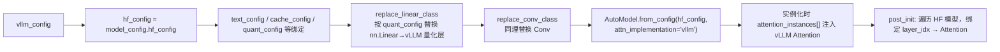

# Transformers 后端 fallback（transformers/）

[← Wiki 首页](../README.md) > [模型库](../README.md) > **Transformers 后端**

> 源码：`vllm/model_executor/models/transformers/`（`__init__.py` + `base.py` + `causal.py` + `moe.py` + `multimodal.py` + `pooling.py` + `legacy.py` + `fuser.py` + `fusers/` + `fx_utils.py` + `utils.py`）。

---

## 是什么

Transformers 后端是 vLLM 的"兜底模型实现"。当 `_VLLM_MODELS` 字典里没有某个架构时（或用户显式 `--model-impl transformers`），vLLM 直接包装 `transformers.AutoModel` 跑通推理，而不是要求每个新架构都写 vLLM 原生实现。它通过 monkey-patch `transformers` 的注意力函数，把 HF attention 调用转发到 vLLM 的 `Attention` 层，从而复用 vLLM 的 KV cache、PagedAttention、量化等能力。

### 11 个类对应 7 种任务组合

`transformers/__init__.py` 定义 11 个公开类，由 4 个 Mixin 正交组合而出：

| Mixin | 来源 | 行为 |
|---|---|---|
| `Base` | `base.py:79` | 通用底座：实例化 `transformers.AutoModel`，注入 vLLM `Attention`、PP / TP 支持、weight loading、`SupportsQuant`/`SupportsLoRA`/`SupportsPP`/`SupportsEagle`/`SupportsEagle3` |
| `CausalMixin` | `causal.py` | 文本生成：`compute_logits`/`embed_input_ids`/`forward` |
| `MoEMixin` | `moe.py` | MoE：暴露 `MoERunner` 层供 fused MoE kernel 选择 |
| `MultiModalMixin` | `multimodal.py` | 多模态：processor 注册、`MultiModalProcessingInfo`、`embed_input_ids` 把多模态嵌入 scatter 进 input_ids |
| `EmbeddingMixin` / `SequenceClassificationMixin` | `pooling.py` | 池化任务：注入 `DispatchPooler` 头，复用 `as_*` 适配器语义 |
| `LegacyMixin` | `legacy.py` | 兼容旧版 transformers（无 `is_backend_compatible`） |

正交产出：`TransformersForCausalLM`、`TransformersMoEForCausalLM`、`TransformersMultiModalForCausalLM`、`TransformersMultiModalMoEForCausalLM`、`TransformersEmbeddingModel`、`TransformersMoEEmbeddingModel`、`TransformersMultiModalEmbeddingModel`、`TransformersForSequenceClassification`、`TransformersMoEForSequenceClassification`、`TransformersMultiModalForSequenceClassification`。

### 优先项与回退项

- `_TRANSFORMERS_SUPPORTED_MODELS`（`registry.py:641`）：架构名 → `TransformersForCausalLM`（或 `TransformersMultiModalForCausalLM`），用户不指定也走 HF 后端。代表：`GPTBigCodeForCausalLM`、`SmolLM3ForCausalLM`、`Starcoder2ForCausalLM`、`Emu3ForConditionalGeneration`。
- `_TRANSFORMERS_BACKEND_MODELS`（`registry.py:653`）：vLLM 探测到 HF 后端兼容时，把架构名改写成这表里的类名（如 `FooForCausalLM` → `TransformersForCausalLM`），按 `model_config._get_transformers_backend_cls()` 决定具体子类。

---

## 为什么

- **新架构零成本支持**：`transformers` 升级新版后，新模型能"开箱即用"——不必等 vLLM 写原生实现。代价是性能不如原生（HF 后端无 fused kernel、无深度量化优化）。
- **复用 vLLM 的执行框架**：单纯跑 `transformers.AutoModel` 就跟直接用 HF 一样慢。包装后，attention 被 vLLM `Attention` 层接管，KV cache 走 PagedAttention，权重加载走 vLLM loader，能进 CUDA graph——保留 vLLM 的并发与显存优势。
- **trust_remote_code 兼容**：私有模型用 HF Hub 上的 remote code 提供 `auto_map`，`_try_resolve_transformers`（`registry.py:1102`）会通过 `try_get_class_from_dynamic_module` 拉到 Python 文件并实例化，再走本后端。
- **任务多态**：通过组合不同 Mixin，HF 后端同样能覆盖 embed/classify/rerank/多模态，与原生适配器（`adapters.md`）语义一致。

---

## 怎么做

### 注意力劫持

`transformers/__init__.py:46` 在模块导入时执行：

```python
ALL_ATTENTION_FUNCTIONS["vllm"] = vllm_attention_forward
```

`vllm_attention_forward` 把 HF attention 的 `(query, key, value, attention_mask)` 重排成 vLLM `Attention.forward` 期望的形状，转发给预创建的 `self_attn = attention_instances[module.layer_idx]`（vLLM `Attention` 实例）。HF 模型只需把 `attn_implementation="vllm"` 传给 `AutoModel.from_config`，attention 就走 vLLM 路径。

### Base.__init__ 的关键装配（`base.py:79+`）



`replace_linear_class`（`utils.py`）把 HF 模型的 `nn.Linear` 换成 vLLM 的 `ReplicatedLinear`/`RowParallelLinear`/`MergedColumnParallelLinear`，按是否在 quant_config 的 layer list 里再决定挂 quant method。

### model_impl 路径

`ModelConfig.model_impl` 三态：

- `"vllm"`：必须命中 vLLM 原生表，否则报错。
- `"transformers"`：必须能解析到 HF 后端，否则报错。
- `"auto"`（默认）：先 vLLM 原生，找不到再 fallback 到 HF 后端（`registry.py:1238`、`:1291` 两段 fallback）。

`is_backend_compatible()`（`registry.py:1161`）由 transformers 库自己判断，主要看模型类是否依赖 vLLM 没接管的算子；不兼容就 fallback 失败 raise。

---

## 与其它模块/系统配合

- **[registry.md](registry.md)**：`_try_resolve_transformers` 是三段 fallback 链的关键节点；用 `auto_map` + `trust_remote_code` 加载 remote 模型。
- **[interfaces.md](interfaces.md)**：`Base` 同时继承 `VllmModel` + `SupportsQuant`/`SupportsLoRA`/`SupportsPP`/`SupportsEagle`/`SupportsEagle3`，让 HF 后端模型也能挂量化、PP、EAGLE。
- **[模型执行-层库](../03-model-execution/layers/README.md)**：`replace_linear_class` 把 HF Linear 换成 vLLM 并行层；quant_config 应用同名机制。
- **[注意力](../05-attention/README.md)**：`vllm_attention_forward` 转发到 vLLM `Attention`，复用全部 attention 后端（FlashAttn/FlashInfer/CUTLASS…）。
- **[多模态](../11-multimodal/README.md)**：`MultiModalMixin` + `@MULTIMODAL_REGISTRY.register_processor` 注册 processor；`MultiModalProcessingInfo` 描述各模态的 token 预算。
- **[采样-投机](../06-sampling-decoding/speculative-decoding/README.md)**：`SupportsEagle`/`SupportsEagle3` 标签 + MoE 模型支持 EAGLE 投机解码。
- **[torch.compile](../09-compilation-ir/README.md)**：`can_enable_torch_compile`（`utils.py`）+ `support_torch_compile` 装饰器，让可编译的 HF 模型走 Inductor pass 链。

---

## 历史版本演进

| 版本 | 变更 | 动机 |
|---|---|---|
| v0.6 以前 | 没有统一 HF 后端，只能为每个架构手写 vLLM 实现。 | 新模型等待 lag 明显。 |
| v0.6.4 | `transformers/` 目录落地，`TransformersForCausalLM`/`TransformersMultiModalForCausalLM` 上线；`vllm_attention_forward` 注册成 `ALL_ATTENTION_FUNCTIONS["vllm"]`。 | 减少新架构接入成本。 |
| v0.7–v0.8 | `replace_linear_class` 支持量化层替换；MoE / pooling / seq-cls Mixin 陆续加入；`_TRANSFORMERS_SUPPORTED_MODELS` 明确"始终走 HF 后端"的优先项。 | 覆盖 HF 后端到主流任务。 |
| v0.8.5 | `is_backend_compatible` 校验落地，与 `model_impl` 三态路径打通。 | 显式失败比静默错误更友好。 |
| v0.9 | `fuser.py` + `fusers/` 引入"激活/归一化融合"机械 pass，给 HF 模型小幅提速。 | 缩小与原生实现性能 gap。 |
| v0.10 | `SupportsEagle`/`SupportsEagle3` 接入 Base，HF 后端模型也能作 EAGLE target。 | EAGLE 生态扩张。 |
| main | `MultiModalProcessingInfo` / `MultiModalDummyInputsBuilder` 重构；`fx_utils.py` 提供 FX 图回退路径；新增 `TransformersMoEEmbeddingModel` 等组合。 | HF 后端任务矩阵持续补全。 |

---

## 参见

- [← 返回模型库首页](../README.md)
- [`registry.md`](registry.md) — HF 后端的三段 fallback 路径
- [`adapters.md`](adapters.md) — 任务转换的另一条（原生）路径
- [`vendor-split-models.md`](vendor-split-models.md) — 当原生实现需要平台特化时的另一选择
- [tokenizers-transformers](../14-tokenizers-transformers/README.md) — `auto_map` remote code 加载
