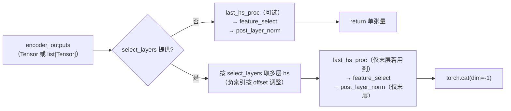

# 视觉塔共享工具（vision.py）

[← Wiki 首页](../README.md) > [模型库](../README.md) > **视觉塔工具**

> 源码：`vllm/model_executor/models/vision.py`（607 行）。

---

## 是什么

`vision.py` 是一个"工具函数 + 数据类"集合，给所有 VLM（vision-language model）共享的视觉塔辅助逻辑。它本身**不定义**任何视觉模型类，那些类（`CLIPVisionModel`、`SiglipVisionModel`、`PixtralHFVisionModel`、`AIM2VisionModel` 等）都在各自的模型文件里。`vision.py` 只提供五个职能：

| 职能 | 入口 | 用途 |
|---|---|---|
| **VisionEncoderInfo** | `VisionEncoderInfo`（ABC，`vision.py:33`）+ `get_vision_encoder_info`（`:66`） | 根据HF `vision_config` 类型（CLIP/Pixtral/Siglip）返回编码器元信息：图像/patch 大小、token 数公式、patch grid 长度 |
| **ViT 注意力后端选择** | `get_vit_attn_backend`（`:99`）/ `_get_vit_attn_backend`（`:83`） | 由 `current_platform.get_vit_attn_backend` 按 head_size/dtype/attn_backend_override 选 ViT 专用后端 |
| **FP8 对齐** | `get_fp8_padded_hidden_size`（`:128`）/ `is_vit_use_data_parallel`（`:142`） | cuDNN FP8 ViT 要求 head_dim 16 对齐，则返回 padded hidden；DP 模式探测 |
| **特征选择策略** | `VisionFeatureSelectStrategy` + `_get_vision_feature_selector`（`:157`）+ `get_num_selected_vision_tokens`（`:177`） | 把 ViT 输出切成"class-only / 默认去 CLS / 全保留"三种模式（对齐 HF Llava/CLIP 行为） |
| **encoder 输出归并** | `resolve_visual_encoder_outputs`（`:198`） | 处理选层、post-LN、特征选择，把 ViT 多层输出归并成单一张量 |
| **DP 分片** | `run_dp_sharded_vision_model`（`:281`）、`run_dp_sharded_mrope_vision_model`（`:383`）、`get_load_balance_assignment`（`:314`） | 视觉塔的 TP-data 并行：按图像 size 贪心负载均衡分到各 rank，再 `all_gather` |
| **M-RoPE 位置** | `get_llm_pos_ids_for_vision`（`:573`） | 给 Qwen2-VL 类的（T,H,W）M-RoPE 生成 LLM 侧位置 id |

---

## 为什么

- **统一三种 ViT 后端差异**：CLIP / Siglip / PixtralHF 在 token 数计算、patch grid、特征选择上各有差异。视觉塔本身由各模型文件实现，但"给定图像尺寸算 token 数"、"识别 vision_config 类型"这种跨模型共性的逻辑没必要在每个 VLM 里重复。`VisionEncoderInfo` 用 ABC + Generic 收口，子类各自在 `clip.py:CLIPEncoderInfo`、`siglip.py:SiglipEncoderInfo`、`pixtral.py:PixtralHFEncoderInfo` 实现。
- **视觉塔 TP 不能走普通 linear 切分**：视觉编码器通常小且对 batch 不敏感，按 Linear 切 TP 会浪费算力。`mm_encoder_tp_mode="data"` 让各 rank 各跑部分图像，最后 `all_gather` 结果，相当于 DP-on-encoder。这要求按图像 size 负载均衡（不然大图都堆到一个 rank），`get_load_balance_assignment` 用贪心（按 size 降序、依次塞给当前最小 load 的 GPU）。
- **M-RoPE 是 Qwen2-VL 系列专属**：3D 位置（T,H,W）展开成 `[3, num_tokens]`，与文本 token 的 1D 位置拼合；`get_llm_pos_ids_for_vision` 给出固定模板。Kimi-VL 用 2D rope 单独走 `run_dp_sharded_mrope_vision_model` 的 `rope_2d` 分支。
- **FP8 ViT 的 head_dim 对齐陷阱**：cuDNN FP8 prefill attention 要求 head_dim 16 倍数；像 head_dim=72 这种需 pad 到 80。`get_fp8_padded_hidden_size` 仅在 `mm_encoder_attn_dtype=="fp8"` 时返回 num_heads × round_up(head_dim,16)，否则 None，避免无害模型多算 pad。

---

## 怎么做

### resolve_visual_encoder_outputs 的两条路径



`select_layers` 支持负索引（相对于完整 ViT 层数），但加载部分层时需要 `max_possible_layers - num_loaded_layers` 偏移（`vision.py:258`），保证 `-1` 始终指真正的末层。

### run_dp_sharded_mrope_vision_model 流程

```
1. patches_per_image = [prod(thw) for thw in grid_thw_list]
2. (image_to_tp_rank, gpu_sample_counts, grouped_len) = get_load_balance_assignment(...)
3. 每个 rank 取自己 assigned 的图像，拼成 pixel_values_local
4. 视觉塔 forward——按 rope_type 选 kernel：
     - "rope_3d"（Qwen2.5-VL）：vision_model(pixel_values, local_grid_thw_list)
     - "rope_2d"（Kimi-VL）：vision_model(pixel_values, tensor(local_grid_thw_list))
       并用 merge_kernel_size 算 reduction_factor
5. 每个 rank 输出 pad 到 max_len_per_rank
6. tensor_model_parallel_all_gather → 切回原顺序 → tuple[Tensor]（每图一张）
```

`get_load_balance_assignment`（`vision.py:314`）核心是贪心：

```
按 size 降序排序，依次塞给当前 total_load 最小的 GPU
→ shuffle_indices（重排序列）、gpu_sample_counts（每 GPU 张数）、grouped_sizes_per_gpu（每 GPU 总 size）
```

### get_vit_attn_backend

```python
mm_cfg = get_multimodal_config()
backend_override = mm_cfg.mm_encoder_attn_backend   # 用户可显式 override
return current_platform.get_vit_attn_backend(head_size, dtype, backend=backend_override)
```

平台层自己决定 ViT 用哪个后端（如 CUDA 走 FlashAttn、CPU 走 Photinus）。

---

## 与其它模块/系统配合

- **[多模态](../11-multimodal/README.md)**：`get_multimodal_config()` 从 `get_current_vllm_config_or_null()` 取 `MultiModalConfig`，读 `mm_encoder_tp_mode`、`mm_encoder_attn_backend`、`mm_encoder_attn_dtype`；这些字段在 [`10-config`](../10-config/README.md) 的 `MultiModalConfig` 里定义。
- **[08 硬件平台](../08-platforms/README.md)**：`current_platform.get_vit_attn_backend` 由各平台实现；`mm_encoder_tp_mode="data"` 的 DP 分片用 `tensor_model_parallel_all_gather`。
- **[07 分布式](../07-distributed/README.md)**：`get_tensor_model_parallel_world_size`/`rank` + `all_gather` 是视觉塔 DP 的基础；与 LM 侧的 TP/PP/EP 正交。
- **[注意力](../05-attention/README.md)**：ViT 走独立后端（`get_vit_attn_backend`），与 LM 的 attention 后端解耦；`AttentionBackendEnum` 在 `v1.attention.backends.registry`。
- **各 VLM 模型文件**：`clip.py` / `siglip.py` / `pixtral.py` 等 import `get_vit_attn_backend`、`resolve_visual_encoder_outputs`、`get_num_selected_vision_tokens` 等，避免重复实现。
- **[interfaces.md](interfaces.md) `SupportsEncoderCudaGraph`**：视觉编码器 CUDA graph 捕获时的 input/replay 由具体 VLM 实现接口方法，但内部的 ViT forward 与 dp 分片会调到 `vision.py` 工具。

---

## 历史版本演进

| 版本 | 变更 | 动机 |
|---|---|---|
| 早期 | 每个 VLM 文件自己写 ViT 后端选择与特征选择。 | 重复代码多。 |
| v0.5–v0.6 | 抽出 `vision.py`，提供 `get_vit_attn_backend` 与 `resolve_visual_encoder_outputs`。 | VLM 数量爆发。 |
| v0.7 | `VisionFeatureSelectStrategy` 三态化（`class`/`default`/`full`），对齐 HF CLIP/Llava 行为。 | 不同 VLM 对 CLS token 处理不一致。 |
| v0.7–v0.8 | `VisionEncoderInfo` ABC + CLIP/Siglip/Pixtral 子类落地；`mm_encoder_tp_mode="data"` 引入 DP 分片。 | Siglip/Pixtral 加入；视觉塔 TP 切不动线性层。 |
| v0.8 | `run_dp_sharded_mrope_vision_model` 加入，支持 Qwen2-VL（rope_3d）。 | M-RoPE VLM 主流化。 |
| v0.9 | `get_load_balance_assignment` 贪心算法落地，按 size 而非张数分配。 | 大图引发负载倾斜。 |
| v0.10 | `get_fp8_padded_hidden_size` + `mm_encoder_attn_dtype="fp8"` 路径；Kimi-VL（rope_2d）分支加入。 | FP8 视觉塔 + 2D rope。 |
| main | `is_vit_use_data_parallel` 单独抽出；`get_multimodal_config` 容错 None（单元测试场景）。 | 测试可独立 import 此模块。 |

---

## 参见

- [← 返回模型库首页](../README.md)
- [`interfaces.md`](interfaces.md) — `SupportsMultiModal` / `SupportsMRoPE` / `SupportsEncoderCudaGraph`
- [`architecture-families/llava.md`](architecture-families/llava.md) / [`vlm-misc.md`](architecture-families/vlm-misc.md) — 视觉塔在各 VLM 里的实例
- [多模态子系统](../11-multimodal/README.md) · [注意力](../05-attention/README.md) · [08 硬件平台](../08-platforms/README.md)
