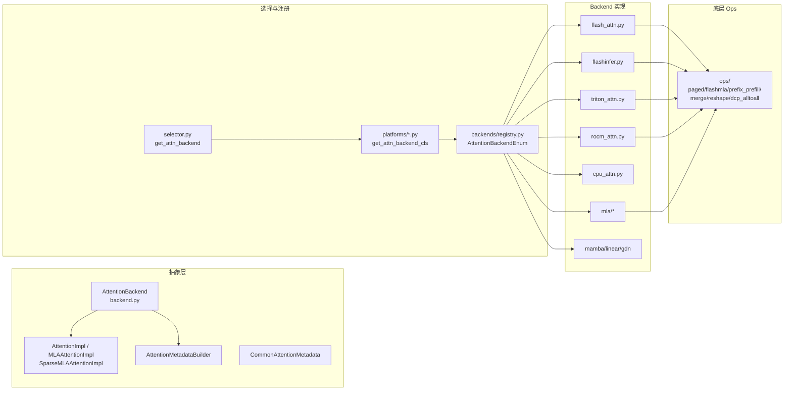
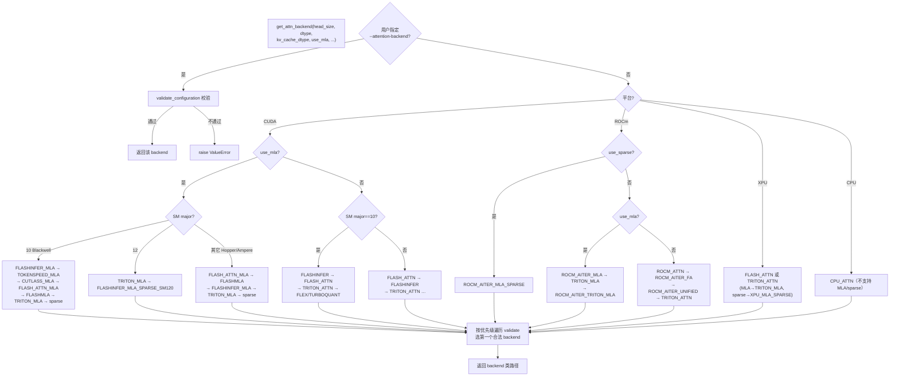
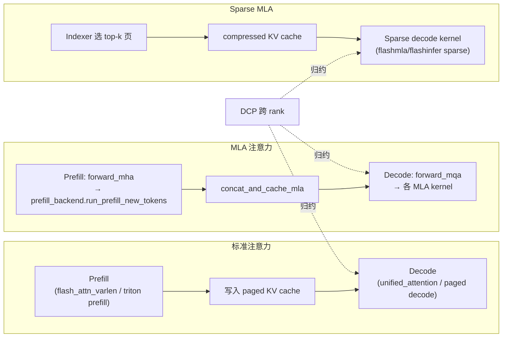

# 注意力子系统（Attention Subsystem）

[← Wiki 首页](../README.md) > 注意力子系统

> 源码根目录：`vllm/v1/attention/`

## 是什么

注意力子系统是 vLLM V1 引擎里负责"对每一层 query 与 KV cache 做 scaled-dot-product / MLA / SSM 注意力"的执行单元。它由三部分组成：

1. **抽象层** `vllm/v1/attention/backend.py` —— 定义 `AttentionBackend`、`AttentionImpl`、`AttentionMetadataBuilder`、`CommonAttentionMetadata` 等接口，是所有 backend 必须遵守的契约。
2. **backend 列表** `vllm/v1/attention/backends/` —— 一组可插拔实现：FlashAttention、FlashInfer、Triton、ROCm、CPU、FlexAttention、Mamba/Linear/GDN（SSM 族）、TurboQuant、HPC，以及 `mla/` 子目录下 DeepSeek V2/V3/V4 专用的 MLA 与 Sparse MLA 后端。
3. **底层 ops** `vllm/v1/attention/ops/` —— 与 backend 解耦的 fused kernel：`paged_attn`、`flashmla`、`prefix_prefill`、`merge_attn_states`、`reshape_and_cache_flash`、`dcp_alltoall`、各种 `triton_*` kernel 等。

engine/worker 在初始化模型时通过 `selector.get_attn_backend()` 选定一个 `AttentionBackend`，由它产出 `AttentionImpl`（每层一个）与 `AttentionMetadataBuilder`（每 KV cache group 一个）。

## 为什么

不同硬件（NVIDIA SM90/SM100/SM120、AMD ROCm、Intel XPU、CPU）、不同模型族（标准 GQA、DeepSeek MLA、Mamba SSM、DeepSeek V4 sparse）、不同 KV cache 量化（fp16/bf16/fp8/int4/turboquant）需要**完全不同的 kernel**。把"统一接口 + 多 backend + 平台优先级选择"这套结构抽象出来，才能：

- 让上层 `Attention` layer 只写一份调度代码，内核实现自由替换；
- 让平台/模型/环境变量任意组合都能自动落到一个**可运行**且**性能最优**的 backend；
- 让新硬件/新模型只新增一个 backend 文件 + 一条 registry 枚举，而不改动引擎主干。

## 怎么做

### 模块拓扑

### backend 选择决策树

### prefill vs decode kernel 路径

### 关键入口

| 入口 | 位置 | 作用 |
|------|------|------|
| `get_attn_backend()` | `vllm/v1/attention/selector.py:54` | 选 backend 类 |
| `AttentionBackend.get_impl_cls()` | `vllm/v1/attention/backend.py:78` | 每层 impl 工厂 |
| `AttentionBackend.get_builder_cls()` | `vllm/v1/attention/backend.py:83` | metadata builder 工厂 |
| `AttentionMetadataBuilder.build()` | `vllm/v1/attention/backend.py:666` | 每 step 构造 metadata |
| `AttentionImpl.forward()` | `vllm/v1/attention/backend.py:884` | 标准注意力 forward |
| `MLAAttentionImpl.forward_mha/mqa` | `vllm/v1/attention/backend.py:944` | MLA forward |

## 与其它模块/系统配合

- **引擎核心-KV 管理**：`AttentionBackend.get_kv_cache_shape` / `get_kv_cache_stride_order` 决定 `kv_cache_interface.py` 中 page 布局；`AttentionSpec` 是 backend 与 KV manager 的握手协议。见 [引擎核心-KV 管理](../01-engine-core/kv-cache-management/README.md)。
- **执行层-Worker**：Worker 在 model load 时为每个 KV cache group 调 `get_builder_cls()`，每 step 用 `CommonAttentionMetadata` 喂给 builder。见 [执行层-Worker](../02-execution/worker/README.md)。
- **模型库-DeepSeek**：DeepSeek V2/V3 触发 MLA 路径，V4 触发 sparse MLA + indexer。见 [模型库-DeepSeek](../04-model-zoo/architecture-families/deepseek.md)。
- **分布式-All2All**：`ops/dcp_alltoall.py` 实现 Decode Context Parallel 的 A2A 通信；`ops/common.py` 的 `cp_lse_ag_out_rs` 做 LSE 归约。见 [分布式-All2All](../07-distributed/device-communicators/all2all.md)。
- **平台抽象**：`platforms/{cuda,rocm,cpu,xpu}.py` 的 `get_attn_backend_cls` 是真正的优先级裁决者。
- **torch.compile**：`AttentionType` 用 `str` 枚举就是为了兼容 `torch.compile`；`supports_batch_invariance` 控制 cudagraph/compile 行为。

## 历史版本演进

- **v0.6.x**：V1 引擎引入，初版 `AttentionBackend` 抽象 + FlashAttention/Triton backend（替换 V0 的 `AttentionWrapper`）。
- **v0.7.x**：FlashInfer backend 接入；`CommonAttentionMetadata` 抽出共享字段；cascade attention 进入 FlashAttention。
- **v0.8.x**：MLA 后端落地（DeepSeek V3）。`MLAAttentionImpl` / `MLACommonImpl` 拆分 `forward_mha`/`forward_mqa`；新增 `cutlass_mla`（Blackwell SM100）、`flashmla`、`flashattn_mla`、`triton_mla`、ROCm `rocm_aiter_mla`。
- **v0.9.x**：Sparse MLA 引入（DeepSeek V4 `C4A`/`C128A` 层）。新增 `flashmla_sparse`、`flashinfer_mla_sparse`、`indexer.py`、`sparse_swa.py`；Decode Context Parallel（DCP）A2A backend 加入。
- **v0.10.x（当前主线）**：MLA prefill 解耦为独立 `prefill/` 子系统（`MLAPrefillBackend` + 独立 selector/registry）；Blackwell 新增 `tokenspeed_mla`（CuTe DSL）、`trtllm_ragged` prefill；`flashinfer_mla_sparse_sm120`；FlashAttention 4（FA4）CuTeDSL warmup；`flash_attn_diff_kv` / `triton_attn_diff_kv` 支持 K/V 不同 head dim（R1 类模型）；TurboQuant KV cache backend。

---

## 子页面

- [backend 抽象层](backend-abstraction.md)
- [selector 选择器](selector.md)
- [backend 注册表](backend-registry.md)
- [底层 ops](ops.md)
- [backends 导航](backends/README.md)
  - [FlashAttention](backends/flash-attn.md) ｜ [FlashInfer](backends/flashinfer.md) ｜ [Triton](backends/triton.md)
  - [ROCm](backends/rocm.md) ｜ [Mamba/SSM](backends/mamba.md) ｜ [Linear](backends/linear.md)
  - [CPU](backends/cpu.md) ｜ [FlexAttention](backends/flex-attention.md) ｜ [Utils](backends/utils.md)
  - [MLA 总览](backends/mla/README.md)
    - [AITER](backends/mla/aiter.md) ｜ [Triton](backends/mla/triton.md) ｜ [CUTLASS](backends/mla/cutlass.md)
    - [FlashAttn](backends/mla/flashattn.md) ｜ [FlashInfer](backends/mla/flashinfer.md) ｜ [FlashMLA](backends/mla/flashmla.md)

## 参见

- [引擎核心-KV 管理](../01-engine-core/kv-cache-management/README.md)
- [执行层-Worker](../02-execution/worker/README.md)
- [模型库-DeepSeek](../04-model-zoo/architecture-families/deepseek.md)
- [分布式-All2All](../07-distributed/device-communicators/all2all.md)
